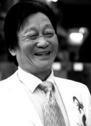
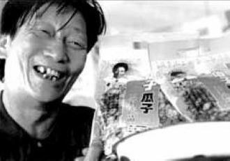

# 落花鸣剑录（一）瓜子大王傻子

天上乌飞兔走，人间古往今来。沉吟屈指数英才，多少是非成败。

富贵歌楼舞榭，凄凉废冢荒台。万般回首化尘埃，只有青山不改。

调寄《西江月》。列位看官，这红尘滚滚，青史昭昭，多少王侯将相，早已化作尘土，多少才子佳人，无不过眼烟云。叹世人日日追名逐利，又是为何，不过是辛苦一生，为人作嫁衣。纵使那些一世之雄，也不过身死名灭，好的留下声名供街谈巷议，功过任后人评说，而时乖命蹇的，也就落个湮没无闻的结果。这天下大事，也不过把酒斜阳，在那渔樵话里呵。

但即便如此，无数英才伟器仍然奋勉图强，在历史上留下属于自己的一笔。他们的时代终将过去，是谓“落花”；但他们的传奇依然铮铮作响，故曰“鸣剑”。十年浩劫之后，在开放搞活的大潮中，多少人一夜暴富，扬名天下，却又轰然倒下，甚至身陷囹圄。成事没有捷径，坠落却路数繁多，除去那些一着不慎满盘皆输的失意人，更多的是死于政企不分、权责不明、产权不晰、制度不全、规则不端等非商业原因。是他们驾驭了风浪，还是大潮席卷了他们，终究将他们拍在岸上。成功的不是完人，更非神话，有的只是如履薄冰，更是运气的眷顾。失败的也是豪杰，他们抗争过命运，或许还抗争过权力，可能败于因不平而起的贪欲，更多的是一种有苦难说的落寞。而这批人，正如西人熊彼特所言的企业家精神，用他们的锐意进取推动着时代的车轮。看呐：

弄潮儿向涛头立，手把红旗旗不湿。别来几向梦中看，梦觉尚心寒。

试图弄潮，自然会弄湿自己，即便上岸，也最好换身衣服。或许从来不湿的，只有弄潮儿手中的那面红旗。

第一位要写的，我认为是成色最不纯的一位。与后面次第登场的群英相比，第一位传主是标准的普通人，不懂商业理念，也缺乏政治敏感，更没有出众的能力，甚至不识字。他的“创业”，更是一种迫于生活的无奈。但他却成为了改革的符号之一，不可谓不传奇。他的一生，是时代的缩影，更是时代这一巨大的放大器的宠儿，一个小人物，是如何被时代推送到他从来没有想过的高点。现在的他，已是一位老者，风流事早已不比当年，或许回首这一切，依然会嘴角泛起微笑，感慨命运的馈赠，毕竟他曾经来过，留下自己的故事。

当然第一篇写他，也是因为他是我的乡里前辈，曾经有过接触，他的一位公子还与我有过同窗之谊，相对比较了解。他就是名噪一时的瓜子大王——“傻子”年广久先生。

芜湖是个有意思的地方，长江在芜湖到南京这一段呈南北向，所以这一带既属于江南，又被称为“江东”。马嘉理事件之后，清廷适度妥协，中英签订《烟台条约》，增开芜湖、宜昌、温州、北海四地为通商口岸，英国实现将影响力渗透进长江流域的目标。芜湖在安徽开放早，风气活，既是徽商疏通南北的两大据点之一，又是内陆接触西方文化的窗口，成为皖东南商业中心的同时，也是革命党的重要活动地点。陈独秀办过报纸，柏文蔚成立过暗杀组织岳王会，胡适、陶行知等近代安徽学人，基本上都曾在芜湖居留。解放前的芜湖，商业风气早，歌舞升平，日日鸳鸯蝴蝶，成为江北乃至淮北人士迁居或者逃难的首选地。现今不少芜湖人，其祖上都是因为黄淮水患、兵祸连年，从祖居地逃难而来，年广久也是其中的一员。年广久出生于全面抗战拉开的1937年，那一年淮河水灾，年家一路乞讨，从淮北来到了江南“小上海”芜湖。

失去了生活来源的年父，在街头摆小摊养家糊口，迫于生计，年广久也要帮父亲做小生意。早早学会了沿街吆喝，讨价还价。新中国的成立，年广久不知道意味着什么，对于小商贩，不会过于关心政治风向的变化，反正不论谁掌权，只要容得下一张小摊，他就能尽量让家人糊口。但不久，情况有些异样，年广久还是街头摆摊，但政治运动接二连三：水果摊被当作“资本主义尾巴”给割掉了；贩板栗受到“打击投机倒把办公室”的清查。1963年，年广久因投机倒把罪被判处有期徒刑一年。出狱后，板栗不能卖了，但生活还要维持，年广久想起了炒瓜子。这时候的年广久根本没有什么商业意识，脑子里有的，只是简单地养家糊口。所以水果不让卖卖板栗，板栗不让卖卖瓜子，从来没有意识到，为什么水果不能卖。既然水果不能卖，那么板栗、瓜子，又怎会让你不受干扰的卖呢？年广久只知道你不让我卖这个，我就卖另外的，当然，这也和老年还只会做小生意有关。1966年，“文革”爆发，屡教不改的年广久成了芜湖市“运动”的对象，许多批判个体户走资本主义道路大字报的矛头对准了年广久，他又被关了二十多天。当然老年最大的优点就是胆儿肥，“文革”期间，大家都在“关心国家大事”，年广久的瓜子事业就在地下“偷偷摸摸”地发展。老年这样描述他早年的生涯：每天晚上七八点钟开始炒瓜子，一炒几百斤，一气干到第二天早晨五点，洗洗脸，稍微睡一会。7点钟左右又起来，开始把炒好的瓜子分包包好，中午12点左右，人们下班时间到了，就出去偷偷地卖。下午再包，6点钟人们下班时间再卖。如此循环往复。市民在批斗之余，物质生活极度匮乏，哪里有零食怡情，或许来一包老年的瓜子，也算是批斗生活中的一点作料，歪风邪气中的一抹色彩吧。据说当年不同派别的革命小将都偷着来买老年的瓜子，结果撞个正着，瓜子摊前引发了大规模械斗。看来在那个时代，瓜子可以超越派别，瓜子和忠于毛主席一样，是两派小将的共识。老年卖瓜子，买一包还要抓一把送给你，不要还非得塞给你，久而久之，得到了“傻子”的诨名，谁能想到，这个芜湖人起的外号，日后居然是第一批中国驰名商标。

十一届三中全会以后，看到市场需求的旺盛，年广久想到了扩张。发妻劝他小心点，“坐牢还没有坐够？”老年虽然大字不识一个，老年最大的优点就是胆大，他押宝邓小平，不知从哪来的信心，相信邓小平会坚持搞开放。小作坊很快发展到100多人的“大工厂”，“红火”一时。“钱都放在家里，要的话就从抽屉里拿，要多少取多少。”100多人的私人企业，在改革开放初期的新中国绝对是个异类，风言风语纷至沓来。当时有种风传的说法，雇七个人属于小作坊，八人以上就是资本家，要割尾巴的。安徽省不敢怠慢，派专人到芜湖调查年广久，并写了一个报告，上报中央。当时中央一些信奉鸟笼经济的干部准备小题大做，抓年广久个案，但这事被安徽的老领导，时任副总理的坚定改革派万里知道，将此事向邓小平专门作了汇报。1984年10月22日，邓小平在中央顾问委员会第三次全体会议上明确指出：“前些时候那个雇工问题，相当震动呀，大家担心得不得了。我的意思是放两年再看。那个能影响到的大局吗？如果你一动，群众就说政策变了，人心就不安了。让‘傻子瓜子’经营一段，怕什么？伤害社会主义了吗？”得到了邓小平的点名保护，年广久逃过一劫。当然坊间的传言就更为神奇了，据说年广久的瓜子邓小平喜欢吃，是“特贡”。经此一事，年广久的瓜子生意更好，谁不想尝尝“特贡”给领导人的瓜子呢？虽然我们不能阅兵，但瓜子还是可以买的嘛！

1986年，傻子瓜子在中国率先搞起有奖销售，并以一辆上海牌轿车作为头等奖。从未见过如此巨奖的消费者，欲望一下被激发起来，3个月，傻子瓜子实现了利润100万元。安徽省可没有善罢甘休，自87年反自由化开始，就不断调查年广久，当时老年也犯了中国新贵或者暴发户阶层的通病，升官了或者发财了，老婆是不是该换换了呢？于是老年就有了“作风问题”，安徽省调查的是“经济问题”，定的罪却是可笑的“流氓罪”。当然现在看来，正是这种发达了就要声色犬马的农民心态，决定了老年始终不会成为一名真正的企业家。92年小平南巡，老年27岁的长子年金宝给小平写了封信并寄去了瓜子，据说还是经万里之手，递到了小平手中。小平品尝了瓜子，并留下了相片，现在这张照片已经成为傻子集团的镇厂之宝。“农村改革初期，安徽出了个‘傻子瓜子’问题。当时许多人不舒服，说他赚了一百万，主张动他。我说不能动，一动人们就说政策变了，得不偿失。”小平第二次救了老年，一听小平发了话，安徽省立马放人。

此后傻子瓜子走上了发展的黄金期，一时间风头无两，是当之无愧的瓜子大王，老年荣誉头衔拿到手软。但这段时间，没有外患，却有内忧，老年四任妻室，留下若干同父异母的兄弟，分家产的事可以说让老年头大。父子、夫妻、兄弟对簿公堂。06年金宝大哥和一位女员工双双因煤气中毒死于豪宅，年金宝的钱夫人以女儿名义将老年和老年发妻年金宝母亲耿秀云告上法庭，要求拆分商标、股份等继承权。对此，老年十分无奈：“我都70岁了，这辈子挣得也够多了，我怎么会和孙女抢钱呢？一家人咋说不行呢？”

这几年关于老年的消息越来越少了，傻子瓜子的地位也日渐式微。近来有关他的江湖传闻，就是冯仑有一年专程去芜湖拜访老年，去看望这位当年的江湖前辈。

对于年广久，坦率的说，没有成熟的商业理念，就算已经是坐拥亿万家资的商界巨子，老年的思想仍然还是沿街叫卖的小商贩。不知道转型，更不知道多元化，就是固守卖瓜子老行业，面对后来者的模仿，也少有创新。而且老年缺乏法律意识，不知道明晰权责，儿子多了，家产怎么分，遗嘱怎么立，老年也是一头雾水，一会感觉疼爱63岁生的小儿子想多分一点，一会又感觉老大当年跟自己挺不容易，又想给老大多分一点，颇有赵武灵王的调调。他的儿子，很多和他一样，还是那种“爷打江山儿孙坐”的观点，始终不能走出家族企业到经营权、所有权分离的现代企业这一“三峡”。

老年的成功，主要是因为时代，还有他有如亡命徒一般的胆大。此外他的运气不是一般的好，谁能被“总设计师”两次点名呢？因为时代走在了前面，又因为时代的变迁落在了后面，这便是老年。但不管怎么说，老年这一辈子，已足够精彩。

（采编：孙晓天，责编：佛冉）

[落花鸣剑录（二）书生无奈是多情](/archives/39049)
