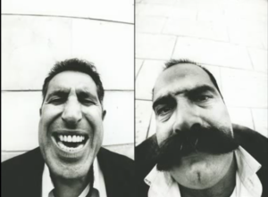
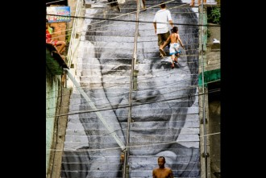
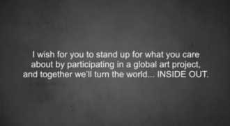

# 藝術可以改變世界嗎?

JR是一位法國的藝術家，他在TED演講裡向大家問道：「藝術可以改變世界嗎？」

都吃不飽飯了，還有錢有閒搞藝術嗎？

窮人、受壓迫的人、在戰爭中受傷的人們和藝術如何產生關聯？

JR在當時因為好奇以巴之間的紛爭和戰亂是否如媒體所報導的面貌，或者還有更多可能性？

於是，他和朋友前往到當地實際地去看看，只是和當地人聊聊天，然後拍照。

### 

### 藝術模糊了「我們」與「他們」之間的界線

誰是以色列人？誰是巴勒斯坦人？

他拍下以色列人和巴勒斯坦人擠眉弄眼的樣子，印成大大的照片，然後分別貼在兩邊的城市。這些照片不再只是主流媒體報導裡出現的邪惡的叛亂分子的面孔，他們就和大多數喜歡扮鬼臉的人的表情差不多，大笑、瞪大眼睛或是鬥雞眼等活潑的表情，不再只是和戰亂的場景有關聯。

JR說他最得意的一刻是當以色列或巴勒斯坦人駐足在照片前時，他會問他們現在你分得出誰是誰了嗎？

那些人分不出來到底誰是以色列人、誰是巴基勒坦人，照片裡的人們就像日常生活裡那些我們再熟悉不過的家人、好朋友般親近。

為什麼會有戰爭？我們怎麼知道該與誰為敵、與誰同盟？

更確切地說，我們[如何塑造出「我們」與「他們」兩個概念](http://woundero.wordpress.com/2013/03/16/stranger/)，進而知道誰是我們該保護的人、誰是我們該攻擊的對象。

昨天看了一個報導提到奈及利亞正著手製作出各式各樣的芭比娃娃（Barbie）。我們發現我們小時候在玩的芭比娃娃大多數都是白人面孔，雖然近幾年隨著包容與尊重多元價值的意識高漲，芭比娃娃比起過去開始有了更多面貌的呈現，但仍不難發現其中的刻板印象，如東方人就是鳳眼、塌鼻等，膚色也塑造成單一的呈現，於是一位奈及利亞的設計師便決定要製作出更多不同的芭比娃娃，我們的長相並非只擁有大眾對我們的刻板印象，而是每個人都有自己特別之處，這些特別應該要被保留下來。美麗當然也不會只有一種的呈現，顛覆美學思考的時尚教主黛安娜佛里蘭（Diana Vreeland）就曾說過：「盡情自曝其短，讓缺陷成為身上最美的部分。」

我們常以「我們共同有的特徵、個性等」區分出我們和他們不一樣的地方，為了更加確立並穩固「我們」的概念，我們必須為此抗爭、堅守到底，把對方塑造成萬惡的敵人形象。然而有趣的是，這項被稱為「Face 2 Face」的計畫就是要大家「面對面」，兩張被印出來大大的面孔放在一起，與街道上的行人面對面互相凝視著彼此，此時此刻，誰是誰或是誰是誰到底重不重要似乎成了一個可以讓人們重新思考的方向。

### 

### 「我想拍你們驚人的生命力，我想拍我在這裡生活看到的一切。」

貧民窟裡的人們呢？那些幾乎快被世界的遺忘的地方，沒有話語權的女人、小孩們，JR也是把他們的表情照下來，印得很大張並貼在那些日常生活裡我們熟悉的地方，比如在一個階梯。 

巴西有三個貧民窟的孩子因為沒帶證件被抓，警察不是把他們送回家或關起來，而是把孩子送到敵對的貧民窟，在那裡孩子們被切成好幾段。JR在巴黎家裡電視機前看到這則新聞，他非常震驚，因此決定和朋友去巴西拍些照。他拍了一張非常非常大的，被殺的孩子的祖母的照片，貼滿在那三個上。孩子被抓的階梯。

人們永遠會記住這些人、這些事。

有一天這些紙張會被撕掉、毀損，不過那不重要，JR認為這些就是他們生活記憶裡的一部分，他們可以自己決定該如何處理這些藝術。

媒體為我們帶來太多的暴力、血腥和令人不安的畫面，貧民窟也真的就如想像中的殘破不堪且難以親近？

想起前陣子在台灣展出的普立茲新聞攝影展，有不少攝影師在照片的註解提到自己當時在拍下照片時的心情是多麼緊張、害怕，最後又是如何鼓起勇氣拍下照片。我和朋友聊到這個，不禁會討論所以攝影師在當下，究竟該先救人還是拍照？這些照片固然有其重要的保存價值，也為歷史中各個時期的人們紀錄了他們的精神，這些都是文字無法完整表達的。或許面臨災難的悲劇當下，單靠個人的力量的確很難挽救情勢，但我們讓更多人知道這件事了，我們讓更多人記得他們、記得為什麼會有這些事情的發生，以及後來是如何發展。

什麼樣的照片能夠打動人？這部分我和朋友達成了共識，最能夠打動我們的反而不是災難或充滿暴力衝突的照片，或許是很溫馨的小孩和警察相望的情景，或許是一個女孩用著疑惑的眼神凝視著正在看照片的我們，又或許是一群人因為革命的成功而開懷大笑的照片。

「你知道嗎？我不想去拍你們致命的武器或暴力，那些媒體裡面已經拍夠了。我想拍你們驚人的生命力，我想拍我在這裡生活看到的一切。」

JR如此說，藝術或許不能拯救世界或實際地有改變世界的行動，但我們的確讓更多人參與了這項改變。

### 

### 當貧民窟的女人們透過照片凝望著世界

在「Women Are Heros」的計畫裡，他捕捉了女人們的神情，然後貼在家家戶戶的牆上，經由直升機的長鏡頭拍攝，這些「凝視」開始受主流媒體的關注，於是人們會開始好奇這些人是誰？這個貧民窟在哪裡？

這些照片就不會只是照片，為媒體和那些不具名的女人們搭起了橋梁。讓更多人關注這些缺乏話語權的女人們，並且，透過這些「凝視」，彷彿已經和這世界展開了對話。

在這兩個計畫之後，他仍持續地在做這些事，在各地做、在他的國家做這些藝術。當人們對他的所作所為感到困惑時，他就只是回答：「這是藝術計畫，我在做藝術！」

藝術可以改變世界嗎？藝術在我們熟悉的城市街道裡化成了和藹可親的語言持續地和居民對話著，也在每位正在凝視照片的人們的心裡播下一顆種子，逐漸發芽茁壯。藝術屬於這些人們，並且值得世界上更多更多的人們擁有。

JR認為藝術或許不能改變世界，但製造了一個中立的空間，提供給人們交流意見、討論的對話空間，而這些便促使了我們能夠改變世界。 

我想起身邊不少朋友對於社會運動感到很疑惑，對於過程中可能有的激烈衝突、或是所謂「非理性」的行為持以抗拒的態度。可以好好講的話，當然大家都希望可以靠好好講的方式去溝通，不過值得好好思考的應該是誰逼得他們走向街頭呢？那些抱怨他們過於吵鬧、太不理性的人們，難道認為自己過得好就好了嗎？受壓迫的人們最好就安靜一點，為什麼非得把事情鬧大？

「佔領華爾街」的社會運動中，因為被禁止使用麥克風，反而凝聚更多人靠著「人聲麥克風」的方式一層一層地傳遞，把想要傳遞出去的理念或價值透過簡短有力的字句、透過每個人的聲音，讓更多人起身關注我們身邊的議題，這些事情就不再離我們那麼遙遠，反而與我們切身相關。因為這些畫面影響了我日後決定實際參與社運，事實上，去年夏天「反媒體壟斷」的第一次社運也有運用「人聲麥克風」，當時的七百多人或許不算多，但在那之後，我們都相信，會有越來越多人和我們一同關注台灣媒體的問題與發展。

或許有一天，我們都會走上街頭抗議不公不義，我們都很可能是那些受壓迫的群體的其中一員。然而這份參與並不僅僅是參與，如果要期待參與社運能夠扭轉情勢的發展，不如說當更多了參與了這項改變的行動，就將聚集成一股不可思議的力量，而這些力量將會促成改變。

藝術可以改變世界嗎？

「我希望你為你關心的事情挺身而出，藉由這個全球性的藝術活動，我們一起顛覆這個世界。」── JR

原文地址: [http://laichialing.wordpress.com/2013/04/29/artproject/](http://laichialing.wordpress.com/2013/04/29/artproject/)

(採編：Vanessa 責編：余澤霖)
