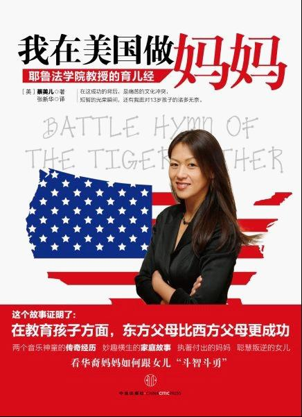

# 虎妈战歌读后感

花了一点时间，看完了好像还是在去年就已经被炒得火热的《我在美国做妈妈》(Battel Hymn of the tiger mother)。

在看这本书之前就已经在不同的知名德媒上看到过对本书以及本书作者的评论。大多用语苛刻，不乏讽刺，由于不可避免地同样针对“中国式教育”发起各种攻击，让我对这本点燃中西家庭教育模式争论的书好奇心陡增。

大陆版从装帧到编排到腰封，几乎是要从每一个细节上不遗余力地把这本书打造成一本典型的成功学垃圾。在题目之下迫不及待地印上“耶鲁法学院教授的育儿经” 以证明此Mother之不同于天下所有彼mother。在作者蔡美儿非常美国式的自信优雅照下面，好像是唯恐该妈的头衔还不足以镇住所有村姑野妇式的未登过大堂的妈们，再提着嗓子加上一句：这个故事证明了（冒号！加大字体！）在教育孩子方面，东方父母比西方父母更成功！难怪连作者蔡美儿本人都在之后的访谈中无奈声称，自己的故事被大陆的发行方片面宣传，她本人都未必得出这样的结论。仅以此段，坚决彻底无回旋余地般鄙视此出版社。

简单地概括，作者蔡美儿，其父母祖籍中国，后移民美国，二人都从事学术工作，算是比较典型的第一代移民。作者本人生于美国，长于美国，哈佛毕业，后成为耶鲁法学院教授。先生为犹太裔美国人，同为耶鲁法学院教授。育有两女。全书围绕她所声称的典型的“中国妈妈式”教育来培养女儿成才的过程而展开。想要总结她的教育理念的核心其实很简单：除了第一以外，其他毫无意义。这还真不是我概括的极端，她的原文就这样写：中国妈妈相信：1，完成学业是第一位的；2，考试中的A-是不合格的；……6,父母唯一允许孩子参加的课外活动，是那些他们能赢得奖牌的项目；7，而且必须是金牌！

这个女人对于金牌的崇拜达到如此无以复加的地步，以至于我数次读到她自以为是的观点与辩解时，都有点不客气的反胃。说自己完全客观无立场地开始读这本书大概也是不正确的，在读这本书之前我就已经对于这种一切向第一看齐的人生观厌恶至极，但这本书还是将我这种厌恶又不可思议地推向一个新高潮。但我总归相信一个观点，没有调查就没有发言权，想要有底气地批评她，好歹要先有底气的把她的书读完。

写过长篇东西的人大概都有这样的感觉，在写整个文或整个书的过程中，你最初想要去证明的东西，和你最后得出的结论，往往会是不同的东西。读她这本书，也生生地体会到这一点。一个严苛到不尽人情的母亲的管教，因为在大女儿身上完美地体现出其“效益”，她的骄傲自豪在整个前半本几乎洋溢遍页，而在二女儿身上所遭遇完全出乎她意料之外（但一点也不出乎我意料之外）的反抗和挫败，她的失落与失控感也在后半本跃然纸上。她的结尾是犹疑的，带着不那么信心满怀的自我肯定，好像是在重复了十次“我行的！我一定行的！”之后还是没有忍住那一句小小声的“我真的行吗？”

其实蔡美儿实在并不是一个笨女人，这一点倒未必能靠她的赫赫学历与响亮头衔来佐证。但可以从书中的部分看出。作为一个典型的二代移民，她本人的成长经历融合了中国式的刻苦与美国式的机遇，而在一个正常的社会里，能融合这两者的人，不成功都难。她懂得去思考自己的成功，也懂得归纳自己的成功，并有足够的，近乎偏执的毅力，去复制自己的成功。带着第二代移民的距离感和观察力，她意识到这个盛产一无所成的小胖堆儿的国家，教育模式有问题：不加思索地鼓励没有带来信心却带来了惰性，无凭无据的表扬没有唤起兴趣却产生了麻木，一味的奖励机制让孩子的胃口变得越来越大脾气变得越来越差，而最重要的，最核心的——把选择权交给孩子，他们就永远都倾向于做出更轻松更懒惰更短视的决定。这些现象我常见到，常听说，不得不说在这些点上，我对她所发现的问题得同样点头称是。但是在解决问题的方案上，我就眼睁睁看着她头也不回地从此极端扑向另一个极端去了。

好似房顶破个方寸大的洞，她的办法就是直接混凝土浇筑，而且还必须得是made in china。她把自己的成功几乎全部归功于中国式的严厉家教，并在自己的孩子身上变本加厉地实现她的金牌梦。她对于女儿们言语之暴力不消说美国父母，就是中国父母也要望尘莫及了。而为了达到令女儿们练习或学习的目的，失信对于她而言已经微不足道。为了弥补孩子们做决定造成的风险，她的解决方式就是“我知道什么对你好，比你自己更知道，所以一切决定我来做”。还好她最起码还算诚实，对于自己热爱炫耀和夸大其词的本性也供认不讳，否则我简直不能够找出这个披着成功学外衣的女人闪光点何在了。

其实在出国的这一两年里，我自己也有默默地观察和对比过我和许多中国同龄人，与欧洲同龄人们的一些差别。在完成一件既定项目（先不论它是不是我想要的）的效率与耐力上，应该说大多数同胞们都显现出明显的优势。但在构造和设计一个项目时（就不得不去想我要的是什么），就很难有信心说我们更好了。不堪重荷的竞争形势逼迫着中国的学校教育注定不可能为每个孩子量身定制，而本可以量身定制的家庭教育又习惯性地以学校教育为导向，一切围绕孩子的学习成绩和竞争力来进行。不知道是幸运还是不幸，卑微的人性又决定了只要苦是大家都在吃，那就不算很难吃。所以千万个妈妈爱着同一个“别人家的孩子”，而千万个别人家的孩子又过着一样自己家生活，但也都各自乐在其中。

这种教育以毫无乐趣的方式培养了一个人的学习的技巧和承压的耐力。这甚至都不是自己主动追求的结果，而是流水线作业一样毫无选择的可获得的属性。对这种属性本身，抱怨吗？当然不，作为一种经年累月的训练后几乎可以终身携带的能力，这些技巧和耐力本身都会让人生受益无穷。但为什么在虎妈如此膜拜的中国式教育下也并没有能够盛产出与其人口基数成比例的“卓越型人才”呢？因为这样的教育回答了一切的how,但不能回答一个for what. 一个人可以身兼十八般武艺最终碌碌无为地过完一生，因为他没有自己的人生动力和目标（即使如此也并不一定表明这位老兄不幸福哦，虎妈极力秉持不成功即不幸福的观点，我都懒得争了）。技巧也好，耐力也好，效率也好，这一切的工具，都要在回答完方向性的问题之后才能派上用场：我想成为一个什么样的人。虎妈为大女儿所选择的钢琴，算是极其偶然，而非如她所相信的必然的，契合了大女儿对这个问题的答案，因为这一方向性的契合，她和虎妈并没有产生根本性的分歧。而在二女儿的小提琴问题上，虎妈几乎是必然的，而非她所认为的偶然的，遭遇了反抗和斗争。父母亲可以传授给儿女们所有他们懂得的一切，却无法代替他们回答这个问题，如果想要越俎代庖，就已经成功地跨出了失败的第一步。

嗯，说着说着就长了，大概因为这本书唤起了我许多亲身的经历与感慨。虎妈千万纰漏，但有一点是可以被理解的，她究竟也只是个爱自己孩子爱到发疯的母亲而已。这个身份，不因为她是耶鲁的教授而权威更多，也不因为她是不识字的农妇而减色不少。她本人，甚至都不能够自以为是地代表中国妈妈这个群体。虽然，显然她正是由于这一极具话题性的代表而引起了西方媒体界的关注，并成功的将中国妈妈身份进一步妖魔化。我想她费时、费力、费爱、费心地写这样一本战歌，最多只是道出一个普通母亲的荣辱起伏。而她想要追寻的答案，却恰好又由她自身作为最好的反证来得以证明：

1.成功不意味着一定智慧。尤其是看上去的成功。

2.成功不意味着一定可复制，即使它看起来不难。

3.成功不意味着一定幸福，哪怕是看上去的幸福。

 

（采编：何凌昊；责编：黄理罡）

 
