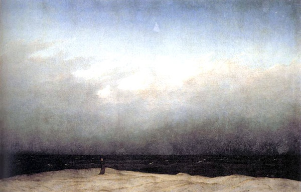

# 行脚，随缘

炎炎的烈日，闷热的空气，早已经让他汗流浃背，他把水壶里剩下的水喝完了，还是感觉渴。

他拿起锡杖，继续向前走去，心中默诵着准提咒，咒语的加持，能够让他感觉到身心合一，对外界炎热的感受不再那么强烈。

很多时候，他就这样一个人走在路上。

###一

那天下午，他走在江西去往湖南的路上，路过一个叫做营盘圩的乡，几个大学生走过来。

“师父，怎么称呼？”

“我的法号叫果衍。”

“师父，到哪里去？”

“去湖南。”

这几个大学生看到他仪表威仪具足，拿着锡杖，像个真和尚，于是对他说，“我们有一个护生主题的夏令营在这边进行，师父愿不愿意和我们分享一些有关素食和行脚的知识？”

“好啊。”他觉得这是一个殊胜的缘分，没有犹豫便答应了。

大家都对这个行脚和尚很好奇，问完他的来处，又问他的去处。希望他今晚就在这里住下，他拒绝了，因为他知道自己现在的一举一动不只代表个人，他是比丘，从戒律上来说，需要在各方面注意威仪。

第二天早晨的分享会上，他说到自己会发微博，用QQ，听的人都笑了，他把这些来到这里做护生的大学生称作菩萨，他们又笑了。最后结束的时候，他送给每一个人一瓶饮料，大家再次笑了。

大家都觉得这个和尚怎么不像我们所知道的那样说话严肃，反倒说话的时候还会开几句玩笑，但是又不像是骗钱的和尚，不然怎么还会给我们买饮料喝呢。

果衍没有忙着解释，自己在那里把饮料一瓶一瓶的发给大家，大家似乎对饮料的兴趣更大，对于他所讲的佛法倒是没有什么回应。

果衍心里清楚大家笑什么，但是他并不在意大家的笑声，他用微博，QQ为了弘扬善法，把年纪轻轻的大学生称做菩萨，为了鼓励他们要像菩萨一样有慈悲心，送给大家饮料是结个善缘，他敬佩这些来到这里宣传保护候鸟的年轻人们。

但是他并没有把这些原因说出来，双手合十告别后，他回到旅馆休息，第二天一大早还要赶路。

###二

天色尚未破晓，山风还在拍打着树叶，淡淡的光把远处的山笼罩了起来。凌晨四点半，果衍穿好衣服，背起背筐，杵着锡杖，借着微光，他走在去往湖南的山路上。

他本不想这么早就走，每天走很长的路，需要更多的休息，但等到太阳升起，就会热起来，那个时候惰性便会让他停下脚步。

一路上他会持准提咒，让内心和周围的环境融合在一起。太阳升起来后，天气越来越热，再走一段路，就会汗流浃背，他会放下背筐，坐在路边，喝一口水，休息的时候，有时会想起出发的那天。

那天早晨，他把装满行李的背筐背到楼下，便去顶礼师父，师父拿出净瓶给他洒净，让他远离祸祟，邪魔的侵扰，他的心逐步的安静下来。告别完师父，他又去大殿拜别常住，顶礼观音菩萨，拜下的那一刻，他的眼泪自己就流了出来，他回想起自己在闽南佛学院的六年时光，是南普陀成就了他。居士知道他要走了，都过来送他，有些人递出红包要供养他，他不收，甚至有些居士跪下请他收下。他的脑海中突然冒出“上报四重恩，下济三途苦”，他内心的对众生的感恩油然而生，眼泪又流了出来。他感觉自己受不起这样的供养，论资历，自己还是一个刚毕业的小和尚，论佛法修为，自己没有一些居士学的精。他们恭敬的不是我个人，是我在行法，让他们看到佛法住持的希望，他们恭敬的是佛法。他这么想了想，觉得自己肩上的担子又重了一些。

他拿起锡杖走出了南普陀的大门，内心空空的，好像有什么东西丢下似的。这种感觉，当年出家的时候也有过。

###三

1979年，他出生在四川省射洪县的一个贫苦的农村，家里有两个孩子，他还有一个姐姐。从小学到高中，他和社会接触很多，当地民风很彪悍，加上年轻人血气方刚，小混混们做过的事情他都做过，经常会约上一帮人和另一帮人打架，初中的时候，在学校里打群架，高中的时候，要跑到外校去打群架，当时他们手中的武器不仅有刀，还有火药枪。有一次他照例约上一群人去一个职业学校打群架，但是那次，他把一个人打伤了，事情闹大后，他为了避开牢狱之灾，买了一张车票逃到新疆去了，高中从此就没有再读了。他记得和父亲说要去新疆的时候，父亲说：“你现在已经年满十四周岁，从今以后要自己负责刑事责任，父母再也管不了你，国法管你。现在家里只有三百块，要买一包尿素肥四十块，还要两百六十块你拿去，想去哪里去哪里。”他记得很清楚，他买了一张从绵阳到乌鲁木齐的火车票，花了两百一十块，路上两天三夜花了三十块，下车还剩下二十块钱。下车的那一刻，他明白今后的生活将会注定是另一番景象，他只有一个想法，出人头地。

九十年代，改革开放的浪潮席卷全国，新疆也不例外。一张地图，一支笔，一个塑料袋，他开始在新疆摸爬滚打，什么事情都做过，建筑工地上搬过砖，卖过西瓜，摆过地摊，开过酒店，开过歌舞厅。凭借自己的勤奋和聪明，很快他就赚了第一桶金，为了扩大歌舞厅的业务，他去深圳，香港考察，把业务引进到新疆，那个时候他是风光的。可是好景不长，2003年“非典”爆发，娱乐行业受到冲击，生意不景气，他只好结束生意回到四川。回到家乡后，他开了一个养牛场，有很大的名气，也得到政府的关注，他被授予优秀共产党员，县委书记给他颁过奖。后来经营不善，加上政策的变化，在改革的洪流中无法顺应形势，牛场倒闭了。

他的生活似乎失去了方向，不知道生活的意义是什么，钱怎么赚都不够，赚了一万还想着另一万。一天都处在担惊受怕之中，做生意牵扯到很多复杂的关系，要花钱去打点各种人，结下很多恩怨，有冤的报冤有仇的报仇，他感觉到很疲惫，睡觉的时候睡不着，吃饭的时候吃不香，空虚的时候他就去喝酒，酒醉了又会和别人发生冲突。难得清醒的时候，他会想，我活着为了什么啊？他感觉到自己的人生突然失去方向，不知道整天做这些事情有什么价值。很多次，他坐在江上的大桥上，想往下跳。

2004年，他是当地县城唯一一家使用宽带上网的农村用户，他在网上的一个聊天室认识了一个人，那个人是一个佛教徒，当时在某个佛学院学习，他经常和那个人辩论，觉得那个人说的观点很有道理，帮助他解决了一些疑惑。有一天，那个人对他说，庙里清净，你去那里住一段时间吧。

他瞒着父母，背着一个旅行包来到他出家的寺庙，自贡市千佛寺。当时他还没有想出家，只是想来这里散散心，时间久了，他喜欢上了这里的生活，环境安宁，是非不多，没有社会上的勾心斗角，一晃四个月过去了，他剃了度，成了果衍和尚。他把出家的事情告诉了姐姐，姐姐对他说，出家是好事，至少你可以保住你的性命，我们也不用为你担心了。

出家后他开始自卑起来，虽然穿了僧服，可是自己对于出家的规矩一窍不通，木鱼不会敲，佛事不会做，经也不会念。

过去，他酒酗得厉害，到了庙里他还没有戒掉。一位师兄和他说，酒必断，不断就不要出家。戒酒的日子是痛苦的，很多次自己想借还是没有戒掉。一次他在房间喝着酒说，明天开始戒酒，那位师兄走过来拿起酒瓶丢在垃圾桶里，“既然有这个心就从现在开始戒。”没喝酒他睡不着觉，半夜悄悄从垃圾桶里把酒瓶捡起来，正准备喝，被师兄发现了，他记得师兄对他说了一句话“你是人还是狗啊？”他从此就把酒戒掉了，他感觉到被人瞧不起的滋味比喝不到酒还要难受。

读佛学院是师父鼓励他去的。当时他并不想去佛学院读书，想留下和师兄一起修庙，师父对他说，庙修完了以后呢？你出家就是为了修庙的么？出家是为了学佛法，先解决自己的问题。

于是他考上了闽南佛学院，一呆就是六年，二年预科，四年本科。读到第四年的时候，他想退学，师父对他说：“人无远虑必有近忧，现在你辍学回来得到只是这一座庙，如果你能在佛法上走到一定高度，全国哪个庙不能去呢。”他明白了人要有远见，继续读完了最后两年。

###四

第一天，他只走了10公里就已经累得不行了，但是他想，第一天一定要走出厦门岛，不然就等于没有走出“家门”。最后的几公里他不知道是怎么走过来的，他只知道疲惫，脑袋空空，什么也没想就睡着了。但是出发时候雄心壮志并没有被疲惫压倒，他依然沉浸在出发的激动当中。半个月时间里，这种情绪丝毫没有减退，但是他脚上的皮已经脱了好多次了，路走多了，会起水泡，把水泡挑了，会长出血泡，新的水泡血泡就这样交替长出来，最后长出老茧，再走就不疼了。

闽南佛学院今年毕业的学生只有他一个人选择传统的行脚，大多数的毕业生会选择去西藏，尼泊尔，印度或者东南亚佛国参学，不过他们都是坐车去的。“行脚”是一个在佛教中用了很久的词，唐朝的时候行脚是禅宗僧人修行必不可少的部分，遍访各地丛林寺院，目的在于熟悉不同的修行方法,进一步提升境界，让自己开悟。

事实上，这个时节本应该结夏安居，但是他发现如果现在不去践行一次行脚，以后可能没有机会了。从佛学院毕业后，他要回四川接手一个寺庙，他还是四川某个公益组织的创始人，回去之后要管理团队。如果现在就回去了，外界因缘就会生起，那个时候哪还能容得了自己去行脚，即使有空闲的时间，那个时候能不能发起这个心都还不知道。没有多想，便做下了行脚的决定。

行脚的想法两年前他就有了，他记得和闽南佛学院的传明法师说起的时候，传明法师反问他：“你会行脚吗?”他愣了一下，“你有这个福报行脚吗？”他又楞了一下。行脚是在行法，需要具足福慧资粮，要有坚实的理论基础和修行的功底，他明白了这个道理之后，做了两年的准备。

他开始思考行脚时会遇到的问题，更多的问题是和心有关的。万一坚持不下去怎么办？路上失去道心怎么办？烦恼来了该怎么对治？这个初心退去了该怎么办？两年里，他不断观察自己的初心，他发现自己行脚的念头越来越强烈。行脚不是旅行，不是看风景，是一种修行，他明白要照顾当下，依境立心，观察自己起心动念。他去拜忏，去修持一种自己的法门在路上行持，去练习止观。

他觉得明白的道理再多没用，练习再多也没用，“诸法因缘生，诸法因缘灭”都成顺口溜了，但是我们真的有去观察过么？我们所明白只是语言逻辑上的明白，身心还没有体悟到过，他经常会想到六祖慧能的一个故事，六祖慧能听五祖讲《金刚经》开悟之后，还要生活在猎人群里，去改变他们的杀戮习俗，一次六祖被一个猎人陷害陷入黄沙之中，五祖过来救六祖，对六祖说了一句：“不在困中，岂能脱困，未曾有迷，何曾有悟。”六祖才大彻大悟。他觉得六祖况且如此，何况我们这些凡夫。在他看来，佛法贵在实证，行脚是一个很好的修行环境，是对身心的历练。

###五

一直走路，妄想自己便会来。天气热，内心就会烦躁起来，走半天路看不到一个人，恨不得来一辆车一下子把自己带到终点。每当自己妄想产生的时候，他会通过持咒来打消这些念头。

他要从厦门南普陀寺行脚到四川自贡千佛寺，走回到自己出家的寺庙，他要把在闽南佛学院所提倡的“悲智”传承回去。毕业前，一个居士对他说：“师父，毕业后不要回四川了，我给你在厦门建一个寺庙，你就在这里当家就好了。”他拒绝了。中观法师也对他说：“毕业了去佛学院教书吧。”他也拒绝了。他觉得学问比他深的法师多的是，他们去教书就可以，他要回到四川的小庙，法脉不兴的地方，去弘扬佛法，住持正法。

路上的诱惑也是无处不在的，他坚持自己的信念“随缘不变，不变随缘”，不能因为外缘的改变而改变自己的初心。他走到江西赣州的时候，住在佛学院同学住的寺庙里，同学的师父是住持，在佛法上很有修为，曾经用几年时间从广东南华寺一步三磕头朝拜过五台山，也很会看风水，寺庙所在的山上风景很好。老师父希望他留下了做寺庙管理，他婉言谢绝了。

刚开始托钵时，他也会感觉到不好意思，担心被别人看不起。他知道这是“我执”占据了内心，我们总是会被自己的所设定的观念框住，画地为牢，才会起烦恼。。处处都顺利，也就没什么可修的了，这是修行的好时机。——他这么想了想，安慰了下自己，内心舒服了许多。次数多了，也就不在意别人会不会布施，这家不给，退出来再去另一家。遇到供养的人，他会在接受供养之后给对方念一段回向偈“愿消三障诸烦恼，愿得智慧增明了，普愿罪障悉消除，世世常行菩提道”。

来过假和尚的地方对于真和尚也不再相信了，这也会让他起烦恼，甚至会在内心抱怨那些假扮和尚行骗的人，一次他行脚走到农村，去西瓜摊买西瓜，母女两个看到是个和尚，摊子都没有收赶紧往家里跑，到家之后把门反锁了起来，那天从早上到现在都没有吃饭，很渴很饿，好不容易碰到一家卖西瓜的不能这么错过了，他这么想着，就站在那里等。等了半个小时，女儿从门里出来拿秤砣，担心秤砣被自己偷走。遇到这样的事情，他也只能无奈叹气，他知道大家为什么见到他像见到恶人一样，一直以来，很多人都打着和尚的名号的出来行骗，起初大家都很相信这些和尚，会施舍，后来被骗之后就提心吊胆，连真和尚都不信了。

他也会改变别人对和尚的看法，一次他在一家小卖铺门前吃桃子，老板见他太饿，就去家里摘了三个李子给他，他没有先吃，放在背筐上供佛。周围的人都觉得这个和尚和以前的假和尚不一样，既不要钱也不攀援。临走的时候，他给施主念了一段回向偈，对方连说谢谢。这个时候，他内心便会愉快起来，升起法喜，他感觉到自己行脚的价值，坚定自己的信念。

###六

一念之差，他走上了另外一条去往湖南的山路，走到了炎陵县的下村乡，本来他是要沿着另外一条路去桂东县的。

路上他接到了自己的团队成员打来的电话，通完电话，他内心沉痛，足足哭了半个小时。团队里两个大学生队员在大凉山做麻风病救助方面的工作，最近几天日夜奔波，加上天气炎热，两个队员都出现严重中暑状况，但是还要坚持工作。他在电话里下了死命令，一定要送去医院输液，他敬佩这些热血的大学生，但他不希望看到他们因为内心执着而把性命搭上，虽然这样的执着可以帮助到更多的人。

他想到昨天遇到的同样一批大学生，在山西的一个乡下宣传护生，保护候鸟，和他的队员是一样的，牺牲自己的时间精力奉献给社会，用布施来增长慈悲心。他觉得这不是一个偶尔的巧合，而且今天刚好走错路，那个夏令营的组织者也发了短信询问有关健康素食的问题，因为有些人吃素已经快撑不住了。他觉得已经染缘了，应该要把这个缘分了结，于是他买了一些蔬菜给这些要在这里吃一个月素食的大学生，坐车回到了昨天到的地方。

###七

起初他背篓里带着帐篷，他想一路都在路边搭帐篷睡觉，戒律规定：八月十五到十月十五，正月十五到三月十五，是行二时头陀行，只有这个时候才能出门行脚，行持头陀行夜晚要树下住，但是这次行脚本来就是个特殊的因缘，不然他正在结夏安居，时节不对，虫蚁毒蛇都会出来，树下是住不了的，夏季暴雨多，帐篷也不抵用了，后来发现户外确实住不了，就住进了小旅馆。被外缘牵绊，有时候按照戒律办事就变得很难，他有时候也恨自己为什么不能忍住蚊虫叮咬，他知道这是惰性在作怪，总是要给自己找各种借口。

天色还未亮，窗外的山风呼呼刮着，隐隐约约，他借着微光装好背筐，带上斗笠，拿起锡杖，走在去往湖南的山路上，这一次，他没有走错路。

(采编：朱燚；责编：刘铮)

