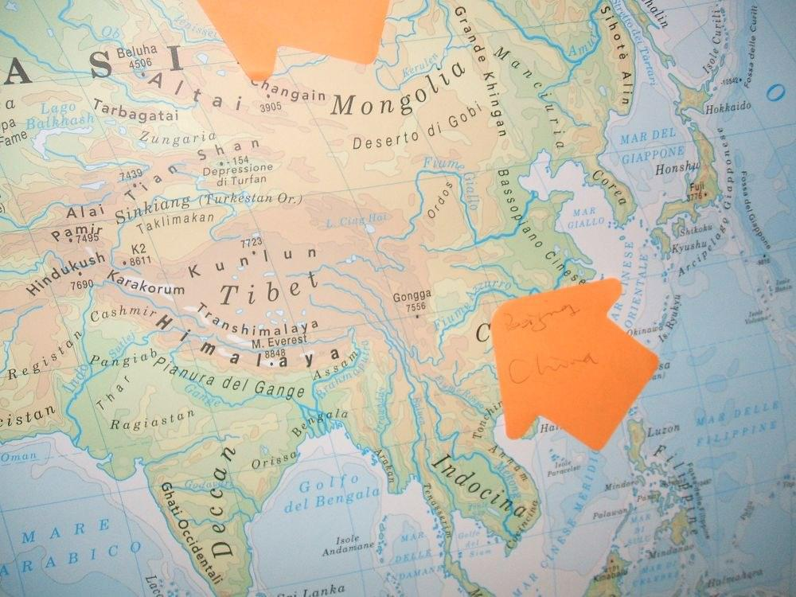

# 被听见的沉默

###(1)###

以色列妹子在北京时，每次听我和出租车司机聊天提到“以色列”都特别敏感。

“颖！我听到你们说‘以色列’了！你们在说什么？”

我便把出租车司机的话翻译给她听。大多是司机从广播里听到的有关以色列的新闻：“内塔尼亚胡很强势”，“他们现在在跟哈马斯干仗，好像经常在打，也不知道是为什么”，“照我看呐，以色列那个地方未来五十年估计都不会和平，跟这个姑娘说，让她能走就早点走吧！”

以色列妹子特别高兴能有机会向中国人讲述以色列，听完我的翻译便迫不及待地开始向师傅澄清。澄清的内容无非是重申犹太人在巴勒斯坦建国的合法性，打击哈马斯的必要性，和以色列人那种时刻担心自己会被从地图上抹去的焦虑。这些话我在以色列时已听过千百遍，回到中国后自己也做过复读机，所以对她总能口若悬河扯上半个小时的演讲多少觉得无趣，但还是强忍下心中乏味拣重点给司机翻译。

“她说，以色列再小再不安定，也是他们犹太人的祖国。就因为祖国经常处于炮弹袭击的威胁之下，犹太人的坚守才更为重要。因为留在祖国可能会有生命危险就移民，不是他们以色列人会做的事情。”

“哟，那她还真是挺爱国的哈！”司机手握方向盘目视前方，或许多少受到触动，“不过巴勒斯坦人也够惨的。”

我把话翻译给妹子听，她自然又是从2000年前开始讲起，再讲到今天恐怖分子给以色列带来的伤害与恐慌。那些冗长的叙述和妹子连一个句号都插不进的急迫终于使同样话痨的司机暗叹了一口气。到达目的地后，妹子的演讲还远未达到高潮。我一边付钱，一边对司机说：“总之她就想表达两个意思：同情巴勒斯坦人，但他们也没有媒体宣传的那么无辜。”妹子趁下车前匆匆结束了自己未完的演讲：“这就是我想让全世界都明白的事情！”

###(2)###

虽然我对以色列妹子那些陈词滥调不复有最初的兴趣，但她这种“代表以色列向全世界发声”的心情，我却非常理解。

五年前，我出发去罗马参加世界青少年峰会时，内心也曾怀着同样澎湃的所谓爱国主义热情。我怀着这种热情花了一整个下午在街上搜寻一枚印有中国国旗的徽章。我把这枚小小的五星红旗别在书包上，兴奋地踏上旅途。

我们四个中国青少年，分享着同一份“代表中国向世界发声”的使命感。后来我们甚至半开玩笑地决定，如果日本代表的英语果真如传说中那么捉急的话，我们也不是不可以勉为其难地代表他们，顺便代表亚洲。

在第一天各代表团自我介绍的环节，大家被要求用便利贴在世界地图上标示自己来自哪里。我们为了先发制人，消灭敌对势力可能发起的任何无耻进攻，毅然决然地用便利贴覆盖了台湾。可是随后我们很快发现，那些倨傲的欧洲人关心西藏远胜于其关注台湾。我为此一度后悔没把便利贴拍在祖国的西南边陲。

前面两篇日志中提到的法国朋友就是我在罗马结识的。当时的他——用他自己五年后的话来说——痛恨中国政府，但他对中国特别感兴趣，在中学已经学了两年中文。吃饭、听讲座、外出活动，他都喜欢跟我们混在一起。我永远记得他在清凉的早晨拉我坐在花园的石板上，兴冲冲地说：“Vesper你来！我教你说法语。”说完就用石子在地上开始比划。我也永远记得他在昏暗的夜灯下对我陈词为什么西藏不属于中国。白色灯光下他咄咄逼人的面孔可谓狰狞。

那时候，单是听到“西藏不属于中国”这句仿若来自魔鬼的毒咒就足以令我恐惧得浑身起满鸡皮疙瘩。

我问他：“你去过西藏吗？”

我预设的辩护策略是这样的：这些自己国内一摊破事管不过来还特别喜欢对中国内政指手画脚的欧洲人不是最喜欢就他们一无所知的事情发表看法吗？他那些口若悬河的论据我从来没听过，也听不大懂，但亲历者永远最有发言权不是吗？法国人肯定会说自己没去过西藏，那我就可以接着反驳——我自己虽然也没去过西藏，但我从小在少数民族地区长大，比他一个远隔千山万水的外国人对中国的民族政策更有发言权。我今天能白白胖胖地到罗马和他讨论问题，不正是中国政府民族政策优越性的最好体现？让他们西藏自己发展的话，他们到哪年哪月才能走出青藏高原？

结果法国人出乎我意料地回答：“去过。我爸爸四年前去西／藏考察时，我和他一起在西藏住了一个多月。虽然语言不是很通，不过我们也去了西藏不少地方。”接着他报出一连串西藏的地名，然后问我：    “你呢？你去过西藏哪些地方？”

在失望地发现不能和我分享他的旅行乐趣后，法国人重新回到他的论证。那个夏日的夜晚，面对他那些排山倒海而来的地质学、人类学、历史学、语言学的论据，我搜肠刮肚，脑海里只有一句苍白的“自古以来”。

他言之凿凿的神情有那么一刻使我产生了轻微的动摇。后来我妥协说，我英语不好，知道得也不如你多，但是你愿不愿意把你刚才说的写下来，我回去查证后发邮件答复你？

法国人欣然应允，接过我递去的纸笔，靠在路灯杆下，就着微暗的灯光洋洋洒洒写满了四大张纸。

那本笔记回国后我再没有打开过，答应要写给他的答复邮件也从不曾发出。

###(3)###

在罗马的整个活动的最高潮应该是与当年参加G8峰会的各国领导人见面。不过每个代表团只选一人。当时我的英语比现在还要糟糕。糟糕到什么程度？面试时我想不起visit怎么说，听不懂“如果你是温总理，面对西方国家指责中国高居世界前列的碳排放量加剧了温室效应，导致了全球海平面上升的论调，会如何反驳？”中国代表团在出发前就定好了人选，但在见面会的前两天还是象征性地举行了投票。

投票结果当然不是我。

那时候，政客在我心中还是很高大上的存在，而且可以一次性见到包括奥巴马、默克尔、萨科齐在内的一共十四国领导人，在当时的我看来，还是很值得向往的事情。此外，我还感到自己有为我的高中带回一张与这些领导人合影的“使命”。

投票结束后的那天晚上，我把自己关进浴室，坐在地板上咬紧嘴唇小心翼翼地流泪，因为不想让加拿大室友听到，进来对我说一堆我听不懂的话。这些领袖在距我仅有两小时车程的拉奎拉，而我因为自己英语不好辜负了那么多人对我的期望。

我靠在冰凉的墙壁上，平生第一次感到了痛苦。

更痛苦的还在后头。回国后，有一次我和美国代表团的一个男生在MSN上聊天，谈到怎么选拔参会代表。美国人说，他们四个名额向全国开放申请，申请人递交申请材料，包括成绩单、志愿经历、课外活动、个人陈述，还要针对当年G8峰会所讨论的任一议题表述自己的看法。

然后他问，中国呢？

当时中国的四个名额，两个给了北京，一个给了河南，还有一个给了我所在的城市。因为当时联合国儿基会在这个城市有试点项目，而我是这个城市最好的高中里总考第一的学生。

这话说完我自己都觉得蠢。美国人看到我的回答后回复了一个意味深长的“Hmmm……”。

我问，怎么了？

他说，没什么，我只是在想这是否公平？

是否公平？当然不公平。我相信当时如果向全国开放申请，光是外国语学校中就能找出好多英文比我好得多，眼界比我开阔得多，综合素养比我高得多的学生。他们比我更应该得到这个机会，也能比我更好地“代表中国向世界发声”。

在这之后的五年里，我无数次问自己：凭什么是你？就凭你来自GDP全国倒数第一的省份，就凭你是个从没学过自己语言的少数民族，就凭你恰好还是个女生？这三样东西中有哪一样是你努力得来的？一样没有。那么，凭什么是你？

就这样，我的第一次出国旅行成为自己最羞于向他人启齿的私密。我觉得我不配，我可耻地占用了本应属于别人的机会。我好害怕有一天什么人冲到我面前质问，而我只能对以无耻的沉默。我拼命寻找可以证明自己的机会，那样的机会——在当时的我想来——只有高考。我觉得只有我考了全省第一，才能证明我配得上这样的机会，才能证明我不是一个对于不需努力就获得的好运感到心安理得的人。

那时的我不知道自己要向谁证明，也不知道谁需要我的证明，更没想过就算考了第一其实也无法证明。我只是一遍遍在心里默念：你只能考第一才能证明自己。

后来我几近精神崩溃地走进考场，在高考结束后的两个月里，我每天除了睡觉就是缩在沙发上抱腿哭泣。

###(4)###

我最终没能证明自己，但当年一起在罗马的朋友们，都在自己选定的人生道路上加速狂奔。那个问我“是否公平”的美国男生进了哈佛；和我一直保持联系的在加拿大念书的韩国人成立了自己的环保组织，并被邀请到联合国总部参加全球公共卫生大会；法国人满世界工作、旅行，一年的生命过得比我五年还长；当年发言被分到一组的俄罗斯男生，现在俨然成为俄罗斯的青年领袖，听闻已是普京面前的红人。而我们当年为其英语水平操心的日本代表，都是外交官和富商的子女，从小在美国接受教育。他们纠结的不是说不好英文，而是纠结自己“不够日本”。这些日本代表曾为艾滋病患者募集到近二十万元的善款，其中一名女生后来也进了哈佛。

我呢？我连自己的目标都还没有。我在一所高中三年从没想过要报考的大学，念一个不是自己选择的专业，我每天一点睡，七点起，大学前两年用结结巴巴的俄语讨论红菜汤、腌黄瓜，和“俄语是世界上最美丽的语言”。

我很早就痛苦地感到中国东西部教育水平的差距，在罗马更见识到我们和欧美同龄人的差距。最直观的差距就是在语言上。那时我们四个的英文都没有流利到可以和英语母语者唇枪舌剑的地步，更多时候我们从自己能听懂的只言片语中感到外国人似乎对中国有误解。但那是怎样的误解？听不明白。上去澄清这些误解？说不出来。

后来我看到BBC在全球气候变化大会期间录制的一个视频，请来了政要和专家，探讨美国和中国的减排责任。台下有中国代表起来发言（原谅我忘了那位女士的名字），有理有据，有礼有节，驳倒了主持人颇有倾向性的论点，引发全场的掌声与喝彩。

我觉得以后我也要做这样的人。我那时觉得外国人对中国的误解和偏见太多，主要都是因为我们英语不够好，解释不清造成的。就像当时在罗马，中国领导人中途退会回国。消息传到会场，大家都很激动，英国人义愤填膺地说：“中国因为不同意碳排方案退出峰会，推卸责任！”我冲上去抢过话筒，第一次流畅地当着那些母语者的面说：“退会跟碳排没有关系，因为中国新疆发生了很不好的事情（我那时候还不知道“暴乱”用英文怎么说），领导人要立刻回国处理。”会场顿时安静许多，还响起了零星的掌声。我由此对偏见的消除相当乐观，觉得很多时候只是一句话的事情，解释清了，有些误解和偏见自然就没了。

在罗马因为英语不好，我深深地觉得中国在国际社会的话语体系中总是沉默的一方。我痛恨这种沉默，立志要为消除这种沉默努力。五年后，在填哈佛国际关系论坛的申请表格时，有一栏问题是“你未来想要达到的目标是什么？”，我写下：让沉默被听见。

当然五年后，我所理解的“沉默”不仅仅是五年前的我所理解的被不公正偏见误解的中国的沉默，我更感到在中国内部，被禁言的历史的沉默，被掩盖的真相的沉默，和虚无主义者的沉默。我想让这沉默发声，让这沉默被听到。

但五年前我更多感到的不是我们内部的沉默，而是我们面对这个世界时的沉默。不过即便在那时，我也模模糊糊地意识到，所谓西方对中国的偏见不仅仅在于我们有些内容未被正确传达，我们与欧美同龄人的差距也不仅仅在语言。具体是什么，我也说不好。他们有比我们更天真、更远大、更乌托邦的幻想，但他们也远比我们更有一步步实现自己想法的决心、勇气和环境。他们比我们更明白自己是谁，也比我们更有勇气坚持做自己。他们从小被鼓励去发现和发展自己的天赋，而非像我们被早早投进流水线，框进千篇一律的模具，浪费人生中最宝贵的青春，努力使自己成为一个不知道世界为何、没有任何底线与标准，并以此为荣的虚无主义者。

朋友从德国交换回来，说起自己在德国听过的一次中德儿童器乐大赛。中国孩子都是背谱的，但不论是两人合奏，还是多人合奏，他们与自己的同伴彼此间没有任何交流。德国的小朋友都需要看谱，但他们的眼睛总在乐谱和自己同伴之间快乐地来回穿梭。一位中国家长在台下说：“哎哟哟，这些德国小孩的眼睛像会演戏一样！”

那个当年代表加拿大参会的韩国男生，在我认识他时就已经每天只睡三个小时了。我说不是据说加拿大高中生的学习任务比较轻松吗？他说：“要及格很容易，要出类拔萃很难，而且除了学习之外，我有很多自己的事情想做。”对我来说，吃辣是一种嗜好；对他而言，每天凌晨三点啃一只辣椒，是为了保持头脑清醒。

五年后在北京，我和法国人也谈起教育的话题。虽然他同样痛恨“软弱的法国政府”，但很为法国的教育自豪。据说法国高中毕业生是全世界同龄人中综合素养最高的。法国中学所授课程涉猎广泛，教育的目的主要在于培养学生根据材料分析综合，得出自己结论的能力，而非抛出一堆勒令你反复记诵的“自古以来”，然后再用这些“自古以来”去论证那些“自古以来”就伟大光明正确的观点。

从罗马回来，我想出国念书的愿望前所未有的强烈。

那时我想去剑桥。为什么是剑桥？峰会期间有一名意大利志愿者，几年前他在伦敦代表意大利参会，现在回来给我们做组织工作。刚到罗马的那个夜晚，他等在宿舍外迎接我们，问候时握手，手掌干燥温暖。那时他在剑桥念书，读经济和法律。我不用听懂他说的每一句话也知道他非常聪明。他长得好看，戴墨镜时尤其。他笑起来时鼻子发出轻轻的声音，然后会用右手握拳遮住上扬的嘴角。就是这样无论什么方面都让人觉得非常舒服的男生。

他是我人生中第一个“想成为”。我的愿望非常单纯——我想做他的校友。

后来我在网上查到，申请剑桥需要修A-Level课程，当时深圳有一家高中还接受想学习A-Level的学生。我妈有一次看到我在电脑桌旁的笔记，小心地问我：“你想去剑桥读书？想去就好好努力，不管需要什么妈妈都支持你。”但是我相信搞不清剑桥在英国还是在美国的她根本不知道自己在说什么。我想去剑桥念书的愿望膨胀得如同一只硕大的气球，后来它慢慢泄气，在我还没意识到时悄悄瘪成一团横在我心里的胶皮。

###(5)###

今年二月我去了哈佛。穷学生住不起酒店，向主办方申请去蹭哈佛大一新生的宿舍。四个姑娘一个套间，里面乱七八糟地堆满袜子、外套、食物和书籍。她们一个原籍天津，5岁时随父母移民加拿大，一个是出生在加拿大的台湾人，一个印度人，还有一个美国人。

美国姑娘把自己野外宿营的睡袋拿给我用，印度姑娘给我抱来自己练瑜伽的垫子，生在天津的小姑娘特别有灵气，和我聊天到半夜。她已经不识汉字，我们聊天也用英文，但她用中文讲“共产党”，字正腔圆得吓我一跳。我跟她说我身边有朋友想出国，也有在美国念书最后回国的。小姑娘不以为然地撇撇嘴：“我可从不知道有什么人想去中国生活。”美国姑娘去纽约参加芭蕾舞比赛，回到宿舍已是半夜十一点。她盘腿坐在地上，和天津小姑娘讨论生物课作业，一定要做完后才搭爸妈的车回家。

台湾姑娘第二天一大早就出门去接伦敦飞来的好友，两人约好去跳水。我问睡眼惺忪的天津小姑娘现在学什么专业，她说还没确定，不过可能会是生物、化学这类方向。说到她居住的城市有个获得诺奖的科学家的实验室。她查对方简历，发现科学家居然也是哈佛校友。于是她发邮件问夏天能不能去他的实验室实习，科学家欣然应允。小姑娘说起这事神采熠熠。

二月的波士顿寒冷刺骨。我缩进哈佛对面的一家餐厅吃早饭。邻桌坐着一个背对我的身穿黑色大衣的男生。虽然没有看到他的正面，但强烈的直觉告诉我，这就是当年那个问我“这是否公平？”的男生。

我坐在他身后，听他和朋友聊球星，聊教授，聊班上的漂亮姑娘。五年过去了，当年那个面容清瘦的少年如今已略显臃肿。他不知道他一句话我记了这么多年，在好多个夜深人静的夜晚我把这句话锻成一柄剑，一刀一刀往自己心上刺。他那句话引发的一系列“凭什么”，多年来如同箍在我心上的咒语，总在我意想不到的时刻收紧，勒出血痕。哪怕在我万事顺遂的以色列，这咒语也总是如影随形。

我特别喜欢自己在以色列交换时的中东史教授。他是纽约人，年轻英俊，讽刺说得辛辣入骨，上课像演话剧，气震山河。我对他又爱又怕。有时他上课提问，我自己在下面小声嘀咕答案，这时候坐在我旁边的阿拉伯女生，就会像我那些可爱的加拿大朋友一样鼓励我：“说大声点！他听不见！”当没人回答，教授公布的答案恰好就是我说的答案时，她就向我投来“你看吧，叫你说你不说！”的可惜眼神。阿拉伯女生的父亲是以色列派驻加拿大的外交官。她在加拿大念完高中，英文说得和我那些加拿大朋友一样文雅温柔。中东史教授特别喜欢她，因为她总有不同的创见。

后来写期中论文，我拿了98，她拿了80。那个“凭什么”的咒语又在我心上收紧。我说我要去跟教授讲，我不配拿这么高的分。她吓了一跳，说你别去，这多莫名其妙。

下课后我已走到教学楼门口又折返回去，对教授说：“您不必因为我是班上仅有的两个中国学生之一，就出于鼓励给我这样的分……”

教授略带诧异地打断我的话：“我的分数从来不是白给的。You deserve what you got.”

我匆匆向他道谢，刚转身推开门眼泪就涌上来。

这么多年，从来没有人跟我说我配得上自己的运气和机会，连我自己都觉得我不配。但是这位我那么敬佩的教授斩钉截铁地对我说：“You deserve what you got.”我在回宿舍的路上一边走一边掉眼泪，觉得终于有一双手开始拔那些扎在我心上的针。鲜血从针眼里汩汩涌出，那么温暖。

罗马是我前二十年的生命中发生的最美好的事情，但是在长达五年的时间里，我把它当做一沉重的罪孽来接受。我渐渐明白，没必要为不受自己控制的事情苛责自己。这世上谁不是被无常的命运推着走的？

美国人问我：“这是否公平？”

我在去罗马前，从来没有受过听力和口语的训练，也从来不知道它的必要。我的英语老师不知道什么是托福。我没有一个当外交官的父亲可以送我到加拿大留学，也没有什么获得诺奖的校友慷慨给予我学业上的指导。但是从来没有人替我问过一句：“这是否公平？”就连我自己也从没意识到有问这句话的必要。我在罗马时看着那些欧洲和加拿大的孩子（美国人当时实在是太飞扬跋扈了，大家都不喜欢），我知道我不比他们笨，我知道我可以比他们更努力。可是我再聪明再努力，又能逃到哪里去？加拿大朋友告诉我自己要跟随政府观察团去南苏丹观察独立公投时，我挣扎在我高考考不了第一、证明不了自己的恐惧里，站在走廊上一道道刷那些历史题，寒风呼呼地灌进领口。

我摇头甩掉这些思绪，喝完最后一口热汤，重新戴上耳罩，走进波士顿寒风凛冽的早晨。

在那天的全体大会上，哈佛的教学官／员前来致辞。提及哈佛已经制作了近百门视频课程，放在Youtube上供全世界的学习者免费观看。“不过，”这位系着蝴蝶结领带的先生说，“中国封／锁Youtube，自己拒绝了哈佛的这一资源。”全场哄笑。

后来见学者，听讲座，和与会者聊天，所有这些活动不免有水的一面，但在哈佛，我更强烈地体会到：不是中国英文说不好，是她确实没什么有价值的东西可说；也不是世界拒绝来自中国的声音，世界一直在对中国说话，但是中国不要听。

###(6)###

不知道从什么时候起，我尽量避免去看五星红旗，也越来越少使用“祖国”这个词。

我在俄语系最敬重的教授，在我申请到去以色列的机会前猝然离世。我还来不及告诉他，我没有被挫折和抑郁吞没，我努力念书考试，用力浪费生命向那些我看不起的人证明自己，终于争取到一点做自己真心喜欢的事情的自由。

我在仍有重度抑郁的大学第一学期就上他的俄罗斯概况课。他在课上一遍遍不厌其烦地对我们讲自己在文革中那些荒谬的经历；他对我那些软弱怯懦给予最宽和的鼓励，“勇敢一点！这算什么挫折！”；他在给我的邮件里，勉励我和他一起，像契诃夫说的那样，“把奴性一点一点地从自己身上挤榨出去”；他坐在地铁站入口的小餐馆里，对我说：“爱一个国家不等于爱那个政府”，他顿了顿，平息自己略有些颤抖的声音，“更不等于爱一个政党！”

在以色列，尤其在特拉维夫，像以色列妹子那样无条件热爱以色列所有一切的人，毕竟是少数。特拉维夫的人们以嘲讽内塔尼亚胡为乐，各党派的领袖只要我问起的，他们都有好多恶毒的笑话要和我说。政客在我心中，也慢慢不再是那么神圣的存在了。

我越来越觉得自己对这个国家的归属感，更多地是归属于那些天赋得不到自由发挥，才华得不到尽情施展，青春被无谓浪费，经历了无数人伦惨剧的人们。我感到自己是他们的一分子。

我们都是受害者。

俄语系的老师曾说过一句让我沉默良久的话：真相对不相干的人来说还是不知道的好。

但是哪些人会真的与真相无干呢？“好”又是什么意义上的“好”？

我如高尔泰一般，“瞪着惊讶的眼睛，看世事如魔幻小说”。我看到在今天的中国，那种令人窒息的沉默。大多数人沉默，因为他们未经省察，无话可说。有的人沉默，是一种自觉的沉默。这些人自愿选择和真相相干，和被摧残的生命相干，和被侮辱的尊严相干，和被践踏的信仰相干。

和痛苦相干。

我知道有那么一些人在等待着，或期待，或绝望。抑或他们根本已不在等待，他们无声反抗的姿态本身已让我感到沉重的庄严。

###(7)###

回国后上俄罗斯文学史。讲白银时代，那么灿烂辉煌。然后讲到上世纪三、四十年代，阿赫玛托娃被禁止创作。

古米廖夫，死。

曼德尔施塔姆，死。

茨维塔耶娃，死。

阿赫玛托娃后来在《安魂曲》的序里写：

在那令人担惊受怕的叶若夫年代，有十七个月我是在排队探监中度过的。一天，有人把我“认出来了”。排在我身后那个嘴唇毫无血色的女人，她虽然从未听过我的名字，却突然从我们大家特有的麻木状态中苏醒过来，在我耳边低声问道（在那个地方人人都是悄声说话的）:“您能把这些都写出来吗？”“能。”我说。于是，在她那曾经是一张脸的部分掠过一丝似乎是微笑的表情。

我知道我在写。有人在写。写这深如黑洞的沉默。沉默地写。也许这沉默永远不会被听见，但是那些选择与痛苦相干的良心，从来不会沉默。

（编辑：王丹妮； 责编：杨修）

**（原文链接：http://www.douban.com/note/425178926/）**