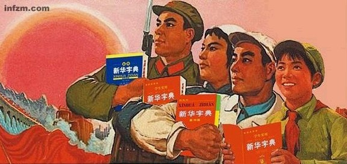

# 被驯化的字典

#### 写在前面的：

齐泽克一直很不满《一九八四》。他认为奥威尔对集权社会的分析很不得要领，天真地认为苏联真有那么严密的国家机器来控制人们的思想。事实上，并不存在一个完美无缺的“系统”，也并不存在奥威尔描述的“毫无反抗的统治”。

就像俺在搜罗1971年版《新华字典》的修订时所看到的，这是一本如此怪诞并成功将怪诞传播于世的字典，但它的怪诞却并非源于严令。更多的，是草木皆兵下读书人的自我催眠与自觉作恶。

当然这也不能全怪他们。很多时候，体制对人最大的伤害，不是敲打，而是恐吓；不是毁灭，而是赎买；不是被黑暗吞噬，而是与魔鬼共舞。“我们被欺骗，是因为我们想被欺骗”。恐惧源于体制，但懦弱发自内心。囚笼的缝隙，正是被我们的懦弱所填满的。

就像杨武听闻妻子被强奸时、萧瑟发抖立于其中的那个“隔壁房间”，比我们想象的要庞大许多。这间黑屋子，是我们常主动走入并甘于藏身其中的。平凡人之怯、之昧、之恶，不该被谴责、嘲笑，但理应得到自视、自惭、自伐。

#### 一

1970年，文革已有四年，接到修订《新华字典》的任务，北京大学青年教师安平秋很紧张，就像“流放已久的战士重新被征召”。

这年4月，中国首枚人造卫星“东方红一号”发射升空，伴随着卫星所发出的激昂旋律，大地上的人们涌上街头庆祝“文化大革命的伟大胜利”。然而，在这年9月，同样曾以《东方红》为题写作小说的作家赵树理，则作为“黑标兵”被批斗致死。人们陷入“宇宙高歌东方红”的狂热中，甚至不会发觉：卫星放出去，中国的形象却未因此“亮堂”起来。

当时，欧洲最小的国家——摩纳哥的国王访华，赠送给中国一部多卷本的《摩纳哥百科全书》，周恩来总理则只能尴尬地回赠一本小小的老版《新华字典》。

这般“小国送大书，大国送小书”，深深刺痛了党国的自尊与骄傲。更让人难堪的是，就算是周总理送出的这本1965年版《新华字典》，也因文革的冲击遭到了被封、被毁的厄运，平民老百姓甚至无缘得见、无书可读。

为了来日有一本更“像样的书”送给外宾，也受困于当时中小学没有字典可用的窘迫，周恩来下令重新修订《新华字典》。

小小字典的修订，成了“国家工程”。一个30余人的修订组迅速成立，成员均来自北京大学、北京第一师范学校等单位。那时安平秋已做了多年的中文系“黑帮爪牙”，其他编撰人员也大都属于“反革命小集团”。修订组的总领导，是工宣队、军宣队派来的两个“工农兵代表”。

安平秋的同事、北大教师曹先擢曾经“傻乎乎”地问总领导：新华字典的编撰一直是社科院语言所的事，这次怎么落到了北大的头上？

对方回答：语言所都烂掉了，他们全都是封资修，被分配到了五七干校。

避免了被划为“烂掉了”的那一撮，重获了任务与位置，这群“臭老九”们感到“心酸的幸运”。安平秋的老师、时年69岁的教授魏建功，则作为北大“反动学术权威”，成了“最为幸运的一个”。

魏建功是1953年第一版《新华字典》的编撰者。1948年，解放军接连攻克长春、沈阳、徐州，国民党败局已定。语言学家魏建功邀请金克木、周祖谟等人，商讨编撰一本属于“新中国”的字典。金克木如此讲述那时的情境：“人民解放军已经包围北平，我们在魏家的大厅屋中草拟新字典的构想……城外传来的炮声仿佛给我们打击节拍。我们不会别的，只能咬文嚼字。谈论字典等于谈论中国的前途。炮声使我们的信心增长。”

只是那时的他们未曾想到：这群“谈论着中国前途”、“在炮声中信心增长”的知识分子，在完成字典编撰后，便成了“新中国”最不欢迎的一类人。魏建功在文革中因“反对鲁迅”而历经多年批斗，患了严重胃下垂，余生每餐只能吃软烂的面条。

更让学生安平秋有“莫名的悲哀堵在心间”的，是当重被召回修订字典，魏建功仍像“一个老儿童”那样的认真和得意。安平秋回忆，魏先生听惯了直呼其名的训斥，会因为在修订组里听到一声“老魏”，而“十分满足和高兴”。

在一次学习会上，魏建功甚至特别发言感谢工、军宣传队的领导，因为他“又能为人民工作了”。

于是，这群暂离了牛棚与批斗的教师们，就这样背负起了如“国家形象片”般盛大而艰巨的字典修订工作。周总理批示，国务院科教组领导，张春桥、姚文元、郭沫若等“重要领导”校正——安平秋有时半夜惊醒，会感到“喘不过气”。

曹先擢这样形容当时的忐忑：“这个编撰工作，和业务无关，就是一场政治仗。”

#### 二

在修订1971年版字典的日子里，魏建功和安平秋师徒俩常会到八宝山革命公墓漫步。有时，魏建功会喃喃地对学生说，对他的批判有些很有道理，“自己从旧社会过来，因袭太重，该当扫荡扫荡”。

事实上，从1953年第一版《新华字典》问世开始，每一版的编撰者们就已主动作别旧时代的“老语言”，转而拥抱崭新的“社会主义语言体系”。在他们看来，字典就是战场，每一个字词都是区分敌我、新旧、革命与反革命、社会主义与资本主义的楚河汉界。

布尔什维克、三反运动、单位、合作社等国家新词登堂入殿，大获褒扬；帝国主义、修正主义、国民党、蒋介石等词，则是每一个解释及例句猛烈抨击的“靶子”。

比如“惨”字的例句：“资本主义国家的工人生活太惨了”。“苦”则被排除在社会主义新生活之外，因为它多指“在旧社会压迫下所受的痛苦”。我们也不能再相信“命”，那是“剥削阶级骗人说人的贫富、寿数等生来就注定的……”甚至要严格区分“爱”，因为“爱是有阶级性的。”

当时十分流行的四角号码查字法，就被视作“污秽”而摒弃了。因为发明此法的原商务印书馆总经理王云五，后来成了国民党的官员，叛逃去了台湾。

1962年版的字典上，还进行了一场“字面上的抗美援朝”——《各国面积、人口、首都一览表》上，美国被列在倒数第三，朝鲜则被排在前列，并注明有两个首都：一个是汉城，一个是平壤，并用括号提示是“临时首都”。翻遍字典，找不到“韩国”一词。

过往传下来的词，如绅、儒、丞、伶，也都在字典里戴上了“旧社会”、“封建时代”、“剥削制度的产物”的帽子，连带着它们所指示的人与物，从此消失于中国。

70年代之前，《新华字典》共有7个版本。人们曾认为，这7本字典如此的修订，源于强硬的国家意志，但曹先擢否定了这个说法。他说，这并非来自高层授意或干预，而是新中国刚成立后“知识分子自觉的政治热情”。

换一种说法，那是知识分子们主动的“思想洗澡”。

而当历史翻到1970年，这一次，编撰字典的人们猛然发觉：自己或许还有那一份自觉的“热情”，但心中更多的，则是散发着大字报与牛棚味道的恐惧。恐惧源于当时“浓烈的政治氛围”，却更多源于杯弓蛇影般的谨慎。恐惧最终凸显在纸墨上，让每一个铅字都瑟瑟发抖。

#### 三

字典修订初期，曹先擢和同事们都是“待罪之身”，他们所怀揣着的心态，是“自我保护都恐之不及”、“我们就是来打工的”。当时曹先擢的脑子里就一个声音：“知识分子算什么？臭老九，扫厕所的，需要被工农改造教育的，大家都唯恐自己在思想上达不到高度，跟不上工人阶级的思想境界。

但工作伊始，他们很快惊奇地发现：工、军宣队的领导，对他们居然都“很客气很尊敬”，没有“我认为应该怎么样”的指使；周总理仅提出了“小改应急需”的意见，科教委也没有“明确的修订标准和规范”。

曹先擢回忆，短暂的无所适从之后，修订组却陷入了一种更加“混乱”的状态。因为没有标准和规范，于是“拼命往左靠”成为唯一安全的堡垒，“无产阶级专政要落实到每个词条上”的原则，也迅速被每个组员所遵循并恪守。

那时，修订组每一天的工作是这样的：将1965年版新华字典一页页剪开，贴在中文系教研室的墙上。面对着满墙字词，大家开始逐个找“封资修”，并“事无巨细地作政治检查并加上政治套语”。

一切以“去封资修，工农兵占领上层建筑”为准绳：“清官”不许要，要改成“清廉”，因为“清官”是吴晗提出的；例句里提到的“外号称‘二诸葛’”也要删掉，这是赵树理小说里的人物；“利人利己”不符合主流价值观，要换成毛主席语录里的“毫不利己，专门利人”。

当然也有“难办”的时候：在修订《化学元素周期表》时，有两种元素在命名上有争议，一个是“苏修”命名“美帝”不承认，另一个是“美帝”命名“苏修”不承认——美国历来反动，老大哥也不那么亲了，怎么办？辗转反复，修订组最终采取了“在表上列出但暂不写名”的“两全办法”。

修订组也想请一些专业领域比如科技、经济界的学者参与，但“不讲专业性、只讲政治性”的门槛还是将其阻隔其外。整本字典关于“业务”的修改，仅有两处：一个是改了一个生僻字“炁”，另一个则是请人重画了“头”的示意图，好使其“眼睛更坚毅，眉毛更浓密”，这样更符合当时“典型的工人阶级的模样”。

字典的初稿，最终修订了“接近一两千处”。但当70年11月修订组将初稿递交中央后，意想不到的情况接踵而至——周总理看到字典，有些气恼，要求的是“小改应急需”，怎么成了这番模样？

前国务院科教组副组长迟群回忆，有一次总理问他：“为什么‘背着太阳’删了，改成了‘向着太阳’？”迟群回答：“编辑们觉得这有影射之嫌。”总理怒了：“神经过敏！”

而当看到“殿下”一词作为封资修被删掉，周恩来有些无奈：“西哈努克（柬埔寨国王）还要来，我们还要称他为亲王殿下……后代要查什么是‘殿下’，字典都没有，我们怎么交代？”

安平秋说，那时他才慢慢明白：言论的笼子并非如想象般密不透风，他开始试图扭转“神经过敏、政治性太强”的头脑，让字典重回“小改”的轨道上。

然而不幸的，他接着发现了另一个事实：“大家当时都疯了。”

长期处于高压状态及未知恐惧，许多修订者丧失了独立判断的能力与挑战底线的勇气，将锁链看为花环，自觉走进了笼子并将其视作忠诚。

安平秋回忆，编到“茹”字时，举了一个例子“茹毛饮血”。有个张编辑就说：“这个很敏感，不能要呀，删掉！‘茹’是吃呀，‘毛’是毛主席呀！”魏建功先生惊诧莫名：“你怎么能这么想？”她更火了：“你是不是攻击我，想攻击我想歪了？”

类似事件接连发生，安平秋总会搬出“总理的要求”来解释。有一次，一个教授怒了，大叫：“我管它周总理还是李总理！就是要突出政治，就是要删！”

而最让安平秋唏嘘的，来自于被囚禁的一群人。当时他拿着修订好的字典，来到一所五七干校，请那里正接受贫下中农再教育的知识分子提提意见。一个在新闻出版系统从事了几十年文字工作的干部，指着“屈”字下的“屈原”一词，拍着桌子，怒吼道：“怎么能把屈原放进字典里！屈原哪里是好人了？”

安平秋很委屈：“这只是一本字典，不是批斗场……”

#### 四

多番争论，修订组确立了折中的规则：“尽量做减法，减去封资修，尽量不多加法，言多必失。”当时很红的词条，如大跃进、大字报、三面红旗等词条，都未收录。曹先擢说不是不想收，而是不敢收。“谁敢给这些字词下定义呢？这是要报中央政治局批准的。”

最终，1971年版《新华字典》得以出版。安平秋至今心有余悸：“要经过多少次的搏斗，才编成这样一本字典？”

然而，当我们今天翻开这本字典仍会发觉，政治话语犹如生长在每一页纸的癣症，依附在每一个字词上并角化结疤。修订者刘庆隆说，这版《新华字典》成了在文革期间，中国在“政治上唯一合格的字典”。

这本字典的影响有多大？

曹先擢回忆，1970年，大学停课，中小学还在勉力维持，但当时社会上已几乎没有出版物，包括一本小字典。就算是1965年曾计划出版一本“农民版字典”，也在文革后不久被彻底销毁。

他一直记得这样一个故事：有个农村小学教师，因为手头没有字典，遇到学生不懂、自己也不懂的字，就坐在村头，一个个问过往的路人，直到遇到认识这个字的人。

于是当1971年《新华字典》出版，即迅疾得到推广，发行以千万计，成了整个文革年间唯一流通的字典——也或许是十余个版本里最为“左倾”的。于是，这本字典所构建的话语系统，如章鱼般向四方伸出触角，深入到每一个咿呀学语的儿童、每一个社会主义新人类的头脑中。

无数的人们，从这本字典获得对世界的最初认知。比如，人们懂得了使用“阶级”划分敌我，学会了规范严肃的腔调去交谈，并用小心谨慎且四平八稳的语言去评论世界。“群众”或“党员”成为人最基本且选择不多的身份，“社会主义”也被所有褒义词竞相环绕。

直到90年代初，字典的修订才尝试着重返常识，但人们发觉，这一套话语体系，已如魂灵般在中国挥之不去，你轻易地就能在报纸、电视、广播中发觉它的存在。

在奥威尔那本著名的《一九八四》中，同样存在着一个“新话系统”。它的创造者如此解释它的作用：“我们的工作是决定语言的最后形式——也就是大家都只用这种语言说话的时候的形式……我们是在消灭老词儿——几十个，几百个地消灭，每天在消灭。我们把语言削减到只剩下骨架。”

“最后我们要使得大家在实际上不可能犯任何思想罪，因为将来没有词汇可以表达。凡是有必要使用的概念，都只有一个词来表达，意义受到严格限制，一切附带含意都被消除忘掉。词汇逐年减少，意识的范围也就越来越小。”

奥威尔所没有意识到的是：他所描述的语言的消亡，往往并非是由统治者，而是由人民自己所完成的。

只是很遗憾，在1970年，又或者以往或未来的任何一个年代，人们总是轻易地将罪责归结于体制。就像那一年字典的修订者陈原所说的：“千万不要责备参加这次修订的人们，谁都只能依样画葫芦，那是一个动辄得咎的年代。”

 

（采编：徐海星 责编：黄理罡）

 
