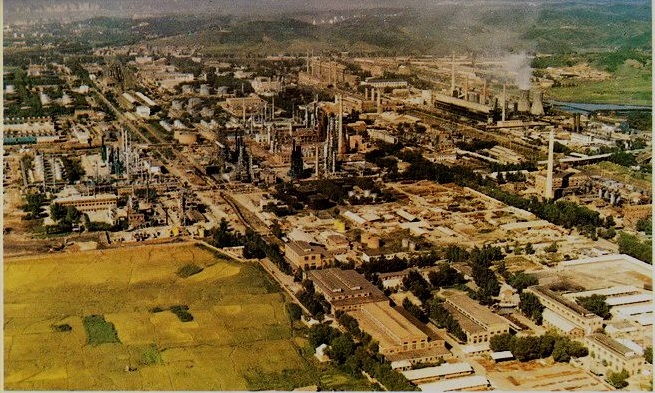
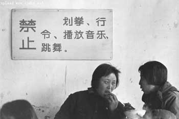
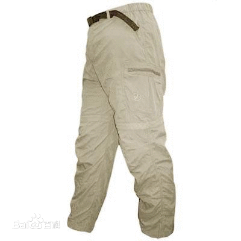

# 西瓜

我妈打电话问我最近怎么样，我说还行老样子。她说学习要抓紧，每一门课都不能落后，仿佛我还在上高中。事实上我基本不上课，哪一门课都不曾领先。接下来就是她的一连串固定问题，有没有吃饭有没有加衣服，我说又不是生活在大森林里，问这些干什么。她没话了，问我有没有什么要和她说的，我说没和我爸吵架吧。她说没有，我们在家从来不吵架。我说那就好，你们保重身体，没别的事我就挂了。她说你爸真不是个东西，中午让他洗碗，三分钟就洗完了，鬼画符一样，盘子上的油都没洗掉，说他两句还不高兴，你千万别学他。我说我性格一直都像您，别和我爸一般见识，拜拜，她说拜拜。

从小到大，我有幸见证了父母无数次吵架，我妈每次生气了，都说我爸“真不是个东西”。

“那一年你拿着一大包钱就跑回来了，真不是个东西！”

那一年是一九八五年。

我在大学里闲着没事翻过一些经济档案，八三年到八五年，国营工厂给上级打报告常常说“中央政策好”、“市场销路好”、“今年翻几番明年翻几番”，报告印制粗糙，错字连篇。那是一个鲁莽前行的时代，我的父辈一无所有，他们可以轻易改变自己的命运，钞票像雪花一样飞来，他们不知所措，于是像扔废纸一样扔掉，天空中扬起更多雪花，厚厚地沉积在早已荒芜的原野上，覆盖少得可怜的天真与梦想。天真与梦想不是脏的，但是必须和裹挟它们的周遭一起彻底死去。一个声音在父辈耳畔响起：你的过去是错的。声音不是由上帝发出却比上帝更有力量。收割机推倒一片片麦田，混凝土浇筑一幢幢高楼。蓬头垢面的年轻人走出饥饿的村庄，迎着太阳愤怒奔跑，充满逃离毁灭的喜悦。

八十年代初，华东发展经济需要能源，两淮（淮南、淮北）地区兴建煤矿，这是安徽省在改革开放初期继包产到户之后的又一件大事。工程浩大，建设力量不足，政府号召全省支援两淮。各地临时组建工程队，招募找不到出路的年轻人，简单教点儿技术，就往淮河去了。

滁县工程队由安徽最东部向北开进，我的爸爸西瓜就在这支队伍中。我爸说当时他刚结婚没工作，听说工程队招工就去了。他们小时候饿怕了，想法很简单，荒年饿不死手艺人，去学门技术，以后好混口饭吃。

工程队三百多号人，有男有女，作为学员工集结在县上的构件厂，住宿舍，发粮食。构件厂的空地有好几个足球场那么大，厂里的主要工作是浇筑楼板。那时的建筑还不是钢筋混凝土结构，靠工人砌墙，然后搭楼板。到处都在破土动工，楼板的需求量很大，空地上每天都有翻斗车跑来跑去运送物料。临时招募的年轻工人由老师傅带领着，学习垂线、和泥、砌墙、搭跳等基本技术。

墙不能砌歪了，得比照着垂线，垂线是一根白线吊着的铁锥，把锥悬在哪，悬几个锥，是工地技术员的事，但普通工人也得懂。当时搅拌机很少，一个大工地能有一台就不错了。大部分“墙灰”得工人自己和。水泥、河沙、水三样东西，比例要掌握好。水泥多了浪费钱，出来的墙没有“弹性”，沙多了砖与砖之间黏得不牢，砌出来的墙不结实。卡车运到工地上的河沙太粗，里面有很多小石子，不能用，需要筛一遍。筛子和床差不多大，中间是细细的金属网，好筛子都是金属网，否则不耐用。将筛子用木棍支撑，和地面成六十度角。工人用铁锹铲起粗沙，对着筛网一扬，细沙和石子就分离了。石子就放在那，工头第二天指着一大堆石子骂送沙的人，乘机杀价，每车沙可不可以便宜一点。经过筛选的细沙用小轮车运送，车斗里装沙，沙上搁两包水泥，这种运输工作一般由小工做，熟练工都在跳上砌墙。到了地方，小工先将水泥包卸下，然后用脚一蹬车后部的铁扣，整个车斗就向前翻下去，斗里的沙迅速在地上堆起一座小山丘。接下来要将山丘变成山谷，用铁锹将中间的沙往四周扒拉，直到中间出现一个坑，将适量的水泥倒进去，再放上水，水在坑中不会溢出去。最后一步是搅拌，还是用锹，“墙灰”和匀了就盛进泥碗，泥碗上系着粗绳索，绳索的另一端连到跳上，跳上的熟练工像在水井里打水一样一截一截拉动绳索，直到将泥碗提在手中。

那时候没有专业的架子工，工人自己动手搭脚手架。现在的脚手架用钢管，以前用毛竹。我爸说用竹子搭脚手架搭得最好的是深圳，他去那里看过，开始很吃惊，他们用的竹子很细，仔细看才发现南方的竹子虽然细，但竹肉很厚，韧性好，非常结实，所以他们盖那么高的楼还敢用竹子，了不起。毛竹之间再搭上竹片钉成的横板，这就是跳，工人站在上面施工。

没有升降机，砖块只能一层一层往上送，最快捷的送砖方法就是下面人扔，上面人接。跳很有弹性，扔砖接砖时脚下的跳能够起到缓冲作用，减轻他们的劳累。工地收工之前，有一段时间专门用来送砖。大家放下手中的活，站在不同楼层的跳上，或是扔或是接，既是娱乐也是为明天开工做准备。老工人很怀念跳，在一颠一颠的跳上，他们能找到劳动的快乐。我爸说那时候经常有失手没接住的砖掉下去把人脑袋砸破的，但大家还是对扔砖乐此不疲。一到傍晚，就有人大喊“不干了扔砖了”。

住进构件厂已经是冬天了，四周空旷，抬头只能看见电线和麻雀。宿舍楼在夜里像寂寞的哨兵。开始时大家很守规矩，白天老老实实学手艺，晚上老老实实睡觉。等技术慢慢学到手，有人就开始缺勤，躲在宿舍睡懒觉、打牌、喝酒。老师傅们对此比较宽容，他们只管教技术，不负责管理，而且那几样活学一阵就会了，老是教，他们也觉得没意思。学员们也乐得磨洋工，反正该发的粮食补贴不会少。有一天，一个叫西瓜的年轻工人将扑克牌和酒带进老师傅的宿舍，构件厂的教学生产秩序从此大乱。

地委书记来检查的时候，偌大一个工地愣是没看见人，构件厂的生产停止了，老师傅和学员不见了。转了半天，地委书记和随行人员在一辆翻斗车背后发现了华叔。华叔是我爸的工友，我们家的老朋友。他穿一件破旧的棉大衣，靠着车轮胎睡着了，身边放着一本纸页泛黄的《安娜·卡列尼娜》。地委书记拍拍他问人哪去了，华叔迷迷糊糊的，不知道对方是谁，抬起手往宿舍楼随便一指，别过脸继续睡觉。地委书记走进宿舍楼，看见一群被资产阶级腐朽思想严重侵蚀的、执着于低级趣味的、毫无希望的年轻人，当即大怒，叫喊着要枪毙负责人。地委书记谁也没枪毙，因为他自己就是负责人。

工程队的全名叫“滁县地区支援两淮煤矿建设工程队”。滁县设有地委，下辖好几个县，工程队中除了滁县本地人，还有来自凤阳县和定远县的工人。只有地委出面，这支队伍才能组织起来。

“同志们，党的十一届三中全会给我们明确了方向，规定了任务。我们的伟大祖国正在努力实现四个现代化，省里开发两淮煤矿，就是为了响应中央号召，推动经济建设。从全省各地调集力量就是为了打好这场硬仗，我们滁县千挑万选选中你们就是要在这场硬仗中体现我们的作用。你们都是年轻人，应该朝气蓬勃、奋发有为、努力钻研。可你们现在是什么状态呢？懒、散、肿，一盘散沙，毫无斗志！这样的队伍怎么打仗！”

地委书记是个老革命，张口闭口都是打仗。他介绍完国内省内的大形势，就开始痛斥眼前这支无组织无纪律的队伍。我爸说他是第一次见到这么大的官，地委书记训了他们整整两个小时，从政治立场讲到辩证统一，讲的我爸爸西瓜彻底服了，因为他的腿站得酸疼，撑不住了。我爸说从那起他就知道能讲的都能当领导，当领导的都能讲。

讲到最后，地委书记说：“同志们，我们是工人阶级，工人阶级是先锋队嘛，先锋队就要有先锋队的样子。你们都在宿舍睡懒觉玩牌的时候，这个小伙子一个人在工地上看书学习。”地委书记指着站在第一排的华叔。“人家怎么就不像你们呢。这样的小伙子才是工人阶级的榜样，才是国家未来的希望。大家都要向他学习！”

我爸说他当时不以为然，你华叔又没去干活，看书不也是偷懒吗，同样旷工，只是我们爱玩牌他爱看书罢了。显而易见，西瓜就是个落后分子，华叔认真读书的时候，他手里夹着烟到处乱窜，喝酒打牌总少不了他。地委书记走后，老师傅摇摇头，都是被西瓜那小子给拖下水的。我觉得我爸其实不简单，那时候就敢质疑地委书记的话。

华叔得了夸奖，出了名，弟兄们都往他身边凑，其中就有我爸爸西瓜。工程队出发前选队长，华叔全票当选。

队长华叔指着西瓜：“这小子脑袋挺灵光，让他管后勤吧。”

我妈说我爸拿着一大包钱的事情，是他在淮北管后勤的时候借着采购蔬菜的机会跑回来，向家里人炫耀自己手握重金，这在当时是犯错误的，我妈当时把他骂走了，后来一吵架就拿这个说事。

八十年代初，人人有一股干劲，无奈工程技术跟不上，工作效率自然低。工程队在淮北干了三年，就盖了前后两排宿舍楼，每一幢只有五层，要是在今天，一两个月就建起来了。我爸和华叔经常讲支援淮北建设是一件非常扯淡的事情，不仅没帮上什么忙，还给当地惹了不少麻烦。完了他们总会加上一句，“那时候还年轻嘛”。

西瓜在淮北的时候很辛苦，工程队军事化管理，人人都得干活，管后勤的也不能脱产。好在他和华叔关系好，给他安排了相对轻松的活——给工程队开翻斗车。翻斗车来回运建材，一天若干趟，挣了钱就买烟抽，抽的一分不剩。不过他回滁州的时候还是给我的老太冬瓜买了不少东西，都在坟头烧了。

支援煤矿建设是响应国家号召，和吃大锅饭没什么两样。工程进度慢，都在磨洋工。年轻工人都调皮捣蛋，磨洋工的间隙喜欢打架，惹出不少乱子。

滁县地区到淮北的工程队有至少三支，滁县一支，凤阳县一支，定远县一支，其他的县大概也派了队伍，爸爸说记不太清楚了。三支队伍中，定远人比较安分守己，从不惹事，凤阳人彪悍，别人不敢惹，滁县人居中。

每个工程队有自己独立的食堂，每天的伙食各不相同，工人们就会“串伙”。比如今天滁县的食堂烧萝卜而凤阳的食堂烧肉，滁县的工人就会去凤阳食堂蹭饭吃，明天凤阳的食堂烧大白菜滁县烧鱼，凤阳工人就会跑到滁县食堂来。鸡鱼肉蛋总是有限的，每到饭点，各工程队会派人在食堂门口看着，不是自己人不给进，工人为此常常有纠纷。

有一次，滁县工人去凤阳工程队的食堂蹭饭吃，被揍了。滁县工程队大概有十来个工人，人本来就少，吃了亏还不服气，把凤阳工程队食堂里的米桶面桶全掀了，搞的米面齐飞一团糟，结果被揍得更惨。

这些人一瘸一拐回到工地的时候，滁县工人都在睡午觉。队长华叔听说这个事，头都炸了，虽然爱看俄国小说，华叔本质上还是个暴脾气的流氓无产阶级。小时候我还穿开裆裤的时候，华叔经常逗我：“过来过来，小鸡鸡给叔叔摸摸。”?据爸爸说，那次凤阳人确实比较狠，被打的工友太惨了，大家都看不下去。

华叔把洗脸盆拿起来，用瓦刀使劲敲盆底:"别睡了！都他妈给我起来！“

包括西瓜在内的工人们都起来了，钻出工棚，听说工友被打，全炸毛了，吵吵着要干架。工人阶级迸发出战斗力并不需要太长时间。按照华叔的要求，所有工人戴上安全帽，拿上锹，但是要用脚把锹头踹下来，防止打死人。

几百号工人出发了，西瓜开着翻斗车也出发了，三角形的斗里站满了工人，翻斗车边还有工友在跟着跑，搞得跟装甲运兵车一样。华叔气喘吁吁跑着，肩上扛一把铡建材的大铡刀。不少小工没有专属自己的铁锹，手里没有家伙打架肯定要吃亏，华叔见到路边有小树，冲上去拦腰砍断，再把树枝铡一铡，将一根根带着树皮的木棍递到小工手里：“待会狠狠打，打死狗日的。”

工人都带着安全帽，在路上列队跑步前进。那时候安全帽不像现在这样是塑料制的，都是藤条编的，远看墨绿一片，像钢盔。他们手里斜拿着锹杆，乍一看还以为是枪。路上运煤运建材的卡车全停下来了，司机们看见路上跑着几百号“戴钢盔拿枪”的家伙，都吓傻了，以为文革时期的武斗又出现了，不敢再往前开。那一天，淮北的公路一直堵到夜里。

西瓜把车开到的时候，凤阳工人正在翻墙逃跑，来不及逃跑的被按在地上，好多人腿都被打断了。

交通堵塞十几个小时，严重影响生产，矿区新栽植被遭到严重破坏，打伤工人多名，地方领导震怒。公安处派人去工地调查的时候，西瓜他们正在打牌，不耐烦地回答说我们中午都在工棚里睡觉，什么都不知道，食堂锅里有肉包子，警察同志饿了就去吃。

这件事最后不了了之。

西瓜年轻时候是个聊骚货，工程队里有个女测绘员长得挺好看。西瓜借职务之便经常给人家送点水果糖糕，停工休息的时候还开着翻斗车载人家出去兜风。现在听上去觉得很屌丝，就好比开着拖拉机去三里屯把妹一样。但是按照当时的条件，西瓜在工程队绝对算得上高富帅，既有名车，又有源源不断的小礼品。

有一次，西瓜开着翻斗车带着测绘员去附近一个庄上玩，无意中开进一片柿子林。你们可以想象一下当时的场景，夏天的末尾，暑气未消，天还未凉，翻斗车后座”突突突“冒着黑烟，西瓜和测绘员美眉静静坐在车上，头顶是大片大片红彤彤的柿子，多么浪漫，多么有诗意！

美眉问西瓜想不想吃柿子，西瓜说不想，吃了会拉肚子。美眉说我想吃，西瓜说我帮你去摘吧。他把翻斗车的火熄了，就往树上爬。柿子树的树干光溜溜的，爬起来有些困难，美眉就在下面推他，年轻女孩子有点马大哈，直接找最优着力点，把手放在西瓜的屁股上推。西瓜害羞了，于是噌的一下子就上去了。

西瓜摘了柿子就往下扔，美眉就在下面来回跑着接，发出银铃一样好听的声音，弄得西瓜心里痒痒的。

远远听见骂人的声音，西瓜在树上看见有人过来了。等他从树上跳下来，才意识到刚才把车子熄火是个大败笔。翻斗车的柴油机要发动，需要用摇把摇响，西瓜手握摇把还没摇几圈，庄子里的人就围上来了。美眉愣愣地用工作服兜着西瓜摘来的柿子，不知所措。

一个老头子说你们滁县来了这么多狗日的泥水匠，都来偷柿子，快把老子的柿子偷完了。西瓜和美眉好话说尽，对方不为所动，把他们当作小偷锁进一间小屋里。因为是出去把妹，西瓜当天穿了一条崭新的卡其裤，老头的两个儿子看上西瓜的裤子，就上手去扒。因为有美眉在场，加上裤带系得比较紧，裤子到底没让人家扒走。美眉后来哭了，西瓜去安慰她，美眉说我们以后不要偷偷见面了，这样不好，回去以后怎么见人。西瓜嗯了一声，两个人只能等，也没别的办法。

工地上丢了一辆翻斗车两个大活人，肯定要四处找，找到下半夜才知道是被地方上的人扣起来了。工程队派人去交涉，愿意赔偿柿子的钱，老头很固执，坚持说西瓜和美眉是小偷，要找警察。后来华叔摸清了老头的意思，他不放人是想要挟工程队，把翻斗车讹走。

华叔不愧是工人队伍中的杰出人才，充分发挥了自己的领导才能。天快亮的时候，一千多号工人把村庄围了起来，经过华叔的串联，能征惯战的凤阳工程队来了，安分守己的定远工程队也来了。工地上所有能开动的重型机械都开了过去，好多履带式拖拉机远远看上去就像坦克一样。翻斗车拖拉机把车头灯打开，直直对着庄里的草屋瓦房。华叔站在车上喊话，老子就要偷你的柿子，一分钱不赔，不放人老子就把整个庄子平了，狗日的！

几十台柴油机一齐轰鸣，阵势挺吓人的，最后西瓜和测绘员美眉全身而退。这件事情上级同样很震怒，往下追查了一阵不了了之。

我的爸爸西瓜讲完这件事，说你妈不知道我年轻时候跟别的女人摘过柿子，你不要告诉她。我当然一转头就告诉我妈，她当时在做饭，没什么反应，轻轻说了一句“不是东西”。

院子里的孩子考上大学摆酒席，他们老工友都会单独坐一桌，每次都喝得东倒西歪，醉醺醺叮嘱我们要好好学习。

“我们年轻时候要有点文化，也不会出那么多洋相。”

(采编：刘铮；责编：刘铮；)
