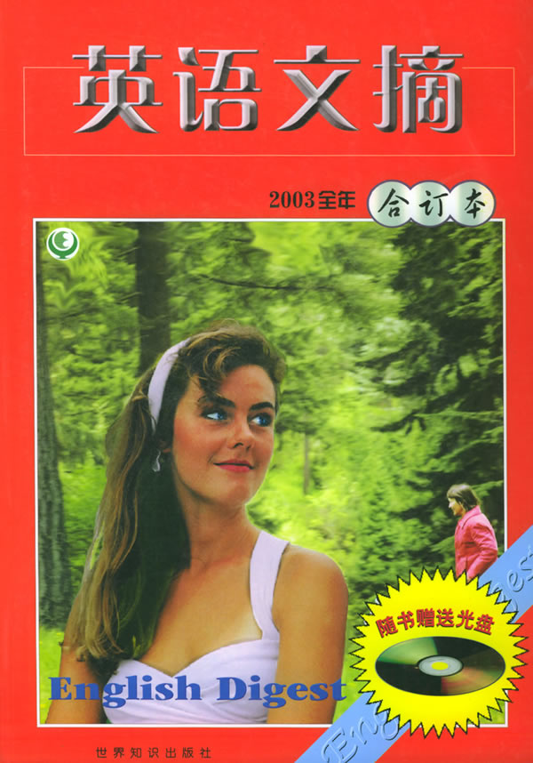
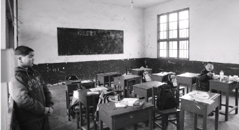

# 西雅图的雨

我是个土鳖，从未到过西雅图。《西雅图的雨》是篇英语文章，刊于2003年《英语文摘》年度合订本。我有那本书，一高门口地摊花2块钱淘来的。封面是位金发碧眼女，侧身，双峰跃然纸上，呼之欲出。那是2003年，我高三。

大雪天，早自习。我左手摩挲在金发碧眼女的秀波上。班主任皱了眉头，走下讲台，从前门出去。在全班哇啦哇啦的读书声里，整个世界一片寂静。我正发呆，课桌被谁手指弹了两下：“什么书？交出来。”班主任从我背后出现，抓了我个猝不及防。我手松开书，抬起头，笑眯眯看着他：“《英语文摘》，合订本。”他噢了一声，转身，背手踱步向讲台走去。我边摩挲书皮边肆无忌惮地高声朗读：Everything is meaningless!

他甫一走到讲台，我在他身后跳出：“报告老师，我内急！”“你什么？”“内急。”他反应了一会：“噢，去吧。”我窜出门一道烟儿消失。

我们两周调整一次座位，最后一排移到第一排，其他排向后平移。我喜欢坐最后一排，那里空间最大。四只腿儿的凳子，我把后两只支在地上，蜷起双腿不沾地，一把削笔刀扎在课桌上，手握刀柄来调整平衡。突然，我的身子向后仰去，我急忙伸出另一只手抓住课桌，咣当一声，全班的朗读声顿时寂静下来，都转头看向最后一排。我爬起来，扶起桌子，坐定，继续读我的课文：“月白风清，如此良夜何？”

我把“白”读作“伯”，“如”读作“鱼”，“何”读作“活”——“月驳风清，鱼岂良夜嚯”——这不是我们那儿的方言，也没人教过我，但我天生就觉得这么顺。

坐最后一排还有个好处，可以在后黑板上随意写写画画。我把《红楼梦》里的句子抄在墙上：“谢慈悲剃度在莲台下，没缘法展眼分离乍，赤条条来去无牵挂。”由此还得到了一个外号，“路高僧”。不过很快就搬到第一排了。第一排极其无聊，离讲台又近，唯一的娱乐是趁老师板书时不注意，把粉笔头扔到黑板槽里。

早上六点上自习，夜晚十点下自习。日日如是，年年如是。窗外殊无景致可玩。冬去春来，阴晴不定。冬天窗上凝了一片雾气，我用手指写蒋捷的词：“少年听雨歌楼上，红烛昏罗帐。壮年听雨客舟中，江阔云低断雁叫西风。”春天放晴的时候，看见远处家属楼上的妇人在阳台晾被子。我在试卷空白处画秦少游的词：“黛蛾长敛，任是春风吹不展。困倚危楼，过尽飞鸿字字愁。”那逼仄的教室，是郭靖的荒寒大漠，是香菱的红袖楼头，是贾平凹的八百里秦川，是孙髯翁的五百里滇池。

天地如此之大。

同桌问我：“把你流放到孤岛，你带什么书消遣？”

我说：“带屁书。一把刀就够了，练刀法。”

“没有秘笈，你咋练。”

“自创。”

“就算练成了，也没有人，你跟谁打。”

“自己有颗头啊，没事割下来，拿着玩。”

同桌愣了半天，说：“你想考哪的学校。”

我说：“不知道。离家越远越好。”

同桌说：“我想往北京考。”

“为啥。”

“北京大。”

我脑子里瞬间闪进那篇文章——《西雅图的雨》。

这世界上还有座城市叫西雅图，但我没告诉他。有的想法，不用跟人说。

今天，他在西雅图，我在北京。昔年世界小，心大；而今世界大，心小。我早已不敢再说“割下头玩”这种狂妄的话

（采编：刘铮；责编：刘铮）
