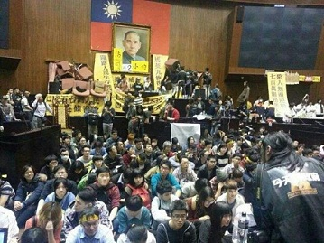
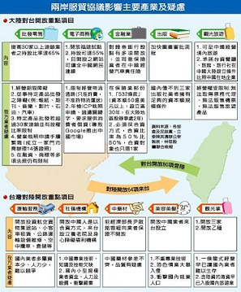
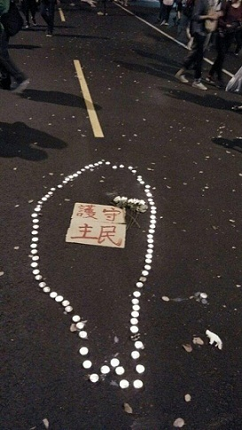

# 让事实说话,让历史见证 ----台灣佔領立法院事件記錄

拖着略带疲劳的身体从山下回到宿舍,已经是凌晨时分,但此时此刻聚集在立法院前的人们并没有散去。很多人在我的直播一开始就在大批这帮人是一群暴民践踏了民主的尊严；也有朋友很笃定的告诉我，这是台湾民主恶化的先兆，其政治生态并不如我们自己向往的那样美好。

在我这次对于学生占领立法院的直播之中，看到相似的言论还有很多，在此时，往日我们能听到的台湾民主多么美好一类的话，此时看起来，宛若一个无比巨大的谎言。大家纷纷表示，这样的事情，大家为什么就不能淡定一些，我们可以等下一次呀，你们这样做一点也不酷。

但是，真的是这样吗？今天在台湾发生的这次真的就简简单单用暴民政治扣上帽子就完了？

此时此刻，当我自己在回顾一天拍的照片，记录的文案，视频的时候也在思考。毋庸置疑，这是发生在有记载的台湾历史中，第一次由民众，由学生占据了国家的立法机关的办公场所，打破了以往台湾社运的许多个记录，甚至它破坏了一些民主的规则，严重干涉到了国家的立法与政策制定。

但让我们回归问题根本，在这次事件之中所牵涉到的最重要内容，便是「两岸服务贸易协定」的签署，在此之中我們可以看到引爆此次佔領立法院的三個重要原因。

其一，便是太过于仓促想要通过服贸协议。时间回溯到2013年，当服贸协议刚刚开始签署的时候，全台上下为这个突然不知道从那里蹿出来的大开放协议而震惊，一方面看到政府在签署开放的各项产业上没有举行任何的公听会，举个例子像开放美容美发业，在协议正式签署之前，居然还完全没有找到一个有代表性的业者来和政府开公听会讨论开放带来的冲击。另一方面，仓促到台湾的企业根本没有时间去检视这个产业开放之后，甚至有部份产业还发现可能变成大陆的单方面向台湾输出资本，比如出版业，目前在台湾的出版业界，具备足够资本规模去大陆发展的仅仅只有三家。
   

其二，党团逐条审查存在猫腻，「两岸服贸协议」是两岸官方通过委托机关正式签署的协议。因为这是一份两岸协议。而根据台湾的《两岸人民关系条例》第4—2条规定：「本条例所称协议，系指台湾地区与大陆地区间就涉及行使公权力或政治议题事项所签署之文书。」。也就是说，这份服贸协议是两岸两个政权之间彼此签署的文书，可以是一份法律位阶的准条约，也可以是行政命令位阶的行政协定，而对于这样一份涉及到多数人权利的服贸协议，自然而然应该是一份法律位阶的准条约，这样才能接受立法院全面民意的监督质询。但绝不会是一份行政命令。但就是在这两天中，两党一直是用行政命令的方式进行审查。在台湾立法院职权行使法里面，规定「超过三个月视为已审查」的只有行政命令。而当国民党立委张庆忠直接用行政命令的手段将这个本不是行政命令的服贸协议强行通过的时候，我们应该要明白，这个协议完全不是一个台湾政府对外或者对内的行政命令，也就是说，国民党为了尽速通过这份决议，硬来了一出指鹿为马，颠倒黑白，事后还完全不承认他们做过这个事，试问，这是民主政权应该具有的立法方式吗？

然后说回来现在占领立法院的民众诉求的“逐条审查”，而依据上面的文字我们不难看出，这样的两岸签署的文书，其实立法院并没有资格审查，而迫于其牵涉范围过大才能交由立法院进行审查，但说到底这样所谓的“逐条审查”不过是立法院的党团看看这个协议是否会抵触现有的法律罢了，结果这个文书被当成了行政命令，就算放着不动，这个协议三个月之后会被视为自动审查通过。如果明白了这个基本的想法之后，那么你就可以看出国民党的做法已经完全摧毁了民众交付于立法者手上的民主信任，如果事关两岸超过100多项的产业开放的服务贸易协定都能被人拿来当成一般的行政命令随随便便就通过了，那还有什么不能当成行政命令？到最后是不是被卖了还得帮人家数钱呢？

其三，便是这次占领立法院的导火线，在真正审查的时候出现完全违背规则的情况。当服贸协议在今年再次在立法院进行讨论。说好的条文剖析也不见了，民进党占着位置不让表决，结果国民党也没有像从前那样来一场“立法院全武打”之后宣布散会。而是出人意料做出了让所有听闻的人都大跌眼镜的事，国民党籍审查会主席张庆忠在会议未召开情况下，借上厕所的机会，花了3分钟直接审查会完毕，然后在厕所边上径自对外宣称，「服贸协议付委员会超过3个月，视为一读通过，直接送交院会」。而这也成为了压死骆驼的最后一根稻草，当晚，立法院就被大批激动的民众所占领至今。

但事实上，只是国民党有问题吗？在此之中，蓝绿双方的立委一下子都变成了演员，合作演出了一场周瑜打黄盖的戏码，一方没有道理却还固执己见，一方明知有理却不敢据理力争，然后让场外抗议的民众，手机电脑前的你我活生生地当了一回曹操，而我们中的很多人也真的以为自己手上的手机不是手机，而是象征着“公民正义”的神物，是公民的权利。

但当我们都清醒下来之后，其实无形之间，台湾民主也被拉下了神坛，它充满各种残缺和错漏。在这整个活动的过程中，我都在问着自己，究竟民主是有意义的吗？什么是人民的权益？何谓公平正义？什么又是所谓的理性呢？是不是今天聚集在立法院上的人的所说的每一句话都能得到大家的认可呢？ 

每当这个时候我就又想起了那部电影《浪潮》，很多人都会想要左手拥抱着民主的自由，右手却能掌握集权的力量，想象着自己喜欢的东西就是大家所喜欢的，是真理。但在这之后，书本也告诉我们有些历史上的悲剧就是从此开始。

当你面对这次服贸协定闹出了一系列问题，面对台湾的民主，甚至面对统独议题，看看台湾自威权政体，党外运动，野百合野草莓等各式学运所催生出民主化进程，看看那种对于现行体制的冲撞，哪怕今天台湾已历经两次和平政党轮替，完成Huntington所谓双翻转测验，但今天台湾的民主依旧还是充斥着公民及政治菁英们自以为占据智识高地而萌生道义优越，对台湾社会疏于沟通、懒于引导，以至于无力引领民间对两岸问题进行正常的对话。多年来短视地屈从于“对抗式”的社会话语，先只有族群对抗、后渐转为阶级对抗，选票是赢到了，可是民间对“中国”的想象却越走越荒唐。今天走上街头的这一群人是不是“民主之耻”？当然他们的行为欠缺考虑，但我们今天回过头来看，真正的台湾“民主之耻”完全不在这“一群人”、“一个所谓的‘阵线’”之上。

今天台湾的社会上下都还是会有透过非理性手段或程序不正义将自我信念强加于他者之上，同时在此之中，更是凸显台湾民众内心的纠葛，自然而然你就会发现，台湾的民主的事情不能简简单单用一个对或错就可以盖棺定论，而应该有更多的彼此的妥协和退让。

常常说，政治是一门妥协的艺术，或者从这个角度来看，我觉得我找到了台湾民主的一个优点。同时这也是我今天身处会场之上所深刻感受到的一种氛围，看到人群手舞旗帜，静坐游行，听着摇滚歌手嗨爆全场，听着示威民众高喊口号，看着警察与示威者之间的友善互动，一句“警察辛苦你了”，一句“你也是”。在这之中，我感受到历史总是那么惊人的相似 ，只是不管是在基辅还是在哪里的广场，却都找不到这样一种温和的感觉。

也许你会批评这就是一群暴民，就算他们不打砸抢烧，就算他们只是把立法院的桌子椅子堆起来阻隔警察而不是直接冲撞他们。就算在他们在立法院门口的演讲有很多明显的错漏。但归根结底，在这样一个社运的场合，本来理性的东西就容易被压抑，而愤怒，不满这样的情绪是很容易爆发出来并且迅速蔓延的。

民主这东西不是神话，不是一切都是那么美好。每一个细节，都仰赖一整套合法合理机制和民众的监督。这也许就是这一阵乱象之下给我的一点思考，而说句实话，到最后我也不知道如何去界定这样一种行为，但身处在他们之中，尤其当大家唱起歌来的时候，当每个人都愿意去做一些事情的时候，虽然台湾的民主不好，但我觉得，这便是一个民主在一步步走向成熟的过程，这个过程不精彩，不好玩，但我觉得他充满意义。

起码就像我在事件发生的当天晚上写下的一段话一样，美国历史学家Natalie Zemon Davis 曾说过一番话，虽然这句话是告诉所有学习历史的人的应有的一种态度，但除此之外我更觉得，这句话适用于今时今日这个事件之上。

「除此之外，研究过去，可以提供道德上的体认，协助达到批判性的了解。不管时局有多邪恶，不论情势有多么冷酷，总有对抗的力量，而仁善也总会浮现。在最绝望无助的时候，也总能因应时局找到出路，想出办法。不管发生什么，我们还是会继续讲着故事，让故事流传到后世。不管现实有多沉闷严峻，过去告诉我们，世事总会有所改变，至少，能有不同。过去，是我们兴趣的无尽藏，也甚至可以是我们的希望。」

希望立法院内院外的民众可以平安归来。

更希望若干年后今天之人再看回今天之事，不要后悔，勇敢前行。