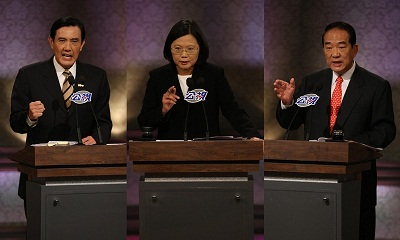
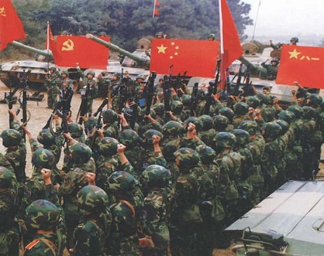
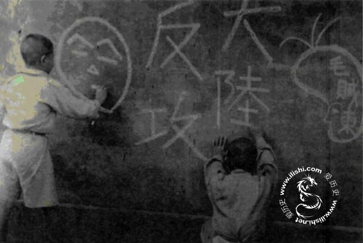

# 让历史在此结束 让历史在此开始

** **

1973年5月24日，时任行政院新闻局局长的钱复，突然被行政院长蒋经国招见，后者要求他在近期内，能再去美国一趟。这是他在新闻局长任内第三次的访美行程。

这一趟去华府，除了行政事务外，根据钱复的回忆，蒋经国特别交代了一个额外的工作，就是要他去找一位能担任蒋经国英文翻译的年轻同仁。后来，他回国后向蒋经国推荐一位年轻的博士生。这位博士生曾在加州大学念硕士，后来去东岸读博士。

这一位博士生考虑了许久。虽然他博士学位的各项考试都已结束，但论文还有不足之处。换言之，也就是尚未领到毕业证书。当时他和他的妻子考虑许久，最后决定在他博士论文完成、妻子放弃在美的工作后，于1974年1月1日回到台北向行政院报到，正式接任蒋经国的英文秘书一职，开始了后来传奇性的生涯。

他是宋楚瑜。

**

年轻帅气，又颇有才干的宋楚瑜，后来的发展当然不仅仅于此。1981年，宋楚瑜高升行政院新闻局局长，虽然仍兼任蒋经国英文秘书的职务，但时常无法上任。于是，寻找一位新秘书的工作，变成为了一个迫切的任务。蒋经国当时，再度把寻找英文秘书的工作丢给了钱复。钱复只好努力再去找人，以便来接替宋楚瑜的工作。

时任外交部次长的钱复，考虑了很久、并征询各方意见后，给了当时已经是总统的蒋经国，一份英文秘书的候选人名单。据说，上面有两三个不错的人选。

蒋经国后来选了一位他认为家世最清白、最简单的人。

那个人叫做马英九。

**

1956年8月31日，少年时赴满洲国担任飞机维修技师， 二次大战结束后返台自行创业开设货运行及汽车保养厂，又投入进口车维修业务，在台北市发展专门经营驻台美军和外籍顾问的生意，经商有成的蔡洁生，其侧室张金凤在这一天，又帮他生了一个小女儿。

年纪已届四十，老来又得女的蔡洁生，在此之前已经有八个孩子－包含正室夫人所生的五个儿女，以及侧室张金凤所生的三个。1956年出生的这个孩子，是蔡洁生最小的女儿，他最喜爱。

他把这个小女儿取名为蔡英文。

这个从小含着金汤匙出生，大学时代即开车上学的女孩，后来因缘际会，跟两个分别比她大上6岁马英九和大上14岁的宋楚瑜，出现在同一张竞选公报上。

1978年12月16日凌晨一时，刚从外交部下班回家，准备上床睡觉的外交部次长钱复，接到了行政院新闻局副局长宋楚瑜的来电。宋楚瑜告诉他，美国驻华大使安克志，希望「立即」晋见蒋经国总统。

钱复挂下电话后，心里有数，他想他知道是怎么回事。于是他拦了一辆出租车，从家里直奔台北市大直的北安路。下了出租车后，宋楚瑜也在北安路上帮他安排好了接驳车，让他可以在三更半夜，顺利进到蒋经国所住的七海官邸。

凌晨两点十五分，蒋经国、钱复、宋楚瑜、美国驻华大使安克志和政治参事班立德坐定。美国驻华大使安克志开始说明来意：

美国总统卡特已经决定，从次年一月一日起，宣布解除与台北的外交关系，并与北京建交。此外，依照条约的协议，中美共同防御条约将于1980年1月1日失效。

至此，安克志成为了最后一位美国驻台北的大使。

经过几番考虑，蒋经国决定停止来年的增额中央民意代表选举，但仍然保持于1979年1月1日起，全面开放国人自由出国观光的决定，以象征政府的信心和决心不变。

这个停止增额选举的决定，意外地改变了台湾的未来。

**

1980年，在美丽岛事件中被逮捕的152人，包含施明德、黄信介、张俊宏、姚嘉文、林义雄、陈菊、吕秀莲等人，在律师团的力保下，仍然被判刑，史称「美丽岛大审」。

美丽岛事件是台湾社会从封闭走向开放的一次历史事件，此事使得台湾社会在政治上、社会上、文化上都产生剧烈的影响。从此，走向全面民主化的路途，一去而不复返。

**

1986年10月7日，在美国甚具影响力的「华盛顿邮报」发行人葛兰姆（Mrs. Katherine Graham）为蒋经国举行了一场专访。蒋经国在这场访问中，向来访的美国友人，透露出他决定「解严」、并开放党禁和报禁的决定。

当时帮蒋经国和葛兰姆翻译的传译官回忆说，当他把蒋经国所说“终止戒严”、“开放政党合法登记”等关键词句翻译给访客时，“立即感受犹如电流通过身体一般”、“我告诉我自己，我们正在改写历史”，一股强烈的历史参与感油然而生。他不讳言，至今回忆起当时情景时，心中仍振奋不已。

这个传译官，就是现任的总统马英九。

**

我时常在想，这些大的历史究竟对我们有什么作用？人类，又或者中国人，究竟会不会从历史上学得教训？历史对我们这些小人物而言，究竟有没有意义？当这么大的历史加在我们身上时，我们该如何是好？

我想了很久，我觉得还是要回归每个人的个人经验来看历史，才会有意义。抽象的谈社会科学理论和观点，是没有太多意义的。在人跟人之间充满偏见，不愿意和解的情况下，讨论能够有突破，只能庆幸两个人的观念正好相同。

在将近五年前，我开了校内的账号，也就是现在的人人网，就是各位现在所看到的这个页面。现在在看文章的你，当时可能是个初中生、高中生、大学生，或者年纪也可能比我还大。如果你当时还没有用校内网，那我必须得说，在我的感觉来看，当时的气氛并不像现在这么开放。那时，不要说要我谈什么中华民国之类的，即便是「总统」两个字要在大陆公开说出口，我都要着墨再三。

当时的气氛就是如此。况且，我们还有一位不受两岸人民欢迎的总统陈水扁。

回想这五年，对我而言，这才是真的历史。我们见证了一个时代，我们的历史在这里开始。2002年，我第一次去北京。在我印象里，我花了一整天的时间，才从台北来到北京，那是个复杂的过程。这趟旅程牵涉到三个机场，两家航空公司，一定程度的风险，以及许多被浪费的时间。

当时，早上从家里出门，晚上才能到北京。虽然只是两千公里左右的距离。

2006年，我第一次去厦门，参加中央电视台和中天电视台合办、厦门卫视承办的第六届海峡两岸知识大赛。当时的气氛非常诡谲，虽然我们有心做两岸交流，但仍然会有所顾忌，而且现实的问题在那里。台北到厦门最近的路，竟然是经过香港或澳门。金厦小三通？对不起，我们都没有金门和马祖的户口。

我搭上了澳门航空公司的飞机，从桃园飞到澳门，经过漫长的等待之后，再从澳门搭厦门航空的飞机到厦门。就跟当时许多往来两岸的空中飞人一般，我们走的这个，是一条非常蠢的航线。当时另外一个流行的航线，是如果你要从台湾去东北和华北的话，也可以从汉城或者济州岛转机，幸运的话，这样的时间会花得比从港澳转机的时间少。

没有转换的几个观念，让我们费了不知道多少的时间和成本。

过去，很多人反对三通，认为这有安全上的危险；很多人反对交流，认为这会让台湾的同学被洗脑；很多人反对大陆游客来台，认为这会让大量的偷渡客非法滞留台湾；更多的人，反对政治上的和解，认为这会让我们失去我们的主动权和民主。但我只问几个最根本的问题，四年下来，这些东西我们失去了吗？过去那些拿来吓唬我们的东西，有哪个成真了吗？交流，究竟是让我们失去自我，还是我们得到更多的东西？

答案显而易见。

五年前，一个大陆人士来台湾，需要经过漫长的审批手续，非常复杂的保证机制，而且无论持哪一国的学历，都不能来台湾读书，大陆本土的学历也不被台湾承认。但这一切的一切，只是因为有些人不断的在吓唬我们，说只要开放，我们就会失去民主。朝野政党还不惜为了陆生来台的事，在立法院大打出手，上演了立法院长王金平被锁在会议室内不能出来的闹剧。究竟是谁在捍卫民主，谁在破坏民主？

况且，现在回过头来看，开放以后，我们失去民主了吗？台湾的学生被「洗脑」了吗？

五年前，大陆主流媒体，无论是电视、报纸、杂志，还是搜索网站，可以像现在这样，大幅从正面报导台湾的选举过程吗？五年前，当时已经当了七年总统的陈水扁，脸孔出现在大陆的主流媒体上几次？五年前，有多少大陆人搞得清楚台湾有那些政党，有哪些主流的政治人物？

一个有自信和自尊的民族，不怕别人攻击自己。一个有良心和正义感的群体，不怕别人的「渗透」。五年来，我一路看着这样的改变，不断地在变好，不只对台湾人民，对大陆人民也是。所以我相信，这条路绝对是正确的。两岸的关系，尤其是两岸人民，青年学子之间的关系，不是预设政治目的、然后不择手段地朝向这个预设的政治目的前进。唯有交心，三通才有意义。大陆海协会前副会长张铭清先生说，三通之后要第四通，也就是两岸要通心。

但是，保守的力量，不断地在打击我们过去的努力。他们总是扣上许多的帽子，认为这样的速度太快，或者太慢。他们总是一厢情愿地认为，自己的点子最好，别人都必须要接受。他们总是喜欢开口批评，却不愿意动手来做。

大家给那些默默动手做的人，多一点掌声，这个社会，这个国家才会更好。

正面的力量很强大，而且会互相影响，最后促成彼此正向的改变。

**

作为一个台湾的80后，我相信我们可以看一个人的能力，而不是一个人的出身、性别、族群、有钱或没钱、爱不爱台湾，来评价一个人。爱也好，不爱也好，前人给我们民主，不就是让我们自由选择用的吗？前人的努力，不就是让我们继续前进、而非倒退用的吗？前人的努力，不就是让我们和解、而非继续对抗所做的吗？前人打的仗、流的血，哪个不是为了子孙的安稳和未来？

无论这次选举的结果为何，到了2016年，也就是下一任，这些蒋经国时代的人，无论蓝绿，无论政治立场和身份，差不多就是到了退休的时候。也就是下一任的时候，就是该我们这一代年轻人要上场，或者至少准备上场的时候。我们准备好了吗？我们准备好要把过去的恩恩怨怨一刀两断、一起迈向一个光明美好的未来了吗？我们准备好要用一个人的能力，而非一个人的出身来评价一个人了吗？

我们准备好，让历史的恩恩怨怨，在我们这一代人死去之前终结吗？

我们可以沉迷在继续仇恨、不断地往过去看、不断地清算历史中，并且不断地支持以这些历史悲情作为勒索的候选人；我们也可以一起向未来发展，选一个对我们未来最有利的候选人；我们可以继续支持那些喜欢追究谁是“二·二八”的凶手、谁该为白色恐怖负责的候选人；也可以继续支持那些喜欢做做人身攻击、继续探讨谁才是台湾、谁才有资格代表台湾人的候选人。或者，我们也可以继续前进。

历史，作为一个历史问题，非常的有意义；但是，它并不是我们选择未来的唯一条件。更不能一竿子打翻一船人，说特定的一群人，必须要为历史负责；而另外一群特定的人，则是唯一一群对民主有贡献的人。

今年，也就是2012年，台湾的外籍配偶总数，已经接近50万人。而且，其中60%以上是1949年以后出生在大陆的大陆配偶。50万外籍配偶这个数字，已经超过台湾最大原住民族阿美族的总人口，也即将超过全台湾所有原住民人口的总和。总有一天，这个数字会继续来到一百万，两百万，到时候，我们还要沉溺在“谁才是台湾人”这种无聊又浪费时间的问题上吗？

我们，谁不是台湾人？或者，又有谁不是地球人？我们，又有谁会反对民主？批判历史，可以获得一个前所未有的道德高度，却不见得会让我们学得如何应对未来。未来的世界瞬息万变，作为一个80后，我们要面对的挑战，远胜过我们前面的每一代人。我们要面对世界秩序的改变，面对金融危机，面对欧债，面对冷战体系的终结，面对第三世界的崛起。我们这一代人责任重大。

 

（采编：楼杭丹；责编：麦静）

 
