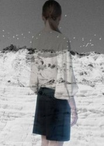
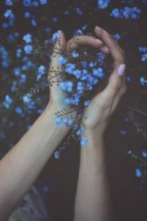

# 记有意义的一天

小学作文时不时布置这个题目，来来去去我也编造了许许多多个“有意义的一天”，却从来没搞清楚究竟什么样的生活才算有意义。

还记得其中有一篇我写的是第一次去咖啡馆，在三年级的时候。花了累篇笔墨写咖啡馆的布置，外面的栅栏好像“英国南部的森林”，又用了一堆一知半解的形容词来描述琉璃灯盏里的蜡烛、莓红色的格子桌布、浓郁的曼特宁咖啡，最后结尾我写离开咖啡馆的情景，“明月是那么的皎洁，仿佛……”那个时候很喜欢用省略号，对于八九岁的小孩子来说，生活里的一切都仿佛是意犹未尽的，毕竟，一切才刚刚开始。

现在想来还要感谢我从小至大的全部语文老师，从来没有抨击过我的这些“有意义”的一天政治不正确或者太享乐主义。当然，他们也从来没看出来我文章里有八成都是编的，我曾经乐此不疲地在小学的周记里写了一整个丢猫的故事，老师看了觉得好像小说一样生动活泼，当然了，本来我就从没养过猫。也曾经在考场作文里满怀深情地写了“我的家乡”，细细叙写乡土风物加上当地传说，事实上活见鬼了我的家乡就在离学校步行5分钟的住宅区里。后来到了高中，作为一个摇滚少女，开始写各种奇奇怪怪的比喻，例如什么“灯光好像白花花的脑髓，爬满了蛆虫”，有个作文题目是“我的理想”，我写了一个人被劈成了两半，一半按照自己的理想，一半按照现实生活。但是总而言之，我种种在文字里寻找意义的努力，似乎从来也未被我的老师们否定过。相反的，他们对我总是格外宽容，比如高考前语文老师还让我可以不上课，自己去图书馆自习。说起来总是心存感激。

但即使这样，我还是没明白什么才叫“有意义”。

小时候因为成绩好，被班上另一个成绩也很好的女生嫉妒，她悄悄拉帮结派，让所有女生孤立我，去春游的时候我只能一个人吃午餐。后来我隐约知道她在告诉大家我被鬼附身，于是我拿了一个速效救心丸的小空瓶，装上盐、味精和胡椒粉，营造出一种极其古怪的味道，在课后值日时扔到她抽屉，再引导别的女生去发现，然后告诉大家，那个是装了鬼的瓶子。凭借我从小到大的编故事能力，大家很快就相信了。那时候我一年级。

刚刚入学的时候我温顺得好像只羊羔，每每被男生追着打，后来我想了想，在他们追着我跑了一段路以后，我突然站定，往后狠狠一踹，男生多半被踢倒在地，疼得直叫唤，我每每还要再上前跺上几脚。因为被女生打得青紫是件很丢人的事，男生们吃了亏也不敢声张，渐渐也就没有人再敢欺负我。那时候我二年级。

虽然听起来好像是挺灰暗的成长经历，事实上对我来说也没什么影响，当时我就能应付得很好，事后想起来也不觉得这些事对我来说有什么意义。

从小我就不大能感觉到身边的人对我来说有什么意义。在高中以前，我几乎没有朋友，大家在讨论的动画片我都不太知道，而我看的书也没别的人读过，每个暑假寒假，我也不被允许和同学出去玩，我常常拉起房间的窗帘，闷头看一天的书。结果暑假结束，晒黑了的大家通常可以看见一个肤色更白了的我。

小学六年级，我开始交笔友，写起信来经常就是七八页。我总是把信纸夹在习题册里，以躲避家人不时的推门检查。

读书和写作似乎一直是我生活的大部分。虽然我也不知道这究竟有什么意义。初中毕业的时候，我把厚厚一本的日记，全部撕掉。那时候的我虽然有两个林妹妹那么胖，但在用力地毁坏写过的每一点一滴的笔迹时，还是多少有种葬花般的心情。那时的撕毁日记似乎也没什么了不得的原因，就是觉得自己过往写得太糟糕。到了高中毕业，我很珍视的那本日记本，却因为遗漏在教室里最终被清理掉，再也找不回来。所以归根结底，我那么看重的写作，到最后对我来说也不构成意义。过去的已然散佚，未来的尚未造就。

我一直是个虚无主义者，觉得生活既没有什么意义，也不值得去热爱。

看廖一梅的话剧《琥珀》的时候，对高辕的台词简直好像他乡遇故知。

“生命就是一个游戏。我只做爱，不恋爱，只花钱，不存钱，只租房，不买房，因为我不愿面对这个世界，我要跟它保持距离，我要像一个熟练的老手那样掌握世界，在它面前保持无动于衷，不失理智。无论生活在我面前搞什么花样。”

是的，我像高辕一样害怕，害怕当我热爱生命的时候，死神就会马上将它从我的身上夺去。毕竟在我还为时不长的生命里，有整整十年是看着母亲是如何热爱生而拒绝死，最后却不得不痛苦而无可奈何地死去，甚至等不到她唯一的女儿的大学毕业礼。

但是最近我好像在我日复一日琐碎而平庸的生活里发现了一点意义。我开始可耻地热爱生活。

是这样的，在一天繁重的工作以后，如果不用加班，我通常会到写字楼地下的日料店去吃一份荞麦冷面，然后去逛旁边的超市，里面可以买到进口的无糖酸奶，还有各种包装花花绿绿的外国食品。之后我会去超市对面的唐宁书店瞎逛，买书或者好看的笔记本。逛得差不多了，就是时候去健身房了，各种力量训练加上慢跑，健身让我最为迷恋的地方在于，它让你感觉到你对身体有着绝对的控制力，同时可以一次又一次地去冲击自己的极限点。这种体验让人进而感到对生活充满了控制力，透过大量的阅读与运动，我第一次觉得我对生活有着绝对的操控感。

这时候，再来一点音乐，譬如是沉沉的老男人Leonard Cohen，在岑寂的冷雨里走回家，黑暗里顾不得恼人的高跟鞋，轻轻踩起舞步。Cohen的嗓音好像痛饮龙舌兰酒以前撒在手背的一小撮盐粒，会亲吻你的灵魂。

在虚无中浮沉了很多年，我终于开始意识到，生活的意义，就是生活本身。这当然是句正确的废话，但是既然生活的大幕早已徐徐拉开，除了更为投入地演出这一生，我们又能怎么样呢？

生命选择了我，而我选择我的生活。是为记有意义的一天。

（采编：鲸书；责编：王卜玄）
