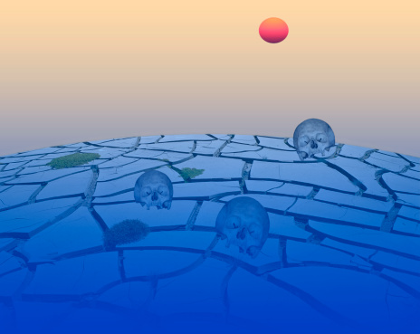
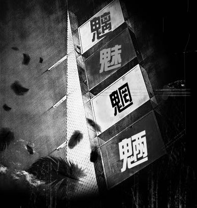

# 说死

** **

今儿是中元，又叫施孤，七月半之类，总之是未亡人给亡人过节，孤魂野鬼求解脱，再不济也求个温饱，比如目莲要救他那饿鬼道里的妈，就要在今日许愿供养十方大德。前几年有些传说沸沸扬扬，说的是玛雅人的预言，今年是世界末日，末日前最后的中元，想来有些仓惶，地府里禁锢的魂魄极多，平日来往又不得自由，不知过了今年，这些个亡魂何去何从。偏隔天又赶上阳历九月一日学校开学，沉闷了整个夏日的城市又呼啦啦的热闹起来，像是潭里被搅浑的泥水，晚高峰的车流愈发稠厚，人味儿浓郁，妨着鬼过节。

每年夏天我都要犯怕见人的懒病，这病好作养，躲起来看闲书就行。今年琐碎的事多了些，不得已强打精神爬起来出门。在路边等着过街的信号灯，见到扑面而来的人群，仿佛遇着了啸聚山林的匪，竟想要拔脚逃开。

早早吃了晚饭，走到月牙湖边，耳听得唧唧啾啾的虫鸣，小虫子一夜夜地鸣叫，从春到秋，这是虫子的永恒。我还要在这世上无声无息的度过几十年，连叫声都不曾有。

近处有一小蓬芦苇杆，早就枯干黄脆，折损得不成样子。湖的对面是南京的城墙，沿着城墙根，是一溜儿临水而建的饭店，经营苏北菜，承办婚宴，敢在中元节操办喜事的人家，大约在江湖上也算一号人物。油烟味儿夹着客人的酒屁汗臭和喜宴上怪腔怪调的高歌，在开阔的湖面上传得分外远，这样的水面上已经放不了河灯了，这般方法给祖先引路必然是不孝，就算引来的是无主的孤魂，也必然要被冲一个趔趄。

从前上神经学的课，听说过Cotard’s syndrome[1]，得了这个病，便要相信自己已经死了，我没得这个病，却也觉得和鬼亲近些，这远人近鬼的秉性我不敢轻易诉给别人，怕招了什么忌讳。人们说起“身后事”这个话题，总是分外沉痛，又或是无比敬畏，因这“身后事”不为人所知，加上各门各派宗教的渲染，这话题便成了古今第一神秘事。窃察世人怕死之缘故，大约因生之未竟之事，也有因畏惧死之苦痛。

冷眼旁观，世间诸人常有“生不如死”之境况，却仍要苦苦的熬着日子，或许人间的苦痛也有叫人留恋之处，即便生来就被判了死刑，也总希望缓期执行的时限长些。这样的人，被曹雪芹数落成“看不破瞧不开”的，说是“天上夭桃盛，云中杏蕊多，到头来谁见把秋捱过”，大观园里的孽障们一个赛过一个痴，可见曹雪芹自己也看不开。想来世间没人能看得开，连庄子都没这般洒脱，庄子爱惠施比爱老婆多些，老婆死了，他鼓盆而歌，可惠施死了，他就偏要去送葬，还偏要比出一个故事，“你们猜我伤不伤心？”。胡文英写《庄子独见》的时候说“三闾之哀在一国，漆园之哀在天下，三闾之哀在一世，漆园之哀在万世。”这话是说庄子是古今中外第一大愤青外加装逼犯，装得比屈原那厮高明。余生也晚，没见过庄子也没见过蝴蝶，庄子说人生之悲如游于羿之殼，至于如何在这“悲”中逍遥，他却没说清，如今庄子已死，他的大道我说了不算，胡文英说了也不算，于丹老师说了算。

我不理解庄子之悲，不理解苦难。

我理解饥饿，理解寒冷，理解“求之不得，寤寐思服”，理解短暂的以及长久的孤独，可这些都不是苦难，都不是能够决定我身在这尘世间去留之计的刻骨的体验。于是我尽量看得多些，看别人写饥饿，写寒冷，写孤独，从具体到抽象，从有形到无形。那些描写所谓“人生终极之哀痛绝望”的书我看了许多，翻开其中的每一页，我都怀有一种及其虔敬的对于苦难的顶礼膜拜的心，这种感觉既诧异又刺激，太宰治就因为写这本书把自个儿写死了啊，茨威格就因为写这本书把自个儿写死了啊，川端康成就因为写这本书写死了啊，这就是传说中的“文章憎命”，太牛逼了。结果这些书看完之后，心里都空虚得厉害。

文字堆砌出来的苦难都是扯淡，文字本身的存在就带有某种目的性，充满了技巧和卖弄。《人间失格》中所描摹的“精神家园之毁灭”都依附在日常的事与物中，内心的坍塌必须经由肉体的放浪形骸，通过漫无目的的肢体动作企图达到某种精神上的境界，像个游魂似的荡在路上，看见路灯把影子拉扯的忽长忽短，这毫无求取死若归途之道的浪漫，相反，都琐碎得很，可这些琐碎却都不够纯粹。

一个纯粹的关于终极人生的故事应该这样写，“张三每日吃三餐，上下班，操女人，他已经死了。”

话说回来，我这寂寂无名的小辈如何敢调侃耗尽先哲心血生命的传世之作呢？有生之年，我依旧会看许多这样的书，看许多死者生前的“惊世骇俗”之举，并为之痛哭流涕。

我猜想这尘世上必然存在过能通灵的文字，仿佛烂柯山下的棋局，可这样的文字都在落纸后便被一把火烧成了灰烬，随着作者的躯体一起烂在土里了，因为这样的文字必然不能为了存在而存在。而那些真正落入凡人眼中的笔墨游戏，比如我在这儿引经据典大言不惭所说的“生死之道”，都是一钱不值的屁。

人和鬼，生和死，这其中的界限是我油多肉满的躯体。倘若没了这躯体，少数人能成仙，金屋玉堂，游手好闲，偶尔管一管人间的闲事，多数人还是成了鬼，鬼能做好文章，鬼很自由。“应共冤魂语，投诗赠汨罗”，在我的心目中，老杜绝对是这世界上唯一真爱李白的人，与之相比，我们对李白的爱那都不叫爱，那都叫捧臭脚。

编教参的人最最讨厌，非要说“魑魅喜人过”是说李白去夜郎那是着了小人的道儿，而李白死了，那是去找屈原了，因为屈原和李白都死得冤。

“一憎一喜，文人无置身地。”

我呸。

真正的文人，都成了鬼，魑魅魍魉，笑看我们这些活着的装逼犯。

生者总喜爱揣测死者的好恶，想起某艺人，死去多年依然造福社会，供人消费，供人呼天抹泪自我感动。说我铁石心肠也好，顽劣恶毒也罢，总之我不愿怀念自戕的人，“啪唧”摔成一滩血，自决生死乃人生乐事。

七月半，我在湖边久久站立，世界末日前的最后一个中元节就快要过去了，亲人在杭州老宅烧了钱纸，旧时家中的地荒得很厉害，稗草及膝高，那儿一片黄土，神鬼不闻。我记得村里有个老人叫卖菜干饼，从前一张饼一块钱，如今两块，再看祭祖的纸钞面额越印越大，天地间流过的除了凄怆的时光，还有通货膨胀，房价也要涨，《夜航船》里面写了好些可爱的鬼，其中最好笑的是鲁子敬，他与活人抢地皮。

念及此，顿觉生之无聊。

南京东郊的夜最圆满，什么都有了，有山，有水，有月，有沉沉的雾，这儿是自绝于世最好的地方，阻止我精神圆满的唯一障碍便是不知如何安置的驱体。于是乎在那一瞬间，我竟对“身后事”有了几分向往之情。

慢着。

我若就此离去，那会不会有我不认识的人转发我的最后一条社交主页的状态并且留下许多蜡烛？

心思一动，我便立刻罢了死的念头，转身去超市采买明天的早餐，我必要吃些有营养的饭食，活得久长些，放更多的关于生死的厥词。

又及，早些时候读曹邺的《江妃传》，无论是惊鸿舞，楼东赋，还是一斛珠，都不能再让我对梅妃产生一丁点儿的好感。全因当年《大唐歌妃》热播，我无意在电视上瞥见了吕丽萍老师扮演的梅妃，自那一瞥之后，梅妃江采萍这个人物就成为了我人生观中一个永恒的大bug。我相信吕丽萍老师百年之后，梅妃地下有知是不会放过她的，后来想到吕丽萍老师信耶稣，顿时释然。

 [1] 编者注：Cotard’s syndrome，科塔尔氏综合征，患者常感到自己不复存在  

（编辑：欧阳银华；责编：周拙恒）

 
