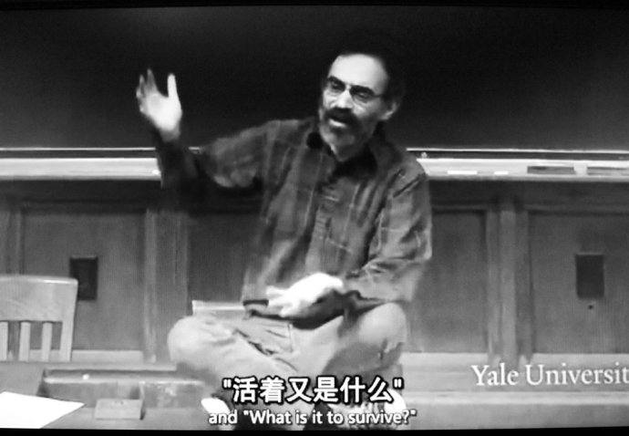

# 说说纯理论的春天吧

** **

晦涩的形而上的理论，往往给人一种逻辑上的拧巴感，理解起来要调动大脑的集中度，占用它对于其他庞杂的外界事物的思虑，不仅如此，当你的视线从理论中转移出来，仍然会有一种被占据的疲惫感，潜意识里的逻辑思辨还在脑中运转，人就在无意识的情况下变得沉默，甚至与现实生活有些断裂感。所以但凡对于某种表象试图进行形而上的理解，顺着逻辑的藤蔓向深处挖掘，并且有着执拗的偏好的理论家们，会产生一种不切实际的虚无倾向，甚至于不太能与人顺利的完成交往过程。

现在大多数人对于理论的了解，多建立在经过几代加工和演变的通俗的读物的学习上，比如经济学，鲜有人去探索三百年间原始理论的产生和描述，再如社会学，功能主义和冲突理论的起源和发展也逐渐被淡忘了，取而代之的是当代经济学家，当代社会学家对理论的解读成果，是一种认识，缺少了理论创世之初的逻辑严谨度给人的震撼。当然这与现今的“跨越式”“快餐化”“速成”等等风气是分不开的，拿出这种“古董”级别的理论除了让人厌恶的退避三舍，就是荒废大把时间却见效甚微，甚至有成为“百无一用是书生”的批评的矛头的风险。

一听到我是学什么专业的，我就免不了被各种人考察，问你对现在股市的走向，美国债务危机，投资金条，物价上涨......的各种看法。往往此时，我就很是语塞。原因很多，当然最主要的是我确实不能分析出来，影响因素的复杂性，相关理论间的相悖性，甚至各种环境的差异性，要想综合考虑全面分析，是件很浩大的工程，何况经济学家都见仁见智，尚不能统一，我这种毫无建树的屁孩怎么敢胡乱分析呢。还有一点，理论化专业化的理解对于我来说，是很难将其通俗易懂的讲给大爷大妈叔叔阿姨听的，对牛弹琴半天，还落不下什么好，大爷大妈们还要装作在听的白费时间。我爸很热衷于让我说经济，每次我都很无奈的表示自己不知道。接踵而来的就是批评我什么也没学到，理论不会学以致用。我是很想反驳的，学习理论本身就是学习思考，纯理论难道必须要拿来对现实指点一番才能显出理论的优越性么？然而这种话很没有市场，毕竟理论实践相结合啊，书呆子啊，死读书啊都是上一代人的金科玉律和批判教条，我是没有心思也没有能力应付的。自己领悟尚且是要靠时间积累，信服于他人必定是几倍于这个领悟时间的。交流对于时间来说，就是一个枷锁。除去对存在主义的观点考虑，萨特说的“他人即地狱”也可以作此新解吧。

说到纯理论的优越性，在我看来不能不提的是其辩证的思维和严谨的逻辑推理，反而应该将其实用性退居到其次。其实不仅是理论，所有人都知道，学习并不是学知识本身，而是学习一种分析表象的能力，对新事物的接受和理解能力，明辨逻辑关系的能力，广泛发散思维的能力。受教育的高低，大多数时候是能从一个人的言谈举止中看出来的，所以我常很不客气的对于那些持有“学习有什么用，不还是找不到工作”“谁谁家的谁谁怎么出息了，不照样没上过几天学”“现在的大学生都是鼻孔朝天的，不就是给人打工的”诸如此类的话嗤之以鼻。以前是一笑了之，后来是置之不理，现在是付诸冷笑了。

不说世界的复杂形势和社会骚乱这些话题，仅仅中国的各种现象和各界声音都已经充斥四处。动辄就是情绪激烈，言辞恳切，大声疾呼，猛烈批判等等的评论，各执一词或者自认管窥全豹。每每听到这些紧跟时代的声音，都很让人引起共鸣，其产生大部分需要归功于环境的共享和风险的公担上，另外可以用社会学的互动系统，和情景分析，以及群体的形成来解释，其中不乏心理学和常人分析法的理论辅助。但是真正客观的，触及本质的，形而上的，思维缜密的分析却是很少见的，这种分析必定不是带有强烈的牵动情感的词汇的，从而避免因为情感共鸣产生对于本质认识的模糊后果。比如分析政治体制的优劣利弊，不是说奔走疾呼就可以达到分析目的的。而是要从社会的科层结构和社会变迁的理论来解释，类似于在什么程度上才满足社会群体间冲突的形成和爆发，在何种情境下，社会结构才能因为冲突而瓦解，瓦解后新的既得利益层如何能避免因袭性的制度建设，从而终结冲突和变迁的循环等等。理论的作用，类似于马克思主义对社会革命的指导关系，尼采的狂人哲学对希特勒法西斯主义的渊源，萨特之于四五十年代法国青年的自由选择思想的关系等等。所以理论必定以其逻辑和形而上的不带色彩的论述而开启继任者的智慧。

然而理论的学习，也确实是一个漫长的需要硬着头皮，而且耐得住寂寞的思考过程。不像实用知识一样，可以有立竿见影的效果，所以更需要学习者能够在一定程度上堵起耳朵钻研，既然选择难以捉摸的理论，就要自动屏蔽些干扰。短期的效果是不能指望的，但是长期下来，便会发现，不知不觉在面对相关领域的表象的时候，已经可以慢慢触及根本，层层递进的深入了。

除了精神指导，相关领域的本质分析这些优越性，理论对于逻辑的锻炼也是潜移默化的。任何理论的得来都是要有一套思考过程和思维方式的，拨开各个领域内容的不同，这思维方式是建立在类似辩证法或者心理学的范式上的，故而不论是什么学科的理论，其形而上的部分都有着共通性和互补性，因此不存在无用之理论。拿经济学分析来说，作为一种人文的社会科学，其相关的外围可以有很大程度的扩展，心理学，哲学，政治学，历史社会等等都是其分析的线索，大家熟知的凯恩斯三大心理定律，马克思的政治经济学，米塞斯的人类行为的分析，熊彼特的企业家理论，科斯和诺斯的制度经济学分析，马克斯韦伯的新教与资本主义等等......都是经济学的优秀成果，不仅在逻辑上存在的分析的共通，也很完美的做到了领域的互补，是集大成的理论综合。

“衡量真正意义上的好学校的标准，是看能不能培养出书呆子”，这种说法虽不见得合乎这个到处讲究“跨越式发展”的社会口味，但是却在一定意义上给予了理论钻研的极大肯定。从金融工程的微观，到财政理论的宏观，再到这个机制如何形成的形而上的理论，虽然没有什么显效的实用意义，同时鉴于宏大的理论宝库也使获得成果成为几乎不可能的“劣势”，但是仅当兴趣发展，就算付出了时间的机会成本，我也是毫无悔意的。

（采编：陈锴；责编：陈锴）

 
