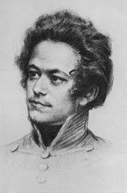
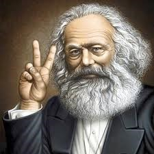

# 谁是马克思——长篇吐槽

** **

马克思到底是谁？这是一个亘古的命题，困扰着笔者。没上学的时候，马克思是隔三差五出现在新闻联播里的奇怪的名字，往往跟着“主义”这个更不懂的名词。上了中学，马克思是一本薄薄的课本，什么唯物主义，什么辩证法，什么剩余价值，是快乐生活中的小小苍蝇屎，而到了高中、大学时它就变成了大大的一坨屎，横亘在我与录取通知书和GPA之间，薄薄的一本也变成了厚厚的n本。在学校里虚度了若干年华之后，想过去看今朝，笔者发现自己对马克思的理解是一波三折波澜壮阔波涛汹涌波及无辜，有诗为证：

啊！马克思，让我欢喜让我愁

你是铺天盖的网，你是踢来踹去的球

你是犀利无比的小钢炮，你是丢人现眼的大马猴

你是抹哪哪亮的地板蜡，你是谁穿谁美的红裤头

总之，马克思是马克思，马克思不是列宁斯大林，马克思不是毛润之，限于智商笔者在本文中只是“孤立，片面，静止”地谈谈马克思本人。本文引用材料经过去精存粗去真存伪可信度极低，所述的道理放之四海而不准，我就这么一说，你就那么一听，总之是不说难消心中块垒。

文中凡少儿不宜的汉字，皆按照李零老师的优良传统，用拼音表示，已经是拼音的就不作处理。当然也有同学表示这种文字马赛克让文章更邪恶了，原来只是图形文字，自从用了拼音之后，大家遇到之后都会下意识的读出声了，但笔者对这种现象概不负责，笔者的意图是良善而和谐的。

#### 三岁看老

生于特利尔犹太律师家庭的小正太马克思在家备受宠爱，下面有几个妹妹，小马整天欺负妹妹，把她们当成马从山坡上往下赶，还捏脏面团当蛋糕逼她们吃，但是她们爱他，因为他会讲很多好故事。讲故事是马克思一生的拿手好戏，当小马变成老马的时候，他经常给孙子孙女讲故事，故事不按个讲，基本单位是“英里”，要多长有多长，想到哪说到哪，小朋友会说，爷爷爷爷，再讲一里地的故事嘛。当然，马克思一生讲的最引人入胜的故事就是资本主义的故事，我们都活在这个故事里，按长度算应该是两万五千里长征级的故事，这是后话。

上了学的马克思也早早的显露了刻薄的才能，让大家又喜欢又害怕。小朋友们喜欢他点子多，会玩（老年马克思同样会玩，带着自己的孙子孙女模拟古希腊海战，叠了一堆纸船放在水桶里，点着了火，一起围观），又怕他刻薄编顺口溜笑话自己，他还曾经把别的小朋友给说哭过，马克思的青少年时代活脱的一个人文社科版Sheldon Cooper，尖酸刻薄不谙世事，充满智力优越感又惹人喜爱，只不过没有Sheldon那么乖。

牛顿小时候家里养猫，他在门上给大猫开了个大洞，给小猫开了个小洞。此事不明真伪，很可能是阶级敌人造谣。不过爱因斯坦小时候用泥巴捏凳子腿都捏不直这事儿是坐实了。总之大凡大神级的科学家，小时候都有点脑残的轶事。马克思的初中成绩单也比较让人跌眼镜，历史居然是最烂的，想象他后来写的《德意志意识形态》、《法兰西内战》、《路易波拿巴的雾月十八日》，上哪说理去……

到了青春期，马克思被送到波恩上大学。据史书记载，当时全家出动，带着锅碗瓢盆叮了咣啷大早上四点钟到码头坐船，很像现在的大学生入学。娇生惯养的公子哥，到了大学更是挥霍无度，以至于老爹写信抱怨说他没有金钱观念。小马加入了波恩大学的特利尔同乡会，主要活动是喝酒，喝完酒了打架，这毛病到了三四十岁也没改，据说后来他喝多了还和李卜克内西半夜砸灯泡玩，叛逆倾向昭然若揭。不过受家庭的影响，马克思热爱古希腊艺术，喜欢莎士比亚，喜欢歌德、席勒等浪漫主义艺术家，拉丁文希腊文法文都学得不错，正经是个有文化底蕴和国际视野的文艺小青年。这对后来的马克思写作影响也很大，谈论理论问题中间还时常引用个希腊神话、莎翁诗句。

波恩的文艺小青年

后来老马一看小马这样下去不行，就安排他转到学风踏实的柏林大学，小马的精神面貌也得到了改变，从酗酒文青变成了学术宅。这也让世界上少了一个三流诗人，多了个牛魔王级别的大牛思想家（马克思20岁左右已经写出了三本诗集，《爱之书（一）》、《爱之书（二）》和《歌之书》，听名字活像日本小清新动漫，据称内容也才华平平）。关于马克思的读书生活，真是骇人听闻，普通青年切勿模仿。作为一个大一学生，马克思浸入法学典籍的海洋里，妄图构建自己的法哲学体系，最初计划300印张，篇幅是《资本论》第一卷的6倍，中文版《资本论》第一卷是八百多页……当然最后计划失败了，不过失败的产物也是相当于《资本论》第一卷篇幅一半的小怪物。经常三四天不怎么睡觉，小马哥也扛不住了，病了，于是休学疗养，在疗养期间一不小心就把现存的所有黑格尔派哲学著作读了个底掉，成了个黑格尔分子。马克思的传记作者梅林说，马克思在两个学期学的内容，“如果按照学院的喂养方法，20个学期也学不完。”这个玩命的架势马克思保持了一辈子，到了临终前两年，还写出了厚厚的4大本笔记，还是现学的俄文看的俄文书。到了23岁，马克思凭借对伊壁鸠鲁的研究得了个博士学位，这使得后来的马克思被欧洲各国当局称为“恐怖红色博士”。

#### 马克思谈恋爱

现在泡妹纸，送花摆蜡烛写诗那只是第一阶段，比如燕妮看了马克思感情充沛的三流情诗之后“落下了悲喜交加的眼泪”，不过按常理然后就该是日常恋爱的温情了，不过小马感情太充沛太荡漾，搞对象搞了好几年，信里还都是诗。姑娘们，想象一下，你给异地男友发短信说，“想你了，一个人在外上学多保重”，结果过一会儿那边回来了句 “面对着整个奸诈的世界，我会毫不留情地把战挑，让世界这庞然大物塌倒，它自身扑灭不了这火苗。”这就是小马的原话，这实在让无蛋可疼的燕妮也蛋疼不已，抱怨说，“卡尔，你的爱情并没有从我身上得到它实际要得到的东西：对它十分感激，完全为它所迷恋。所以，我常常提醒你注意一些其他的事，注意生活和现实，而不要像你所喜欢做的那样整个地沉浸、陶醉在爱的世界里，耗费你的全部精力，忘却其余的一切，只在这方面寻找安慰和幸福”，甚至小马他爹老马也介入了，教育儿子说，给燕妮写信“应当充满温情和纯真的爱情……也应当明白述说你们的关系……一定不要充满诗人的幻想。”

马克思谈恋爱谈到了给父母的信里都是情诗的地步，一次马爹很火大的写信说，我和你妈盼星星盼月亮，好不容易等来你的家书，结果里面写的全是你有多想燕妮，这是给爹妈写信的态度吗？岂止是不靠谱，简直是不靠谱。从马爹的信中可以看出马克思不靠谱的生活状态：

“杂乱无章，漫无头绪地踯躅于知识的各个领域，在昏暗的油灯下胡思乱想，蓬头乱发，虽不在啤酒中消磨放任，却穿着学者的睡衣放荡不羁；离群索居、不拘礼节甚至对父亲也不尊重。与外界交往的艺术仅限于一间肮脏的房间。我们常常几个月见不到你的信，最近这一次你明知爱德华生病，妈妈微恙，我自己也不大舒服，再加上柏林霍乱流行，可是，在你的来信里对这些只字未提，好象这一切无须请求原谅似的。这封信里只有仓促涂写的几行字和以《访问》为题的日记摘录，坦白地说，这样的东西我与其收阅，还不如扔出门外。这是一派胡言乱语，只能证明你白白浪费了你的才华和好几个不眠之夜去制造怪物，证明你正在步现代无耻之徒的后尘，这些人自己编造出一些连他们自己都不想听的话，却宣称这些滔滔不绝的话是天才作品，因为它们没有任何思想或者只有被歪曲了的思想。”

岂止是不靠谱，简直是不靠谱。不过后来的马克思稳重成熟多了。

#### “脐下三寸”的问题

对于众所周知的马克思私生子事件，笔者的态度是宁可信其有不可信其无，谁说革命导师就一定能管好自己的裤裆？朱熹同志存天理灭人欲的同时不耽误养n多小妾，马克思当济世大佛同时也没准是个送子观音。不过二人情况截然不同，马克思从不做道德说教，这和道学先生们不一样，马克思知道自己的斤两。为了不让生育问题影响声誉问题，恩格斯不得不自己背了这个世纪大黑锅，这是马克思的不仗义。

饭岛爱2001年在台湾回答蔡康永的问题“你这么恨你爸爸，为什么又想见到他？这不是很矛盾？”她说，“先生，难道您不知道，人生本来就是矛盾组成的啊。”用学术圈的话说，人性就是这么的“吊鬼”。有了这档子事儿，笔者反而踏实了许多，马克思本质上也不过是个凡人，但是他深刻地改变了历史的进程。希特勒不近女色并没有让他流芳百世，杰斐逊搞女黑奴也没能让他遗臭万年，群众的眼睛还是雪亮的。

在谈到马克思的时候，不能忘了这是一个有血有肉有JJ的革命导师。

#### 小钢炮马克思

作为社会科学家的马克思，一往无前生猛无比，一辈子最崇拜的科学家是开普勒。开普勒大家都知道，一辈子穷困潦倒成就辉煌，我说地球围着太阳转，你们非说太阳围着地球转，哥就算给你们看，我算，我算……算到死后身上只剩七分钱，可是算出了牛顿，算出了人造卫星，算出了航天飞机，算出了哈勃望远镜，算出了人类新时代，是我们既往开来的领路人。不过人类对先驱往往很刻薄，死后多少年才能平反摘帽。马克思的科学生涯大致也是这样。

另据极不可靠八卦消息，马克思和达尔文互赠过大作，这二位都是所在领域的非主流，都对挑战权威有先天癖好，都承受着巨大的鸭梨，达尔文还被报纸讽刺为猴子，他们还都把历史感引入了科学研究。我们可以尽情想象马克思给达尔文的书的扉页上写着什么：“献给自然科学界的战友，你懂的。”也可以想象达尔文在《物种起源》的扉页上写着“理解万岁啊，亲”。当然，这都是yy，yy而已。

在马克思的世界里，经济学家分为傻bi和非傻bi，前者中的代表有萨伊、西尼尔、穆勒（没错，就是伟大的约翰·斯图亚特·穆勒）、马尔萨斯等大部分人，如果新古典早期的大神人物马歇尔、门格尔、米塞斯、庞巴维克等人不幸早生几年，估计也会被马克思归为傻bi一类，当然这些大神仗着自己生得晚，倒是没少管马克思叫傻bi。非傻bi组包括很有限的威廉·配第、亚当·斯密、魁奈、李嘉图等人。马克思倒是从没直接管前一类人叫傻bi，他只是从经济研究的逻辑和历史的发展以及这些人各自所处的历史环境、受的教育、看到的材料和利益关系，系统地分析了这些人为什么是傻bi，这个就比较淫荡了。他本人有个文雅的说法，管这些人叫“庸俗经济学家”，《资本论》这一论述经济学同行的傻bi之处的著作，也有个文雅的副标题叫“政治经济学批判”。虽则如此，马克思还是在书里极尽刻薄之能事，把道理讲清楚的同时，能恶心你一下算一下，凡是提到傻bi组经济学家的时候，总是酸溜溜、贱兮兮的，整个《资本论》，就是马克思在向观众娓娓道来经济理论，涉及一个人的观点的时候，把他拎过来，揪着脖领子给观众朋友们看，看看他长得鼻子不是鼻子眼睛不是眼睛，简直没有人样，道理说完了，piapia扇两个耳光就给扔到历史垃圾堆里去了，所以《资本论》是写得很欢乐的。不怪乎马克思受挤兑，书也卖不出去，一家子搞得又穷又挫，学术圈里来了这么一匹战斗数值八位数的疯狗，大家都得团结一心把他搞掉，踏上一万只脚永世不得翻身（想象一下在今天，搞新制度经济学的人，把科斯诺斯威廉姆森称为傻bi的后果），更何况他的学说包含着一些莫名的危险信息……

说说《资本论》吧。马克思本人是把它当成大宝贝儿、当成人生的终极艺术品来打磨的，他的历史唯物主义和辩证法在《资本论》里达到了巅峰，谁看谁知道。当时资本论三卷都完稿了，恩格斯兴奋异常，说哥，咱们赶紧出版把，马克思说nonono，最近有个人新写了一本书，我得看完了把东西补进去，恩格斯当即表示很无语：看看你那书，大字套小字，尾注夹脚注，怕有骗稿费之嫌，哥们儿修订的时候都不敢在最后加参考文献，还差这么一本新书啊？这书拖了这么久咱可不能再拖了。马克思说了这么一句，“我不能下决心在一个完整的东西还没有摆在我面前时，就送出任何一部分。不论我的著作有什么缺点，它们都有一个长处，即它们是一个艺术的整体；但是要达到这一点，只有用我的方法，在他们没有完整地摆在我面前时，不拿去付印。”

我经常想，如果《资本论》是普鲁士国家社科基金重大项目成果的话，马克思写的结项报告肯定牛bi闪闪：

本书系统地论述了当代主流经济理论的傻bi之处，并详细的指出了他们为什么傻bi、怎么傻的bi、以及他们还将继续傻bi的形式。本书批判性的吸收了李嘉图的劳动价值理论，创造性的提出了劳动二重性学说，解释了剩余价值的形成这一世纪科研难题，并首次将历史唯物主义的方法引入到经济学的研究中，使整个政治经济学科的研究面貌发生了根本改变。本书还全面阐释了我国及整个欧洲——尤其是英国——的经济制度的运转机制，指出了其中的根本性危机。本书提出的政策建议是，全世界无产者联合起来，与现存制度的辩证发展过程一道，通过不懈的抗争以减轻制度变迁的阵痛，最终实现全人类的解放。

当然，如果马克思生活在现存的科研体制下，早就被领导拿着砖头厚的《资本论》一路打出来，边打边骂，叫你丫批判吸收，叫你丫全面阐释，还根本改变，还根本性危机，还尼玛政策建议，还尼玛解放全人类……实际上这个项目根本就立不起来。不过历史上的马克思是有人包养的，申请立什么项恩格斯都会批，事实证明这个项立得很值，一百多年过去了，在遥远的中国的一隅，我校经济论坛上关于《资本论》的月经式大争论一直都是我眼中最欢乐的活动之一，每隔一段时间笔者都会去徜徉在口水的海洋里自娱自乐。治学如此，夫复何求！

当时马克思不会知道这些，与他同时期有个三流诗人哲学家叫塔波尔，马克思对他真是羡慕嫉妒恨，辛辛苦苦写的《资本论》看的人那么少，可丫的《谚语哲学》在鸟屎大的英国都卖出去了上百万册，让人心里怎能平衡。塔波尔的书放到现在，连于丹老师的书都不如，全书充满了“空洞浅泛的道德教诲”，书里留下的句子到现在只剩下这一条，“极端的悲痛和极致的欢乐都会在期待的长河中缓和减弱，就像恼怒和慰籍都会在忍耐的水流中稀释变淡一样”，确实够烂。马克思骂得也够犀利，他说“马丁·塔波尔在诗人中的地位就像边沁（没错，就是功利主义大师边沁）在哲学家中的地位一样”，骂一赠一。鉴于当时伦敦工人生活的惨淡状态和马克思本人经济情况的惨淡，言语中的这种戾气是可以理解的。当时的英国童工很多活到14岁就过劳死掉了，工人不得不吃馋了石灰的面包，具体情况参考狄更斯著作，马克思自己则死了女儿又死儿子，一片愁云惨雾，本来就没好话，这下批评就更不留情面了。

总之，科学家马克思可以用写开普勒的诗来概括：

没有谁比他飞翔的更高

他在一生结束时穷困潦倒

由于他只赐给智慧以欢乐

他的肉体却得不到温饱

只有了解了马克思的一生之后，才知道他在《资本论》序言中所说的话的意思：

科学的入口即是地狱的入口

马克思说，我不入地狱谁入地狱？

#### 马克思的生活水平

严格来说，马克思一家即使在伦敦也并不是一直挣扎在温饱线上，很多时候他们还保持了绅士的生活水平，他的闺女还请私人老师学绘画和法语，到了周末也有全家去公园的欢乐一刻，马克思背着小女儿满地爬。出门也打的，也抽大雪茄。据群众反映，马克思的家就像是个无底洞，多少钱进来连个响都听不着就没了，这位经济大神显然不善理财。他不无自嘲的说，研究货币的人都和他们的研究对象保持了良好的关系，而我和自己研究对象的关系则一直比较紧张。由于不会管钱，赚钱能力又真心不行（想去铁路办事处赚俩零花钱，因字太潦草没有拿到offer），马克思一家经常性的陷入困顿，被房东赶出来，小孩儿的玩具都被没收抵债，马克思一家是苦逼的一家，不过这也不奇怪。把理想寄托在宏大事业上的人往往是这样。马克思给全世界的革命输送思想，不仅仅是一座灯塔，照亮了远在加利福尼亚的矿坑，他简直是顶在魔都之塔上的可控核聚变反应堆，隔着上百年晃瞎了我的狗眼。但凡济世伟男都有灯下黑的毛病，在外面有多亮，灯下就有多黑，女同学们嫁人前请仔细甄别，看看自己是否愿意用一世的苦逼换取百年的荣耀和人类的解放。燕妮是愿意的，她最大的愿望就是看着马克思的学说为世人接受。

#### 导师马克思

马克思的一生是不断与人决裂的一生。青年黑格尔派的鲍威尔，从前的好朋友，妄想用哲学的思辨来完成对现实的批判，不靠谱，掰了（为此马恩还合写了本损阴德的书，最初定名为《对批判的批判所作的批判》，就冲这书名活该卖不出去，后被出版商改名为《神圣家族》）。魏特琳，幻想着平均共产主义，不靠谱，掰了。沙佩尔，总想着打出英国去，解放全欧洲，不靠谱，掰了。蒲鲁东，想用二手黑格尔建立自己的小资产阶级经济学理论大厦，不靠谱，掰了。巴枯宁，以为无产阶级有朝一日来个总暴动就能推翻所有权威，进入无政府状态，不靠谱，掰了……这个名单非常长，关于马克思的旁人回忆材料，开头总是这样的：据后来与马克思绝交的某某某回忆……当然，折服于马克思的深邃思想的人更多，他们“紧密地团结在以马克思同志为核心的共产主义者同盟中央周围”，过着激情澎湃朝不保夕的快乐生活。马恩二人为什么那么黏糊？从这就能看出来了，他的大部分朋友“不思进取”，以马克思的前进速度，很快就和他们没法沟通了，而恩格斯始终和他保持一致的步调，甚至有一次马克思在伦敦恩格斯在曼彻斯特同时看到了一本书，写下了一个意思的评论，连措辞都一样，真是身无彩凤双飞翼，心有灵基一点通。这样的友谊马克思怎能不珍视？尤其是在晚年，马克思在外出疗养的路上给恩格斯写的信里什么鸡毛蒜皮都有，今天路边看到了什么，想到了什么，最后还都写着千万要想我哦。马克思想不到一百多年后很多人死命研究着他们的这些肉麻的信件，并且以此为业。

他与别人结识是因为思想上的亲近，但是与他们的决裂不是因为友人退步了，而是因为他们止步不前而马克思一直在狂飙猛进，一日千里。所以恩格斯说，马克思有很多敌人，但是没有一个私敌，被他损哭的小朋友除外。

在笔者的东北老家，“装”是一个含义非常丰富的词，可以是动词也可以是形容词，大致相当于西文的disguise，trick，bluff，hypocritical，arrogant……是个可以以一当百的词。马克思一辈子最痛恨的就是别人“装”，笔者通过查阅大量当事人回忆材料，可以负责任的说，马克思本人绝不装，因为他知道自己已经牛到了不用装也是大神的地步，这个是不是更欠扁？所以有些接触过马克思的人会觉得他骄傲自大目中无人，但又不得不承认马克思是个很诚恳的人。他的朋友说，“在我所认识的人物中，完全没有虚荣心的人为数不多，而马克思便是其中一个。在这一方面，他表现得太伟大、太强大，因而看来也太值得骄傲了。他从不故作姿态，始终保持本色”，既不是朋友也不是敌人的人说，“故作姿态是同关于一个充分了解自身价值从而认为无需用外表方式来强调自身意义的人的观念完全不协调的，马克思是一位纯朴的、甚至是心地善良的交谈者，谈起话来滔滔不绝，富于幽默，喜欢自嘲。”，他的敌人说，“马克思把巨大的智力优势同孩子气和心地善良独特地结合起来……不会伪装”。既然一个人已经牛bi至此，那么至高的“装”就是展现完全的纯真的自我了。

只有了解了19世纪英国工人的生活状况，才能了解马克思为他们撑腰的价值。下面的资料来自1860年英国政府的《工厂调查》。

“一些工厂主雇佣12-14岁的儿童，迫使他们从星期五早晨6点一直劳动到星期六下午4点，除了吃饭和半夜一小时睡眠外，不让有任何休息，这些孩子在成为再生毛料洞的小屋里一连劳动30小时，洞里弥漫着灰尘和毛屑，连成年工人都要经常用手帕捂着嘴来保护自己的肺。工厂主声称让他们睡4个小时，但偏执的孩子偏偏不肯。”

“陶工作为一个阶级，不分男女，代表着身体上和道德上退化的人口，他们一般都是身材矮小，发育不良，而且胸部往往是畸型的。他们未老先衰，寿命短促，迟钝而又贫血；他们常患消化不良症、肝脏病、肾脏病和风湿症，表明体质极为虚弱。但他们最常患的是胸腔病：肺炎、肺结核、支气管炎和哮喘病。有一种哮喘病是陶工特有的，通称陶工哮喘病或陶工肺结核。还有侵及腺、骨骼和身体其他部分的瘰疬病，患这种病的陶工占三分之二以上。”

“伦敦的面包工人通常在夜里11点开始干活。他先发面，这是一种极费力气的活。根据烤制面包的数量和精粗程度，需要半小时到三刻钟。然后他躺在那块兼作发面盆盖子的面板上，拿一个面袋枕在头下，再拿一个面袋盖在身上，睡几个钟头。随后他一连紧张地忙上5个小时，把面揉好，分成一块一块，做成面包的样子，放到炉里去烤，再从炉里取出，等等。烤炉房的温度达75度到90度，小烤炉房的温度还要高些。各种各样的面包做成后，分送面包的工作又开始了。短工中的一大部分人，刚刚结束了上述繁重的夜间劳动，又要在白天提着篮子或推着车子挨户送面包，有时，他们还要再在烤炉房里干些别的活。根据季节和营业范围的不同，劳动在下午1点到6点之间结束，而另一部分工人则在烤炉房里一直忙到晚上。”

“一个20岁的女时装工玛丽·安·沃克利是怎样死的。她在一家很有名的宫廷时装店里做工，店里的女工平均每天劳动16又1/2小时，在忙季，她们往往要一连劳动30小时，要不时靠喝雪莉酒、葡萄酒或咖啡来维持她们已经不听使唤的劳动力。当时正是忙季的最高潮。为了迎贺刚从国外进口的威尔士亲王夫人，女工们要为高贵的夫人小姐立即赶制参加舞会的华丽服装。玛丽·安·沃克利同其他60个女工一起连续干了26小时，一间屋挤30个人，空气少到还不及需要量的1/3，夜里睡在用木板隔成的一间间不透气的小屋里，每两人一张床。”

“在梅里勒榜区，铁匠每年的死亡率为31/1000，比英国成年男子的平均死亡率高11/1000。打铁几乎是人的天生的技能，本来是无可非议的，只是由于过度劳动才成为毁灭人的职业。现在强迫他每天多打这么多锤，多迈这么多步，多呼吸这么多次，而这一切加在一起就使他的生命力每天多耗费1/4。他尽力做了，结果在一个有限的时期内多干了1/4的活，但是他活不到50岁，他37岁就死了。”

…………

简直是屎能忍尿不能忍，叔能忍婶儿也不能忍了。于是马克思夜以继日的写，他说，要想工人能工作八小时，我就得每天工作十四个小时。现在马克思超额完成了任务，现在在英国工人每天工作八小时都不到，全靠福利养活，也没产业可做了，这涉及全球的分工和产业转移，这是后话。

需要澄清一点，是工人暴动在先，马克思出面指导在后，甚至“共产主义”一词也早已有之，只不过马克思赋予了它新的含义。先有革命才能有革命导师，所以不存在忽悠不忽悠的问题，人家过得好好的你忽悠也得有人听啊。严格来说，马克思在统计口径里应该算是第三产业从业人员：革命咨询服务业。当时的情况是，欧洲一大票人浑身不舒坦，但是说不出哪不舒坦，为什么不舒坦，舞舞扎扎的要么砸机器，要么就想跟谁拼了，马克思这是候站出来说easy，easy，听我慢慢道来，大伙儿看他说的有道理，慢慢的就开始听他的了。恩格斯说，也许在和平时期，我的判断对的多一些，但是在动荡时期，马克思的判断从来没有错过。

作为革命导师的马克思，很亮。

马克思之死

一般的思想家越是到了晚年，思想越趋于保守，鲜有大的突破。而马克思越是到了晚年越是深邃，活到尽头了还成天琢磨事儿，还都不是小事儿。晚年马克思开始把眼光从欧洲移开，关注东方，主要研究俄国村社，写的笔记被后人称作《人类学笔记》，俨然有要突破欧洲中心论的架势，天若假年，谁知道他又能鼓捣出些什么东西来。不过一代思想家还是提前“停止思想了”。马克思的一生与时俱进，历史的鼓点儿一踩一个准，始终保持着党员先进性，时代走到哪就跟到哪写到哪，通过写作和社会活动，践行了年轻时的那句话，“哲学家们只是用不同的方式去解释世界，而问题在于改造世界”，这句话也被刻在马克思在伦敦的墓碑上，任凭风吹雨打，时刻准备经受历史的批判。

细看每个人的人生，都是一个矛盾体，马克思更是这样，他高傲又谦逊，自负又虚心，温和又暴躁，善良又邪恶，让人摸不清头脑。不过马克思身上有一点是不矛盾的，那就是对自己选择的事业的忠诚和一往无前的热情，不管受到什么打击，多大困难，始终和资本主义死磕，既生瑜何生亮！

#### 谁是马克思

乔治·奥威尔的《动物农庄》里，有一首动物版的国际歌《英格兰牲畜之歌》。一头智慧的老猪在临终前教会了动物们唱这一首歌。

英格兰、爱尔兰、各个地方的

牲畜们，请大家听我言，

听我告诉你们一个喜讯：

我们的未来将像黄金般灿烂。

这一天或迟或早定要到来，

残暴的人类将被我们推翻。

只有动物们能够享受

英国大地的沃土、良田。

我们的鼻子不再穿着铁环，

脊背上没有了挽具和辔鞍，

嚼子和马刺也将永远消失，

再没有人对我们挥动皮鞭。

生活富裕得谁也无法想像，

大麦、小麦、稻草堆积如山。

苜蓿、蚕豆和鲜嫩的甜菜根，

到那一天将是我们的美餐。

英格兰的田野一片光辉灿烂，

河流、池塘的饮水纯净又甘甜。

空中将吹拂温煦、新鲜的清风，

在我们牲畜获得自由的那一天。

为了这一天，我们一定要奋斗，

即使我们死在自由到来之前。

牛、马、鸡、鹅……所有的动物们，

为争取自由大家都要流血流汗。

英格兰的牲畜、爱尔兰的牲畜，

普天之下的兄弟们、姐妹们，

请听我说这个喜讯：告诉大家

牲畜们将有一个金光灿烂的明天。

虽然说的是动物的事儿，但是人看了也心有戚戚，这样的梦想并不可笑。

马克思给的比这个老公猪威灵顿要多，他还试图给人实现梦想的途径，他最喜欢的希腊神话人物是给人间带来火种的普罗米修斯，也往往以此自比。鲁迅在一篇杂文里说，非洲部落神话里的窃火者普罗米修斯是另一个样子，他受的惩罚也是被绑在山崖上，但没有老鹰来啄食他的肝，而是一群苍蝇蚊子寄生虫叮在他的身上吸取脓血，围在耳边嗡嗡乱叫，这种折磨也是很严酷的。马克思受到的考验就是这后一种，被驱逐，被盯梢，被查禁，被逼债，无休止的骚扰，还有死后无休止的口水。米诺陶牛魔王也好，普罗米修斯也好，马克思就是这样的一个人。

尽管马克思希望自己的著作随着旧世界“速朽”，“交给老鼠去批判”，但是杯具的是，现在他的东西还是最大的口水源，焕发着“你来呀你来呀一起上啊”的挑衅光芒。

年轻的马克思在十八九岁时写作文yy道：“如果我们选择了最能为人类福利而劳动的职业，那么，重担就不能把我们压倒，因为这是为大家而献身；那时我们所感到的就不是可怜的、有限的、自私的乐趣，我们的幸福将属于千百万人，我们的事业将默默地，但是永恒发挥作用地存在下去，而面对我们的骨灰，高尚的人们将洒下热泪。”当然后来马克思三观剧变，活着的时候别人的评价都不在乎了，死后的评价就更不在话下，不过马克思年轻时的这个有点幼稚、有点理想主义的愿望还是实现了，面对他老人家的骨灰和著作，高尚的人们和不怎么高尚的我，都撒下过热泪，是真的热泪，不是背马哲时的苦逼的泪。

新古典综合派巨擘萨缪尔森在谈到马克思时说，“马克思的‘哲学家们只是用不同的方式解释世界，而问题在于改变世界’这句话也可以用来作为一切伟大的政治经济学名家的座右铭”，走在地铁里，看到乔布斯的巨幅头像，上面写着“活着就是为了改变世界”，历史仿佛越发“吊鬼”了，笔者表示真心看不懂了。德里达说的好，马克思这个幽灵继续盘旋着，冲出欧洲走向了世界，隔三差五蹦出来吓人一跳。

拉拉杂杂写了这么多，发现自己还是一头雾水。等到认识了谁是马克思，也就认识了全人类。

 

（采编：彭程；责编：马特）

 
