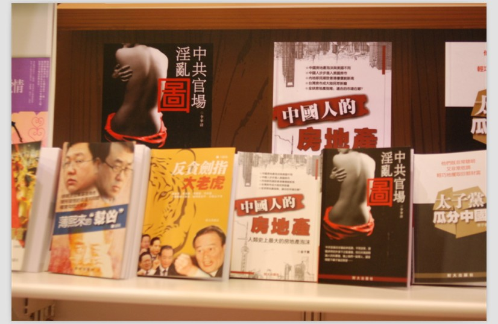
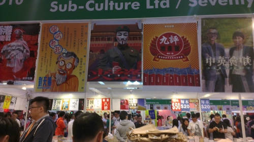

# 谈香港书展

珠三角一带有阅读习惯的年轻人期待已久的香港书展又开始了。这场声势浩大的图书展览始于“禁止事项”那年的夏天，逢夏一年一届，如今是第二十四届。如同前几年一般，我们再次相约过海围观。

今年大陆的书展并不算少，大体上，香港的书展与这些图书展并没有太大的区别：出版社参展设摊百花齐放、会场中的摩肩接踵、令人心痒痒的图书折扣、嘉宾演讲、会场内贵得吐血的餐饮服务……香港书展对大陆游客还是有一定的吸引力，书展通常都能邀请到更加知名的嘉宾，今年便有陈冠中、张大春、李欧梵、梁文道；讲座的规模也控制得比较好，嘉宾和观众互动的场合相对比较多；还有“少数人的读书会”，由嘉宾带观众一起阅读名著，分析内容。可以肯定得说，香港书展的讲座节目办得有声有色。

对大陆游客的吸引力更重要是因为，香港并没有如大陆那样的出版物审查制度。一些题材或内容触碰到大陆当局敏感点的图书在大陆或经过违背作者原意的删节、或不能通过审批，香港却给买到这些“禁书”的完整版提供了一个机会。随着近几年自由行的放宽，大陆游客去香港消费更加频繁。同样的印刷品，由于种种原因，在大陆购买通常要比在香港购买更加便宜，香港书展的优势便在于可以购买“禁书”了。近些年，相当多的“禁书”重新编辑出简体横版，相当于赤裸裸地迎合大陆游客的偏好，专门做非本地人生意。

“禁书”并非全是好书，也有一些只顾逐利的出版商吃准相当一部分游客不常来香港的事实，利用游客们的猎奇心态，随意地捏造事件，为吸引眼球搞出一些毫无根据的大新闻，制造了大量被禁的印刷垃圾。（注：这样的印刷垃圾并非出版自由带来的副作用，大陆的出版物审查制度也没能阻止《货币战争》这样的印刷垃圾盛行。）销售垃圾禁书的摊档数量相对普通禁书而言并不算多，也是一件值得欣慰的事情。

此处有点比较吊诡，以反思或者揭短为主的禁书时不时会和一些被我们成为“意淫作品”的“中国崛起论”及“西方阴谋论”书籍放在一起，三者形成了鲜明的对比。也不知道后两者的主要消费对象是何人，销量又是如何。

支撑起书展的另一半人群则是香港的本土居民。香港本土居民的出版物消费偏好与大陆居民着实无差。青春文学摊档总是挤满形形色色的少男少女，埋单长龙上亦以他们为多。这些作品一大部分来自本土新晋的网络作家，书展前我从未尝听说过他们的名字；郭敬明的小说前也是人山人海，将整条走道堵得水泄不通。青春文学的受众相当清晰，购买力和购买欲望都相当之旺盛，难怪郭敬明能够蝉联多年作家收入榜，书展的大部分摊档都铺满封面花哨华丽的青春文学。

占版面较多的还有工具书。这类型的书品种比较多样。比较突出的是两大类：宝典类的安卓使用宝典、相机教学、烹饪教学、旅游指南和成功学大板块下的时间规划类和人性操纵类。宝典类工具书算是一种诡异的产品，书中绝大多数内容都可以在互联网上轻松地免费获取，能占领那么多的展位在我看来多少有些难以理解。考虑到大多数人都不怎么会用搜索引擎，下app还要用各种辅助工具，这一切似乎也是非常合乎理性。成功学书籍的流行基本上是普世的，便不多谈。

今年恰好是卫斯理50周年纪念，许多看着卫斯理长大的中青年人排队购买50周年纪念套装。以我个人经验，看过的书，买精装纪念版回家，通常是放在书柜上蒙尘。他们大约是通过消费的方式回味自己年轻的生活吧。或许若干年后大家也会在下班之后奔赴会场，排着队买《三体》纪念套，会场一侧是“消灭地球暴政”横幅，另一侧是三体人的三角logo立牌。

这届书展跟往届书展最大的区别，在于作为主要议题的本土主义。今年关于本土话题演讲便有两个，一个是主推的陈冠中“中国天朝主义”（陈冠中著有：《盛世：中国，2013》及《中国天朝主义与香港》），另外一个是陈云的“香港城邦论”（陈云著有《香港城邦论》）。两个讲座我都错过了，不便评价。书摊之间的本土元素更是明显。今年出现数家专门贩卖本土抗

争元素的书摊，不约而同地装饰上那些赤裸裸指向抗争的符号：拳头、V面具，巨大鲜红的惊叹号。贩卖的书籍封面通常都鲜艳而ps痕迹明显，标题则完全无愧于“标题党”的称号，与先前提到的劣质禁书相似，有十足的地摊色彩。同样有地摊色彩的还有这些书的标价，20港刀，折合16人民币，在书籍价格通常60起的香港算是十足的异类。摊档之中的工作人员一直在用扩音喇叭喊话，场地人声喧闹，只依稀听到他在建议路过的年轻人前来选购，声音不如他背后的展板热血。摊上比较多的还是年轻人，还算是比较热闹的书摊。

回归十五年有余，香港只身一屿，面对大陆政治经济乃文化各方面的压力，想要如同以往那般维持自己相对独立的姿势甚至姿态优越，已经越发地力不从心。香港与大陆之间的冲突是多方面的，不仅仅是政见分歧那么简单。蝗虫事件、限奶令乃至于书展中异军突起的本土愤怒，均是这些冲突的现实表现。

本土知识分子并没有忽视这些冲突。陈冠中的“天朝主义”主要应对的是香港与大陆在政治上的矛盾，他用异于新自由主义的思路重新叙述了香港历史，并试图揭穿“天朝主义”式宏大叙事的内在陷阱。陈云的“香港城邦论”则试图抛出一条路线，以标准的新自由主义视角叙述了香港港英时期的辉煌历史与回归后困顿的现在，提出香港可以作为一个城邦独善其身，走自治之路。实现自治将要遇到的种种问题，他提出“这些问题，通通不需要问。有了信念，就有答案，就有实践的道路。”如是的解释并没有现实操作的可能而且并不能真正地解决问题，为此“香港城邦论”饱受批评。

书展归根到底还是一场商业活动，只不过这场商业活动中间参杂着不少的文化因素。尽管很不愿意承认，在如今这个有商业驱使的世界之中，尤其是重商清文的香港，文化只会是商业活动的附属品。消费者关心“被禁言论，出版商便印刷大量禁书”；消费者关心青春文学，出版商便大量出版青春文学；消费者关注本土文化，出版商便铺设更多的摊位、邀请相关的专家前来讲座。一切一切都是都是在为商业服务，出版商赚够钱，消费者满足了自己的欲望，其余的便不必关心了，至于其中印刷物的质量跟收入并没有太大联系，便置之不理了。 

所幸在场的还有几家传统书摊：中大、港大、Oxford、天地、三联。他们多多少少还照顾我们这些无聊读者，在摊位上摆放了几本质量上乘的严肃读物。以阅读的名义，将我们身上本无多少的钞票统统骗到出版商的钱包。其中还有一点钱会落入作者手中，这大概是驱使我们买书的唯一原因了。

（采编：佛冉，责编：佛冉）
