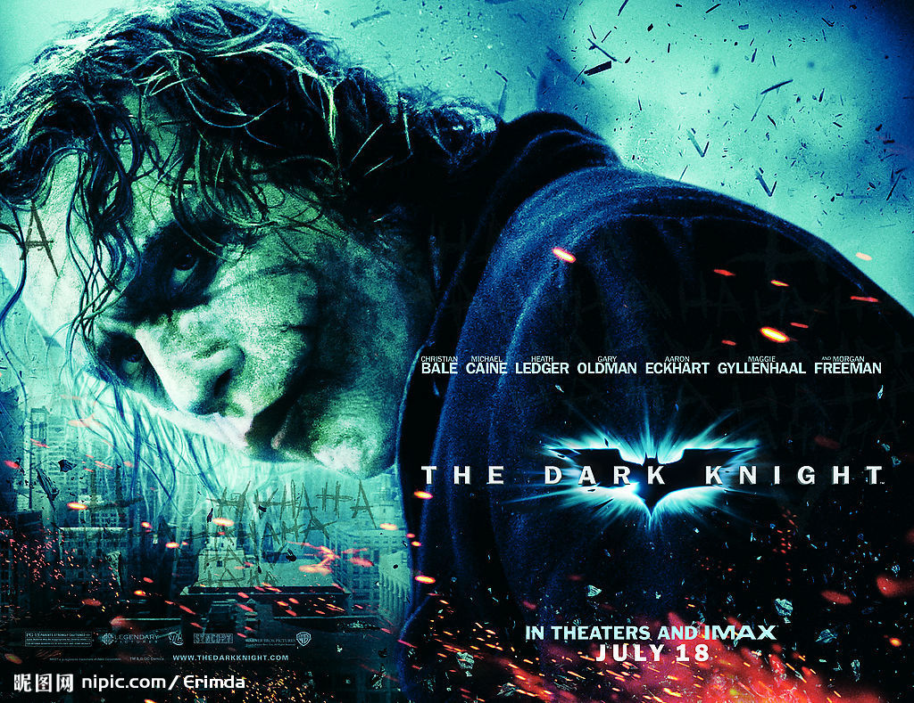
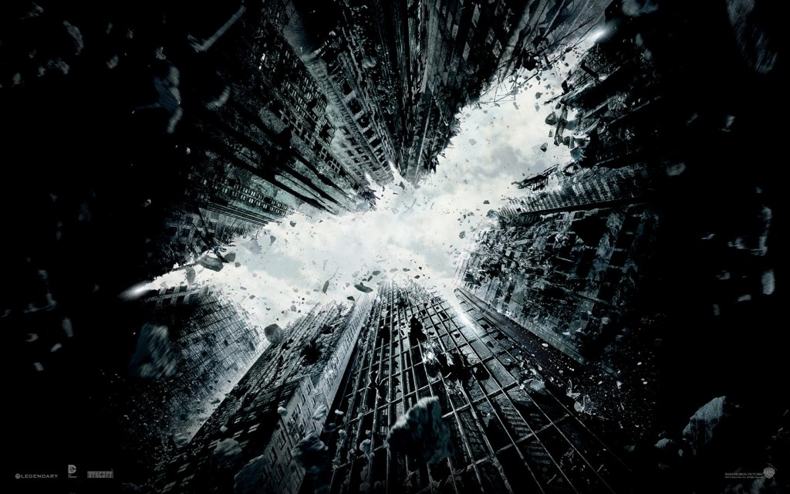

# 贝恩与小丑——对黑暗骑士中“邪恶”意识形态的思考

** **

两部黑暗骑士，诺兰用他诡谲的天才，几乎改变了传统好莱坞英雄片的既定叙述方式，将私刑与公义，疯狂与理智，兽性与人性的深度赋予了已落入俗套的英雄片中。但即便是“鲸呿鳌掷，牛鬼蛇神”的“电影之鬼”诺兰也有无法打破的传统格局，那就是英雄片中的恶人和他们的消亡与制服。而两部中的两位反派“小丑”与“贝恩”（当然是泰德操纵下的），却表现出了别样的邪恶，而在这样的差异中，也能窥见现代社会所恐惧的一些侧面。

**小丑****——****纯粹的无政府主义** 

“要真正的活着就必须毫无规范。”("The only sensible way to live in this world is without rules!) ，小丑用这样的话语要蝙蝠侠在无序中和自己玩两枚炸弹的游戏。

这句话，就是小丑的行事准则。他自称是混乱的代表，他就像一个用混乱写诗的诗人，而火药、炸弹、汽油就是他的纸和墨。与《老无所依》里的安东不同，安东杀人是没有理由和信条的，只是纯粹的为恶，小丑却显得“善良”一些，他拥有着自己的信条——“打破秩序”。他的无政府主义是那样的纯粹——所期待的不是在现有的政治制度之外去建立一种新的社会存在方式，而只是纯粹地制造着恐惧与无序。

于是，所有的人，包括那些罪犯，都只不过把小丑当作疯子和怪胎（freak）。他的信念并不能成为大众共同的信念。就如同小丑自己所说的“我不是怪物，我只是想法比较先进”（See, I'm not a monster, I'm just ahead of the curve. ）。这不是疯子的自负，而正能准确的表现出小丑为什么永远只是一个异类——他打破的和所执着的，是对理性的彻底推翻，而不去考虑所谓的“文明”，所谓的“自由”——普世价值对他来说，没有任何的意义。

“诗人是畸形人，是被抛弃者，他正走向绝迹。”（法国诗人 S.J.Perse)，小丑所秉持的，就是一种诗人化的无政府主义，而他的境遇也不过如同此诗作者所描述的诗人那样，得到社会的放逐，远离“文明”的城池——被关入疯人院。

小丑的邪恶，虽然疯狂甚至先进，但相比贝恩（下文提及），在现代社会的语境下却没有那么危险，因为他最终不过为这个意识形态所排斥，不会有更大的波澜。就如同福柯在《疯癫与文明》里所表现的——所谓的癫狂，只不过是一种排斥，所有与“理性“不符的人，都在“文明”的界限之外。

**贝恩****——****一个新的****“****切****.****格瓦拉****”**

相比于小丑的癫狂，贝恩的邪恶却显得那样含情脉脉，他的所有的计划与“阴谋”都建立在对泰德的爱与保护之上，就连泰德自己，其行为也建立于完成父亲的愿望之上，而这愿望又那样的实际——重新恢复世界的平衡。与小丑相比，他们的目的那样的有序并且"理性“。

这使得贝恩的面具开始逐渐的变成了切.格瓦拉的贝雷帽——“真正的革命者是以爱的强烈感受为指导的。没有这样的品质，一个真正的革命者是无法想象的。”这是格瓦拉日记中的名言，他用普世的价值作为自己革命的行动的箴言，贝恩也正是如此。当哥谭市所代表的现代文明面对小丑时，所对抗的是一种在文明自身看起来癫狂的一种新的意识形态;而面对贝恩时，所对抗的是同样的普世价值下所衍生出来的一种社会形态。

这也是贝恩能够动员起整个社会成员的原因，正是因为他不会被看作是疯子，而更像是与犹太教对抗的布道的“基督”，他需要建立起一个新的宗教，原本的“宗教”（现代社会）是堕落又腐朽的，于是他拥有了众多的追随者。

 **为什么影片中贝恩要被消灭，而小丑只是被关进疯人院？**

其实当贝恩拥有了格瓦拉，甚至是基督的形象之时，答案就逐渐浮出水面。小丑的疯狂是为现代社会大多数人所排斥的，他处在“文明”的界限之外;而贝恩，却能够明确的提出其革命的构想，并引起群体性的行为。这种对即成制度的颠覆，在整个社会看来，要比零星的，无法引起共鸣的疯子，要危险的多。

这几乎就是现代社会意识形态的一面镜子， Tom Charity评价说：“电影对既成建制的捍卫，这种建制以仁慈的富翁和廉洁的警察的形式呈现出来。”本着它对人民掌控局势的怀疑，展示了一种对社会正义的欲望，以及一种暴民掌控下有可能实际发生的事情的恐惧。”

而蝙蝠侠所需要做的，就是去完成整个社会意识形态所需要做的——放逐疯狂，消灭新的政治可能。而他这么做的理由，只不过是完成他自己的本职工作，因为他的本质，只是一个善良的资本家而已。齐泽克的话可以美妙的解释这个观点，他把整部电影描绘成狄更斯小说的再现——“虽然观众知道韦恩是一个超级富翁，但他们倾向于忘记他的财富是从哪里来的——军工厂加上股市投机。这就是为什么，贝恩的股票交易游戏可以摧毁他的帝国——军火商和投机分子，这才是蝙蝠侠面具下的真正秘密。但影片如何处理这点？恢复狄更斯的原型话题：一个资助孤儿院的好资本家（韦恩）对抗一个贪婪的坏资本家（狄更斯笔下的斯特赖弗）。”于是，在三部前传中，蝙蝠侠从一个对法律的地下维护者，转变成了一个意识形态和既成体制的维护者——他的英雄色彩随之得到了升华。

** ****单向度的英雄主义与邪恶？**

马尔库塞在《单向度的人》中，总结了工业社会的一大关键的症结——将社会需要变作了个人的需要，“个人同他的社会，进而同整个社会所达到的直接的一致化。”蝙蝠侠这样的英雄人物，在现代工业社会中所表现出的英雄主义，也不能超过这样的界限。

而电影中所表现出的“邪恶”，也不过是这个社会情境下的意识形态的衍生：它将在其之外的当作“疯狂”，将与之对抗的进行正义化的“消灭”。

 

（采编：孙梦予；责编：徐海星）

 
