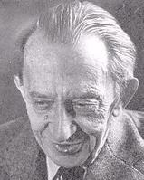
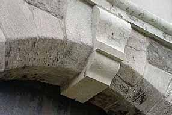

# 跨越深渊——卢卡奇与康德之间的张力

众所周知的，《物化与无产阶级意识》（<Reification and the Consciousness of the Proletariat>）这篇论文最集中且具有代表性地体现了卢卡奇的哲学立场，而当我们检视这篇代表论文中的《物化现象》（<the Phenomenon of Reification>）与《资产阶级思想的二律背反》（<the Antinomies of Bourgeois Thought>）这样两个相连的部分时，我们会发现，这两个部分之间呈现出了一种奇怪的张力：在第一个部分中，其“物化理论”被视为对现代工业资本主义社会的内在不合理性的一种哲学式的表达：这种表达的哲学根基综合了来自马克思的“商品拜物教”（commodity fetishism）与来自马克斯-韦伯的“合理化原则”（the principle of rationalization）的多方面要素，力在揭示工业资本主义社会中的各种似乎具有“普遍性”（universality）的要素的虚假特征以及其背后蕴含的深刻的“非人化”（inhuman-existence）的现实——从而，对这样一个被物化了的（reified）、并未展现出真实形貌的社会采取一种批判的立场——这种立场是坐落于经济学、法学、哲学等各个领域而分别展开的——也就是理所应当的了。因而，在这种视角下，一个激进的、意在颠覆物化现实的作为革命者的卢卡奇的形象跃然纸上——事实上，这个形象也构成了我们对卢卡奇的一般理解，而这个理解，似乎是完全无关于德国观念论（German Idealism）的。

因而，在第一种理解的视角下，我们便会很难去理解，为什么卢卡奇会在第二部分中花费如此冗长的篇幅去论证此般的“资产阶级思想”的悖谬何在：按照既定的思路读解，卢卡奇似乎更应该在第二部分中将经验主义（Empiricism）与实证主义（Positivism）思潮列为主要的批判对象，但是令人费解的是，卢卡奇似乎并未将经验主义或实证主义视作可堪匹敌的对手——对它们的批判在第一部分与第二部分的交界处被草草地略过——最大的篇幅的批判，指向了似乎与之前所述的一切要素都毫无关系的德国观念论，而首当其冲的，则是生活在前工业时代的康德（特别要说明的是，也许对卢卡奇文本足够熟悉的读者会怀疑，为什么我有意忽略了《资产阶级思想的二律背反》中卢卡奇那些关于后康德的观念论哲学家——从席勒、谢林到黑格尔的论述。我将在下面的论述中着力去说明，康德与后康德观念论者——特别是黑格尔对于卢卡奇具有截然不同的方法论上的意义，前者更关乎问题意识，后者更关乎立场的择取，而后者显然超出了本文所欲讨论的范围 ），这里似乎出现了一道难以捉摸的狭小的、而又深不可及的裂缝横亘在第一部分与第二部分之间，那么问题也就自然地浮现：卢卡奇对康德的批判的基础何在又意味着什么？或者说，从《物化现象》到《资产阶级思想的二律背反》的跨越何以可能又导向何方？

** **

** **

在下面的论述中，我将尝试着对这个问题给出四个层次的回应：第一，我将从事一种“筑桥”的工作，即试图找到康德的第一批判与第二批判之间的张力的关键点——这个张力将是卢卡奇展开对康德批判的最主要着力点，对这一点的细节呈现意味着建立从康德到卢卡奇的直接关系将是可能的；第二，我将详细阐述卢卡奇对康德的批判是如何展开的——这也是往往被人忽视而又至关重要的部分，批判的过程背后所体现的卢卡奇与康德的立场与方法论的差异可能会直接影响到第三第四层次的内容；第三，我将从事某种意义上的“报靶”工作——即判定卢卡奇对康德的批判对卢卡奇而言究竟意味着什么样的结果，此般的结果又如何反馈于他的物化理论并牵引出了进一步的“无产阶级的立场”（the Standpoint of the Proletariat）；第四，我将回到康德，并对其进行“验伤”——面对卢卡奇的攻击，康德是否守住了他所欲守住的东西，如果守住了，那么卢卡奇的攻击究竟在何种程度上产生了偏离？

的确，假如仅仅从最最肤浅的角度出发，我们的确能够在康德的第一批判与第二批判——或者以一种极为含糊而不准确的表述、但也许在增进读者理解的意义上是必要的而言——在康德的认识论与伦理学之间找到某种奇特的对应性。1781年的第一批判所呈现的那种从纯粹理性与物自体双向出发、综合构造先天综合判断从而使认识达到知识的那种结构，与1785年的《道德形而上学奠基》中所体现的那种由纯粹实践理性推导出先验的定言命令（Categorical Imperative）从而使经验的道德知识达到道德律（Moral Law）的那种结构具有某种意义上的相似性，这里的相似性基于一种基本的二元论的预设：自在之物（thing-in-itself）与现象（appearance）的区别，也就是说，这里存在着一个来自理性的形式（form from reason）与来自世界本身的既定内容（given content）之间的张力。在卢卡奇看来，这个基本的预设是勾连第一批判与第二批判的一个关键点：自在之物本身即表达了一种对理性与世界的割裂的现实的描述。甚至就如当代德国观念论专家Terry.Pinkard教授也这样认为：

“即使我必须将自己视为自由的，但究竟为何我能断言自己真的自由呢？为什么我不能断言自己是注定要沉浸于某种幻象之中呢？康德对此的回答基于一种对现象与本体的界分。”[1]

但是我们很快就会发现这种对应性并不那么可靠——就如《道德形而上学奠基》的第二章那个极具迷惑性的标题《由通俗的道德哲学到道德形而上学的过渡》所引发的争议那样，但是，我们仍然暂且会在这里同意卢卡奇所作出的断言——否则我们将无法继续分析卢卡奇对康德攻击的思路，而对于这种对应性的可靠性，我们姑且存疑并将在之后详细的论说。

由于断言了康德的体系存在着根本上的张力，卢卡奇笔下的康德因而呈现出两个不同的维度，因而攻击也沿着两条不同的路线展开：自在之物本身被规定为无法被纯粹理性给出的形式（Form given by Pure Reason）把握的内容，同时被规定为无法被把握的总体，因而，在第一批判的维度上，感性直观的能力也仅仅是接受并呈现出经过形式中介的内容（不能被此般的形式把握的内容都被舍弃而划入了不可认识的自在之物的范畴），而作为感性直观的对象本身，我们完全无法达到。因而，先天综合判断所达到的知识并非真正的知识，而只是“被人相信为是知识”；因而，这种放弃了不相容的内容的形式无法把握总体——尽管这样的形式已经是具有某种程度的普遍性的形式，但这种形式滤去了大量的内容，因而只能是一种抽象的、无内容（或者无力把握内容）的形式。卢卡奇在这里没有忘记补充一点，他提出，这里的悖谬也是现代资本主义社会的悖谬——将部分宣布为是总体尽然总体根本无法被完整地把握，这样的结果就是一旦这样的部分的形式被宣布为是普遍的——那么给出这种“普遍”形式的资产阶级也要被这种形式所规定——这也就指认了物化的现实（reified reality），从而揭示了第一部分与第二部分之间的关联所在。

在卢卡奇看来，第二批判维度上的康德似乎认识到了第一批判所揭示的形式与内容之间的困境，因而试图将那些既定的内容转化为可由理性主体把握的内容——如此一来既定性的难题就可以被消解，而完成这种转化的方式便是实践——实践中不允许出现既定性内容，所有的内容都必须由实践生成的形式所规定（我必须要在这里提醒读者，我们已经能很显然地发现这里的结构已经显然与第一批判完全不同——此般的“实践”给出的形式是没有任何中介的，而这种结构的不同与卢卡奇先前的断言似乎有所矛盾——这将成为我之后论述卢卡奇对康德的攻击是否有效的重点）。从而，这种试图去克服生活中的既定性的“实践理性”最终还是无法克服既定性，自由成为了内在的反思与评判，外在的世界被保留原状，自由与必然的分裂深入了内心，此般的道德原则成为了没有内容的形式：

“这样一来，康德提出的伦理问题就又把我们引回到了自在之物的没有被克服的方法论问题上去了。我们早已把这一问题的哲学上的重要的方法论方面规定为形式和内容的关系问题，规定为事实的不可溶化问题。康德的形式主义的、适应个体意识的伦理学虽然可能展示了解决自在之物问题的形而上学前景，其途径是一个被把握为总体的世界的，全部被先验辩证法瓦解了的概念，以实践理性的假设形式出现在地平线上，然而从方法论的角度来看，这种主观的和实践的试图解决问题的办法仍被限制在那些限制过程性批判对问题的客观和直观提法的同样界限里。”[2]

尽管在这里卢卡奇援引了费希特在《先验逻辑学》中的大段关于自我与经验以及作为两者中介的“活动”的论述来引出康德的实践理性（Practical Reason），但我认为，卢卡奇对康德的断言其实更多的是基于卢卡奇将对《道德形而上学奠基》的理解延续到了对第二批判的理解之中。也就是说，之所以卢卡奇笔下的康德的“实践”会显示出这样一种困境，就是因为卢卡奇认为康德将“实践”视为“把两个世界联结起来的，由此出发可以一眼通观这两个世界的那一点”[3]（这里的两个世界指的就是第一批判与第二批判的世界），而这一点同样是需要进一步推敲的。

抛开存疑的要素，沿着卢卡奇的思路，他在通过对康德第一批判的批判指认了物化现实与德国哲学之间的联系之后，紧接着论述了康德所给出的“实践”无非又是一种直观的独断论，对既定性-自在之物难题的解决最终不能再以先验哲学的路向进行，否则只能达到虚假的无意义的“自由”。真正的“实践”需要的是“注意相关对象的独特性，注意内容与物质基础”，也就是说，我们不应再试图去给出主观的形式去覆盖内容，而是要从内容本身去发展出新的形式——这种解决路向直接导向了黑格尔，并引出了卢卡奇自己的“无产阶级的立场”，但这已不是本文所欲讨论的范围，我只在这里指出卢卡奇借以通过批判第二批判所欲达到的方向何在。

我们在转向第四个层次之前最好先做一个短暂的停留来整理一下卢卡奇已经达到的东西——之所以会有从第一部分向第二部分的转向，就是因为如果仅仅凭靠第一部分中对物化现象的叙述，我们对这种困境的认识还是只能停留在直观的、既定性的层面上。但就如卢卡奇所说，“德国古典哲学的伟大、矛盾与悲剧正在于，它不再——像斯宾诺莎那样——把每一个既定的事实当作不存在的东西，并让它们消失在“由知性创造的理性形式的宏伟建筑后面，而是相反，它把握住了概念的既定内容的非理性特征，牢牢地抓住这种特征，超越和克服这种证明，力求建立体系。”[4]如果我们不进入观念论的世界，我们将无法从根本上把握物化世界的本质——而只能停留在直观中发出虚妄的僭语；从这个角度来看，德国观念论对于卢卡奇的重要意义就好比一个进入门路的钥匙，只有在观念论的视野中我们才能达到对现实世界的洞见，相形之下，经验主义与实证主义的困难简直如同儿戏一般。尽管康德生活在工业革命完成之前的年代（甚至在拿破仑之前），但他在1785年达到的洞见却是直接针对1915年的现实的——这也是卢卡奇对康德所下的断言导致的，如果我们继续阅读的话，我们将很明显地看到，卢卡奇将改造黑格尔的辩证法，接着统一1815年与1915年的世界。

最后，如我所承诺的，让我们回到康德，来看看卢卡奇是否真的揭示了康德体系中的致命问题。我之前已经在论证里提到了一些存在争议的地方，首先，是作为卢卡奇对康德的解释根基的断言，即第一批判与第二批判共同分享同样的一个形式-内容分裂的前提的问题。这个问题的复杂性在于，第一批判与第二批判是否共享同一套论证结构。尽管卢卡奇坚持认为，第二批判所遭遇的困难与第一批判完全一样，都属于同一个既定性-自在之物不可溶解的问题，然而，我们已经发现，在两个批判之间存在了很大的不同：从最肤浅的意义上来说，第一批判中的认识结构是双向推导出的一个先验中介，然而第二批判中的定言命令或者“实践”却是一个单一由理性给出的形式，这里的方法论上存在着本质性的差异，让我们不由得怀疑究竟这里是否还存在着一个结构上的对应。就如我先前所说，《道德形而上学奠基》的第二章的标题《由通俗的道德哲学到道德形而上学的过渡》具有很强的迷惑性，让我们产生了一种两者结构可以等同的错觉；但是即使在这里也仍然存在一个这种作为中介形式的“过渡”由谁给出的问题（似乎，这里已经有了隐含的主体理性的预设），更不用说在第二批判的序言中康德已经很清楚地说明：

“需要辩护的只是：为什么在这部著作中，纯粹思辨理性的那些概念和原理，固然已经经受过了它们的特殊的批判，在此还时时再一次地被加以检验，这种做法通常对于一门必须被建立的科学的系统化的进程而言是不太适当的（因为已被判定的事按理来说只须引证，而不必再加讨论），但在此处确实允许的，甚至是必要的：因为理性连同那些概念是在另一种运用的过渡中被考察的，这种运用完全不同于理性在彼处对这些概念的运用。但一个这样的过渡就使得把旧的运用和新的运用加以比较有了必要，以便把新的轨道和以前的轨道很好地区别开来，同时又让人注意到它们的关联。此外还有那些再次针对自由概念、但却在纯粹理性的实践运用中的考察，不是看作例如仅仅要用来弥补思辨理性之批判体系的漏洞的插叙。”[5]

也就是说，至少对于第二批判时期的康德来说，第一批判与第二批判的两个世界并不完全分享同一套体系，按照亨利希（Henrich）的解释，在第一批判时代，康德将理性视为是一个“有机的总体”（organic totality），理性是使经验完整的原则，是争取联结的总体性的东西（参见卢卡奇对康德“实践”概念的定位就不难理解这里的含义），但是，由于作为两个世界假设的联结的“自我”的缺失，康德仍然无法完成一个从本体论框架到体系基础的“反馈环”（feedback loop），也就是说，这两个世界仍然是断裂的（这个判断事实上在卢卡奇那里可以见到一些隐含的影子）；但是到了第二批判时代，康德开始将自由描述成理性本身的目的，在第二批判的序言中，康德就提出了那个著名的“拱顶石”的比喻：

********

** **

“自由的概念，一旦其实在性通过实践理性的一条无可置疑的规律而被证明了，它现在就构成了纯粹理性的、甚至思辨理性体系的整个大厦的拱顶石，而一切其他的、作为一些单纯理念在思辨理性中始终没有支撑的概念（上帝和不朽的概念），现在就与这个概念相联结，同它一起并通过它而得到了持存及客观实在性，就是说，它们的可能性由于自由是现实的而得到了证明，因为这个理念通过道德律而启示出来了。”[6]

也就是说，两个世界之间的联结是通过自由而彰显（而不是像卢卡奇所说的那样，两个世界的分离是自由的前提，这里有一个颠倒的关系），自由作为一个拱顶石，保证了整个体系得以被支撑起来，哪怕自由是无法演绎出来的。亨利希这样论述：

“我们认知能力的建构（architecture）能够被描述成为一个使得自由意识（an awareness of freedom）成为可能的体系。自由依赖总体性理念，而总体性理念预设知性是一个联结、但又不是总体联结的原则。作为最低限度和受限制的联结，知性使作为一种最大限度的联结或总体性的理性变得有意义。我们需要知性以便到达总体性，我们需要总体性以便到达自由；我们需要自由以便到达这个总体系的意义。因此我们可以说自由是这个体系的拱顶石。除非我们拥有这块拱顶石，否则这个体系的所有要素的连接是看不到的。一旦我们拥有了这块拱顶石，这个体系就是自我支持的，尽管这里没有任何对自由可能性的演绎。自由却使这个体系成为一个整体，即使我们不可能从它开始。”[7]

也就是说，康德在这里的困难在于作为体系关键联结的自由无法被演绎，而只能通过其对体系的作用而得到确信，这就诉诸一种神秘主义——而不是卢卡奇意义上的直观，而这种理解的差异，根源还在于对第一批判与第二批判体系的理解的差异，我无法说明究竟孰是孰非，但是毫无疑问的是卢卡奇更多的是以康德来书写自己的哲学，因而他笔下的康德必然具有一个新的形式，至少就理解卢卡奇的物化世界而言，他对康德的攻击，即使还会有许多不确定的因素，但仍然是绝顶的精彩。

参考文献与注释

[1] Terry Pinkard , German Philosophy 1760-1860 : The Legacy of Idealism , Cambridge University Press , 2010 , p47

[2] 卢卡奇：《历史与阶级意识》 ，杜章智等 译，商务印书馆，2009年，第200页

[3] 卢卡奇：《历史与阶级意识》 ，杜章智等 译，商务印书馆，2009年，第197页

[4] 卢卡奇：《历史与阶级意识》 ，杜章智等 译，商务印书馆，2009年，第189页

[5] 康德：《实践理性批判》 ，邓晓芒 译，人民出版社，2003年，第6-7页

[6] 康德：《实践理性批判》 ，邓晓芒 译，人民出版社，2003年，第2页

[7] 亨利希：《在康德与黑格尔之间》 ， 乐小军 译，商务印书馆，2013年，第145页

（采编：李以诺；责编：彭程）****
