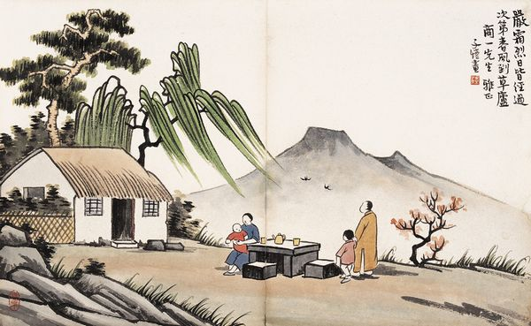

# 踏歌行

** **

按照一般武侠小说的尿性，当一个习武之人遇到苦苦无法突破的瓶颈，他就会按捺住苦恼、彷徨、迫切，去繁华如梦的红尘俗世里修心养性，在熙攘如潮的市井大街上观察，感受，突然就从安静小巷里，一个小女孩唱着童谣，跳着格子的无忧无虑中顿悟过来，哈哈大笑着，毫不在意世人的目光，飘然远去。

于是在一个秋后微寒的下午，我坐在成府路清华园的公交车站台上，等待大道那一丝飘渺无痕的突破契机。世事如潮人如水，我看到了一对步履蹒跚相互搀挽的老伴，看到了一群吱吱喳喳放学归来的学生，看到了冲着手机吵架不断的青年人，看到了疲惫不堪皮包领带的中年男子，看到了被儿子推着轮椅的残疾人，看到了抽着劣烟浑身泥尘的民工，看到了万花筒般在眼前流淌的人和事，风和景，幸福和麻木，渺小和伟大。

大千世界，百态人生。

整整悟了三个时辰，从一点到七点，等待已久的一股气流终于从丹田缓缓升起，经檀中，绕廉泉，猛烈冲击在鼻子旁边的迎香穴上，企图撞开那堵塞已久的经脉要穴。

于是我连着打了哈啾，感冒了。

出师未捷身先死，长使英雄泪满襟。

待到病丝抽去，山河重拾，我决定换一种领悟的方式，于是背上帐篷睡袋防潮垫，独自爬上百花山。

同行中偶遇了一个姑娘，二十来岁的样子，大学毕业了没找工作。她只是想在找工作之前疯狂地玩，去好多她想去的地方，听好多她想听的故事，见好多她想见的人，像听腻了的，许许多多有着不安灵魂的青春一样。

交浅言不深。行走江湖，唯僧人、道士、乞丐和独行女子这四类人决不能惹，这种道理我还是懂的。所以我警惕地打量着她，打量她人间凶器之所在，打量她蛮腰后面若隐若现节律摆动的武器。

她的个子不高，看上去柔柔弱弱的，是极易惹人犯罪的那种；一身户外的行头，长长的马尾，笑起来竟然是很多小说女主人公里的那种爽朗。

她说她去了好多地方。南疆、青藏、东北和云贵，大半个中国快走遍了。北京来了好多次，大吃省也去过。

“那里好热，玩的地方不多，但早茶很好吃。”她一针见血地给出了评价。

按照故事的展开，我该话音一转，问她：“你为什么走那么多地方？”然后期待她发人深省的回答。但可惜，作为相互契机隐隐纠缠在空气中的我，早已明了这个问题的答案。

那是她的淡淡忧伤。

最终我俩分开。她的声音很好听，走时轻轻哼着苏有朋《背包》里的“我的流浪路里几多云和树，只有背包陪着我奔跑……”的歌词，让江湖人送爱称调王之王的我，也是微微失神。

跑得一手好调。

看着苍茫暮色，我略一沉吟，决定安营扎寨。走累了跟不上她节奏的事我会乱说么？吃过晚餐，穿好衣服，我走出帐篷，在一棵树下站定了，开始吸纳天地之灵气。

就像按点跳出机器鸟的时钟一样，晚霞落幕，星河升起。肃穆萧杀的荒冷，吹散了所有抬头仰望的阻碍。点点繁星，恰如天堂的万家灯火，让人忍不住听柴门犬吠，等风雪归人。

世界不过是一个小小屋檐，而我只是一个等雨百年的少年。唔，大叔。有人陪我偎依过，又跑入了茫茫雨幕里；有人陪我偎依着，彼此懂得；有人将跑进来躲雨，相逢一笑。

我就会冲她眨眨眼，百年只在一瞬间。

“不好……”我猛然惊醒，方惊觉气血浮涌，竟是隐隐有入魔的征兆。手淫伤身，意淫伤神，我的独门功法扉页，就已经明确地提出了这八字精髓，这遑遑夜空，竟差点让我迷失。

咬着舌尖，我强迫自己静下心来，继续感悟天地法则，苦寻那一缕让自我突破的天机。

衰兰送客咸阳道，天若有情天亦老。

空旷的天地间，猎猎的山风执行着秋天的法则，吹落了无数的树叶。远远地看，这些还在树上的，早已远方的，仍在风中挣扎的片片秋叶，并没有什么不同；走近了，看仔细了，才发现他们千姿百态，各有其独特的脉络，各有其独一无二的气息。

我一直在想，是不是上帝也会有一天困于自身境界，跑到天堂的一座小山丘上，打量天地，打量光阴，打量一株毫不起眼的小树，突然发现，那些飘零欲坠的树叶，竟是一片片鲜活的名字。

而这株小树，却是我们这些名字无法挣脱的整个世界。

一声长叹，我左顾右盼。这个时候，就应该有个绝世高手悄无声息地出现在我的面前，一剑斩出，便像惊雷走电，破开一切有形的无形的尘网，破开一切绝路前的荆棘，破开迷惘的犹豫的复杂缠绕的思绪，斩出一片简单的恢弘的朗朗晴空，然后他冷峻地看着我，严肃问道：“可懂？”

我醍醐灌顶，大汗淋漓，低头长拜：“懂了。”

然后他大袖一挥，瞬间消失在我面前。空气中还萦绕着的，是他振聋发聩的声音：“懂了，就去做了。”

我恭谨地长身而起，细细想着那精妙绝伦的一剑，仿佛有一条前所未有的崭新大道展现在了自己面前，于是我仰天大笑，踏歌而去。

莫笑我四月庵前种桃花，

莫笑我千金换醉胡姬家，

莫笑我疯疯傻傻，痴言痴话，

莫笑我游园一梦，便各天涯。

笑了几分钟，又从一条草甸小道绕了回来。外面还是太冷，这时候钻睡袋呼呼大睡才是最实在。

浮生若梦。大梦谁先觉，平生自知。

 

（采编：黄梅林；责编：周拙恒）

 
