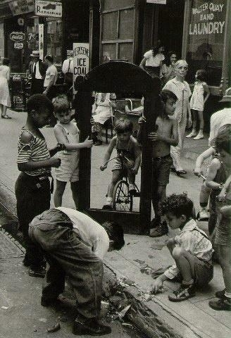

# 迈向法团主义—中国现实的选择和出路

**“对于我们国家来讲，公民社会还没有形成或者正在形成，但是民众利益的表达已经是呼声渐高。如何实现民众的利益？国家肯定不可能成为民众利益代言人。但是，利益机制如果不能有效调节的话，自然会出现很多问题。而且，中间阶层的缺失使得中国社会中潜藏的危机日渐加深，因为它不仅可以调剂利益，同时可以作为压力缓冲层，使得社会冲突的烈度下降。毕竟，无论是什么样的改变都需要一个相对安定的社会和制度环境，而冲突显然不行，高压政策同样也是不可取的。** **因此，中国的法团式建设势在必行。”** ** ** ** ** ** ** ** ** ** **

# 迈向法团主义—中国现实的选择和出路

** ** ** ** ** **

## 文/郭冉（华东政法大学）

这段时间，中国又出了许多事，什么“我爸是李刚”事件，乐清上访村长被车压死事件，某地某地强行拆迁，某地某地官民冲突等等；经济形势则是一片大好，增长的一塌糊涂，好像世界都快成了我们的天下了，如此云云。这些为本来就不平静的2010年末又增添了一抹“亮色”，同时也是2011年的承接之作，但都应当是有所预兆的。这些事情当中，我们不难发现一个现象：官方舆论一谈到社会就是刁民们又在反抗我们的政府，不满意拆迁政策，不满意社保政策，弄出了XX事件等群体性事件；而一谈到国家则尽是溢美之词，似乎国家的无限风光都集中到那几个干巴巴的GDP数字上面以及各种宏伟活动上。 这些可以很明显地说明，在当代，中国一个最突出的矛盾就是国家和社会之间的矛盾。 针对上面的一些事件，有中国的学者很早就进行了研究，认为中国其实是一个断裂的社会。[注](/wp-admin/post-new.php#_edn1)这个“断裂”如何理解呢？社会和国家之间存在着一个断层，由民众所组成的社会和由国家为代表的政治系统之间没有一个作为缓冲的第三方力量，二者的关系是面对面的。一旦两者之一在某些方面发力，那么，作用到另一个系统的力量就是很直接的，没有躲避和缓冲的余地，因此，两者之间的张力是很强大的。结构性的对立使得二者之间关系很是紧张，现在出现的问题很大程度上是由这个引起的。 另外不能忽略的一点就是，在社会和国家的关系之中，国家的力量居于主导和统治地位。中国历来是强政府弱社会的情形，而且也不是一时半会儿可以改变过来的，所以，政府的政策制定就可能对下面的社会造成强烈的影响。掌握权力的人自然都是强势群体，政治人假设也是遵从的经济学模式，认为政治人是“理性”的，自然要谋求利益的最大化。社会利益是有限的，就拿蛋糕模型来比喻吧，蛋糕是有限的，切蛋糕的权力掌握在强势群体手中，结果怎样呢？那肯定是很明显的，在没有一定制度限制的情况下，不公平是必然的。也就出现了所谓的利益压制局面。一方压制另外一方，两者的冲突和矛盾在所难免，也就是所谓的“群体性事件”，实际上是民众利益表达的一个没有合法性支持的方式。 说了这么多，其实我要表达的意思很简单，就是我们国家和社会之间张力的出现原因在于，利益协调机制缺了中间的一环——法团。 

### 历史：法团主义vs多元主义

简单的说，法团主义是一种政治权力安排的方式，是一种理想类型。通常，它通过制度对自身加以合法化，并把民众整合进一个共同体之中。在这种方式下，国家具有很高的地位，居于主导地位的政治哲学一般都是保守主义或者新自由主义。而多元主义更多是作为与之相对的另外一套系统，在它这里，国家地位受到挤压，主导的政治哲学一般为新保守主义或古典自由主义。 用一种历史的观点来看，法团及法团主义的产生已经有一个世纪左右的时间了，而多元主义产生的时间更早，可以追溯到北美独立。传统上把法团主义看成是多元主义的一种发展和变体。顺应时代的要求，二者各有千秋，就看他们对特殊环境的特殊实行情况了。 当代法团主义产生于西欧，应该是一战前后的法国，当时法团的产生出于整合整个社会的目的（功能主义会关注他们具有的相关作用及影响）。后来这一模式推广到很多传统上政府势力强大的国家：瑞士，德国，东欧国家以及拉丁美洲国家。在二战时期，这些国家基本上都走上了威权政体甚至极权政体，如德意等国。二战后，民主化改造完成之后，各国的法团都逐渐恢复，都回到了民主主义的制度之下，有的走的更远，实现了福利国家的目标。只有拉丁美洲走上了威权之路，而东欧各国则被苏联拖进了深渊。 多元主义的产生和维持就显得比较稳定，而且稳步发展。代表自然是美国。从18世纪末建国之后，加上十九世纪内战的洗礼，美国式的政治权利结构一直是多元的，竞争的。当然，这样并非没有问题，但就不在这里讨论了。 

### 结构：汉堡模式

法团主义和多元主义的结构本质上是很相似的，就类似于汉堡的结构两片面包中间夹着菜，面包是相同的，上面是国家—政治系统，下面是社会—公民社会或者由民众组成的共同体；至于中间的菜是什么，则彰显了二者的区别。“菜”其实是代表各种各样利益的团体，当然，这些利益都是不同民众的利益，如纺织工人，企业职员，菜农等等，都有其利益团体。在这一点上，法团主义和多元主义其实是相同的，都是代表利益的组织。他们把社会中民众不同的，分散的利益有效整合在一起，通过某种方式传达，并影响政治系统的权力分配和政治格局。 但是，不同点在于：法团主义强调国家的作用，政府在支配社会的过程中具有很大的影响力，他们合法地参与社会经济决策的制定，在走第三条道路的福利国家中政府有着很高的威望。法团是得到国家承认的组织，是排他性而非竞争性的，就比如中国的总工会，独此一家别无分店，如果某个人偏要再设立一个总工会性质的组织，那一定是不合法的。虽然我们的“总工会”是不怎么替我们说话的“二政府”，但仅仅作为一个组织来看，它的存在是有合法性的。但是，政府批准你合法性不是无偿的，肯定需要法团作出相应的举措来维持社会的稳定以及宣传实施一些政府的政策。 而多元主义恰好相反，错综复杂的利益交互产生，不同的人可能在不同的领域里有自己的利益，代表一个领域利益的组织可能也不止一个两个，因此是互相之间是竞争的，谁能代表我的利益我就相信谁。但是国家不可能对这些组织一一承认，而且也没有那么多的精力。另外一个原因就是，多元主义背后便是自由主义政治，传统的对政府的担忧，再加上制度的设计使得政府的权力仅仅局限于一隅，因而不能对市民社会进行过多的干预，否则就是侵犯公民自由，会有一大批理论家，政客去抨击这些政策。 

### 解决问题的角度之一—法团主义

关于中国的出路的问题，这样讲很大，就像我们平时写作文都爱写得很大，表明我们的什么什么观点，什么什么愿景，什么什么理想之类的。虽然不能解决什么问题，但是可以提供一个角度。无疑，法团主义是一个可以去实践一下的东西，尤其是对我们国家来讲。 在七十年代末中国从教条主义中走出来之后，我们的各项国家指标都进展不少，唯独公民意识和权利意识的提高明显滞后，当然这也不能怪我们的人民，毕竟中国是一个传统上的专制国家，专制的血液渗透每个人的机体，甚至每个细胞。即使到今天我们仍然是一个威权国家，只是享有不充分的公民权利，所以，一蹴而就的要达成某种目的，确实是强人所难。但是，这不意味着我们始终是原地踏步的，毕竟，华人社会中有的已经步入民主社会，这说明，有些东西其实是可以改的，比如“国情”。 法团主义有两个形态：一个是国家法团主义，一个是社会法团主义。前者是在国家实力比较强的时候存在的形态，比如说威权体制下的“总工会”之类的组织，纵然是作为二政府，也是有其合理性的；后者是在政体比较民主的时候出现的形态，举个例子，比如法国的民航工会，他可以代表民航从业者同资方，同国家进行种种博弈，但同时，法国的政体又是民主政体，其基础是公民社会，民主社会的种种法则又制约着各方的行动，使得各方都不敢恣意妄为。 对于我们国家来讲，公民社会还没有形成或者正在形成，但是民众利益的表达已经是呼声渐高。如何实现民众的利益？国家肯定不可能成为民众利益代言人。但是，利益机制如果不能有效调节的话，自然会出现很多问题。而且，中间阶层的缺失使得中国社会中潜藏的危机日渐加深，因为它不仅可以调剂利益，同时可以作为压力缓冲层，使得社会冲突的烈度下降。毕竟，无论是什么样的改变都需要一个相对安定的社会和制度环境，而冲突显然不行，高压政策同样也是不可取的。 因此，中国的法团式建设势在必行。我们有这个基础，比如原先作为二政府的各个机关，各个单位，这些可以作为改变的素材。实在不行的话（因为这些组织在民众中公信力丧失）我们也可以重起炉灶，只是这样做的话代价会比较大。 保守主义之父埃德蒙·伯克曾经这样说过： “ ……经历一个缓慢而良好的过程，每一个步骤的效果就被人注意到了；第一步的成败照亮着第二步；这样，我们就在整个系列中被安全的指引着，从光明走向光明……我们在补偿，我们在调和，我们在平衡……如果正义需要如此，那么这种工作本身也要求不只是一个时代的心灵能够提供的帮助。” ---《法国大革命反思》 我觉得法团主义的模式对中国来说还是很有吸引力的，毕竟我们尝试过各种各样的方法，但基本上都是浅尝辄止，而且很多都留下了后遗症，但对于这个比较少接触的概念和形式，我们还是有必要去尝试一下的。因为其他许多国家已经走过了这条路，我们再走一次，即使错了，又会有什么关系呢？ 

* * *

[注](/wp-admin/post-new.php#_ednref1) 作者在此主要指孙立平的社会断裂说。编者注[http://www.sociology.cass.cn/pws/sunliping/grwj_sunliping/t20031008_1192.htm](http://www.sociology.cass.cn/pws/sunliping/grwj_sunliping/t20031008_1192.htm)
