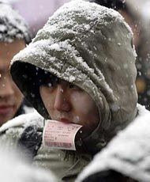

# 返乡归家的人可以再次做梦

**返乡归家的人可以再次做梦**

—— 今年春运的悲壮可能是史上最强

有位在深圳工作朋友讲述了一则离奇而真实的故事：他同事是昆明的，春节前两日才能返乡。他订不到2300元的直飞机票，也买不到传说中可以网购的火车票，毅然选择曲线救国，订了深圳飞曼谷的特价票，以及曼谷到昆明的8折票，加起来2200元，为神州大地谱写了一段悲壮的跨国回家路。

事实上，今年春运的悲壮可能是史上最强。继2012年春运首次超过30亿人次后，国家发改委日前预测2013年春运将达34亿人次。我不理解为什么有些人认为提高火车票价就可以解决春运难题。郭凯说得不错，归根结底，春运票价不只是一个价格问题，更是一个分配问题。提价无法增加火车运力的供给，只可能使一部分乘车者被挤出而另一部分乘车者增加成本。因火车票价上涨就不回家的人毕竟是少数，除非火车票涨到比飞机票还贵。返乡的念头根植于春节合家团圆的习俗传统之中，根植于人们最珍贵的回忆与情感之中。无论如何艰难，外出的人们还是要踏上回家之路。

为了生存，我们早早成人，离开家乡，来到大城市寻找梦想。为了梦想，我们把命运比作淤血，把挫折当成病，却仍保有不可言说的骄傲。为了骄傲，我们一年无休止地学习、劳作，不断付出与牺牲，在城市里暂时安顿下来，甚至扎根。为了根，现在，无论如何，我们要回家。

我也是离开故乡来到城市的人群中的一员。城市繁华，故乡冷清，但我在繁华中总是觉得孤独，而在冷清中才能找回安宁。

安宁的源泉来自童年，来自故乡。我只读了半年幼儿园，其余时光全在五眼钟山渡过。我每天一个人在山中游荡，让风吹过手指，用手指杀死草地上的虫子，听鸟在林间鸣叫，看夕阳像熟透的果实一样落下山。回家时我记住山上的一切，第二天早上会仔细查看，哪里少了一片花瓣，哪里又多了一只甲虫。

我怀念在故乡涌斯江边，捡几块白色鹅卵石，以便在夜里用它们擦出微型闪电。等五通桥的太阳西下，望着菩提寺山上的天空，想象未来那条没完没了的路，在这条路上，一切怀有梦想的人们，正在被卷入时代的大漩涡。我知道在牛华镇需要有痛哭的地方，一定有人痛哭，我知道在竹根滩需要有愤怒的地方，一定有人愤怒。我知道在大河坝的草地上，每个晴朗夜晚都可以看到众多星星，其中一颗就是我们自己。它低低垂首，无语安详，把光芒洒落在五通桥的每一座桥，每一匹山，每一条河，每一个人身上。

一年终了，回到故乡，是我们获得安宁的最好机会。看看这个呼啸前行的世界，每个人都在忙，忙着生，忙着死，忙着追名逐利，忙着油盐柴米。现在，一年就要过去，我们也许应该停下来想一秒：我们的身体我们的脑子，是不是已经麻木了？我们的上帝在哪里？

上帝就在故乡等着我们，等我们返乡。

我们可以开车返乡。那会很疲倦，但值得，而且可以躲过买火车票的痛苦。我们不会一个人开车上路，我们身边一定有爱人、亲人或朋友。我们也许会遭遇高速公路大塞车，但是没关系；我们也许会遇到大雪，但是没关系；我们也许会没油却找不到加油站，还可能抛锚在荒郊野外，同样没关系——上天保佑春运回家的人们，总有一双手帮助你脱离困境，总有一束光照你回家。

我们中间还有更多人，仍是坐火车返乡。我们来到火车站，排队排成冰棍，挤车挤成照片，支撑我们的是返乡的希望，是去年走时父母对我们说的“早点回来，平安回来”。我们像被流放的圣徒一样坦然面对艰难，没有什么比回到故乡更能显示我们的勇气，以及勇气背后蘸满泪水的情感。

现在，让我们收拾行李，带上礼物，走出去，经过大街，越过原野，在亘古就有的星光下，返乡归家的人可以再次做梦，并且一切都只为了做梦。返乡吧，异乡人，灵魂的噪音只有在爱的故土才能得到过滤、平息。当我们爱着，我们就已经回到故乡。

（采编：佛冉，责编：佛冉）
