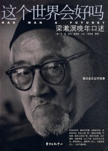
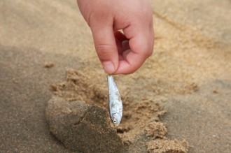

# 这条小鱼在乎——七星说法致北斗五周年

按：

这个世界会好吗？或许我们从来没有明确地回答过这个问题。饭桌上KTV里微醺佯狂屁话连篇的时候，也可能大言不惭地怒吼一句：“不会了！”然而这群在情理社会中处境尴尬的法学生，在喧嚣浮躁的网络言论大潮里，从未放弃过哪怕一小步实在的努力。

尽管几乎是北斗栏目中稿件数量和质量都最高最稳定的频道，“七星说法”却极端低调。低调到什么地步呢？北斗在京的11聚整个栏目只有我一个人参加，并且另一个更为人知的身份是“理事长家属”；北斗五周年上海聚会终于见到了前任责编陈蓉，在互相通报了所在栏目部门之后居然有人说“哦？还有这么个栏目”；甚至“说法”栏目的读者QQ群里也不时会有人说“我是看了七星百科加进来的”；包括我自己，在得知被选入这个栏目的时候也一脸茫然，直到看了栏目下的一篇文章才自觉惭愧：“啊，原来那篇文章就是出自这里！”

那篇文章叫做《愿意换票的人》。起因是一个法学学生出于实践民法原理的初衷，在火车上对“换票”问题讨说法并撰文《拒绝换票的人》而走红，却引发人人网上一片讥讽谩骂；一时间“拒绝XX的人”文体横行（著作权法术语叫“模仿性讽刺”），看客们在戏谑中沉溺不已并且深以为乐，令我烦不胜烦。直到看到那篇《愿意换票的人》，尽管观点不尽相同，却发现世上总算还有人理性并且正常着，跟我一样。

与其在网络言论大潮中浮夸喧闹，不如谈点实际有价值的观点；与其让疾瘤在自媒体的哈哈镜下被过度娱乐，不如尝试分析病理给个药方；与其盲目批判颠覆他人以自证高明，不如充分理解倾听交流。

他们大抵都是这样一群人：脚踏实地默默写稿，甚至日期字数都要求严格，力图在漫天噱头和炒作中挖掘出客观而有价值的东西。不像煽情文那样包含水分，也不像煽动文那样油花飞溅。这些文字干硬得如同骨头，多数看客们嫌之鸡肋，只有极少数人视之进补并大快朵颐。

虽然并非大红大紫，但在北斗网上一干被广为传颂却也被批男默女泪的文章中间，它们一根根挺立着。

有人说法学是目前最难就业的专业之一，有人说法律在这个人情社会根本不顶用，有人说这群抠字眼背法条的GEEK就是欠解构。可是某天一根骨头跟另一根打了个招呼：嘿，原来你也在这里。于是所有那些都不再重要了。

我想大多数志愿加入北斗的人，都是这样走到一起的。

当人类的孤独伴随文明与生俱来，无法消除，只能缓解——有人在一段段恋爱里死去活来，有人在微信陌陌上消磨排遣，也有人选择了志愿加入这个没有任何盈利的事业。

即使外界阻挠和流言蜚语，即使倒贴腰包到天天吃泡面，即使各种心性不合摩擦不断，也难以割舍——有的甚至由爱生恨由粉变黑。这原本和一帮粉丝痴迷五月天没什么太大区别。

直到他们发现，指引大家走到一起的，是这么一个问题：这个世界会好吗？

或许我们从来没有明确地回答过这个问题。饭桌上KTV里微醺佯狂屁话连篇的时候，也可能大言不惭地怒吼一句：“不会了！”然而作为在情理社会中处境尴尬的法学生，在喧嚣浮躁的网络言论大潮里，我们却从未放弃践行每一步努力。

纵使这个世界不会好了，想办法做点让它能好一点的事，总是没有错吧？

纵使法律替代不了人情，让更多的人看到法律如何运作，总是没有错吧？

认真做点事，好好讲道理，真有那么难吗？

其实也挺不容易的。刚刚加进这个栏目的时候，我也没想到每一次写稿都会这样：在多个选题中爆发选择综合症，在网络文体和学术文体中摇摆纠结得直抓头发，欲求不满咬牙切齿地把中外数据库翻个底朝天。想要针砭时事，又不愿停留于介绍法条的表面；希望发掘法理深意，又担心难以被观众理解。没有好的idea时简直烦躁透了，恨不能把自己剁成生鱼片。好友见状每每劝我：不想写就不写啦。但是真要我收手，却又舍不得。

就像那个高中做过无数遍的作文题，男孩在退潮的沙滩上把搁浅的小鱼扔回海里，别人问他谁会在乎这个呢，他一边捡鱼一边说：这条小鱼在乎！还有这一条，这一条……

前面提到那篇文章的作者后来告诉我，当初进组时也没想那么多，直到某次看到跟陈蓉姐一起做的强制引产案被十几家媒体用了，忽然意识到这件小事的价值：原来只要认真做，就有可能影响更多人，这世界就有可能好一点点。

你可以给我们贴个“理想主义者”之类的黑标签，虽然法律已是相当务实的一个行业。不大声嚷嚷口号，仅仅做事似乎就越来越不被世界关心。

你也可以觉得这些文章微不足道，中国法治的进程只与高层们的权谋相关，我们只是些妄图撼动大树的蚂蚁。

然而没有关系。如果你也身处过孤独而干燥的沙滩，周遭粗粝生硬潦倒，恐怕现在你也会跟我们一样，捡起那个被绝望笼罩的自己扔进海里。因为你知道：这条小鱼在乎。

（责编：陈澜鑫）

【北斗五周年】：[我与北斗 ——献礼北斗五周年特稿](/archives/35888)
