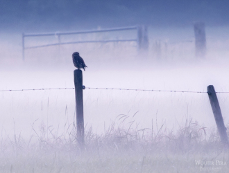

# 迷城

一场来路不明的大雾从清晨起就裹挟了这个城市。

钢筋水泥铸就的庞然建筑被看似稀薄却又浓稠不知所终的迷雾缠绕，太阳的灿烂也只能通过细小的缝隙曲曲折折地零星洒在城市的脚下，又被无数双步履匆匆有着不同目的和方向的鞋子碾碎，昏暗就这样从早到晚迷迷蒙蒙地降临，把这座聚集着成百上千万人的城市寂静的疏离。

回家的末班车摇摇晃晃地自雾里驶来，在等待的眺望中仿佛来自一个不可告人的神秘国度。清晰的刹车声绵长又迟钝的袭来，戛然洞开的车门吞进了稀疏的几粒，庞大的车体从短暂的休眠中苏醒，重又开往不可预知的地点。

司机持续着一百年光景的沉默，留给身后乘客一个冷漠的肥胖的背影。只有车窗旁的模糊风景在昏黄的路灯下如花似锦的变幻，和漫长路程的一起，给蜷缩在大大的皮质座位里享受疲惫的她，提供一个胡思乱想的惬意。

黑蓝的夜空似一张静默的脸，对被它居高临下笼罩得城市欲言又止地暧昧。在雾中若隐若现飞速移动的树木是苦修数十年的忍者高手，一闪而过的高大灯塔是来自异国行动迟缓的巨人，坐在最前排身着黑色风衣的无名男子是风度翩翩的落寞公子，而她则是对落寞一见钟情的神秘吉普赛女郎，有能随心所欲变幻身形的古老部落法术，为了进入他的世界她把自己矫饰成一只娇小玲珑的黑猫，顺理成章得到心上人人不明就里的宠爱。

故事就此一发不可收拾，情节自己缱绻而来。她在白茫茫的迷雾中看着自己对落寞如影随形的爱恋，看着自己为了美梦成真所采取的诡谲手段，看着自己亦人亦猫痛苦徘徊在情感悬崖边缘，正撕心裂肺时，白雾中一只黑猫妖娆扭动着逼近，狰狞地看着她大笑……

梦醒了，梦中的笑声却依然刺耳。恍惚了好久她才发现那笑声来自前排的黑衣男子。梦中的落寞公子目无表情地回头看了她一眼，她才惊觉原来他只是一个面目模糊的陌生人。

梦幻闲淡的薄雾霎时被荒唐的现实脆弱的击散，真实的清晰和寒冷慢慢渗入，她不自在起来，这时，她到站了。 踩在通往家门的楼梯上时，身后传来得男人脚步声让她心慌，她快亦快，她慢亦慢，长长的楼道中两双质地不一的鞋一轻一重一前一后忽快忽慢，像是情人间甜蜜的追逐。

她不敢回头，越走越快最后玩命地碎步快跑，在家门口颤抖着拿出钥匙悉悉索索地开了门。

在关上门的那一刹那，她终于鼓足勇气飞快地扭头瞄了一眼。

只见门前，一只体态优雅的黑猫绅士般端坐，细细的尾巴还得体地在脚上围了一圈。

等待千年那般情深，黑猫含情脉脉地迎着门缝中她惊愕的脸，温柔地唤了一声：

“喵呜”。

“碰”！她用吃奶的劲把故事关在门外。

(采编：有奖信息公布；责编：王卜玄；)
