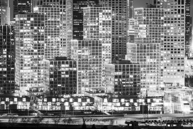

# 适度腐败的逻辑

加里·贝克尔的一篇开创性作品讲得就是社会“最优”犯罪量，也就是在制止犯罪的成本与收益之间求得平衡，使效益最大化。用流行的话说就是“适度犯罪”。这确有道理，但我想没有任何警察局发言人胆敢说我们的宗旨是把犯罪控制在人民可以容忍的范围内，或者声称“必须在宏观上容忍现阶段无法根除犯罪的事实”。况且更为紧要的问题还不在这里：对于中国的腐败犯罪来说，关键不是对治理成本和治理收益进行计算，从而找出能容忍的适度腐败量；而是关心腐败的人亦即相当多数的利益攸关者基本没有投入成本的权利与渠道。

公民持枪尽管因为各种校园枪击案以及街头犯罪而形象不佳，但是枪支普及除了给维持公共秩序带来成本的一面，对于维护治安也有正面作用。严格限制自卫设施的法律会使得犯罪者更加肆无忌惮，美国枪械管制较松的地区并不是犯罪率较高的地区。所以单从预防犯罪角度，可能确实存在一个公民持枪带来社会风险与社会收益之间的权衡问题（什么是“社会”风险，能不能找到这个平衡点，是不是应该政府来找，那是另一系列问题）。

在中国，政府对持枪权利的限制显然有人尽皆知的更深层恐惧，适度容忍的逻辑并不适用。对以民主和政治变革作为治理腐败问题的手段的消极评价，背后也是类似的醉翁之意不在酒。确实，各种规制腐败的社会—政治方法都存在成本，权衡是存在的，比如高薪养廉就是这个权衡的具体体现之一。民主作为监督腐败的方法代价不低，而清廉度和民主之间的相关性历来也存在很大争议，指望单靠民主自身的运作肃清腐败，会让其不堪重负。环球时报显然深谙此道，所以才说民主对治理腐败并非万能药（这可能是对的），并进一步说盲目追求民主不可取。

但这里有一些偷换概念的把戏：首先，对于那些愿意通过民主的一整套体制投入成本去成立社团、监督政府、推动立法的人，体制没有给他们机会，对于可能被民主体制所巩固的技术手段，制度环境也无法提供支持，反腐败的成本被抬的如此之高，本身就需要改进而不是容忍。其次，治理腐败绝不仅仅是追求民主的唯一理由，甚至不是主要理由。在腐败之外，还有更尖锐的问题：庞大的、受到极有限牵制的武断权力。包括民主在内的一整套法治体制，要面对的核心症结其实在此。环球时报和当局对此心知肚明。他们在说的不是民主治理在经济上的无效，或者容忍适度腐败在经济上的效率。正如他们严格限制枪支，并不真的全因为枪支泛滥带来的治安难题。

因此，即便不去讨论在这个体制内反腐败根本上的不可能性，把腐败作为首要的政治顽疾仍然是官方的障眼法，他们说的“宏观理解论”，浅白的说辞荒谬，而隐微的含义更是无耻。西方的所谓法治政府在相当长的时间内按照现代标准看是腐败的，弗朗西斯培根因为贪腐服罪，但一般认为其程度仅仅到了当时惯例的程度而已。腐败是更严重的问题的副现象，而这些问题造成的苦厄，远甚于腐败本身，这在基本无利可分的体制内，表现的尤为明显。

（采编：徐海星；责编：徐海星）
