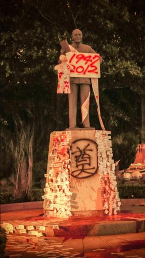

# 道德注意力偏差和言論自由

我看過太多人抱怨大家和大眾媒體把道德八卦（例如日本人打司機[[1]](file:///G:/%E5%8C%97%E6%96%97/%E7%AC%AC%E4%BA%8C%E6%AC%A1/H0205%E9%81%93%E5%BE%B7%E6%B3%A8%E6%84%8F%E5%8A%9B%E5%81%8F%E5%B7%AE%E5%92%8C%E8%A8%80%E8%AB%96%E8%87%AA%E7%94%B1.docx#_ftn1)）放頭版，不把焦點集中在真正重要的議題上。我認為這種現象之普遍和嚴重，使得我們為它命名:**道德注意力偏差**。

道德注意力偏差的人，傾向於忽視後果的嚴重性和時間上的急迫性，改採其它判準來決定自己要把空暇時間用來追哪則新聞，他們喜歡的因素例如：

戲劇性

綜藝醜聞

可愛小動物被虐待

令人髮指的性交

不喜歡的因素則如：

從第一眼看不出誰對誰錯

複雜

就算有事也是很久以後

農民抗爭

道德注意力偏差讓我們把時間和精力花費在討論根本不需要討論（甚至不甘我們屁事）的個案、人肉和譴責根本輪不到我們審判的「壞人」，而輕易放過那些真正需 要人民施加壓力讓政府戰戰兢兢決策的事情。道德注意力偏差的人民，就像罹患某種認知疾病，看書時只見頁碼，沒辦法讀內容。這會造成嚴重後果，特別是當書中 內容事關公平正義的時候。

 圖一、成大零貳社在2012/2/28將校內蔣公銅像潑漆並掛上受難者名條，要求蔣公銅像退出校園。（圖源：蘋果日報）

[成大零貳潑蔣公紅漆](http://tw.nextmedia.com/applenews/article/art_id/34056520/IssueID/20120229)[[2]](file:///G:/%E5%8C%97%E6%96%97/%E7%AC%AC%E4%BA%8C%E6%AC%A1/H0205%E9%81%93%E5%BE%B7%E6%B3%A8%E6%84%8F%E5%8A%9B%E5%81%8F%E5%B7%AE%E5%92%8C%E8%A8%80%E8%AB%96%E8%87%AA%E7%94%B1.docx#_ftn2)，[文化大學袁禎禧為了抗議校方網路言論管制而裸體佔據系辦](http://tw.nextmedia.com/applenews/article/art_id/34080822/IssueID/20120310)[[3]](file:///G:/%E5%8C%97%E6%96%97/%E7%AC%AC%E4%BA%8C%E6%AC%A1/H0205%E9%81%93%E5%BE%B7%E6%B3%A8%E6%84%8F%E5%8A%9B%E5%81%8F%E5%B7%AE%E5%92%8C%E8%A8%80%E8%AB%96%E8%87%AA%E7%94%B1.docx#_ftn3)。

對於這些可怕並令人不舒服的反抗行為，許多人的反應是：「要表達意見當然沒問題，但是為什麼要使用這麼激烈的手段？」這些人恐怕沒想過：若零貳當初只是在 網路上連連署靠靠北，或者幫蔣公戴個嘻哈帽，是否還會引起如此熱烈的關於威權公共施設的討論？又，袁禎禧連在校方網路平台的留言都被刪除，他還有什麼管道可以讓共處校方規則下的人們了解他的立場？寫信給系辦嗎？貼佈告欄嗎？這些人之所以被迫選擇不得體的方式表達意見，最重要的原因就是我們的道德注意力既軟弱又偏差，使得他們若不這樣做，很難讓其他人的眼光落在他們關注的議題上。

當然你可以抱怨說：反正目的是要引起注意力，為什麼這些人偏要挑那些惹人厭的方式，而不是比較可愛討喜的方式？我們身邊有這麼多商業廣告，那一則是因為惹人厭而受到關注的？

我認為Gatsby和Pinky的廣告[[4]](file:///G:/%E5%8C%97%E6%96%97/%E7%AC%AC%E4%BA%8C%E6%AC%A1/H0205%E9%81%93%E5%BE%B7%E6%B3%A8%E6%84%8F%E5%8A%9B%E5%81%8F%E5%B7%AE%E5%92%8C%E8%A8%80%E8%AB%96%E8%87%AA%E7%94%B1.docx#_ftn4)就是因為討人厭獲得關注，我不時有衝動想把那個男的和那些猴子開槍打死。不過，你以為可愛討喜的廣告很好想啊？面對為了生計上街的農民，你認為你有立場指責他們阻礙交通，或者白布條上的字寫得不好看嗎？我認為，在這個資訊爆炸的時代，我們有理由給予那些基於道德理由發聲的人多一點言論自由和多一點容忍，因為只有這樣，他們的聲音才有機會在塞滿我們生活的各項資訊中脫穎而出，引起討論。你不 應該把關於自由或言論管制的抗議訊息和商業廣告用相同標準審判，因為，雖然後者試圖提供給你多樣的生活選擇，而前者則讓你更有機會能真正自由地選擇自己的生活。若我們只給予道德意見和八卦、商業廣告一樣的言論自由，這個社會的道德溝通將會更無效率，政府和權力的擁有者也會更加不受控制。

當然，基於道德理由的發聲比其它言論額外享有多少自由，這是需要討論，並且不可無限上綱的。例如，就算是為了抵抗威權，我們也絕不會允許成大零貳社將某個長得跟蔣公很像的無辜百姓駕到操場上，然後對他潑紅漆。然而，給定現況，如果我們基於零貳和袁禎禧的行動而處罰或打壓他們，則可能導致寒蟬效果，在大眾的道德注意力已經偏差的社會中，對必須的道德討論之形成，造成進一步阻礙。

**＊Blog：哲學哲學雞蛋糕 **

企圖以一般人看得懂的方式談論哲學。

[http://phiphicake.blogspot.tw/2012/03/blog-post_14.html](http://phiphicake.blogspot.tw/2012/03/blog-post_14.html)

* * *

[[1]](file:///G:/%E5%8C%97%E6%96%97/%E7%AC%AC%E4%BA%8C%E6%AC%A1/H0205%E9%81%93%E5%BE%B7%E6%B3%A8%E6%84%8F%E5%8A%9B%E5%81%8F%E5%B7%AE%E5%92%8C%E8%A8%80%E8%AB%96%E8%87%AA%E7%94%B1.docx#_ftnref1) 2012年2月31日，台灣中日混血女藝人Makiyo（川島茉樹代）與其日籍友人友寄隆輝及另兩名女性友人凌晨欲搭計程車返回飯店時，與司機因酒醉加上語言溝通不良產生誤會導致糾紛，友寄隆輝因而毆打計程車司機，Makiyo未能及時勸阻，且被附近店家錄影機錄下對司機叫囂、用高跟鞋踹林姓司機的畫面。此事件導致司機腦膜下腔出血與腦震盪，引起台灣社會震驚憤怒與廣泛討論。據悉友寄隆輝在日本經營多家夜店，此次造訪台灣是為了考察台北各大夜店。事件爆發後被限制出境，最後法院二審判決結果為友寄隆輝判刑1年，緩刑4年；Makiyo判刑10個月，緩刑3年。 

[[2]](file:///G:/%E5%8C%97%E6%96%97/%E7%AC%AC%E4%BA%8C%E6%AC%A1/H0205%E9%81%93%E5%BE%B7%E6%B3%A8%E6%84%8F%E5%8A%9B%E5%81%8F%E5%B7%AE%E5%92%8C%E8%A8%80%E8%AB%96%E8%87%AA%E7%94%B1.docx#_ftnref2) 台灣台南市成功大學學生社團「零貳社」，2012年2月28日清晨將置於成大校園內的蔣介石銅像周遭噴漆、潑灑紅油漆、掛上印有二二八罹難者的紙條，以製作裝置藝術，象徵蔣介石是二二八元兇，盼校方撤掉銅像。 事後校警把裝置藝術撤除，並派人清洗，學生認為校方干預言論自由，但校方表示，學生可透過連署方式表達訴求，但不能毀損公物，將依校規處置，並向學生索賠清洗費用。（內容改寫自2012年2月29日蘋果日報<蔣公銅像 遭潑紅漆>） 

[[3]](file:///G:/%E5%8C%97%E6%96%97/%E7%AC%AC%E4%BA%8C%E6%AC%A1/H0205%E9%81%93%E5%BE%B7%E6%B3%A8%E6%84%8F%E5%8A%9B%E5%81%8F%E5%B7%AE%E5%92%8C%E8%A8%80%E8%AB%96%E8%87%AA%E7%94%B1.docx#_ftnref3) 台灣中國文化大學中國音樂學系四年級學生袁禎禧，因不滿他在系內臉書發表聲援樂生療養院的留言被系方刪除，2012年1月邀4名外校同學在他期末考時演出裸體音樂行動劇， 抗議系上打壓言論自由，並且一行人衝到系辦公室，霸佔系辦呼口號。國樂系認為此舉已脫序，將舉行系務會議，考慮將袁退學。 

[[4]](file:///G:/%E5%8C%97%E6%96%97/%E7%AC%AC%E4%BA%8C%E6%AC%A1/H0205%E9%81%93%E5%BE%B7%E6%B3%A8%E6%84%8F%E5%8A%9B%E5%81%8F%E5%B7%AE%E5%92%8C%E8%A8%80%E8%AB%96%E8%87%AA%E7%94%B1.docx#_ftnref4) Gatsby為一日本髮膠品牌，廣告由木村拓哉出演，連結：[http://v.youku.com/v_show/id_XMTQzNjg0NDQ=.html](http://v.youku.com/v_show/id_XMTQzNjg0NDQ=.html) Pinky為一日本糖果品牌，因朗朗上口的廣告歌旋律為人記憶，廣告內容為兩隻卡通猴子唱著：「Pinky Pinky Pinky三種口味。」 
