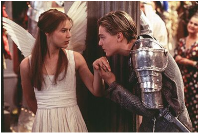

# 還好茱麗葉死了

**「過了這麼久，我終於可以問這個問題了──你愛我，還是愛這個世界？」******

幾天前和一個非常要好的朋友聊天，聊到某個話題時，他忽然說「你看台灣不過蓋個核電哪個不是唉唉叫嚇得半死，一個一個喊著說不要蓋在我家這裡，何況是這個……」

何況是哪個，我實在是忘了他究竟拿反核來比喻哪個話題。在那個當下，我還在心裡想著：他應該一直都看得到我在Facebook上分享的反核訊息，如果他的立場原來是這樣，那麼他平常是怎麼看待我的這些訊息呢？

而我是不是應該為了我所知的核電安全，勇於反駁這個我一直非常非常喜歡的朋友呢？我是不是應該對他說「問題不是要不要蓋在我家這裡，問題是這東西該不該蓋。」？

我正想說話，忽然想到這個朋友的父親在幾年前曾因負責的工作業務成為民進黨炒作的議題，自己也成為輿論攻擊目標，當時可能因為承受壓力過大，引發急病而導致無法逆轉的身體殘障。

他們很有道理討厭民進黨，那麼，討厭民進黨一直「口口聲聲」高舉的反核旗幟，也是可以想見。

想到這裡我不知道該怎麼回應了，而就在他接下去說其他事情的時候，我想起了另一個朋友。

那是一個非常少見的，長得帥又聰明還性格開朗的學長，他非常熱衷於社會議題，從小出身南部卻在北部念書工作，還很愛參加社運，很容易就被身邊的朋友們貼上綠標（呃我的意思不是說他是比較便宜的那個），不過他自己倒是不太在意這種事情，他覺得只要選擇認為對的事情去做，執政黨在野黨甚至共產黨他都隨便啦。

這樣的學長簡直是《女朋友‧男朋友》裡的王心仁，自然極受女生歡迎，不幸的（？）是他對身邊那些活潑伶俐能言善道的革命夥伴們毫無興趣，卻愛上一個與他自己背景完全不同的女孩，女孩纖細輕靈，看起來完全是個溫柔婉約的料子，性格裡唯一執拗的一面只在關係到家人時出現。

這有什麼不好？聽起來超顧家的啊！

問題在於，女孩的父親是核電廠裡的高階主管，她非常難以容忍Facebook上宣稱與她穩定交往的那個人頁面上滿滿的反核論述，更憎恨那些「一天到晚就只想害我爸失業」的混蛋。

她才不在乎什麼見鬼的統計數據，才不在乎公視《我們的島》說了什麼鬼話，才不在乎台灣旁邊的那個島國發生核災後其他國家做了什麼反應，她憤怒的理由讓每個人感同身受並且毫無置喙餘地──「你們不要欺負我爸！」

好，我們回頭看看學長。

身為憤青領袖，他當然小心翼翼地對女友提起過這件事，女孩氣得淚眼汪汪質問他「那你說啊，你說現在有什麼跟核電一樣便宜方便的綠色能源可以用，那就改用那種啊！你們根本就想不出解決方法來，只會一直鬧鬧鬧鬧鬧，說這個危險說那個危險，然後又要政府拼經濟又不給用核能阻礙經濟發展，你們根本是來亂的嘛！」

學長當然不可能在心愛的女友面前拿出他在立法院前面廣播車上拿著大聲公嘶吼的（帥氣）架勢，大義凜然解釋什麼「該提出替代能源方案的應該是學有專精的專 業人士，而不是拿這種理由對反核者放大絕；反核之所以不能等到有了替代能源再做的原因，就在於核能不會和我們約好在替代能源出現前都不失控，螺絲都不要斷；而我們不能拿拼經濟當作不顧核電危險的理由，就像我們不能說自己心情不好就砍人，缺錢就搶銀行。」

「那所以你用什麼委婉的說法跟她討論？」我們一邊分食爆米花一邊問。

「我問她下午想吃蜜糖吐司還是馬卡龍。」

至此我們對王心仁學長的想像完全破滅。

還有一個朋友，伶俐可愛的女孩，經常在Facebook上因為反媒體壟斷、聲援拆除美麗灣、支持關廠勞工等等的分享，被她其他Facebook上的朋友指稱「妳變了」。

認識她也不過這兩三年的事情，我還真不知道她的漂亮臉蛋是哪時去韓國整出來的，所以我問她：「妳以前究竟是什麼樣子啊？是有變多少？」

她告訴我那些憤恨不平的朋友是當年在反貪腐的紅衫軍陣營裡認識的，他們無法理解當年的戰友為什麼現在拿著刀往自己人身上捅。

我恍然大悟，當年我也是紅衫軍的一份子，所以現在同樣成天疾呼反媒體壟斷反違法環評的自己，很可能也在某個時間點去整過形洗過腦了（那怎麼還……）。

再過幾年要是政治局勢又變，相信我們還是會被另外一批綠巨人怒吼「你們變了！」，然後藍色小精靈就會搖搖頭說「就是因為你們當初叛變我們這次才會選輸，不過浪子回頭金不換，我們這次要團結起來好好給他們一個教訓！」

什麼時候這座島的人民能夠用自己的智慧去檢視政府政策與媒體報導，而不再需要依靠色盲眼鏡來分辨是非，那麼就算是從鬼往人邁進一大步了；要不然就算逃出 了這個鬼島去了充滿高加索種金髮碧眼小天使的歐洲大陸，也不過就是隻不在鬼島上的鬼，實在沒有立場嘲諷什麼鬼島不鬼島。

我一直不太願意正面衝撞他人的信仰，一直到去年認識一個很聊得來的基督教徒朋友，很令人不爽地（？）也是個聰明好看神似某一線男星的天之驕子，眼見此人頭腦清楚個性率直，身兼基督徒與我的啤酒好朋友，是個很好的切入點（？），藉著手上有瓶啤酒，我居然就放膽去跟他討論起同志議題，但我們的討論裡永遠隔著一個我們稱之為上帝的存在，他既無法短時間內讓我打從心底相信他的信仰，我也難以讓他的思考迴路裡不考慮神與聖經的指引，最後終於理解到除非我找到寫下聖經的那位好好坐下來分析討論，要不然他永遠不會因為任何立論質疑神說的話，而這個關於同志議題的討論在「神不會錯」的前提下，會永遠處於沒有交集的平行世 界。

這一切無損於他是個重要朋友的事實，我們還是有許多有趣的事情可以聊有許多冒著泡泡的啤酒可以喝，我只是無法不可惜那些因此不能開啟的話題。

我也不得不承認，我的那些同志朋友裡，除了機敏聰明善解人意的，也不乏激進派，碰到什麼事件都可以立刻以「同志歧視」處理，經常讓我感到非常疲倦，並且不由得想到某些動不動喊種族歧視的黑人。我好想抱抱他們，告訴他們我們應當更努力讓世界接受這樣的愛情，但別再為了保護自己而把世界推得更遠。 當我們的價值觀迥異如斯，我們該如何相愛？該如何坦然面對這世界的醜陋，以及拔掉滿身尖刺之後，自己身上的軟弱與不足？

愛錯人永遠是愛情故事裡最艱難的習題。愛錯了一個超對的人，則是不幸中的大幸，萬幸中的大不幸。

我一直無法想像，羅密歐與茱麗葉如果真的私奔了「怎麼辦」。他們的愛情故事不只美在他們死了，還美在他們年輕，他們的愛情因為頭腦單純的關係還容不下其他深刻想法，如果他們對自己家族與家族企業更有責任感，如果他們對於家族的感情夠深刻，如果他們是不同的信仰，而愛情在一個基督徒與一個穆斯林之間綻放……

想不下去了，我的胃開始絞痛──莎士比亞說的沒錯，**你們還是淒美的死一死好了**。

好吧似乎不應該用這麼絕望的句子做結論。

除了帥氣學長、可愛女孩與明星臉酒友以外，我還認識一位從事文史工作的過重輕熟女，肉呼呼的臉蛋裡頭因為裝著對庶民文化的關切，顯得格外可愛而毫無腦滿腸肥的刻板印象，她對文史保存工作認真起來整個人都會發亮，有的朋友說那模樣讓人想起某種圓滾滾會發光的深海水母。

這枚水母剛和她的教師老公離婚，知道的人不多，卻都為他們相當惋惜。他們的例子有點像帥氣學長和輕靈女孩多年後可能會遇到的狀況：擔任教職的老公性格單純，滿腦子學生考卷，老婆關心的那些事情他知道很重要但怎麼想都像是另一個世界發生的，但他們兩人都不在乎各自有各自的熱情與專業。愛情多偉大？偉大到足以讓這樣的一對戀人牽手踏上紅毯。

性格單純的老公來自一個性格單純的家庭，爸爸是公務員媽媽是公務員連姐姐都是公務員，一家子聚在一起想當然耳地藍如深海，這個深海卻沒有水母悠然發光的餘地，他們聲稱自己討厭政客不願討論骯髒的政治鬥爭，實際上是討厭綠色，也不願思考任何反藍色的論述，乾脆地一概當成綠色看待，這座島上太多人從小被教育成藍綠色盲，除了這兩種顏色，連是非黑白都可以看不清楚。

然而因為文史工作，水母為了老樹啊古蹟啊那些夫家覺得「到底淌那渾水對妳有什麼好處」的玩意兒，一再槓上都發局文化局甚至建商，始終不了解她卻也不願束縛她熱情的老公漸漸無法再保護她，當家人指責丈夫「連你都不知道你老婆在做什麼，你結這個婚有什麼意義！」，他們也不再能夠像婚前那樣寬容彼此的不同。

他們離婚以後，有一天，變成前夫的那位老實教師在電話裡閒聊到自己上課的情形。「我跟學生說了妳上次跟我說的那個都更案，班上同學似乎都很有興趣的樣子，報紙跟電視都沒報，所以他們都不知道。」

「我只是想跟妳說，妳不是一個人在做那些事情，如果妳願意跟我分享，讓我了解妳的想法，如果我也認同這個想法，我可以讓我的學生了解更多這些資訊，那就會慢慢擴散出去。」素來腦子裡只有備課改考卷和打成績的前夫在電話那頭說著，不知道這頭的水母已經融化成一灘眼淚。

水母告訴我的時候，我也融化成一灘被灑了鹽巴的鼻涕蟲。

我們曾經以為真愛無敵，不管愛情友情親情，它們應當要超越所有世俗的限制，無視時間距離階級貧富種族性別美醜年齡甚至道德標準或價值觀，可它們並不。

我們也以為真理萬歲，然而當每個人都高舉真理與正義的旗幟，甚至你的摯愛就站在拒馬的另一頭，而你無論如何都無法被「那一邊」的道理說服時，你要拋下大旗爬過拒馬不顧戰友們聲聲呼喚成為新時代的羅密歐與茱麗葉，或者換個他看不見你你看不見他的地方繼續奮鬥，還是乾脆挑個同一邊的人來愛？

**「我和真理，你比較愛誰？」茱麗葉****噘****著嘴問。******

**「當然愛你，因為世上並無真理。」羅密歐微笑著吻了她甜美的唇**。

 原文出處：http://misswhere.blogspot.tw/2013/01/blog-post.html#more Blog簡介－精靈不加糖：精靈的地球觀察筆記本 [http://misswhere.blogspot.tw/](http://misswhere.blogspot.tw/) 

採編：黃馨儀 責編：余澤霖
