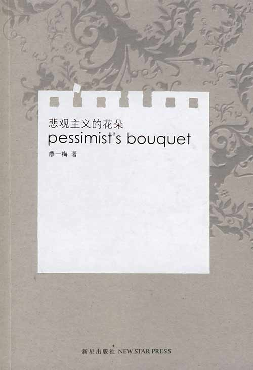
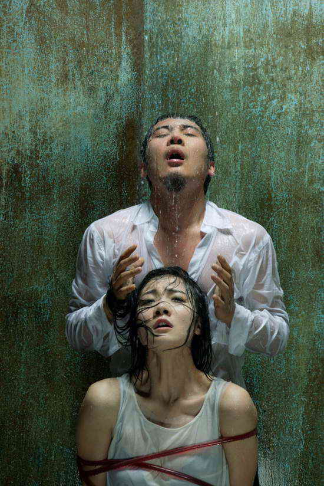

# 那个我爱过的廖一梅已经老了

** **

像每个热衷于自我标榜品位不凡的粉丝一样，我也爱说“在廖一梅还没红的时候我就喜欢她啦”。不过这事是真的，当我还是个初中生的时候，情迷装逼的气质已经在我的身上展露无遗，我常常跑去邮局买《读书》杂志，然后大概是在04年的某期上读到一篇对《悲观主义的花朵》的书评。坦白说，整本杂志里，我感觉自己彻头彻尾看懂了的，就只有那篇文章，于是我记住了这个看起来很文艺女青年的小说名字，也记住了听上去挺俗气的名字，廖一梅。

后来我的高中被困于山区，在没有电脑没有电视的寄宿生活里，最大的娱乐除了早恋就是读闲书。于是不记得是哪一次偶然地发现了新浪读书上有这部小说，用手机断断续续地在课上读完了全篇。我至今依然认为那是廖一梅写得最好的作品，我把喜欢的句子抄在我的课桌上，比如这句：“吸血鬼的爱情有着爱情中一切吸引我的东西，致死的激情，永恒的欲望，征服与被征服，施虐和受虐，与快感相伴相生的忧伤，在痛楚和迷狂中获得的永生……”。其实现在想来，普通读者对一部作品的偏爱可以说是毫无理智可言的，通常让我们爱不释手的书，只是因为里面的某些部分触动了我们所特有的某段感情、记忆与观念，偏爱往往源于读者本身的经历与主观感受，而并非这本书的技巧或者高度。注意，我说的是偏爱，不是喜爱。人们可以喜爱许许多多的书，或者别的事物，但能让他们偏爱的，通常只是那么一两样。而《悲观主义的花朵》是我特别偏爱的一本书。

直到现在这本小说也不甚知名，我常常只好用一种更为公众与庸俗的方式来介绍廖一梅：“廖一梅，对对，《恋爱的犀牛》的编剧，对对，她老公是孟京辉”。到我读大学的时候，廖一梅这个名字对于一众文青来说早已变得并不陌生，要是一个大学的话剧社没排演过《恋爱的犀牛》，你简直都不好意思把它称为一个大学生话剧社。可我对大学生的表演水平一直缺乏信心，左等右等没等到专业的巡演，只好买了本《琥珀+恋爱的犀牛》望梅止渴。作为一个脑子里总是充塞着胡思乱想的人，文字给我的画面感与冲击力甚至要胜过真实的演出。我把那本书翻来翻去翻得封面上都有了一道道指甲的划痕，直到结束了和前前男友的三年半恋情悲伤地跑去背包游时，我还带着它，睡觉时放在枕头底下，像默诵祷词一样反复回想着里面的一句对白，“所有的爱情都是悲哀的，可尽管悲哀，依然是我们知道的最美好的事物”。

后来我终于等到了《恋爱的犀牛》巡演，我拉上前男友去黄花岗剧院看平生的第一出话剧，结果看到一半他睡着了，我在旁边心潮澎湃热泪盈眶。所以虽然我给他写过“你是我温暖的手套，冰冷的啤酒，带着太阳光气息的衬衫，日复一日的梦想”之类的话，最后我们还是分手了。我没法忍受他在这方面的钝感，而像所有自私又自命不凡的人一样，对我来说，“爱情不是永恒的，追逐爱情是永恒的”。

没有看到刘烨和袁泉主演的《琥珀》是我最大的遗憾之一，因为他们两个都长着一副我很喜欢的面孔。既然如此，《柔软》就是不可错过的了。所以虽然票价着实让我心疼了一番，我还是跑去看了在广州的首演。看了以后，虽然我并不喜欢这部剧，但我想还是值回票价的，因为它很有可能再也不会公演了。在我看来，它缺乏一种打动人心的力量，虽然廖一梅反复强调她想在当中探讨的东西更深层，也更微妙。但它就是不如《恋爱的犀牛》，也不如《琥珀》了。

《恋爱的犀牛》是最好的，因为它很直接，没有太多的野心，而廖一梅在99年首演时写下的话也简单干脆：“我希望看过戏的观众，能感到他的生命中有一些东西是值得坚持，可以坚持的。至于爱情的结局不是这个戏里所关心的。”到了《琥珀》，“我心爱的”，“因为你，我害怕死去”，已经开始显得有点感伤泛滥、故作姿态，尽管廖一梅依然让里面的高辕在戏中的大部分时间都保持着登徒子的风度，“我放浪形骸，我骄傲暴躁，我放肆狂欢，那样我就感受不到风雨飘摇软弱迷茫的颓废和阴影；而当我温静娴雅，我消费我合乎道德的享受，我的绝望马上就能毁灭我自己……”可惜，结局滑向了庸俗，因为它是一个幸福的结局。而像赫胥黎说的那样，“现实的幸福看起来往往相当廉价，幸福从来就不伟大”。除了末尾那一段诗一样的对白能够稍稍力挽狂澜——在我知道原来“现在你是我的，现在爱情和痛苦和劳作都应该入睡，黑夜转动它那看不见的轮子，你在我身边纯洁如一只入睡的琥珀”确实是聂鲁达的诗之前。

而《柔软》，说实在话，除了那句“在我们的一生中，遇到爱，遇到性都不稀罕，稀罕的是遇到了解”的宣传词以外，就再没什么让我印象深刻的对白了。也许无论作家或者别的什么家再如何宣称他们关心的是终极问题，普通读者或观众关心的始终是感情问题。《柔软》显然不能满足普通受众的需要。

很多年前，廖一梅就曾经宣称“大众审美是臭狗屎”。不知道她那时有没有设想过，有一天像她这么“小众”的人，也会成为“大众审美”的一部分，正如《恋爱的犀牛》已经被安上“年轻一代的爱情圣经”的名号，而在她的新书的自我简介里，也已经悍然地标榜“无论是她的剧作还是小说……成为文艺青年们的集体记忆”。最讨厌被标签的廖一梅，竟然成了一代“文艺青年”的标签，这实在值得她书写并且自嘲。遗憾的是，她所做的事并非自嘲，而更像是走在了一条迎向大众审美的路上。

我所说的大众审美并不是平常人的素朴的、天然的审美，而是那种被引向政治利益或者商业利益的审美，正如廖一梅自己所定义的那样。比如说我曾经喜欢的一本杂志《城市画报》，如今在我看来就是在贩卖大众审美，或者说，它售出的是一种“文艺青年的大众审美”。

得知廖一梅出了新书的时候，我一度是多么的兴奋，因为我曾一度多么的喜爱她啊。把《像我一样笨拙地生活》买了回来以后，像一个爱得如痴如狂的人收到了心上人的来信一样，我无论如何也不愿意立刻就拆开来看，非要在期待、渴望、幻想当中坐立难安许久，才终于深呼吸一口气，轻轻把它打开。然而一打开，我就后悔我把它打开了。

我之所以如此喜爱廖一梅，是因为她有种品质十分可贵，她讨厌废话，如果不是非说不可，她宁可不说，而我更无比赞同她的那句“在这个废话满天飞的年代，沉默是人类最大的贡献”。所以我实在不明白如今她为什么明明真正想写的只有两千字，却非要把其扩充成为一本十万字的衬着各种照片插图，以及附上过往她写过的精彩句子的一本书。这如果不是一个被出版商诱奸的产物，那么就是她老了。

人老了的重要体现是对自己失去信心，对年轻时所坚持过的各种准则失去信任，并且开始以各种方式证明自己，证明自己还没有老，还有能力。在杨振宁的身上这体现为他找了一个比他小了半个世纪的老婆，在聂鲁达的身上这体现为他为他的最后一个老婆足足写了一百首爱情十四行诗并且结集出版，而在廖一梅的身上这体现为她开始炒自己的冷饭，加入一点这些年来微末的感悟作为调味。

那个我爱过的廖一梅啊，她已经老了，现在她的名字只是文艺青年们口中的一个暗号。

“你知道廖一梅吗？”

“我喜欢《恋爱的犀牛》。”

“我喜欢她的新书里的一句话。”

“哪一句？”

“她说，在世界没变的太坏之前，抓紧时间做爱吧！”

“你家还是我家，七天还是如家？”

 

（采编：徐海星；责编：徐海星）

 
