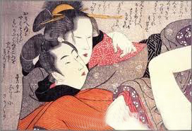
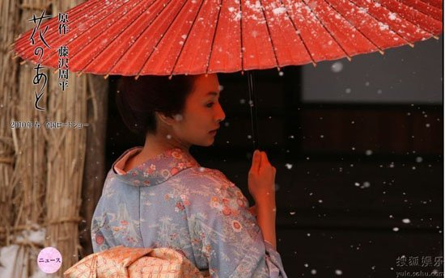

# 那些年，我们一起下载的女孩

**当西方人傲慢无礼地闯进日本澡堂时，日本人不但不慌乱，反而会微笑着走到他们面前，向他们施礼。只有当她们意识到，这些蓝眼睛是有意地看自己的身体时，才会转过身去。年轻点的女子，尽管刚刚发育，却也没有身体羞于示人的观念，调皮地跑到外国人跟前上下打量，仿佛倒是这些燕尾服笔挺的绅士们没穿衣服似的。慢慢地，西方人终于明白：他们来到了伊甸园，在他们面前的少女们，一个个都是“堕落之前的夏娃”。**  

# 那些年，我们一起下载的女孩

## 文/ 李飞（中国政法大学）

 

一两年前，媒体热议中国房地产的时候，喜欢提及这样一个段子：说日本宁可将色情业发展为四大支柱产业之一，也不会将房地产业列在其中。言下之意，听得出对色情业的不齿。不过，真正认真研究一下日本色情业的人，却少之又少——尽管样本多多。事实上，我们只需对“那些年，我们一起下载的女孩”稍作了解，就能意识到这种不齿是毫无根据的，更能体会到一种文明的消逝是怎样的可怕。

那些被打上马赛克的影片，其繁盛之态，说起来，是一种美好文明的残存。

#### （1）

19世纪中期，西方舰队停泊在日本的港口时，恰值江户时代末期。从船上走下来的西方人，如佩里舰队的翻译官威廉姆斯一样，被他们所看到的日本景象惊呆了：“在我见过的诸异教徒国家中，我以为这个国家是最淫乱的…妇人们坦胸露乳，走起路来连大腿部分都可窥见…不管是男人的还是女人的裸体在街头都随处可见，并且他们也完全不顾及面子的问题，一同前往混浴的澡堂洗澡。淫荡的身体姿势、春画、猥亵话，这些作为百姓低级行为和幻想的表现，在这里如家常便饭般常见，甚至多到让人恶心。”史密斯主教在《Ten Weeks in Japan》里代表基督教文化对此表态：“老人、小孩、男人、女子，他们对讲究谦恭、什么是违背道德的东西没有清楚的概念，不知羞耻地混杂在一起洗澡…日本人是世界上最淫乱的人种之一。”

时间不长，西方人发现，这些被他们视为不知廉耻的淫乱的人，个个都是一副坦然的样子，仿佛并不认为赤身裸体有什么不妥。哈里斯记载了他在温泉里泡澡时的场景：当他赤裸着走进温泉时，那里面正泡着一位领着孩子的妇女，“她看上去没有一丝不安，笑着跟我打招呼问好”。爱丽斯•培根也记录了一个画面：刚刚洗完海水澡的日本年轻女子正在沙滩上擦拭身体，迎面走来一位陌生男子，女人丝毫没有慌乱，她尽管赤裸，但仍平静优雅地像男子行礼，微笑，仿佛这是再正常不过的事一样。类似的记载非常多，基本上勾勒出江户时代的日本人赤裸裸的民风：男人、女人，在有必要赤裸身体的时候会很自然地一丝不挂。

与西方人的震惊不同，日本人对此则视而不见。卖命拉车的车夫从只穿着光线站在路边洗澡的貌美女子身边经过时，似乎没有看到她一样地跑过去了，而坐在车上的西方人则无礼地探头探脑。日本人认为，自然地袒露身体并没有什么不妥，“裸露与道德之间没有直接的关系”（梅契尼科夫《回忆中的明治维新》）。只有有意地向别人展示自己的身体才是可耻的。所以，她们会在洗澡、喂奶、做饭、务农、或者天气炎热时很自然地脱光，不觉得有什么。但会对西方女性的服饰大为不屑，认为尽管将身体包住，其裁剪却处处为了凸显身材，是故意将身体展示给别人的表现——这才是真正可耻的。

法国经济史学家费尔南•布罗代尔在他的《15-18世纪的物质文明、经济和资本主义》一书中曾解释过日本人的服饰为何款式恒久，而西方人的服饰则常常随时尚而变，大有道理。我在一本很奇怪的书里也曾读到过作者对日本人为何设计出和服的解释，同样令人信服。总的来说，正如渡边京二《看日本：逝去的面影》所描绘的：江户时代的日本人尽管裸露成风，但并不有意地展示身体——没人会否认“和服不显身材”的观点罢？

当西方人傲慢无礼地闯进日本澡堂时，日本人不但不慌乱，反而会微笑着走到他们面前，向他们施礼。只有当她们意识到，这些蓝眼睛是有意地看自己的身体时，才会转过身去。年轻点的女子，尽管刚刚发育，却也没有身体羞于示人的观念，调皮地跑到外国人跟前上下打量，仿佛倒是这些燕尾服笔挺的绅士们没穿衣服似的。慢慢地，西方人终于明白：他们来到了伊甸园，在他们面前的少女们，一个个都是“堕落之前的夏娃”。日本人彬彬有礼，做事情一丝不苟，女性们贤淑典雅，男子则文明谦恭。以日本人经常裸体为依据就定论日本是“没有羞耻心的国家”，这完全是一个“低劣的诽谤者”、“对一个全然不知的问题妄下的愚蠢、严重的结论”。

显然，西方人基于自己的理念，误解了日本。正当他们逐渐意识到，这个东方岛屿上的人们似乎不仅不淫乱，反而正是真正纯洁的亚当和夏娃时，日本人对待性的态度再次令他们大为不解了——这种态度与其他文化理念的冲突如此之不可调和，以至于我们至今仍不齿于日本的色情业。

西方人看到，江户时代的日本，处处可以看到春画，以及各年龄阶层的欣赏春画的人。而那画中的秽物又被“当做玩具公然在商店里出售。做父亲的会将这些玩具买给女儿，母亲买给儿子，哥哥也会买给妹妹。甚至十岁的孩子就已经知道在欧洲甚至连老贵妇人都不甚清楚的关于性爱方面所有的秘密。”这不仅仅是市井风情，即便在有钱的武士阶层所用的瓷器、漆器、象牙骨扇子上也可以看到种种西方禁画。小孩子也未能置身其外，糕点师傅当着大家的面，将面团揉成“我们只在解剖课上见过的那些东西”，做成粗点心给孩子吃。

与日本人对待裸体的态度一样坦然的是，他们对性行为也不以为然。江户时代的日本人认为男女之间相互吸引是非常天然的事情，性的结合是情爱、家庭义务产生的基础，而不是相反。结为夫妻的理由绝对不会是爱情，爱情甚至不被认为有任何高贵的涵义。而不管有无爱情，不管是否结婚，性总是在自然的情感上萌生出的轻松愉快的事情，是保证男女融洽的明快的东西，实在没有什么好害羞的。鲁尼•本尼迪克特在《菊与刀》中也认为“我们（美国人）在性的享乐方面有很多禁忌，日本人则没有。日本人在这个领域没有什么道德约束，但我们却相反。日本人认为，“性”和其他“人类本性”一样…没有什么罪恶，因而对性的享受没有必要确立伦理道德。”“日本人把属于妻子的范围和属于性爱的享乐划分得清清楚楚，两个范围都是公开和坦率的。”也就是说，家庭中的理想父亲，同时也可以是一个寻花问柳之徒。正如当时的日本杂志中所描述的：“在这个国家，结婚的真正目的就是生儿育女、传宗接代，除此之外，其他任何目的都歪曲了婚姻的真正意义。”不过，需要强调的是，《菊与刀》成书时，已是二战之后，在文化上日本仍然有其独特性，但作为一种文明面貌，江户时代的风景却并不完整了。

回到明治维新前。更进一步的，日本人对待娼妓的态度，即便最钟情日本文化的欧洲人也无法接受了。他们无法理解，日本人为何会对卖淫之事如此的包容，而青楼女子也不觉得做妓女有什么丢脸的，“离开家去妓院时的心情是愉快的，仿佛是去上寄宿学校一样。”献身之后，她们兴奋异常，好像取得了优异的学习成绩，终于对父母有了交代。而她们的父母也持支持态度，时不时跑去照看她们。这种包容体现在全社会的各个分子那里：当女孩子离开妓院之后，基本不会受到歧视，宛若刚刚毕业的学生一样，开始找工作、嫁人；到妓院里消费也是不受阻拦的，多数男子会出去找艺伎或者妓女玩乐，而且这种玩乐也是完全公开的。朋友之间在路上相遇，会相约一道前往。结过婚的男人，也不会为太太所困。相反，日本的妻子还要为晚上出去逍遥的丈夫梳洗打扮，妓院也可以将账单送给妻子，妻子也理所当然地照单付款。事实上，直到今天，日本夫妻相处时仍可看到这种影子。桥田寿贺子女士在《夫妇的格式》一书中，也表示“（丈夫）就算跟别的女人在一起，只要给我一通电话报告回家时间就行，我想得很开”。日本政府对此，也是鼓励大过禁止：不仅体现在保护妓院的种种条例上，也体现在某政府官员家属的故事里——伯尔斯布鲁克来访江户，受到下关町长老伊藤的款待。从烟花巷回来后，町长太太，一位优雅的日本妇人，在餐桌上问伯尔斯布鲁克：“您觉得烟花巷漂亮吗？侍女们都很漂亮吧？”说这话时，还当着町长婆婆和儿子的面。

再进一步的，江户时代的日本人对于同性恋和自淫的包容也是前所未有的。同性恋是日本传统“人情”的一部分，在武士阶层和僧侣中间尤为盛行。而说到自淫，鲁尼•本尼迪克特言简意赅地指明：“没有其他民族像日本一样有那么多的自淫工具。” 好了，这大致可以管窥江户时代日本文明的面貌了。

#### （2）

那么，我们（包括相当一部分当今的日本人）为什么会不齿于日本的色情业，以及这种不齿究竟怎样可怕？

根本上，不同的文明对于羞耻感有不同的认识。有些文明里，赤裸和性爱与羞耻感，或者说与道德，无关。而在有些文明里，这些则是游走在道德边缘的物什。有的时候，我们可以记起这种文明间的差异存在：比如，在看到非洲某些部落或者印第安部落有赤裸习惯时，我们不会联想到淫乱、无耻等，骨子里我们认为这些人与我们有本质不同，甚至在一两百年前我们卑劣地认为他们并非人类。但看到日本人，看到他们受过教育，礼节周全，与我们如此相似，却也赤身裸体，一时间似乎忘记了，这也是一种不同的文明。

在继续下去之前，需要再次强调：日本人虽然裸露身体，但并不代表他们没有羞耻感。事实上，其羞耻感要远远强于欧美人。文化人类学里，可将文化划分为以罪为主的文化和以耻为主的文化。譬如在欧美，人们做出与道德标准不符的事情时，会认为这是一种罪恶，相应地便会跑去向神父忏悔，以减轻罪恶感。而在外蒙羞的话，他们大多会以自嘲或类似的方式化解。但日本人则不然，没有强烈的罪恶感，但蒙羞是万万不可的，是要剖腹自杀的。时至今日，这种文化差异依然存在，但是却有了不同的表现，外化成不同的文明面貌。

只有具体下来，才能深入下去。不妨以基督教文明冲击日本文明为代表罢，尽管以裸露为羞耻的文明众多，但基督教文明毕竟影响最甚。

基督教文化认为人类的羞耻感来自于亚当和夏娃偷吃禁果一事，并且将男人的喉结解释为那尚未来得及咽下的果核，以示铁证如山。此后很多基督教典籍都以此为源，不断衍化出各种故事、派生出条条教义，对基督教国家产生了深远影响。那亚当与夏娃偷吃智慧之果后的第一个反应便是，意识到自己正赤裸着身子，于是迅速地摘下无花果叶子遮住私密处。从此，基督文化便认为赤裸是羞耻的。这或许还可以追溯到更早之前的、发展出基督教的闪族文化，恕不考究了。在这样的起点上，将爱情视为高贵的，就成了一种必然。否则的话，实在无法为性找到一个合理的注脚。而当日本文明因为不将性事与羞耻联系在一起时，爱情也就没有高贵的必要了。

由于这种文明本身是建立在基督文化基础之上的，于是处处有其烙印。甚至于以提倡人性、反对神性为主旨的文艺复兴也未能摆脱——卢梭将羞耻心解释为个人行为与社会制度的不协调所带来的感受，但同时认为社会制度即包括社会文化；在文艺复兴之后兴起的资本主义精神也被马克思•韦伯认为与新教伦理干系甚密。总之，时至今日，《圣经》里开篇所讲的故事，仍对今日基督教世界中人的羞耻感产生着重大的影响——这不是哈佛裸奔所能推翻的了的。 随着“西方世界的兴起”，基督文明开始影响全世界。大航海时代将西方的生活方式、传教士以及洋枪洋炮一并带到了美洲、非洲、亚洲等其他文明的所在地。

第一，西方现代文明的重要部分——现代生活方式——的确对其他文明形成了强烈冲击，使得无论是日本人还是中国人，纷纷效法西方，尽管这其中也有过主张保护自己文明的声音，但被迅速淹没了。中国末代皇帝爱新觉罗•溥仪在《我的前半生》里如是说：“在我眼里，庄士敦的一切都是最好的，甚至连他衣服上的樟脑味也是香的。庄士敦使我相信西洋人是最聪明最文明的人。”——一国皇帝崇尚西方文明如斯（当然，仰慕中华文明的西方君主也不在少数，文明相互冲击的道理是一样的）。

第二，基督教文化本身就是一种传教文化，而如日本（以及中国）的文化，则更偏向于取经文化。基督教里，上帝与人的关系是父子关系，人与人的关系是兄弟姐妹关系，同是上帝的孩子。当西方人看到日本人赤裸着身体时，他们仿佛感到自己的姐妹不知廉耻，顿觉有义务通过传教拯救家人——“祈求上帝让真理的光芒开启这个民族愚昧颓废的心灵吧！（威廉姆斯《佩里日本远征随行记》）”而日本的文化，历来属于取经文化，像处于洼地一样自然地接受外来文化。尽管不能将日本归为佛教国家，但其受中国的影响深远，而中国儒释道三家均有取经文化的特征。儒教自不必说，孔子被誉为夫子，与后人师生相称；佛教也是如此，佛与人本质上是一种师生关系，而且不像西方宗教一样存在天然的鸿沟，佛是过来人，人是未来佛，学生也是可以成为老师的；道家思想在这点上虽不明显，但更本质：天地万物均是人师。可想而知，当传教文化遇见取经文化时，一种文明对另一种文明的冲击该有多么强烈。

第三，韩非子在《五蠹》中说：“上古竞于道德，中世逐于智谋，当今争于气力。”的确，以洋枪洋炮作为代表的气力，也参与了掩埋日本江户时代文明的工作。譬如二战后军进驻日本，看到男女混浴的场景后，认为这有违文明，于是要求日本人限期整改。这是典型的通过“气力”影响文明的案例了。不过，实在不认为男女混浴为何有违文明的日本人倒也可爱：第二天就坚决地改好了，并请美方参观视察。美国人来了后，看到的景致却是，仅仅在浴池中间拉了一条绳子，一边是男，一边是女…当然，这种有点卡哇伊的懵懂丝毫无法延阻江户时代文明的消逝，很快地，日本人就在原子弹的阴影中接受了大部分美国生活方式。

以上述三点原因为主的种种原因，使得基督教文明对日本文明形成了强烈的冲击。这种冲击之甚远超过我们的想象。在日本，江户时代的风貌，明治维新之后，大部分都看不到了，二战后更是全面瓦解。当然，文明被冲垮不代表文化完全毁灭，时至今日，日本仍然有其独特的文化。并且这种文化仍影响着其思维和行为方式，譬如，日本曾有所谓汉学家称中国人是“唯性欲者”，说中国人喜欢吃竹笋，就是因为看了它挺立上翘的姿势而有所联想。但是，作为一种文明，即那个时代的面貌，在日本却永远也不复存在了。残存下来的一些民俗、建筑，零星地点缀在现代生活方式和摩登大厦之间——成为一种文明让位于另一种文明（或者挑明了说是西方现代文明）的写照。

#### （3）

这并非对西方现代文明的控诉。一味反现代文明是不智的，盲目推崇某种“逝去的面影”也有点愚昧了。但是，当我们决定义无反顾地向前走时，稍微思考一下是不是走对了方向，总是应该的吧！

如果一种文明担负起了拯救世界的角色，那么其所有行为必然将精彩纷呈的世界推向无可避免的毁灭。我们可以想象，正如日本江户时代文明的瓦解一样，中国人自己是否也正目送面影逝去。不管走到哪一个城市，我们看到的景致大致是相同的，而且仍在趋同。即便走在拉萨这样保留相对较好的城市，我们也可以看到和北京的商业街一样的北京东路，也能感受到越来越多的人，尤其是年青人，开始按照内地的生活方式（不如说是西方现代文明的生活方式）来安排每一天。再比如，几十年前还鲜活的泰国，十几年前还原汁原味的尼泊尔，如今也慢慢地走向现代了。可以想象一下，如此下去，最后的世界将是什么样子：我们生活在某个城市，和生活在世界上所有的城市一样，再无新鲜东西，甚至到了非洲看到的也是一模一样的高楼林立，毫无二致的车水马龙。当然，这有些极端，情况未必会这么糟，但是，向着无底深渊不断地滑去，不是比触底更令人绝望吗？

还是要再次强调，我们固然不能阻止别人选择其想要的生活，也不能无视现代文明的进步性。但是，躬身自省一下我们正走向的现代文明是否是自己想要的生活，这不过分吧。一直以来，现代文明这个词听起来如此先进、美好，以至于我们不假思索地为之努力、奋斗，毫不心疼地抛弃自己的文明、传统。 当我们走向现代时，我们正走向什么？这个村上春树风格的问题，的确是需要好好想一想的。

美国德克萨斯州的一家名叫诺马式的餐厅里，有一组人做了这样一个试验：一对儿蕾丝带着她们的孩子就餐，演员扮演的服务员有意歧视、羞辱、刁难她们。摄像机密切地观察餐厅中其他食客的反应。试验中，53名食客里有24人挺身而出，为蕾丝们说话，甚至引用马丁路德金的名言“我们会记住的不是敌人说的话，而是朋友的沉默”以示支持——这是一个令人欣慰的试验结果——对于保守而传统的德州而言，已是实属不易。

同样的试验在纽约重演了一遍，结果，以开放而自由为文化标记的大苹果城的一家餐馆里，百人中只有不足十人敢于出声。绝大多数人的态度是：打酱油！

很有意思的对比吧：传统和保守的德州在对待颠覆旧伦理的新事物上表现出比自由而开放的纽约更大的包容，将我们想当然的猜测驳得体无完肤！

一直以来，自由、开放的现代文明都是我们每天披荆斩棘向前走的动力。这两个词是如此地褒义，以至于我们忘记了认真地考虑一下目的地到底是天堂还是地狱。如果我们正走在从德州到纽约的路上，并自诩为一种进步，那么，这个玩笑是不是开得有点过大了？

更加开放和自由的纽约给很多颠覆伦理的事物提供了出生的胎盘，其原因却并不是出于如同母爱般的关怀，而更多地则是被物质集权了的城市文化对此表现出的漠不关心和懒得扼杀。如同性恋这般的新生事物，可以在纽约生出来、活下去，却鲜有被理解和尊重的机会——而这恰恰要到德州这样传统和保守的地方来寻找——只要这些新生事物符合人性且无害于世！

如果德州的传统和保守中包涵了更多的对人性的关怀、对原点的尊重、对新生的申思、对陌路的接纳以及始终以入世的态度面对社会和社会问题，如果纽约的自由和开放更多地体现在冷冰冰的微笑、假惺惺地客套和不胜枚举的社交礼仪中的繁文缛节以及始终打酱油的行为原则，那么，完全有理由得出结论：我们正满脸幸福地服毒！

尽管没有系统科学地实验数据，但是我相信下面的现象及结论仍能被大多数人所认可：当我们走在北京、上海、广州这样的现代化城市里，迎面走向一个陌生人，问路或者求助时，对方下意识的反应更可能是向后躲一下而非向前迎过来。而在边远山区，那里的人是会向着你迎过来的。看到有老人摔倒了，人的下意识反应本应是向前冲一下准备扶起老人家，这在斯密的《道德情操论》里被认为是基本的人性，但身处现代文明中，我们却条件反射式地躲开了。太多太多的城市正思考着，用多少年时间达到上海的发展水平，走向高度现代文明。但是，如果我们付出艰辛努力，达到的是“下意识向后躲”的社会状态，那…

在延安市黄陵县的农村调研时，经常与村子里那些满手老茧、指甲缝里全是泥的农民握手，他们往往两个手都用上，使劲儿地攥，憨憨一笑露出两排棕色的烟牙，讲一口陕北话土得掉渣。后来也曾在所谓现代化的城市里与形形色色的人以完全符合社交礼仪的方式握手，却从未有过如陕北农民那般的亲切感。我们现代了、文明了、进步了，其结果却是再也无法静下下来体会、品读和欣赏陌生人了，甚至是熟悉的人！我们只能看到自己，看到自己的利益，看到自己面前的食物，却再也无法看到隔壁桌上那对受歧视的蕾丝以及她们的故事。而且，也正因为我们不再用心去考虑自己和他人的关系，自己的行为对他人意味着什么，所以我们伤害别人的可能性骤增，于是我们发明了社交礼仪，大家都在礼尚往来的原则下按照程式化的礼仪行事，避免伤害

别人——尊重个体的结果却是：我们与别人的生命已无交集！当占据我们生活的绝大部分空间的东西不再是人而是物的时候，我们终于成为了可悲的现代人！ 太

多时候，刻意追求那些被印上“先进和现代”的标记的东西时——尽管很多时候它们不配拥有如此光环——所收获的往往是退步！二十年前我们挤在狭小、喧嚣地电影院里看电影，看那个年代的电影人真正用心拍出来的电影，如今我们在安静的包间里戴上遮住半张脸的三帝眼镜看电影，看这个年代的电影商看着财务报表拍出来的电影，于是我们怀念天堂电影院，因为我们进步到地狱里去了…

如今正在发生着的，看上去，像极了亚当和夏娃在蛇的诱惑下吃下禁果的翻版。

#### （4）

当年，德国商人鲁道夫从美国舰队那里听说了日本男女混浴的风景，忙不迭地扔下生意跑去看，然后在《葛丽泰号日本通商记》中愤慨道：“像日本一样男人与女人以如此猥亵的方式生活在一起的国家找不出第二个。” 殊不知，仅仅不到两百年，当日本再也看不到全民皆裸的画面时，德国人则开辟了一个公园，效法江户时代，赤身裸体地过起伊甸园里的生活了... 这是不是有点讽刺？！

 

（采编：应宁康；责编：陈锴）

 
