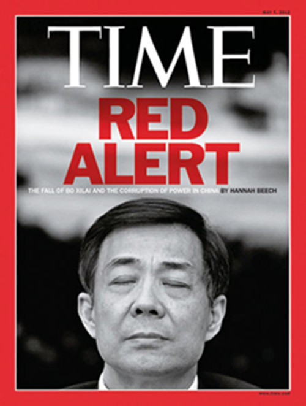
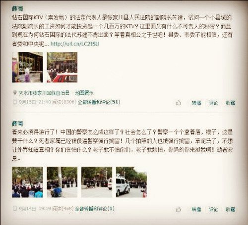
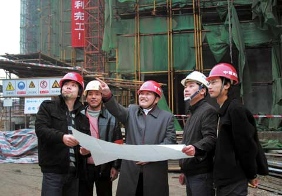
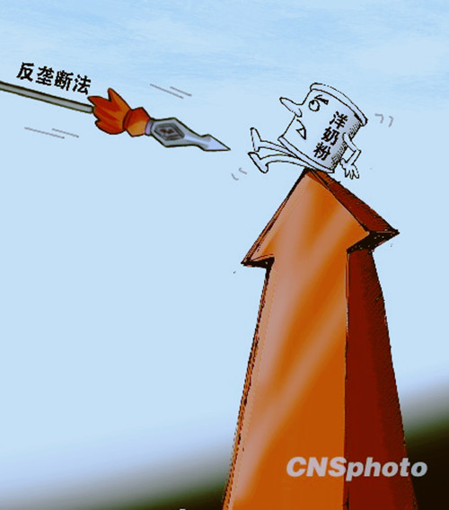
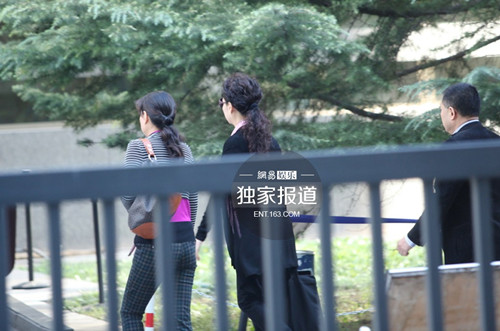
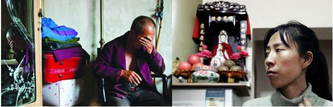
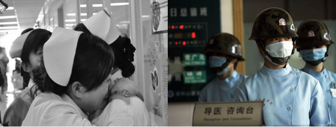
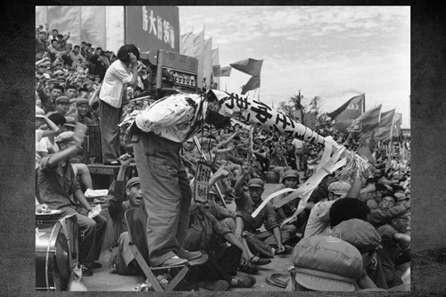

# 那些有关无关的改变·我们的2013（7-12月）

###编者按：

2014年已经过了3月有余，现在再去回顾2013会不会有些太晚？毕竟这个时代就像奔驰在铁轨上的列车一样，始终处在提速的状态，我们还没来得及回望，欲望，或美其名曰理想却将我们裹挟在时间的浪潮中，开始推进。与此相伴的是对于新闻遗忘的加速，袁厉害、张家叔侄、南京饿死女童、张家川、曾成杰、夏俊峰……这些在2013年曾被我们密切关注的人名或是地名现在提来却总是多了几分陌生感。

如果将这个国家比喻为一个人，在过去的几十年则是其野蛮生长的时期，2013年同样。可是那些渗透在社会的肌理中的“细胞”的变化却并非像外在形象的改变一样迅速。2013在日历上虽然被翻过去了，但2013真的消失了吗？

在我们看来，其实2013揭的幕才刚刚敞开，2013很多事件直到如今才开始慢慢发酵。2013是末日后元年，我们现在权且算是“后2013”时代。

我们的编辑精心梳理了2013年发生的一些重大新闻事件，并对这些事件中的问题做了一简单评析。可能当你随着这篇文章回望时，会发现很多当时给你很大震撼和触动的事情，现在却已遗忘了。不只是你，也许当时在社交网络上为这些事吵得昏天黑地的“公知”、看客们也早已将其抛进过去的时间轴。只有当今年类似的事情再发生时，有心人才会感叹，原来这些呼吁改变的事件真正得到改变的却是少有。既然如此，为什么我们在一开始就放过它们呢?

在我们以往的历史教育中， “铭记”是常被提到的词语。但铭记不仅仅是为了记忆，更是为了改变。

**薄熙来案庭审微博直播 开启公审新实践**

2013年8月22日，备受关注的薄熙来案一审开庭。一连五日，山东省济南市中级法院在其新浪官方微博@济南中院 直播了薄熙来案的庭审记录。一个月后，薄熙来一审被判处无期徒刑；随后薄提出上诉，山东高院予以受理；10月25日，薄熙来案二审宣判，维持无期徒刑。

大幕终于落下,看客各有唏嘘。

薄熙来是近33年来中国公开受审的第三位中共中央政治局委员，他因在重庆主政时期开展“唱红打黑”活动而红极一时，再加上“红二代”的背景，薄曾被视为最热门的政治局常委候选人。判决书上赫然列出贪污、受贿和滥用职权三大罪状，但却绕开了他在重庆期间对于法治、人权的践踏，内行们心有不甘；与此同时，外行们倒是过足了戏瘾，难怪有人戏谑道：“一切都是因为爱情！”

内行觉得不甘也好，外行觉得过瘾也罢，微博直播庭审的做法倒是赢得了舆论一片喝彩。公众原本以为薄熙来案庭审不过是“装装样子”“走个过场”，但@济南中院 从首日起就连发十条来自庭审现场的长微博，表现出史无前例的公开透明。人们看到，在一个公开的法庭上，公诉人使用追诉机关收集的大量证据指控犯罪，被告人充分进行辩解并阐明自己的观点，关键证人出庭接受控辩双方以及审判长的轮番询问，控辩双方针锋相对，激烈对抗。

比起1998年陈希同案的不公开审理，2008年陈良宇案的新闻联播式公开审理，相关法律界人士称薄熙来案庭审为“具有里程碑式意义的庭审”。无论公众是否猜中了结局，至少能从这场法治公开课的过程中获益匪浅。
我们在肯定庭审过程中体现出的法律的公开性和公正性的同时，也应反思，对被告人进行公开审理和公开宣判，本是法治的应有之义（我国《宪法》第125条和《刑事诉讼法》第11条和152条都规定，除了涉及国家秘密、个人隐私以及未成年人犯罪的案件，人民法院审判第一审案件都应当公开进行）。然而，从纸上的规定到庭上的实践，我们为何要走数十年？其背后的历史、法制因素又有哪些？与此同时，十八届三中全会提出的“推进审判公开、检务公开”也让我们心怀期待，我们期待着公开审理与宣判的实践成为常态，更期待着公开公正的成为每个人心中的常识。

 
图片来源：《时代》杂志

**“转发500次”第一案:甘肃初中生涉嫌造谣被刑拘**

9月17日，甘肃省张家川回族自治县初三学生杨某被警方以涉嫌寻衅滋事罪刑拘，杨某曾发微博质疑该县一名男子非正常死亡案件有内情。第二天，该县发布官方消息称，命案死者确系高坠致颅脑损伤死亡，已对该案中利用网络平台虚构事实，扰乱公共秩序的违法人员给予治安处罚(其中行政拘留1人，罚款5人)，对情节严重，发帖转载500次以上的1名犯罪嫌疑人依法刑事拘留。

这一报道迅速成为微博热点，并且数日来经久不息。究其原因，一来这是“两高”出台关于办理网络诽谤等刑事案件的司法解释出台以来，因为“转发超过500次”而刑事拘留造谣者的第一案；自这一解释出台以来，公众对其的讨论和质疑就不绝于耳，这一事件也为该司法解释提供了一个直观的观察窗口。二来这一事件之前，网络言论空间经历了一段肃杀的严冬期，薛蛮子，王功权以及花总的系列风波让人们感慨打击网络谣言行动似乎有扩大化的趋势，这些知识分子要为少年讨公道，也是要为压抑已久的情绪寻找宣泄出口。三来这次的主角是位16岁的少年，一时间他被赋予各种期许，各种象征，但是所谓的“V字少年”不过是年少轻狂，他不该被刑拘，也无需被捧杀。

事件继续发酵，迫于网路舆论和传统媒体的压力，23日发帖少年获释。剧情还有买一送一的大礼包，第二天，张家川公安局长因行贿被免职。这一进一出，自然值得庆贺。庆贺之后，我们也要感慨一下，网络舆论的力量不容小觑，但也不该被神圣化。它不是洪水猛兽，也不是正义的号角，它只是网络民意的一种表达。

对于政府部门而言，如何正确应对网络舆论已经不再是一个陌生的话题，但如何将大而空的理论运用到实践中，似乎还有很长一段路要走。

对于个人而言，他可能受益于网络舆论，但也可能受困于网络舆论，重要的还是自由思考、独立行事，这难道不正是人们争取言论自由的意义所在吗？

 
看到张家川初中生发布的微博内容，似乎对这场官方与民间在舆论发声上的博弈多了一分理解。

**湘西非法集资案主犯曾成杰被执行死刑  法院未通知家属引争议**

7月12日，长沙市中级人民法院对湘西非法集资案主犯曾成杰执行死刑，其女儿在微博称，执行死刑当天没有接到通知，没有见到父亲最后一面。对此，长沙中院先后发3条微博回应，称罪犯曾成杰在死前并未提出会见亲属的要求。最后，法院与曾成杰女儿微博上互相道歉。

曾成杰案的审理，一直存在争议，但最初主要局限于当事人和法学界内部，死刑核准并执行后，演变成社会舆论事件。一方面，公众关注民间金融市场管理的规范问题，另一方面，社会更强烈地呼吁程序正义，判决公正。

首先，曾成杰的民营企业家身份引发寒蝉效应，引发舆论对企业家正当财产权利乃至人身权利保护的担忧。近年来，民营企业家屡屡卷入高利贷风波，孙大午案，温州立人案，吴英案......“集资诈骗罪”似乎成为民营企业家的牢狱陷阱。只看有没有造成损失，是当前集资类犯罪定性出现问题的关键所在，这使民营企业家很容易便陷入牢狱之灾。

再者，就曾案而言，地方政府对于集资给予近十年的默许和支持，党政干部甚至参与到民间融资中。然而当金融风暴来袭，集资一夜从“合法”变非法，公务员已提前撤离，底层集资者感到恐慌，群体事件难免爆发。地方政府的行为又该为湘西集资案担几分责任呢？

最触发社会舆论的，莫过于终极关怀的问题。法院究竟有没有责任通知死刑犯家属？2013年1月1日开始施行的《最高人民法院关于适用〈中华人民共和国刑事诉讼法〉的解释》（以下简称“解释”），其第423条规定：“第一审人民法院在执行死刑前，应当告知罪犯有权会见其近亲属。罪犯申请会见并提供具体联系方式的，人民法院应当通知其近亲属。罪犯近亲属申请会见的，人民法院应当准许，并及时安排会见。”

执行死刑未通知家属，引发国人对一个死刑犯的同情。怎样对待一个死刑犯，体现一个国家的司法文明程度，也体现一个国家对于人权的尊重程度。如人民日报官微所言，“每一次裁决，都可能成为司法进步的台阶，也可能让公平正义远离，司法机关当有直面问题的勇气。”

 
几年前还在工地上“指点江山”的曾成杰也许没有想到他在2013年竟成为了中国法制悲剧的注脚之一。（图片来源:中国经营报）

**发改委开出反垄断最大罚单，6家乳企罚6.7亿**

2013年8月7日，国家发改委宣布，6家乳粉企业因违反《中华人民共和国反垄断法》，限制竞争行为共被罚约6.7亿元，成为我国反垄断史上开出的最大罚单。

市场经济的灵魂在于竞争，垄断则是竞争的死敌，反垄断法因此被喻为“经济宪法”。中国施行反垄断法已有五年，但国人对这部存在感极低的法律一直非常陌生。直到2013年，一声不响的反垄断法猛然发威，这一年中发改委开出的反垄断罚单比过去五年的总和都要多。而且，最重的一拳直击中国人尤其关心的乳业。

反垄断法频频发力，究竟有何背景？相关部门负责人称，查处和公布某些领域的垄断案件是因为这些领域存在价格垄断行为，这源于举报人的举报，并没有特殊的背景。

不过外界并不这么认为，一边是发改委的密集执法，一边是坊间的争议传闻。反垄断案件处理的特性，为主管机构留下很大的自由裁量空间。在美国、欧盟等地，执法案例例行公开，而在中国信息并不透明，这些自由裁量权是如何被使用的，外界无从得知。尤其奶粉案爆发后，因调查企业多为外国品牌，发改委被质疑针对外企处罚以此来保护本土产业。

人们还有一问：乳业为何中枪？

一方面，民以食为天。食品安全问题一直是国人关注的焦点。自2008年的三鹿奶粉案以来，国产奶粉乃至整个乳业都深陷各种负面报道中，国人对自家的乳业的信任度陷入冰点。父母们相信，只有进口奶粉才是放心奶粉，于是进口奶粉的价格随着国人购买进口奶粉的热情一路高涨。这也难怪，奶粉有价，放心无价。

另一方面，巧合的是，发改委发动反垄断调查的领域，多与本届政府公开强调的领域不谋而合。国务院曾在2013年5月底召开常务会议，讨论加强婴幼儿奶粉质量安全问题。8月初，发改委反垄断局宣布了对合生元等六家奶粉企业高达6.7亿金额的罚单。

在发改委启动反垄断调查之后，各奶企纷纷宣布降价，这应该算是反垄断调查带给消费者最大的好处。不过，平价诚然好，放心尤可贵。无论是执法部门打击垄断行为，还是企业生产销售产品，我们都期待两个字：透明。唯有透明，才能放心。

 
图片来源：谷歌搜索

**全民围观李某某案**

2013年，谁人不识李某某？李某某等五人涉嫌强奸案定于9月26日上午公开宣判。被告人李某某犯强奸罪，判处有期徒刑十年，此后二审维持原判。数月以来，案件先因被告人“特殊家庭背景”而被持续曝光，后因被害人“特殊职业身份”争论升级，这个涉及未成年人的性侵害案件，几乎每天都在给报纸和网站的“娱乐”版面贡献话题，始终处于全民围观之中。

李某某案本身只是一起涉及未成年人的强奸案，但媒体和公众对其关注度不亚于任何一起贪官大案。它的突出特点并不在于案件本身，而在于相关参与人员，企图通过舆论造势，影响社会热点案件的司法审判。有人直言，此案成了全民“连续剧”，媒体、律师，包括司法机关，编剧、参演，样样不落。

我们相信，社会舆论对于此案的关注源于一份同情弱者、期待真相的朴素正义，然而这一案件中，庭外的舆论战高潮迭起，公众热情极度高涨，过度地使用了同情、愤慨的情绪资源，想当然地发表言论，以观众的角色扮演着演员，最终发展成了一场闹剧。

在这场闹剧中，媒体也扮演了不光彩的角色。未成年人保护、个人隐私保护，在强大的“知情权”和“公共利益”的口号下，法律写得再明白也显得苍白无力。越是此时，我们越需要法律的公平正义；越是嘈杂，司法机关越要保持清醒，独立作出公正裁判。

闹剧之后，我们不禁反思，为什么会出现全民围观？

在我国的现实背景下，面对强大的公权力，我们大多数人都是弱者，公众内心因此缺乏了安全感，感受到一种深深的焦虑。这部“戏”折射的，恰恰是当今社会普遍的矛盾：富人和穷人，权贵和平民，公权力和私权利……说到底，这不是闹剧，而是社会公信力缺失的悲剧。

 
也许对于各媒体来讲，图片并不重要，图片上的文字才最重要。（图片来源：网易娱乐）

**夏俊峰们**

2013年9月25日，夏俊峰被执行死刑。悬了四年的刀还是落了下来。一时间，满屏夏俊峰。

2009年5月16日，在一场众所周知的城管与小贩的冲突中，一名小贩被送入监狱，他叫夏俊峰，而两名城管死亡，他们叫申凯和张旭东。你大概不认识他们，但是没关系。09年的那场冲突已经演变成了一个符号，被赋予了无数意义。而这两名城管，不过是夏俊峰的另一种表现形式罢了。

撇开城管和小贩的身份，他们都是小人物，在自己的柴米油盐里忙碌，做着关于幸福的梦。然而，贴上身份之后，他们被硬生生地割裂了。一方得到了权威，剑鞘里藏着锋利的刃，只看持剑者是否拔出；一方则成为了“无证经营”，随时随地准备逃跑以及捍卫。然而，对于一个人来讲，没有身份时拥有的那些东西更加难能可贵。为了保护这些所拥有的，攸关之际，谁都可以豁出命去。于是，夏俊峰杀人了。

申凯张旭东做出与性格不符的行为是因为他们被自己身份蒙蔽，成了奉命干脏活的人；而夏俊峰的确冲破了身份的桎梏，却因为过激的行为，从凡人夏俊峰变成了犯人夏俊峰。

无论你是否承认，我们实际上都是赤裸的凡人。不是因为我们被权威握在掌心，不是因为我们没有冷硬的拳头，不是因为我们无法用金钱筑命，而是因为我们都有比生命更重要的东西。于夏俊峰而言，便是他赖以供孩子学画的家当。于你而言，也一定存在，你需要冲破身份的藩篱去看。死者已矣，生者应知。

 
夏俊峰们死后，家人的悲哀（原图源自凤凰网）

**医生.医殇**

2013年10月25日星期五，8时27分左右，浙江省温岭市第一人民医院三名医生遭遇医疗暴力事件，其中耳鼻咽喉科主任王云杰不幸丧生。

这场医患矛盾演变的悲剧，引爆了医疗卫生界长期压抑的情绪。10月28日，数百名身穿白大褂、面带口罩的各地医生、护士聚集在温岭一院，呼吁关注医护人员的人身安全问题。在江苏、北京、长沙等各个地方，众多医疗工作者通过不同的方法，表达了他们的哀悼与声援。

不知道从什么时候开始，人们眼中的白衣天使的心变黑了。找来找去，这一切似乎都因为那些不安分且热衷于曝光的记者，于是媒体成了怒火的另一个靶子。

无论是医生被患者冷漠对待，还是媒体被公众指责，都触及到了职业群体的底线。于是两个靶子在团体内部抱团，互相攻击，痛点都在“道德”、“良心”、甚至是“灵魂”上。然而，在微博上是无法产生真正的辩论的。医生们自怜，记者们自艾，其他的攻击者自顾自的愤怒，三方都给自己戴上了悲剧英雄的帽子。于是，相同的情绪不断片面叠加，而无法产生真正的解决方法。

如今，医生依旧压力大,正常收入低，记者常常陷入想说不能说的尴尬，医患关系还是很紧张，媒体曝光还是毁誉参半，而自媒体在其中发挥的作用越来越大。新时代来了，不是么？每个时代的发展都伴随着一大堆问题。人是医生，该去给这个时代好好治病。否则，医患关系只会更加紧张。

 
白衣天使，不爱红妆，反爱武装（原图源自观察者网）

**扶不扶？**

2013年12月2日上午10时30分许，在北京朝阳区香河园路与左家庄东街路口，一名东北口音女子与骑摩托车的外籍男子发生碰撞，东北大妈倒地，一个国际化的“to 扶 or not to 扶”问题由此展开。

上午，媒体先是报道东北大妈讹诈外籍男子，网民们对大妈群起攻之，说“丢人都丢到国外去了”之类的话。到了当天下午，又报道是外籍男子撞倒大妈后不但不认错，反而对她粗口谩骂，为大妈澄清。网民们迅速把大妈上午接收到的淹到脖子根的口水瞬间转移到外国人身上去了。

放在一两年前，这样一条关于小摩擦的网络新闻是无法入权威媒体眼的。但是，这次的媒体和围观者像打了鸡血一样，几乎要脱口而出：扶不扶终于成为国际问题啦。再深层一些，人们便开始慨叹：老人变坏。直到下午的真实情况被披露。

光想你也能感受到这件事的荒谬。同一组照片，不同的叙述，就可以让网民们迅速倒戈，化敌为友。但是也要佩服中国媒体自我修复的能力，他们几乎没有迟疑地大旗一挥，调转马头，一方面扮演侦探，对上午新闻的疑点大加分析，一方面又进行了充分的批评与自我批评，并将之上升到国民的刻板印象，甚至还空出时间来安抚老人们的情绪和对洋人嗤之以鼻。

然而，这件事着实让人们心有余悸了--我们什么时候成了一群这样的人？把摔倒的大妈跟骗子划等号，大言不惭地说这“老人变坏”这样不负责任的话，甚至不经查证也不顾他人隐私，便开始发所谓“新闻”？当然，对外国人的盲目信任是很久前便出现的了。

现在不是批判国民劣根性，不是反省刻板印象，也不是继续纠结扶还是不扶的时候，我们必须首先解决自己内心的依托。单一标准下的追求拖着我们走了太远，走得太快，使身体和灵魂分离，因而产生孤独，而孤独又促生了怀疑。

中国人很少有宗教信仰，但是中国人是应该有信仰的。往日我们学习诸子百家，笃信礼义廉耻，熟背“老吾老以及人之老”这样的句子。而今，我们也该慢慢找到一个存放心的方式。毕竟，手机录像不是解决问题的最终方法。

 
当你老了，炉火在家里熊熊地烧着，你却摔倒在家门，无人扶起。（原图源自新浪网）

**陈小鲁：道歉**

2013年10月7日，在北京市八中对面的举办的“老三届”同学会上，陈小鲁代表部分同学正式向当年批斗过的老师道歉。此消息一经传出，因陈小鲁“陈毅之子”、“红二代”的身份，并涉及“文革”“道歉”等敏感字眼，很快得到公众关注，一时间，采访陈小鲁的媒体纷至沓来……

关于”文革道歉“的新闻在2013年并不少见：6月，前济南市文化局文物处处长刘伯勤登报向自己当红卫兵期间伤害的人道歉。随后，河北宋继超、安徽张红兵、湖南温庆福、山东卢嘉善、福建雷英郎等人皆以不同形式反省并向受害者道歉。直到2014年初，另一名”红二代”，开国上将宋任穷之女、北师大女附中“文革”红卫兵领导人之一宋彬彬的道歉把相关事件又推入新的高潮。

陈小鲁坦陈自己道歉的原因来自于自己四十多年来的困扰与愧疚，他将“文革”出现的原因归结于法律权威的缺失、领导人社会扁平化社会理想、民众自主意识缺失、人性中深藏的暴戾之气等原因。而在相关采访中，陈小鲁不断地强调法律权威与宪法的尊严。他自己甚至在道歉的前一晚读了一遍《五四宪法》……

陈小鲁曾用“头羊效应”来解释群众运动，“羊群中，头羊起着导向作用。头羊一走，大家就跟着走。“‘文革’中，极左的人就是头羊，它诉诸武斗，打砸抢烧，其他的人都会恐惧，于是没有人敢说真话，大家都随波逐流。”他认为为“文革”道歉，则不存在“头羊效应”了，更没有想过要振臂一呼，八方响应，他只是做了自己想做的。

而作为观者，我们正好借此机会开始对历史进行追溯与反思。毕竟，如果没有正本清源的历史，我们便没有资格去期许“大同“的未来。

 
文革批斗大会场面（图片来源：谷歌搜索）

**信访：改革之后怎么办**

2013年11月15日，鹤壁进京上访者巩进军在被押送回原籍的高速路上，刺死刺伤截访者各一名。随后，巩进军被警方抓捕拘留。这次信访事件也成为了十八届三中全会进行信访改革后第一个被媒体显著报道的事件，而这一事件出现原因则来自于我国独特的信访制度。

信访制度发源于1951年6月政务院颁布的《关于处理人民来信和接见人民工作的决定》，20世纪90年代，国家又对信访制度做了两次改革，并颁布了《信访条例》，使其成为我国第一部信访行政法规。

但信访的制度产生来源于我国法治不健全的状况，因此，信访制度始终作为“法外之地”而存在，其产生的弊端也并不少。例如信访制度中各级政府权利划分多存在权限模糊的问题，而基层信访则存在官僚主义严重等问题，即使地方信访局有心，但因访民上访问题多涉及其他政府部门，而信访制度中则缺乏多个政府部门配合解决上访问题的明确规定与措施，“非法上访”成为绝大多数的选择。据统计：“仅从2003年7月1日至8月20日不到两个月的时间里，到北京市委门前上访的人数就达1.9万人；到中纪委门前上访的人员达1万多人次，平均每天100多人，最多的一天达到152人。”据记者了解，在2003年至2013年十年中，这份数字始终保持上涨趋势，但因统计难度大，目前越级上访的人数尚不明晰。

为解决这一问题，2005年又新增对于地方政府越级上访进行信访排名的制度。一时间，地方政府压力骤增，常出现一人上访，多名地方政府人员陪同劝会的场面。而地方政府人员对于访民劝回多依靠“给钱”与雇佣“黑保安”非法拘留、判处劳教等多种方式。对于已经在国家信访局“挂号”成功的访民，地方政府则要“花钱销号”，此行为经多年实践后成为了一项潜规则。顿时，“法外之地”乱象丛生。

而以上这些问题仅是信访制度弊端的冰山一角，其存在的问题因篇幅所限无法一一具言。

2013年11月九日十八届三中全会做出了“改革信访工作制度，实行网上受理信访制度，健全及时就地解决群众合理诉求机制。把涉法涉诉信访纳入法治轨道解决，建立涉法涉诉信访依法终结制度”的决定，并在月末将信访排名制度取消。但信访领域作为“法外之地”，并无法完全纳入国家行政、法制管理的正常渠道，例如，直到2014年2月，据记者了解，河南西北部某地级市仍保存信访排名制度，其他地方政府是否保留并没有明确数字说明。而信访制度这一庞大机器经半个世纪之久的实践，早已渗入政府行政管理的肌理之中，且根据我国目前法制仍不完善的现状，信访制度仍有其存在的必要性，其改革目标与方向仍难以明晰。

 
立在田间地头的标语与在国家信访局门口排队的上访者

《信访条例》对于上访级别的规定为“属地管理、分级负责,谁主管、谁负责”，对于“非法上访”的界定并不明晰，在地方信访部门处理过程中，一般都将“越级上访”定义为非法。近日，国务院办公厅出台《关于创新群众工作方法解决信访突出问题的意见》，其中规定“进一步强化属地责任,积极引导群众以理性合法方式逐级表达诉求,不支持、不受理越级上访。”

（感谢项栋梁、刘一舟对此文的贡献）

（欲看本专题其他稿件，请点击文章题目下的“2013年度新闻事件”按钮，与我们共同回望我们的2013。）

（撰稿：万晓华 胡璇艺 李卓  编辑：李卓  责编：李卓）