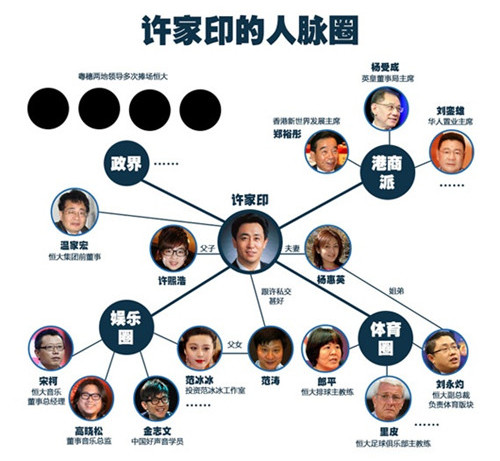
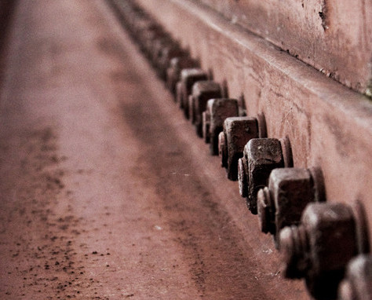
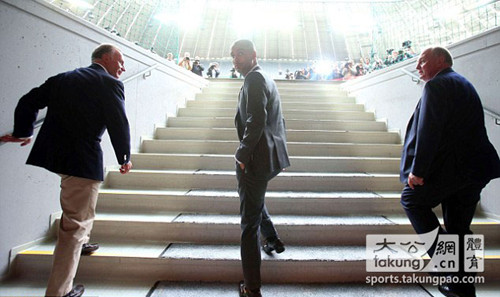
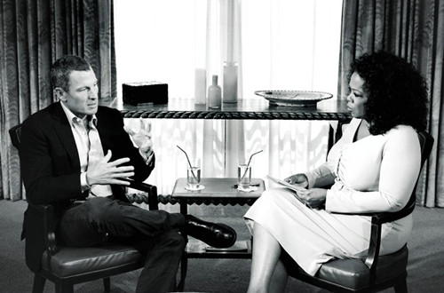

# 那些有关无关的改变•我们的2013（体育）

###编者按：

有人说2013年是世界体坛的小年，因为这一年夹在2012年伦敦奥运会和2014年巴西足球世界杯之间。

然而2013年的体坛却很有可能比2012年和2014年更具有影响力，在世界级大赛和聚光灯不那么耀眼的2013年，一些星星点点的事件和人物正在深刻地影响着世界和中国体育的面貌。

每一年的体坛都会诞生无数冠军，都会举办无数的大赛，这些都可以称作新闻和大事，但它们未必如一些不太起眼的小事一般具有影响力。炒冷饭一般的盘点只是敷衍了事，从遴选的体坛新闻中找寻体育行走、发展的轨迹才更加具有价值。

###广州恒大：没钱不要想玩好足球

2013年的中国体坛，广州恒大是最耀眼的名字。农历大年三十的下午，中央电视台体育频道播放了广州恒大亚冠决赛夺冠比赛的录像：这支球队在那个夜晚创造的历史搭配春节喜庆欢聚的气氛再合适不过，而绝大多数情况下，足球对于这一天的中国人来说只是春晚联欢上一个个酸涩的梗。

恒大集团在2010年买下广州队，三年后完成中甲、中超到亚冠的惊人飞跃，无论如何解读，都离不开一个“钱”字。许家印用支票簿为“中超华南虎”请来最顶级的教练、超水准的外援和最优秀的本土球员，也换来了“东方阿布”的调侃。

调侃与嘲讽无法否定广州恒大在赛场外为许家印和他的恒大集团带来的成功：昔日两会期间记者镜头里的 “腰带哥”，摇身一变成为具有社会责任心的“民族企业家”，广州恒大为许个人乃至整个恒大集团都立好了企业形象、挣够了政治资本。

然而恒大的辉煌无法掩盖中国足球势力衰微的现实，2013年的中国足球留给我们的记忆还有惨败泰国、逼退卡马乔的闹剧。卡马乔、中国足协和万达集团之间错综复杂的关系没有呈现于合同中，它们写在卡马乔、韦迪和王健林的脑袋里、嘴巴上。

2011年，王健林的万达集团和中国足协达成战略合作关系，这位曾被中甲深深伤害的企业家在当时也被一些媒体冠上“东方阿布”的帽子，王在接受采访时说：“我觉得这是一种侮辱，我和阿布根本不是一个层次。他是个暴发户，靠切割国有资产发家，我则是在市场里竞争得到的财富。”

想要重组中国足球的新任中国首富王健林瞧不起阿布，但阿布拉莫维奇“玩”足球的哲学恰恰没有脱离王口中的“市场”，许家印也是如此。在中国特殊的政、体环境中，王选择抛弃自己在市场竞争里学会的一身本领、亿金一掷与深陷体制泥潭的中国足协合作，许则坚决用一切手段摆脱地方体育局对俱乐部决策的控制——典型的事件就是里皮的上任。

恒大不可能、也没有义务去振兴中国足球，然而恒大让许多人意识到：中国足球的崛起需要更多的恒大，需要更多的“许土豪”，需要更多的财富积累，需要这个国家真正富起来——富到能够真正玩得起、看得起足球。

这也是恒大为中国足球夺得的最宝贵的东西。

 
广州恒大历史性的亚冠丰功，在许家印个人的成功面前微不足道。事实上，广州恒大俱乐部只是恒大集团这盘大棋中一颗未必重要、别样生花的棋子。（图片来源：搜狐体育）

###跳水明星与明星跳水

2013年，当其他运动项目还忙着在运动场拼成绩博眼球时，跳水台却一马当先成为娱乐镜头的宠儿。

浙江和江苏不但是中国跳水项目最重要的版图之一，也是中国经济发展水平相对较好的地域，反映在文化上，则是两地地方卫视的风格和制作策略明显“开化”味儿十足。从红遍南北的《非诚勿扰》，到引爆舆论的《中国好声音》，都可以明显察觉到对节目内容和制播形式的突破和创新。浙、苏两台尽管依旧是从国外购买节目版权再引进制作，但将竞技体育项目与明星娱乐综艺形成综合内容，无疑是一次成功且值得赞赏的尝试。 

尽管依靠节操美女换眼球点击、重金堆砸明星阵容令无数人鄙夷、不看好明星跳水秀节目，但没有人能够否认娱乐化、明星式的解构对职业体育、竞技体育的推广效益。对于如今的中国体坛而言，最缺的就是这种流动于街边巷尾、日常生活的存在感。

更为可贵的，则是节目热潮对中国体育市场的觉醒式教化：体育“场”，绝不仅仅是体育场。

另一个让跳水成为热搜词的娱乐节目，则是《爸爸去哪儿》。田亮“前奥运跳水冠军”的头衔并不稀奇，明星运动员拥有漂亮的千金也不稀奇，但明星运动员和明星艺人一同成为炙手可热的娱乐宠儿却是第一次。

从刘璇在酒盒子上印上自己僵硬的笑脸，到刘翔出现在某饮料阖家欢乐的电视广告中，再到田亮和宝贝女儿成为人们津津乐道的真人秀节目主角，中国的市场在慢慢了解体育，中国的体育在逐渐熟悉市场。

只有把体育推入市场，才能让体育进入生活。

 
（图片来源：中新网）

 

###广场舞大妈：社会主义铆钉的寂寥

广场舞大妈有多火？无数人削尖脑袋想上的马年春晚里，冯氏也不忘颇有深意地给那位讹人老太设置了一个广场舞大妈的背景身份。

对广场舞、对大妈的解读已经太多太多，也太对太对，但理解问题却未必能够解决问题。广场舞大妈本质上跟网瘾少年是一个性质：正常的人的正常的需求，却被异常匮乏的物质市场和异常刻板的文化体制教化、逼迫到不正常的病态。

从泼粪到爆头，从藏獒到广场文化，甚至有酒驾者欲躲入广场舞人群却因步伐不合被揪出的轶闻。这个时代、这个世界对广场舞、对大妈的解构没有落下，但广场舞大妈们和这个时代这个世界的距离却越来越遥远。

让广场舞大妈们不再扰人清梦的根本办法当然不是气枪、泼粪、谩骂或者一纸禁令，而是为他们提供层次丰富的体育消费项目和体育消费产品。正如大妈所说：“不跳广场舞还能干啥，打麻将啊？”广场舞的背后，是他们所缔造的时代对他们的抛弃与无奈。

广场舞大妈们成长于“社会主义大厦上一颗铆钉”的时代，社会主义大厦可以一朝令改号召人们掏出钱包拉动内需享受生活，但铆钉却无论如何也难以改变深入生命的生活方式和整个社会为他们留下的消费空间。

已经学会在健身房里塑造体形的中国城市年轻一代们讨厌广场舞的扰民，更讨厌老一辈休闲方式的单调与乏味，然而即便从最阴暗的心理出发，中国新时代的体育从业者和消费者，也根本没有嘲笑广场舞大妈的资格，刚刚学会练卧推的年轻一族与专业的体育爱好者、消费者之间的距离还十分遥远——这种遥远如同中国职业足球超级联赛与英超的距离一样。

北马尿红墙、全运会北京手球队罢赛、电子竞技成为正式体育项目引争议等事件说明，中国体育从赛事主办、赛事养成、赛事参与到赛事消费的专业化、市场化都还有很长的路要走，从业者对体育的理解依旧“消极而刻板”，消费者对体育的态度依旧“幼稚而保守”。

不要以为只有你知道广场舞单调。

 
每一枚曾经的社会主义大厦上的铆钉，都被时代的变换和轮转蚀刻上深入骨髓的锈斑。拥抱新生活的“脱锈”需要付出的代价并非每一个人都能承受，也绝非每一个人都可以理解。这种隔阂与无奈，是愕然回首旧时代的叹息，还是延绵两个时代的冷漠？（图片来源：网络）

  

###欧洲足坛：秩序重建的一年

对于足坛而言，2013年可能远比2014年世界杯年重要。

06年的电话门事件后，莫拉蒂终于逆流而上拿到了梦寐以求的欧冠冠军，意大利足球的颓势却一发不可收拾，而同时处于低潮的还有为技术革新交学费的日耳曼人。英超失去了利物浦却得到了更加可怕的新贵切尔西，西超双雄之一的巴塞罗那依靠技战术优势确立了对欧洲足坛的统治。

2013年则是欧洲足坛的又一次洗牌：从拜仁慕尼黑、多特蒙德会师欧冠决赛，到弗格森突然宣布退休，到一整个夏天高到令人咂舌的转会交易数字，再到瓜迪奥拉执教拜仁……

在这所有的疯狂与琐碎之间，未来五年欧洲足坛的基本面貌已经清晰：

日耳曼人拿回了属于他们的足坛地位，如果说拜仁慕尼黑、多特蒙德在欧洲赛场的摧枯拉朽、神奇表现还不够说服力，那么瓜迪奥拉从海因克斯手中接过德甲班霸的教鞭足以体现德国足球如今的地位。德国人从克林斯曼——恰恰是德国足球上一个辉煌时期的著名球星——执教国家队时开始强调现代化的传接球技术、传控球节奏，与此同时绝不放弃有限空间里的速度、力量的对抗，这种有着英超节奏、巴萨渗透的打法最终从技战术上实现了对巴塞罗那的超越。

加泰罗尼亚人被巴伐利亚人赶下神坛，但拜仁慕尼黑的辉煌难以复制，巴塞罗那即便失去了对欧洲的统治，拥有拉玛西亚的他们依旧是全欧洲造血功能最强大的俱乐部。皇家马德里？根基深厚的伯纳乌球场拥有C罗，却依旧面不改色地天价拿下贝尔，没有任何理由怀疑皇马对欧洲足坛的影响力。

如果说有人能够在新秩序下阻止巴伐利亚人复制加泰罗尼亚的统治，那就是英超联赛。

英超联赛虽然失去了弗格森，但刚刚签下巨额转播合同（收入增长70%）的英超群雄逐鹿、强队如云，无论在场上场下都是毫无疑问的世界第一联赛。相比之下，意大利足球依旧没有从足球经济泡沫的消极影响中走出活路，技战术水准继续下滑，市场权重则进一步堕落为欧洲顶级联赛的球星加工厂，足球人才持续流失。

 
瓜迪奥拉在贝肯鲍尔（左）和郝内斯（右）的陪同下亮相安联球场，标志着加泰罗尼亚人对欧洲足坛统治的结束和日耳曼人的回归，拾阶而上的回首间，瓜迪奥拉仿佛看见诺坎普渐远的山呼海啸中驰骋辉煌的日耳曼战车。（图片来源：大公网）

  

###体育史上最大的兴奋剂丑闻

2013年将是体坛反兴奋剂年表上浓墨重彩的一笔。

年初，7届环法自行车赛冠军阿姆斯特朗在公开承认自己长期使用多种违禁药品，而此前他一直对此问题保持沉默和否认——即便在2012年被处以终身禁赛时也是如此。阿姆斯特朗的兴奋剂丑闻被称为“21世纪最大丑闻”，这位曾经被树立为勇敢战胜病魔、重返赛场夺得冠军的励志英雄，也被冠以“体育史上最大骗子”的称号、甚至退出其作为最大捐赠人的抗癌基金会。

年中，兴奋剂最为泛滥的田径赛场接连爆出重磅新闻，两届奥运女子200米冠军得主坎贝尔-布朗药检不过关，美国名将盖伊和牙买加前百米世界纪录保持者鲍威尔兴奋剂检测结果也呈阳性。

美国职业棒球联盟（NBL）也不甘寂寞，佛罗里达生源公司爆出的兴奋剂丑闻最终使得13名球员被处以禁赛——其中有3人是当年的全明星球员，而这已经是21世纪以来美职棒的第10次重大兴奋剂丑闻了。

兴奋剂和假赌黑一样是对体育精神的根本破坏，从规则的角度而言兴奋剂打破了公平竞赛，从运动员的角度而言兴奋剂牺牲运动员的身体健康以换取成绩。曾有使用兴奋剂的运动员表示：“不用就会吃亏。”当兴奋剂的使用左右了赛事结果时，这项赛事原有的规则体系从根本上就被打破了，它也将不再成为真正的体育赛事。

令人欣慰的是，世界反兴奋剂机构（WADA）年底在南非召开会议通过了新的《世界反兴奋剂条例》，新条例从许多方面展现了WADA贯彻反兴奋剂事业的决心。

然而反兴奋剂要做的第一件事，就是不要妄想一劳永逸。兴奋剂问题很有可能不是一个可以有朝一日通过技术或政策手段一击KO的对手，总会有人铤而走险。我们可能永远都无法赢得这场战争，但重要的是我们永远都不能输。

 
阿姆斯特朗在奥普拉脱口秀上承认自己曾经服用禁药。阿姆斯特朗不是第一个、也绝不会是最后一个倒在尿瓶子里的体育传奇，也正因此，体育界与兴奋剂的较量是一场“永远也不会赢”——同时也“绝对不能输”的战争。（图片来源：新浪体育）

  

（本文仅代表作者个人立场）

（欲看本专题其他稿件，请点击文章题目下的“2013年度新闻事件”按钮，与我们共同回望我们的2013。）

（撰稿：张苏樊  编辑：李卓  责编：李卓）