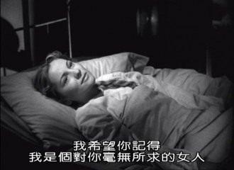

# 那些有关爱的事——《一个陌生女人的来信》影评

最近有机会重新看些老片子，《一个陌生女人的来信》是其中之一。这又是一部改编自小说的电影。长久以来，对于改编电影我一直都有所偏见，真正的好小说是无法用影像来还原的。

例如《倾城之恋》，语言优美华丽如同一袭长袍，人物生动妥贴仿佛天外异客，永远记得那个在寂寞中生长颓败的流苏，那个冷静热烈的范柳原，张爱玲笔下他们在即将倾颓的帝国大厦里尽情演绎了一场倾城之恋，但是在改编的电影里，即使许鞍华再怎么兰质蕙心，也改变不了影片略逊于原著的事实。而同样改编于文学作品的《色戒》，却因为原著的不甚突出而大获异彩。这是源于人的期待。一个人的期望越大，失望越大。的确如此。所以我试图用一种完全不带希望的态度去欣赏这部作品，包括文字和电影，过程平淡并无转折，收获颇丰。

关于故事。高尔基曾由衷地赞赏这篇小说“真是一篇惊人的杰作。”一个男子在41岁生日当天收到一封没有署名和地址的信，这封信出自一个临死的女人，讲述了一相刻骨铭心的爱情故事，而这个故事的男主人公也就是收信的男人对此一无所知。故事始自18年前，她初遇男人的刹那，她还是个孩子，而后经历了少女的痴迷、青春的激情，甚而流落风尘，但未曾改变对男人的爱，直至临死前才决定告白——她躺在凄凉的命运的甲板上，雪白的泡沫把她推向了死亡。

这或许就是爱情，因为盲目，因为没有原因，也没有计较，。是现实版的美人鱼的故事，只不过没有上帝，没有永生，只有漫长的永恒的死亡。悲哀，却无法说是不幸，因为这是爱的选择，女人选择爱情，是在正常不过的事情了。在阅读文字的时候好像是在捡贝壳，魅力无法抵挡，我兜转于一个女人的世界里，并且无法自拔，然后我看到电影。电影有两个版本，个人认为并无可对比之处，好莱坞倾向于故事，而中国电影倾向于心绪意境，这是种必然，因为完全不同的生活态度，完全不同的价值观。我可以很清楚地看到两部电影的差异，并且坦然接受了这种差异。

和好莱坞习惯相同，这个故事在好莱坞的编剧手中显得更加成熟和合理，更符合大众的审美趣味。首先是人物，男主人公由一个拥有很多书的作家变成一个风度翩翩善于调情的音乐高手，当然是音乐更让人着迷，而不是干巴巴的书本，电影中有一个镜头，大概是女孩坐在秋千上听音乐家弹奏钢琴，然后生成迷恋来。对的，就是迷恋，还不是爱，毕竟还是太小，少女即使怀春在最开始也只是迷恋而已。即使后来她追逐到他的城市，不顾一切地等待，我仍觉得不过是一场执迷。但是到后来，两个人相遇，交谈，这才是真正爱的开始，并且这种爱由于时间而显得更加珍贵。好莱坞的趣味是随处可见的，例如说两个人的旅行，那是一种只有在恋人中间才显得稍微有些不那么傻的一种方式，不过，观众是爱看这些的，人们爱看一切傻得很美好的东西，这亦是好莱坞多年不倒的原因，这亦是爱情故事永远流行的原因。还有结尾，这也是影片与原著最不相同的地方。女孩是傻的，为了爱可以不顾一切仿若飞蛾，但是影片中的女子显然比书中的要幸运的多，最起码男人想起了她，虽然这是另外一种程度的悲哀，但比起游丝划过天空什么也不留下，这已经是最美最好的结局了。提到这里不得不说下开头，男子因为决斗而准备出逃，因为爱的感化而选择面对，这又是经典的好莱坞故事，即一切应需完美，即使这是悲情故事，当然，像我提到的那样，观众是爱看这些东西的，里面有着独特的美国精神在的。

个人是比较喜爱这样的模式的，我耽溺于世俗的平常的爱里。电影在很多时候充当的是一种造梦工具而缺乏文字的教化功能，人们在选择看电影时是为了娱乐而非学习，这里我也并不是说悲剧性艺术性的电影就是错的，只是站在观影者面前，他们更需要的是梦想而不是撕破梦想，这也是电影区别于文学作品的原因之一。或许有人说这样的电影就很难表现出来文字的反省与思索，但是，为什么要呢，单纯的娱乐也许不是目的，却是一种方式，思索的方式。

相比较而言，中国版的来信则因为与剧本的符合，因为意蕴深刻，因为与中国背景的契合而获得很高的评价。就故事而言，和原文一样这是一篇小女孩恋上大作家的故事，经历了苦难却没有修成正果，死了儿子，搭上一辈子，最后却连名字也没有留下来。《琵琶语》的苍凉贯穿电影，就像命运的悲痛无处不在，人们习惯了漠视怀疑和背叛，你的事情与我无关，你的感情与我无关，你的生命远离我，你只是我的过客，这种梦呓式独白加上中国式的白描显得深刻。这是一个女人的一生。一声叹息，就那么过去了。其实，文学作品改编成影视作品是一件非常困难的事，尤其是不同地域的改编，但是这一点中国版的来信做的非常成功，它把这个外国故事彻头彻尾的中国化了：四合院，晒被子，放风筝，包饺子，女学生，黄包车上的偶见，抗日游行上的浪漫相会，这些都是非常具有意味的美，是不亚于原著给人的震撼的。如果单看电影，也许我会以为这就是一个中国故事，其实这个故事本来就是非常中国化的，那种一生一世的痴恋，有着非常明显的东方神训味道，有禁忌的美感。

故事结束了，电影结束了，也许只有爱还没有完。像是汽车悲鸣着穿过隧道，浓重的黑暗过去了，蓦然看见些光亮，却突然有些不适应了。爱是否还在？它永恒存在。

(采编：卢静；责编：王卜玄；)
