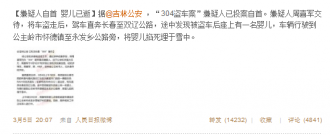

# 那些看客

2013年3月4日，学雷锋纪念日50周年的前一天，在距雷锋服役所在地300公里外的长春市，一个窃车贼在得手一辆丰田后发现车座上有一个2个月大的男婴，随后他把这个婴儿掐死后埋于路旁雪中。消息传出，全国哗然。

群情汹汹中，有几种声音值得注意，但我并不认同，试与之商榷。

**1.****帮助还是帮凶？**

@王小山：你们在微博上这么大规模地转长春孩子失踪消息，加上此前不停地对同类罪行绝不宽恕、坚决处死的叫嚷，用你们的愚蠢头脑和我的脚趾头思考一下，也会知道孩子不可能还在了。你们以为自己正气凛然、大义在胸，但不客气地说，你们他妈的就是帮凶。（3月5日13:18）

王小山老师发这条微博的时候，噩耗还没有传出，并不是事后诸葛亮。这条微博代表了一部分网民的看法，尤其是媒体人，他们是从媒体职业道德的角度来反思的，并引用了台湾“白冰冰”案；另外持类似观点的便是一群把“无良的媒体”挂在嘴边的人。

这条微博的思考是有道理的，但在这个具体的案例中并没有太多说服力。首先，是婴儿的父亲主动寻求媒体帮助的，而不是他报案后，警察在秘密调查时被媒体捅出，媒体以及微博传播者并没有原罪。当受害者主动向媒体与民众求助时，如果媒体按下不发，又或者民众视而不见，这才是该被指责的。

@FM1038吉林交通广播：【交通广播权威发布】2013年3月4日，一个再平凡不过的周一清晨，早7时20分许，103.8吉林交通广播直播间《畅行早高峰》正在直播，原本欢乐、轻松的氛围，被许先生的一个求助电话完全打破。

其次，在中国当下的现实中，还是一定程度的“媒治”：媒体治国。这并不是一个很正常的状态，媒治同样不是法治。但如果纵向比较，还是有进步的，毕竟媒体还能代表部分民众的立场，尤其是当互联网时代，自媒体兴起后。当一个无身份无背景的普通人突遇横祸，报警自然是第一选择，但他同时求助于媒体这是完全可以理解的。与官僚机构打过交道的小民，有这种觉悟不奇怪。中国的警察是很专业的，基本上只有他们不重视的案子，没有破不了的案子。当受案人不自信警察会重视自己的案子时，诉诸媒体是一个不得已的选择。

其实在最后噩耗传来之前，我对结局一直是很乐观的。因为《人民日报》的微博转发了，因为吉林的副省长作出批示了，因为全民被动员起来了。这样的高压下，从警方的角度，必然会全力以赴，而在窃车贼看来，必然会悔不当初。破案的时间指日可待。只是没想到，窃车得手后不久，那贼就掐死了孩子。

我认为媒体以及微博传播者要为这场悲剧结局的发生负责的观点是站不住的。一方面，从时间线上来讲，目前所知的讯息表明，当婴儿被掐死时，微博上大规模的转发还没有开始，同时，也没有证据显示窃车贼一边在开车一边在刷微博。另一方面，发起民众参与救援并没有干扰到警察执法，相反，不少市民提供了有价值的线索，在失窃的车辆被找到前，已有好几辆同款的汽车被民众举报。

至于认为窃车贼因为媒体、微博的喊打喊杀而倍感压力于是杀婴的，这种说法更荒谬。此案与白冰冰案并没有可比性。窃车贼只是为了窃车，并不是为了绑架。窃车与绑架甚至杀婴的罪行孰重孰轻，有常识的人都可得出结论。加上婴儿还不会说话，不会指认窃车贼，从常理来推，窃车贼根本没有杀婴的动机。窃车贼迫于压力，把婴儿还回，与窃车贼迫于压力，把婴儿掐死，两相比较，前者的可能性更大。所以，其实可以这么说，之所以窃车贼敢下毒手，是因为他根本没有感受到压力，如果媒体更早的介入，也许结局就有不同了。最后窃车贼是自首的，说明他对情势的发展是有预估的，并非没有常识。

由上可知，至少在这一具体的案例中，媒体和民众的参与没有太多值得指责之处。

**2.****谴责还是赞美？**

@AC空气稀薄：@姚晨 说这世界坏透了，或许她想说中国坏透了但她很聪明，@演员孙海英 则很直白，他说这反映中国人逆天的品性和恶贯满盈。他们没有看到，白天，数千市民自发在路口盘查车辆，夜里，无数市民不顾寒冷，自发来到广场点起蜡烛为孩子祈福。罪犯必须严惩，善心必须赞扬。有气愤，也有感动，这才是正常人。

其实，这样的观点已经不错了，相比与那些能把丧事当成喜事办的新闻稿来说，已经算是有进步了。但这条微博仍有洗地嫌疑。确实，“罪犯必须严惩，善心必须赞扬”，然而还有一条更重要的是，有司必须谴责。不能把民众的善当成主管部门的政绩。

坦白地说，能在24小时内找到失窃车辆，这样的效率似乎还行。只是，为什么不能更快一点，从发现车失窃到报案只有几分钟的时间，在这早期的黄金救援时间内，为什么没有能第一时间发现这辆车，毕竟是一辆车，必须在路上开的车。

2011年5月19日的《新文化报》发表文章《长春“天网二期”9月末完工》称，经过近3年的“经营”，监控探头已经遍布长春市各主要街路、出城卡口、金融网点、人群聚集地、车站运输港口等重要部位，所有街路、各金融网点等重点单位都会被每天24小时不眨眼的“监控眼”盯住。（[http://news.xwh.cn/news/system/2011/05/19/010183548.shtml](http://news.xwh.cn/news/system/2011/05/19/010183548.shtml)）

虽然听上去这么高级，虽然是在第一时间就报案了，但最后仍是在时隔24小时后才找到失窃车辆。这样的效率是不够的，尤其是考虑到这个工程投入这么多，且是全市布控，但还是能让窃车贼大摇大摆的在外晃荡，如果是对城市安全有威胁的行为，“天网”靠谱么？当窃车贼下手掐死孩子的时候，他有没有想过这个城市有“天网”？为什么他毫无畏惧？“天网”的威慑力何在？窃车贼怎么就那么自信的觉得他能够逍遥法外？我不相信窃车贼精神不正常，不然他为什么明智的自首。

**3.****父亲失职？******

另外，还有一批人的意见是这样的：

@摄影师冯俊铭：从一开始我就建议追究那个父亲的法律责任//@龙灿://@裴宣手札: //@顾肃: 一定年龄以下的儿童也是不允许一个人关在家里的，否则会受到处罚。这些都是为了保障儿童的安全 //@老龍吉:在美國，保護未成年人是監護人的法律責任，失職就要受到法律的懲處//@许身健: 确实，在管理社会上需要虚心向人家求教的

@许身健：同事在美访学时，带孩子驾车出游，因内急将6岁孩子放在车上后去公共卫生间，回来时发现警察已经在车旁等他，原来是停车场人员发现车上只有孩子立即报案，警察几分钟就赶来。警察掏出一张纸，向同事告知孩子一人放置在车上可能会发生的几十种后果，警察警告他说：好在时间不长，否则他会被当即拘捕。

我才知道，原来现在“想当年，兄弟在美国时……”这样的句式已经升值了，连“想当年，兄弟的兄弟在美国时……”也能拿出来装外宾了。不用美国的法律来弹劾中国的官员，却用美国的法律来起诉中国民众，行啊。

一方面，这位爸爸没有违反现行的中国法律，各位何必如此咄咄逼人？另一方面，法律的制定要考虑现实的环境，在一个有那么多留守儿童的国家，一开始就用儿童福利标准最好的美国来要求，是不是有点过？儿童监护权的问题是需要一点点提高民众的意识，但能不用一部还没有制定出来的法律来指责一位刚失去孩子的父亲么？

我没有觉得这位爸爸有多么失职。情景回顾，根据目前公布的消息，他是将车停在自家店面门口，因为房间太冷怕宝宝冻着所以先放在车里，打算等屋里暖和些了再把宝宝抱进去。这样做真的有那么大的过错么？看到消息说，婴儿的妈妈已经患上突发性神经病了，希望孩子的爸爸保重。这个家庭已经够不幸了。

**4.****以下是和主题无关的瞎扯**

4.1 杀婴是中国传统文化

当我和朋友在讨论为什么窃车贼能下得了手时，均百思不得其解。不就偷辆车么，至于么？也许只是窃车贼人很极端，不代表普遍现象。

如果非要上纲上线一下，可能在中国传统文化中能找到一点影子。至迟从明清开始，在中国的某些地区，是有溺婴传统的，尤其是女婴。女婴不被重视从家谱的编制上就能看出来，一般来讲，“女小口”不算人，即不会在家谱中留名，尤其是夭折的。而在人口密集的地方，如果有婴儿出生，但家境又无力抚养，将其溺死是一个选择，尤其是女婴。这样的现象在中国以外的地方比较少见。

说近的，一些极端的计划生育执行者同样在上演这一幕，婴儿也是人的观点似乎没那么深入人心。同样是婴儿面临生命危险，根红苗正的媒体鲜有关注因计划生育政策而丧生的那些婴儿的，而计划生育执行者还很理直气壮。也许是在这样的氛围中，让窃车贼觉得掐死个婴儿算不得什么。

4.2 看客

如果说听到这样压抑的新闻后，还有什么能让人对未来稍微有点信心的，那便是还有那些积极转发的热心人士，那些素不相识却前去献花摆蜡烛的市民，这可视为公民素质和公民意识提高的佐证。我们都是看客，但看客也在做事情。挺好的。

本文的部分观点受《“3.04”案件省直及长春市媒体报道要求》一文启发。

（采编：周凌希，孙梦予 责编：欧阳银华）
