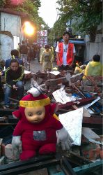
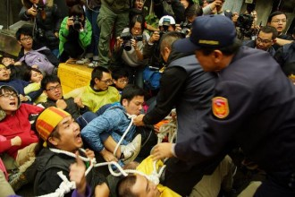
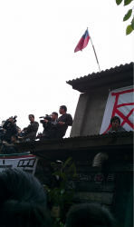
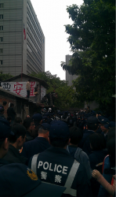

# 那面國旗高高的掛在天上—-華光社區強制拆遷的故事

**注解：華光社區強制拆遷事件，發生於2013年3月27日。台灣法務部於當日10:30開始拆除華光社區兩戶違建戶，聲援學生與居民排成人牆阻擋，喊出「反迫遷，要安置」、「強拆暴政、罰款殺人」等口號，但最後仍抵擋不了。**

** 華光社區位於台灣台北市中正紀念堂東南方，為大安區的光明裡及錦泰里，杭州南路、金山南路、金山南路2段30巷、金華街之間的區域，為大安區與中正區交界處，總佔地面積約有2000坪，有許多在地店家，近年來正面臨土地開發議題。**

** 政府的開發計畫亦不明朗，從2007年「台北華爾街」到2012年「台北六本木」，最後2013年卻說「台北六本木」要轉到空總開發。華光社區之後到底要做為什麼，社會大眾不知道、華光居民也不清楚，而政府始終也拿不出一個完整的規劃公諸於社會，因此一直無法驅逐佔有國有土地的違建戶。**

1937年盧溝橋事件爆發，中華民國總統蔣中正總統宣佈全面抗日。在那樣的年代有多少年輕人投入作戰？多少人是為了理想而奮戰？又有多少人是不願意打仗卻被強行拖入軍中。不論是哪一種人，從南到北，從家鄉到異地，漸漸的大家沒時間在想年少的夢想，漸漸的，淡忘青春暗戀女孩的臉龐，時間就這麼過去了，大家唯一記得的就是那面青天白日滿地紅的旗幟，炮聲、槍聲、人民的哀嚎聲、士兵的吶喊聲，一切就這麼淡淡的鑲入年輪當中……

1949年國共內戰之後，一大群人過來的，來自中國四面八方匯集的人，跟著國民政府退守到台灣。在那個年代政府一時還找不到地方安置這些軍民，所以很多人就跟著部隊，住在現在的中正紀念堂。是的，當年的中正紀念堂那邊是個臨時住所。

每天大家都會去問甚麼時候可以離開這個地方……

每天大家都會去問，但就好像石沉大海般，一問再問都沒有變化。

漸漸的那些有家庭的士兵就跟長官說:「我們真的需要離開這邊，長官你知道哪裡可以去嗎？已經有家庭的我們，真的無法在繼續住在部隊中了。」

那長官想了一下，手往後面一指說：「你們就往那邊去吧！以前那邊是日本統治下的監獄以及宿舍區，現在都已經沒有人在住了。」

就這樣這群跟著國民黨過來的士兵就在以前的日本宿舍廢墟中一磚一瓦的建造起自己的家。在這群士兵家的屋頂上一定看的到樹立起他們的精神指標，那面國旗，那個陪著他們奮戰大半輩子的青天白日滿地紅。

感覺是那麼自然的，門牌發下來了，孩子依照戶籍到附近的學校上課，而政府也很準時得來收稅。就這樣這群士兵們在這個地方定居了下來，有個賣起來自中國北方的餅食，有的賣起牛肉麵……

眷村的味道，緩緩的飄在這個華光社區上空，孩子在嬉戲，國旗隨風飄揚。

華光社區，是他們的家，也是他們從小到大生活的地方。

當中華民國政府接受了日本的降書，以前日本統治的地方理所當然的換到民國政府的統治之下，像是以前日本的監獄以及宿舍區就是這樣被編入法務部的財產中。原本的台北監獄是與日本監獄同地址，但隨著時間過去，現在的台北監獄移到桃園縣龜山鄉。只不過監獄地址變了，可是在監獄旁的宿舍區依然沒有改變，許許多多的人仍然在這邊生活直到，前幾年政府想將華光社區的土地規劃成類似美國的華爾街，或是日本的六本木。據說政府想在這邊蓋很多的百貨公司以及繁華的商業街，我想這就是他們認為能夠創造好經濟的方法。

不過，像這樣的事情我已經聽了好幾次了，這麼多年下來我一直在納悶，政府所謂的好經濟到底是為誰好的？ 當這個政策準備要開始執行後，擁有土地財產權的法務部，開始與住在華光社區的居民協商搬遷的事宜。很多的公務人員被告知會被給一筆補償金，並請他們趕快離開華光社區到別的地方居住，即便不捨，但是，因為這個命令來自頂頭上司的所以能夠不遵守嗎？

大部分的人就這麼含著淚水走了，離開這個從小生活到大的社區。

至於不是公務人員的居民，政府可就沒有那麼友善了。

而思索著這些的我，看了看了時間，夜已深。

夜雖然已經很深了，但在我所在的地方完全沒有夜晚的氣氛。

在這邊幾乎不用講話就會感覺到空氣中有甚麼東西在振動著。身旁的人，有的拿著磚頭，有的正戴起手套，有的正在幫忙抬鷹架，有的人正在指揮。 

這裡是2013年3月27號凌晨的華光社區，而所有人都在為明天的強拆行動備戰。透過記錄下這篇文章，就算華光社區被強拆，這一天仍然會停留在時空，透過這一篇文章，未被拆除的華光社區會不斷存在著，只要我們不要遺忘掉，只要還有人閱讀這一篇記錄。

這一天晚上，我們用自己的雙手企圖築起一座反抗現在發展模式的磚牆，所有人排成一列我用帶著手套的手從前方姐姐手裡接過一個比一個大的磚頭，也許或有人納悶這些磚頭是哪來的，其實我們也不過是從隔壁已經被拆除房子的廢墟中拾起這些被遺棄的磚頭。

其實這些磚頭曾經是來自中國各地軍人用來建造家的基石……

我們都知道，即使我們今天在這邊也擋不住，要來執行法院強制命令的怪手，擁有因日本投降所以擁有土地權的政府。把這片土地的管理權給了法務部，也因此當政府為了他們的經濟而需要這片土地的時候，法務部必須來當這個打手。在幾年前法務部透過民法告這群居民強占國有土地，並威脅如果不趕快離開就會追討高額的罰金。從法律上來看，政府是對的，因為民法的目的就是為了要保護財產所有權人。法律遠離了人的情，可是住在這個地方的人，卻都是有感情的，看著這樣的衝突，我好困惑，法律保護的到底是什麼？在利益衝突的時候，國家這巨大的機器，是犧牲了哪一部的身體呢？每一個住在臺灣的人，不都是這個國家的血肉的一部份，那麼像這樣的衝突，到底是用什麼標準去衡量的呢？

這邊，高高掛著國旗的老卷村，是他們從小住到大的地方，有他們青春的記憶，有他們的汗水，有他們努力的一切……

為了竭盡我們所能的組擋政府拆除華光，我們擋在地板上，很紮實的靠在一起。我們想也許手握的很緊，等等警察來的時候，就無法把我們抬手了，如果抬不走我們政府的怪手也沒辦法進行強拆的工作。當我把眼睛望向天空我看到那面國旗高高的掛在天上……

（這張照片借用自「苦勞網」，當時我就是人牆的一部份，無法拍照。）

只不過很悲情的事情發生了，這片旗子所代表的政府，不僅僅在過去沒有好好的安置他們，在這麼多年過後還要用國家的力量，以法律程序告他們，並且用法院的強制執行令拆掉他們的房子。住在華光社區的人幾乎是家家戶戶都有國旗的，縱使在國旗已經不像兩蔣時代那麼受重視，可是住在這邊的人一定會插上一支國旗，畢竟這是他們從小看到大的信仰，也是他們所相信的未來。

當我們在等待警察行動的同時，透過鷹架上的廣播器我親耳聽到了將要被拆的屋主在跟我們說話，她是這麼說的:「我的老公是國民黨的軍人，當我老公死掉後我是靠身為他遺孀的補助金在過生活，可是前幾年當政府對我提起告訴後，法院就把這筆經費凍結了，也因此我每個月都拿不到我的生活費，可是當時我的孫子還要上學繳學費，所以每天我都會去撿紙、撿破爛，來供應我孫子上學，可是每天我的身體都很不舒服。這是甚麼政府、這是甚麼政府，政府不是應該要照顧人民的嗎？這是甚麼政府……」

當我聽到這段話，我的心好痛，我的眼淚也這麼流了下來，為什麼會有一個國家把以前曾經對國家有貢獻的人，用如此粗魯的方對待，用公權力把生活著好好的婆婆變成要去撿破爛的窮人，用公權力把他們好好的家給拆毀！

到底這麼做是為了甚麼?？ 為了要提高台灣的經濟嗎?

說句實話，振興經濟講了多久，大家心裡不是沒有譜，但我們的生活有變好嗎？

但一次次的施政，一次次的衰弱，我們發展了，那經濟到底是為誰發展的?

這樣的發展，庶民如我們，想要嗎？

政府說想要將華光社區發展成像是日本的六本木，那我希望政府好好的研究六本木得開發過程，人家可不是強硬的破壞後再建設，日本是先尊重當地的社區，並再協調一同開發的！

政府的確又再一次的重視起這些曾經為他們奉獻的人，但是這樣的重視，這樣方式的重視，絕對不是這群把國旗每天升起的人所想到的。

警察來了，怪手來了，但那片青天白日滿天紅的旗子仍然高高的掛著……

其實被驅逐著，屋瓦被拆遷，那面旗子仍高高掛在天上，不曾降下。

那面旗上一直都高高掛在天上，半世紀如一日，這就是華光社區，我所看見的故事。

（採編：余澤霖，責編：余澤霖）
