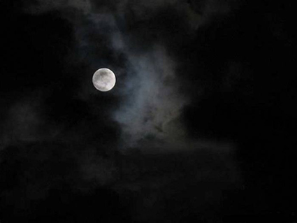

# 郑屠春秋

#郑屠春秋

##帝畿无边潇潇柳，城高不使苍生望。

###一

郑老头儿是我的老师。

一般吧，医学院的老师都有种清冷的气质。但郑老头儿完全不同，他穿上白大褂像饭店里的厨子，拿起解剖刀像练摊儿的屠户。尤其当他面前摆上许多关节或者肌肉组织的时候，活脱脱就是在吆喝着卖肉。所以，江湖人称郑老屠户，简称郑屠。

郑屠是学院第一名捕，戒律院首座。每年倒在他手下的人不计其数，丫在考前还要放烟雾弹：“这每年考前啊，大家手头上官方资料没有，各路山寨资料倒不少，你们不知道，寨主就是我呀！背完那个就没问题了。”

但结果知识点仍旧侧漏得一塌糊涂。有同学过去评理，老屠户嘿嘿一笑：“我故意的！”

其心可诛！

老头儿终身，哦不，是至今未娶。上骨科解剖的时候，老头天天扛着一具骨骼标本来上课。那是一套完整的人体骨架，在天灵盖上打了个孔，吊在不锈钢支架上。老头儿对这副标本很珍惜。而且有好事者曾经问过郑屠咋没对象呢，结果郑屠怒答，死了！所以有传言称，这就是他当年的情人。

“每一块骨头都是一个寂静的灵魂！”郑老屠户每次下课都要强调，“大家要爱惜！”

老头儿扛着骨骼标本，悠悠地踱步出去了。那具骷髅在他身后一荡一荡的，残缺的面孔像是荡秋千荡高兴了露出的微笑。

不过他再怎么牛逼，我是不喜欢他的课的。福尔马林的味道简直烦透了！那时候我入了诗歌的迷道，在课堂上也写写画画。这天，我正琢磨着一个金句，突然一声怒吼。

“王图！站起来！”

我于是站了起来。

郑老屠户手里扛着着一条大腿，大腿根部还连着半拉骨盆，模样像极拿了项羽半块生彘肩的樊哙。他乐呵呵地看着我说：“王图同学，如果我用力拉这个关节，会发生什么情况？这条大腿会被卸下来吗？”

“这不废话么。”好吧，我承认我没那么胆儿肥，我当时只是默默地点了点头。

老头儿一乐，同时左右手开弓那么一拽，股骨头连接的地方发出了“嘭－－”的一声，被卸下来了。然后他的手一松，半拉骨盆在大腿上颤悠悠地吊着，没卸下来。仔细一看，股骨头上还有条韧带拽着。

“看，王图，你这个学渣。”

老头幸灾乐祸地继续说道：“罚你把股关节的特性抄写十遍给我交上来。”

我表示抗议。

“好吧，再给你一个机会，回答上来就免单。请问，这条韧带叫什么名字？”

我哪儿知道它叫什么名字，只能接受。

“听说你是文艺青年。”老头把肱骨又慢慢塞了回去，骨头与关节窝之间发出噗地一声，归了位。他继续说：“文艺青年好啊，哪天把写的诗词给我，让我老头子学习学习。”

我心想，就你？他妈能看得懂？拿着手术刀卖肉的屠户！

某个周五的下午，我就拿着我的诗集，还有被罚写的作业，晃晃悠悠去了他办公室，把册子往桌上那么一推。

贼屠户！你悬壶济世的勾当你不干，偏偏来抢刀笔吏的饭碗，那就让你见识见识王图的手段！这里头有我最得意的一首，最后两联是这么写的：

地浮黄叶开金殿，天阔丹墀映明堂。

长安无尽潇潇柳，城高不使苍生望。

我心说，来吧！郑屠夫，敢拿诗文特意与我消遣，洒家便与你大战三十六场！看我不拿醋钵儿般大拳头望你脸上开染坊！

没想到郑屠户翻到最后一页的时候，看完大叫一声好，还不过瘾，大拍了三下桌子。然后提起笔，把映字一勾，写了个趋字。

地浮黄叶开金殿，天阔丹墀趋明堂。

“你之前写的气魄也很大，但单单就是一排屋子，冷。”他点着那个趋字，说，“我这么一改，里头就有了人了。好的诗词里头都是因为有人。”

老头儿吸了一口烟，说：“古人说，不以言害意。这样虽然不合平仄了，但格调却是翻着跟头往上涨。这点账，你要算明白。”

嗬！还真懂。

自打改了一回诗之后，郑老屠户和我的关系迅速升温。常常时不时地一块儿喝酒吃肉。

我们会在解剖教室里吃酱牛肉，喝二锅头。在寂静的一堆人骨丛中，由于没有软组织和福尔马林，所以气味倒也不坏，而且气氛很清净。老头吃完酱牛肉，再来一条红烧肘子，喝半斤酒，然后再来一盘花生米，放在嘴里闲吃。然后抬起迷迷瞪瞪的眼，招呼我，吃啊，唉，吃啊你！

我摇摇头，惭愧一笑。继续喝一口酒，然后吃颗花生豆。这个地方的肉我是决计不碰的，太恶心了。这贼屠户每次都把肉一个人吃完，他妈的！

喝多了，他就拿起一节跖骨和猪蹄子做比较，然后不失时机地教育我：“你看，这俩玩意儿，在拓扑学上是等价的。这充分证明了进化论的正确性！我跟你说，信有神论的都应该下地狱。”

我说：“老师，都无神论了，哪儿来的地狱？”

“那谁知道，问村长去。”

我们也谈论诗歌。老头儿说，王维的下字下得真好，杜甫也比不了，李白就更甭提了。李白幸亏生在唐代，要是搁明清，指定被那些老学究们鄙视死，闹不好还得给抓起来。贾谊就是一loser，杨修就是一个笨蛋，刘禹锡就他妈一傻逼，那个得瑟鬼的诗词写得不坏，但到处爱显摆，倒霉就倒霉到这儿了。“玄都观里桃千树，尽是刘郎去后栽”，谁不知道啊，还用你说？人家皇上好心好意把你提溜回来，你不说两句仰沐天恩的话，还要发牢骚，又栽了吧？杨修那厮更倒霉，命都没了。贾谊呢？自我放弃生命，谁都救不了！

“不作死就不会死！”老头儿说着，撕下一大块猪蹄膀来。

###二

日子水溜溜地滑过去好远。

这中间发生了好多事，比如我的解剖课成绩竟然好了起来；比如郑屠的；再比如我追求到了一个女神；一开始情投意合，但当我还没上二垒的时候，女神她爹就以父之名把我给否了。嗯，这是一个悲伤的故事。

那段时间我茶饭不思，心里特别想把我的女神狠狠地揉在我怀里，可是行动上却卑怯懦弱。心里琢磨着我是一个大屌丝，给不了女神豪宅和跑车；女神似乎生了气，每次看了我，眼皮都不抬，高贵冷艳地就走了。我更加心烦意乱，各种繁杂的邪恶之力把我拉扯撕碎，坐到教室里都感觉大脑穿越了四维时空，仍旧遗忘在寝室里的枕头上。郑屠的课已经完结，那两天学习神经学，大脑回路是邪恶的朝廷，脑干是奸诈的丞相，各节脊髓是二十四路反王。整节课就在和狼烟四起的江湖作斗争，差点没牺牲。讲课的又是一个干巴巴的更年期妇女，瞪谁谁怀孕的眼神，更使我失望，索性就不去了。

那天我叼着烟，在自哼自唱的伴奏下撒完一泡尿。一出门，就被一声厉喝给吓破了胆。

“王图你休走！”

一瞅，郑屠如神兵天降，堵在门口。脸憋成了猪肝色，一双怒目蹬向我，左手握着一卷手纸，摆成了赵子龙的银枪势，看样子是要把我给挑了。我当时就吓尿了。

“看什么看，滚进去！”

他抬手一推，我就这样被一个急着蹲坑的老头儿又撵回了厕所。

我心说这是要给我口一管儿？

郑老屠户找了个隔间，进去把门哐地一关，说：“如果我拉完了发现你跑了，信不信我把你做了标本！”

我哪儿敢动啊，站在门外候着，郑屠蹲在里面，然后隔着门就开始了他气壮山河的演讲，门被震得隆隆价震天响。

“你小子狗胆包天！课都不上了！人生不只是爱情，洞房完了还得爬起来上班去呢，你失了恋就丢了魂儿了？而且还是不做任何努力的万念俱灰？枉费我着急上火，都便秘了！出去别说是我学生！”

“年轻人，遇到自己喜欢的就去追！物质隔离算什么？老夫当年革命大串联，跟着我女神转战祖国山河八个省！得到没得到两说，总之努力过了就没遗憾了。人生嘛，就是玩儿那一哆嗦！”

“你别跟我玩儿清高，清高顶个屁用！我知道你们这些诗人，都是他妈傲娇货。他爹有钱怎么了？少奋斗二十年不好？非要自己吃苦，你是受虐狂？人生在世，关键的是要把自己的价值观输出，影响世人！你怀瑾握瑜，空有一腔热血，隐居在黑山老沟里打飞机，对人类进化顶个屁事！”

“多发paper少写诗，文青也要干点正经事！我早就跟你说刘禹锡是个傻逼，孟浩然是个大傻逼，杨修贾谊是俩臭傻逼，你都听到狗肚子里去了？吃天鹅肉，不丢人！当癞蛤蟆才丢人。搞对象，就要不择一切手段耍流氓！”

郑屠户在隔间里正骂得气壮山河，突然发出了一声九分凄厉一分娇羞的轻嚎。我吓一跳，赶忙问道：“老师？咋了……”

“透来！（？）粑粑好粗，撑着菊花了。”

###三

托郑老屠夫的福，我又重新向女神发起了攻势。不过，主席说，论持久战。以后又分分合合数次，至今都在和我大能的岳父打游击战争。不过这是后话了。

总之一句话，我是练得皮实了，女神之心在我手，女神之父是浮云。

后来临毕业的某一天，我在路上碰上了郑老屠户。郑屠问我，医院找好了没？我说，还没。郑屠说，那正好，今晚有个饭局，你也来，我帮你牵个线搭个桥，别以为我们基础课教师就只有给人挂科的能耐。我大喜过望，连声说好好好。

下午捯饬一番，拣最好的穿了。见了郑屠，他把后脑勺的几根头发都刮了，脑门儿溜光水滑，更像屠户了。一起骑自行车去了酒店，真到了那里，吓尿了。学院里各路大牛就不说了，最具威慑力的是为首坐着带着金丝眼镜儿的院长，唯一认识的就是旁边一师兄，但人家是院长的嫡系子弟。

院长从来是我可望而不可及的人，据传言，当年硕士毕业后高分留校，娶了老校长的女儿，从此平步青云，在学术上大搞霸权主义，在建筑上大搞豪华主义，一手把医学院提振成了全校最牛逼，全国排名蹿上了第一梯队。

在这里吃饭，实在太压抑。

酒过三巡、菜过五味。郑屠就讪笑着搭讪，帮我推荐。为首的院长没搭茬，只是说，来来来，大家都吃好喝好。搞得我脸烧得跟猴子屁股似的。渐渐地，有些教授就告辞滚蛋了，我心说咱也见好就收吧，使劲儿使眼色，可郑屠的屁股纹丝不动。

桌上终于就剩下五个人了，院长、师兄、我、郑屠，还有我目标医院的书记。人不多了，院长开口问，老郑啊，这医院的大梁还是需要你来挑，梁书记三顾茅庐，你得给个面子。

郑屠推了推我，说，我去不了，让我徒弟去吧。不用挑大梁，给个饭碗就行。

院长说，今天只讨论你的事。

郑屠说，我觉得还是教解剖比较有意义。再说医患关系这么紧张，我怕死。真的，让我徒弟去吧，他有牺牲觉悟。

一时尴尬。那个医院的书记左右看看，站起来提议说，那咱们击鼓传花，玩儿唱歌吧。大家说好，于是开始。咚咚咚，三声鼓，花落在了郑屠的怀里。

大家都鼓掌欢迎郑屠开嗓。郑屠说我唱不了。大家一定要唱，郑屠死活不唱。最后院长闲闲开口了：“老郑，让你唱你就唱，大家定的规则嘛。”

郑老屠户说：“我真不会唱歌，你又不是不知道。”

院长看来也喝多了，金丝眼镜后面，眯着一双飘红的桃花眼，说，我唱一句你唱一句，教你，总行了吧？

郑老屠户这下推不过，唱吧。

院长一开喉，惊艳全场。至于郑屠，我现在只恨文字没有五线谱的功能，不能把郑老屠户那惊天地泣鬼神的效果写出来，那跑调的路径，一会儿上天入云，一会儿下地寻泉，真当是惊翻三山仙女瓶，吓煞九幽鬼府静。

如是几回，院长再也忍不住了，呼一下拎住了郑屠的领口，怒道：“你他妈不跟着我唱，让你他妈跟我作对！”

郑屠更牛，一拳把金丝眼镜揍掉，怒喝：“滚你狗日的，老子现在学得很认真！”

院长平白吃了一拳，自然不肯收手。俩人你来我往，就打了起来。

都说高手过招，杀人于无形。郑屠和院长都是学术界的高手，可他俩也就是抱在一起滚蛋蛋，没有别的创意。我们仨赶紧把院长拉开，却发现拉错了人，因为郑老屠户还是自由地扑上来狠揍院长。我们于是赶紧改变策略，我和师兄死死摁住郑屠，院长那边只留下医院书记装模作样地拦着，院长也装模做样地冲了几下。

“你他妈这辈子就跟我作对，你这辈子就看不起我！”院长指着郑屠，愤愤地大喊，“让你去医院当院长，你为什么不去？你心里还疙疙瘩瘩没放下当年那几件事，当年是我的错吗？！”

郑老屠户斜睨着眼睛，不屑地说：“我？才没那个闲心呢，再说了，你谁啊？”

院长怒气冲冲地整理了下领带，骂了句：“臭清高！”

结果喝浑了酒的郑屠一口浓痰喷了过去：“呸－－阿谀之徒！”

这四个字，如同钢牙咬铁板，字字泣血。这口浓痰，犹如李广之箭，精准地落在了院长的脸上。院长这下怒色如猪肝，立马把桌子掀了，鲍鱼燕窝天九翅，全砸在我和师兄的背上。

唉，这一通闹的，简直是七零八落。

###四

抚慰了院长，送走了书记，安顿了郑老屠户，已经是深夜。我和师兄结伴回了寝室楼。师兄看了看在战斗中光荣挂彩的西服，啧啧了几声：“唉，可惜了。一千八百块呢。我得让老板赔我。”

我没心情同情他的西服。“得了吧，砸你身上的菜比你那破衣服都贵！郑屠和你老板到底有什么前仇旧怨？老郑不是那样的人啊，逼急了这么牛，敢唾盟主的脸！”

“切！人家俩，互相睡一觉也不稀奇，互相捅一刀子也不稀奇。”

我更懵了，问到底怎么回事。师兄延续着他一贯的逼格，只是说给我看个东西。丫神神秘秘地把我带到解剖楼，翻窗户进去，师兄在他的抽屉里翻啊翻，终于翻出了一本旧杂志，扔在我面前。

伴着窗外的虫鸣，在幽白诡异的灯光下，发黄的封面上有两个小伙子在指点江山。明眸皓齿、浓密黑发，一个戴着金丝眼镜略显冷峻，另一个眼神俏皮，萌态尽显，总之一句话：恰同学少年，风华正茂。

我看了半天，问：“这什么意思啊，这个是咱院长？那这个是谁？”

”你把他的头发捂住看看。“

我将信将疑地把少年的头发挡住，再一看，一个秃顶的脸庞与面前的照片渐渐重合，似曾相识。卧槽！是郑屠！

师兄闲闲地点了一根烟：“当年你老板，哦不，你还不是研究生呢，还不能叫老板。当年郑教授和我老板系出同门，分别是老校长的首座弟子和二座弟子。俩人形影不离，成绩也都是一等一的好，可给老校长脸上增光了。你看的这本，就是报道当年他俩联合攻克断肢再接手术中神经显微连接技术时的合影。当年名震中国医学界，号称一时瑜亮。”

师兄在那说着，我却渐渐起了疑。郑屠曾经的话在我耳边回响着：“转战祖国山河八个省……”“得没得到两说……”再想到他至今单身未婚。还有，今天晚上一贯威严斯文的院长跳着脚吼“当年那是我的错吗？”顿时感觉有什么大事要出现了。这老屠户该不会是有特殊癖好把？又接着想起他拉这我在教室里喝酒吃猪蹄，我还醺醺然醉到不知所以然，顿时菊花一紧，手情不自禁地往后摸。

“难道，他俩……”我艰难地开口，比划了个手势。

师兄一个手刀砍上了我的后颈肉，在这空旷的解剖楼里，吓人不轻。

“想啥呢？龌龊！”师兄骂道。

“是这样的，当年老校长的女儿出落得亭亭玉立，郑老屠户像所有的男生一样，发疯似的爱上了她。老校长被打倒了，女神也插队了。郑屠不惜放弃贫下中农的高贵身份，和女神一起辗转八个省市，可女神回城后抛弃了老实可爱的大师兄，选择了冰冷英俊的二师弟，这都是没有办法的事。”

我悲伤地走了出去，点了一根烟。然后突然就明白了郑老屠户为啥对于当初我的自甘消沉那么愤怒，对于所谓的清高那么愤怒。他本质上是清高的，可是他憎恶这种清高，因为这种清高使得他的才华被埋没、被消耗。所以他把一切都寄托在了我身上，他想要让我找个金饭碗，娶个好老婆，然后像他的二师弟一样平步青云。

然而，他就算憎恨、愤怒，他骨子里的清高仍然难改。就像曾经他追求理想的爱情一样，虽然被现实所击得粉碎，仍然执拗得像头牛。就比如现在，本来有一个平步青云的机会摆在了他面前，但他用一口浓痰回应了所有。

郑老屠户，你个神傲娇。

青烟缭缭，晚风寂寞。我坐在秋凉如水的月光下，听了一夜的虫唱。

###五

郑老屠户要走了，对当朝院长又揍又啐的，就算院长容他，学院能容他？其实，就郑老屠户的性格，他自己也不容自己。听说要南下某个医学院任教。临走我去火车站送他。

熙熙攘攘的站台上，果然一个本校的人都没见到。看来，就我一个人来了吧。看着这嘈杂的旷野，突然想到，如果我没见到那本杂志，没有师兄解释，我会怎么看他，一个淫乱的、老不正经的人？那大家现在是怎么看他的？一个暴躁的、神经错乱的人？一个傻货、一个流氓？

郑老屠户，你一辈子最惜名节，到头来却自污了一个遍，面对千夫所指，你百口难辩。你骂人家刘禹锡、孟浩然、杨修和贾谊，到头来，郑屠户啊郑屠户，你才是个大傻逼。

正想着，在出站口，一个矮矮的秃头在人群中晃动着走近了。

郑老屠户穿着一件白色圆领的老头衫，肩头挎着一个鼓鼓囊囊的黑挎包，这大概就是他全部的家当吧。他手里拿一把折扇，踱着八字步，闲闲地走了过来。要不是这儿是火车站，我真以为是哪个遛鸟儿的大爷来了。

郑老屠户不知道我要来，所以当我出现的那一刻，他显得很激动，嘴唇嗫喏着，平常杀伐决断满嘴喷刀子的人，此刻，愣是啥都没说出来。

我说，老师啊，我来送送你。

郑屠嘿嘿一笑，回头在挎包里掏啊掏，摸出了一张纸递给我。我打开一看：

鹿角寒车过渭水，十年迁谪阅沧桑。

冠垂凤阙唯骨傲，袂染京尘忽鬓霜。

地浮黄叶开金殿，天阔丹墀趋明堂。

帝畿无边潇潇柳，城高不使苍生望。

这不是我写的诗吗？

“对，是你写的，最后一句我又改了改。别老怀念长安，现在没长安，只有坑爹的帝都。”

我道了谢，正要装起来，不料老头一把抢过去，说：“不！这可不能给你，我收着了！”

“不是，老师，我又没说这首诗是送给你的……”

“别扯淡！”郑老屠户雄风依旧，“我越读越觉得你这首诗就是黑我的，所以你拿不走了。”

“你看啊，你这七八五十六个字，不就描写了一个傻货老头么？皇上召他回去了，还要阴阳怪气发几句牢骚。那天晚上我回去想了很久，这就是在黑我么！但这也没办法，我跟你说了，让你多管齐下，不择手段地实现自己的理想。但真正到了我这，就麻烦了。平步青云，一展雄图，我不想吗？但那么做了就不舒服，我觉得这个不舒服的程度要比一展雄图的愉悦程度大，所以我就不干了。”

“这不是清高，这是贱骨头。”

“那家医院是搞康复的，简直就是扯淡。骗钱！康复将来时要下放到社区的，这才是本质，你搞个大医院，除了收费，还有啥目的？你去干干吧，就是混碗饭吃，无所谓。我不行，我去干了那个，将来老天是要砍我的头的。”

“人不辜负自己的才华是对的。不过在我这儿，为了实现自个儿的抱负却把别人给糟践了，那不行！小日本儿就不这么想，糟践了多少国家！”

“你别看现在医院越盖越大，医学院的学生越来越多。都是假象，真正的老百姓享受不到。帝畿无边潇潇柳，城高不使苍生望啊。我这次南下，是有个学校请我过去当老师，还是解剖老师。现在你们的学生哪，都懒，基础不牢靠。一个医生，不论是什么科室，解剖基础打不好，那太危险了。我老郑调教出来的人，没一个糊涂蛋。哪个狗日的不背书，老子就敲他狗日的天灵盖！”

说罢，折扇在手掌心儿里一敲，发出啪－－的一声脆响。

白鸟飘飘，绿水潇潇。郑老屠户这萧萧瑟瑟的一番话语，说得我心里像秋水一样透亮。

汽笛一声肠已断，郑老屠夫转身就走，利索地上了车，头都没回。

秃头、松松垮垮的老头衫、鼓鼓囊囊的挎包，四仰八叉地走路，不知为什么，我从这背影里，竟然读出了孟浩然的风骨。

去罢，老屠户！

(采编：薛晨如；责编：刘铮)
