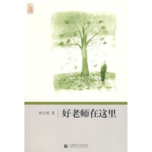
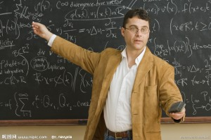

# 酬问师

** **

又到了一年的教师节，心里莫名地怀念起小学时教我们语文课的聂老师，前几年听人说，他已经罹患肝癌去世了。当时听到这样不幸的消息，心里委实难过了一阵子，我没有参加过他沉静的葬礼，也没有留下什么值得珍藏的遗物，也许在我人生中唯一值得纪念的东西就是他给予我童年时代的启蒙教导和师范影响。这个世界或许就是这样：很多人突然出现在你的生命中，只是为了给你上一课，然后匆匆关上岁月的门，转眼消失不见。

聂老师在我的印象中总是一副和蔼可亲的样子，个头不高，微胖，时常穿着白衬衣，搭配着黑色的小马甲，一副绅士的派头，这似乎有点像法国电影《放牛班的春天》里的音乐助教克莱门特·马修的模样。他是一位幽默风趣的人，一间间七八十年代的学校青砖瓦房，一群群调皮捣蛋的小家伙忽而在简桌陋椅旁比量手劲，忽而在廊檐操场上跳来蹦去，转眼间都被他收拾地服服帖帖，不敢造次。他对自己学生的教育方式并非来自严厉的惩罚，而是温柔的”恫吓”。每当谁的作业没有做完，聂老师总是拿着竹尺让没做完的学生来到讲台旁，令其脱掉裤子，撅起小屁股，在众多一双双慌张哑默的眼神面前，玩起了”杀鸡儆猴”的假把戏。一边是轻柔调侃地训斥，一边是竹尺不停地摇晃，当竹板轻轻地敲在粗裂的地板上时，某同学早已是哭喊不断，有时连裤裆里都吓得屎尿纵横，这让其他的学生在提心吊胆的氛围里顿时陷入空前的哄笑中，于是某同学下次再也不敢因为偷懒玩耍而没去做功课了。

每当晴朗的下午，聂老师总要带着我们一群人去室外的操场上散步，在高大的杉木底下，大家围着他席地而坐，有时他会给我们讲孙悟空、猪八戒的故事，有时也会和大家一起猜谜语，做游戏，或者让某人”毛遂自荐”地起来背唐诗，唱儿歌，画画，博得其余人的阵阵掌声，大家在他面前没有什么紧张和不适感，有的只是纯真的笑靥和无忌的童言。”红色”花坛和棍棒相加的年代，在那时看来，这一切已是教育者对于学生最大的个性关怀和人文坚守，那也是我童年时代最后一段快乐的学习时光，而聂老师也在这群孩子中间完成了自己独特的师导理念。

我是出生在农村家庭，那时候也没有上过什么幼稚园或者学前教育之类的课程，没有条件玩上滑梯床、秋千荡、跷跷板或是旋转木马，但是和聂老师相处的那段童年时光却是令我永生难忘。也许他更喜欢的是”自然主义”的人文教育理念，而非苛刻严厉的变相折磨打骂。著名社会学家和教育家潘光旦先生曾经趣谈师生之间的关系：学校犹水也，师生犹鱼也，其行动犹游泳也；大鱼前导，小鱼尾随，是从游也；从游既久，其濡染观摩之效，自不求而至，不为而成。他曾明确提出教育必须以每一个人为目的，必须在每一个人身上着手，教育的主要目的是为了完成一个人，教育的最大目的是为了促进个性发展，教育的最终目的是让受教育者完成”自我”，把自我推进到一个”至善”的境界，成为”完人”。

潘光旦先生的教育”高论”或许不太适合这个国度，或者说他没有人认清这个国家”特殊”的教育形势，而他自己最终也成了教育的受害者。五七年他被打成”右派”，成为五大”右派”之一；文革时期，他和费孝通先生经常傍晚一起散步，却被一群不分青红皂白的小学生红卫兵争相围观，还在后面向他们扔石头。后来被抄家、批斗，在医院时，潘光旦已经成为重危的病人，却得不到任何的治疗。住在他家隔壁的费孝通先生曾哀叹”日夕旁伺，无力拯援，凄风惨雨，徒呼奈何”，最后潘光旦在费孝通的怀中停止呼吸，痛苦地死去。我似乎还能想象得到先生在垂死前那种悲鸣的姿态和绝望的呼喊，虔诚的育人火种在窒息的国度里陷入灭绝的幽薮。

人生也许只能停留在某个阶段才能获得某种纯粹的永恒，过了那个阶段，一切都变得了然无趣，教育亦是如此。聂老师后来因为和校长产生了一点小矛盾，被迫去了另外一所学校，在教育这条”革命传统”的战线链条上，依旧遵循的是政治强权大于师者尊严的铁规法则。有时遇见他的时候，我们都会亲切地和他打招呼，他也是微笑着向我们问好，像一座安静孤独的石像，屹立在某个路口。而我们的集体主义成长旅程这时才刚刚开启，从”好好学习，天天向上”的领袖标语到向红领巾、N道杠优秀班级分子看齐，每个人都在接受着庞大”红色教育”的洗礼，而后又在应试教育的河槽里摸爬滚打，乏味长大。

法国著名社会学家米歇尔•福柯认为：作为一个训练机构，学校不但规训人的身体，还规训人的精神，同时是一个监督、筛选和奖励的机器，它和权力有着某种天然的联系。我们从福柯的话语里发现学校作为一个对学生个体进行规训的机构，在某种意义上它是消极和否定的，甚至是一种压制的象征。在现代社会中，教育依然起着教育人和培养人的宏大目标和社会责任。在教育领域，对学生实行适当的规训是应该也是必要的，但不能将其发展为极端不民主的压制与摧残。而福柯主张的民主、自由、平等的教育观念，坚持师生间的相互尊重，反对形形色色的束缚，这对推动当代教育新的理念的形成是有着一定积极的启发意义。

著名导演张元曾拍过一部电影《看上去很美》，改编自作家王朔的同名小说，影片里让人恐怖的不是集体主义的拉屎，而是集体主义的擦屁股，这是规矩也是你属于这个群体的标志。当方枪枪冷冷注视着集体的饭局，衣服不同的他和那些习惯于听话的孩子拉开，终于他换上了相同的衣服，若有所思的做着最后无力的反抗。而现在的城乡幼儿园和小学都被铁栅栏紧紧地圈住，像是一群被豢养的笼中灰鸽子，无力地抖抖失色的羽毛，早早地学乖了听话，在晨读的朗朗声里都变成了早上八九点钟的太阳。民谣歌手徐强曾在歌里这样唱道：

在花园里 在草地上

我们幸福的象花儿一样

雄鸡在歌唱

小松树你要快快长

我们要好好学习

我们要天天向上

严肃活泼 团结紧张

谁的语录把我心照亮

红太阳 红太阳

指引我们得解放

我们是红色的五道杠

——徐强《五道杠》

梁文道在最近一次大陆演讲中，曾提到哈维尔的文章，里面有这样一个故事：一个肉贩在他摊铺后方的墙上悬挂了一幅标语，上头写着”全世界无产阶级联合起来”。为什么他要挂上这幅标语？是因为这句话和卖肉的生意相关还是因为他很认同这句话，非常希望这个目标早日实现？不，他挂上这句话甚至不是出于强迫。这幅标语可有可无，可挂可不挂；但挂了也不碍事，而且总比不挂要好。这位肉贩对”全世界无产阶级联合起来”的态度既非肯定，亦非否定。在那样的政治环境里头，挂上这个远大的理想十分合适；可他对这个理想的态度却是冷漠的，无所谓的。你在自己的铺子里贴上一句自己都不相信的政治宣言，这当然也是一种说谎。可怕的是，你不在乎这种欺瞒；久而久之，甚且习惯活在谎言之中，反正如此撒谎也不难受，蔓延下去，你可能还会开始怀疑任何宏大的理念与崇高的信仰，觉得它们都只不过是种怎么说都无所谓的大话。洗脑教育本身并非构成危害，而它的本质危害是消解了人类真正意义上的崇高和伟大。

我尊重每一代人的教育理念和教育方式，他们是祖国辛勤的园丁，也是伟大的灵魂工匠。教师节成立于八十年代中期，那个年代的人对于知识的尊重和渴求或许在我们今天看来已经是无法超越的理想标杆。商业化和功利主义的现代社会让人文精神和知识尊严日益走向失落的边缘化。今天借着教师节，写下这篇拙作《酬问师》，既是为了纪念和酬谢过去的恩师，也是追问和反思当代人文语境下的政治教育环境。韩愈说：师者，传道授业解惑也。如果一名老师能够做到潘光旦先生的”传道”和聂老师的”授业”，我就认为他已经很了不起了。至于”解惑”，也许是任何师者一生都无法解开的谜底，韩愈也是一样。

（采编：麦静；责编：麦静）
