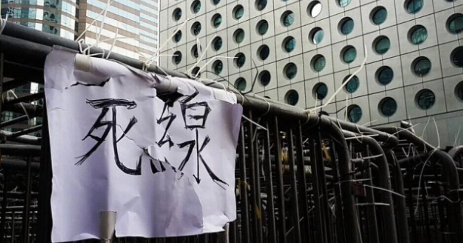

# 铁马

小丽结束了一天的工作，把耳机堵进耳朵来抵挡街上的喧嚣，iPod里的歌曲哀伤地唱着"多少往事甜在心头，夜雨触花这景致令我忧愁"。大概是她太喜欢这句歌词，都没注意到今天的弥敦道与往日相比分外冷清。

干诺道上开起了烟花，白色的雾气翻卷着，带着微微的杀气。所有人都很感动，鼻涕和眼泪一起流下来，好像失恋的时候看透了爱情一样。

金鐘道上面流淌着银河，复原了"天淡银河垂地"的诗句，大片大片的手机灯簇拥在一起，热闹的好似拉阔音乐会举行，现在是九月，秋天的风还没吹到香江。

而九月的桃园，囡囡在院子里骑着爷爷做的竹马，吱吱呀呀的晃个不停。阳光照在藤椅上，老人的脸大部分隐落在报纸下面，额头上的皱纹被阳光晃得发亮。囡囡的曾祖和我的爷爷是兄弟。我的爷爷也有一个竹马，那是用家院里长得竹子做成的。我爷爷的爸爸，也就是我的曾祖父，亲手为他做了这个竹马，就在爷爷骑上竹马在自己的童乐世界中肆意驰骋的时候，我的曾祖父伴着吱吱呀呀的竹马声远走台湾，有生之年再未回到故土，再也听不见自己儿子坐在竹马上摇晃的开心笑声。

人，终究是脆弱的，要被时代的滚滚江水裹挟，往前冲着，没有目的地奔流。每到了新的分岔口，就要做出选择，做出选择后每每回首这些分岔口，却都似曾相识，景色相同。

2006年的9月，台湾的凯达格兰大道开满红花，罗大佑在细雨中，在万人的包围中，轻轻唱起光阴的故事。

“流水它带走光阴的故事改变了一个人”。

施明德因为美丽岛事件被法院审判之时，陈水扁曾经是美丽岛的辩护律师。当陈水扁竞选台北市长，却因为澳门嫖妓绯闻形象受损时候，施明德又做了他的超级助选，帮助他拿下了台北选票。

恩怨情仇，利益交横，矛盾丛生，这就是政治，政治就是人性。

就在这样的雨夜里，施明德坐在总统府所在地凯达格兰大道之中，听着雨滴中散漫而去的音乐，一脸无奈和强作欢颜的笑容。

这些为了政治一生飘摇的人，有的坐上了总统的宝座，有的已经死在监狱中，有的就这样坐在旧相识的面前，强迫他们有尊严的退场。

在示威人群红色的海洋中，愤怒，无奈，悲伤，种种气氛肆意弥漫洒淌，这世界上本就没有最乐观和最勇敢的人，只有在一部分人的人生漫长河流之中的某一刻，他们做出了某些参照人生来看最勇敢的举动，而这些举动汇集了，相聚了，形成了最勇敢的事情，变成了时代的象征。

就在那海洋的周边，执政者为他们镶嵌了一圈银边，仔细看你就会知道，那叫做铁马。

铁马的基础作用是阻拦示威者，让他们知道合理的边界，不要冲过，也保证了在集会可以进行的同时不要妨碍其他的社会活动，这样来说，铁马是文明的象征。

我们在一些新闻图片上看到，示威者冲过铁马去表达愤怒和警察起冲突，这是可以理解的小摩擦，这个时候铁马的作用就显现了，这对双方来说，都是一种保护和缓和。

如果没有铁马，很可能示威者的冲动之举就会落下袭击警察，妨碍社会治安的罪名，甚至会给整场集会蒙上不理智且暴力的污名。而换位思考，周遭的国家机器，他们的防护面具之下，就是一个个有血有肉的人，可能就是你的邻居警察阿强，或是小区里帮你抓住小偷的阿亮。你是你妈妈的儿子，他也是他妈妈的骨肉，你们的对峙和摩擦起因根本不在你们身上，这也就是人的不得不。

如果铁马林立的场景带给我们的第一视觉冲击就是恐怖，可怕，想去摧毁，那可以归结为是情绪作祟。这些铁马，都是文明的象征符号。如果哪一天你见不到铁马了，要么是你压根没有权利举行合法的自由集会，要么是，最可怕的那一种结局，没有缓冲，没有矜持，是鸡蛋砸向雨花石。

2006年，红色的海洋并没有带来想象中的胜利。

阿扁公开说过，这样的静坐威胁是开民主倒车。（大意如此）可想而知，人性在政治的历练中从来都是被拷问的那一个。

看起来所有的类似的集会，结果大部分都很相同，但是对于每个人来说，它的意义都是不同。

一百年前，是青年人走在阵营的前面。

几十年前，还是青年人走在前面。

看看如今，还是如此。

但是现在的状况好了些，没有哪个政权敢毫无顾忌的毁灭青年，他们也得低下尊贵的头颅，听这些"乳臭未干"的黄毛小子们的申诉和要求。如果他们不尊重这些青年人，那就是不尊重这个时代和他们自己。

什么叫年轻？那就是他们悲愤，他们难过，他们渴望，他们的肌体中血液新鲜而炽热，他们也虚弱，迷茫，幼稚，但是这又怎样呢，谁不是从青年变为老年？

可是有些人相信的是石头，有些人相信的是河流，还有腐骨，蛆虫和粪便，还有星空，太阳，和烈火。

施明德听着罗大佑唱着台湾戒严时候的禁曲，眼角泛起星点泪花。

“这绿岛像一只船，在月夜里摇啊摇”。

如果说人是理智的动物，那人一定也是最情绪化的。他们记着生命中最自由，最轻松，最阳光灿烂的日子，并且怀抱着最虚无，最梦幻的理想。闭上眼睛，都会在心里骂一句，然后想起“郎骑竹马来”的年龄，怀念他，就像怀念老子说的“至圣无为”。

可这就是人。

如果要我对执政者有什么希望，我希望他们每个人都成功，都履行自己的诺言，都对得起自己的良心，当然我还有最后一个童话般的希望，我希望总统府的地下有一个小小的工厂，里面日日夜夜生产的是温柔的铁马。

（编辑：赵乾；责编：杨修）