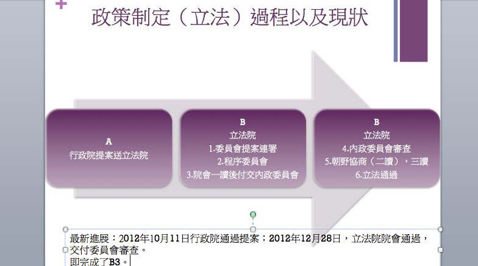

# 關於陸生健保的二三言

雖然陸生由停轉居並有可能納入健保這個並不是什麼新鮮的消息，我自己身為一個陸生，真心感謝,所有支持陸生納入健保的臺灣的朋友.

但我們也要清楚的看到，這不過是個闖關的開始，猶如一個RPG遊戲，我們現在只是砍倒了第一關的Boss罷了。何出此言？一方面，目前的陸生停轉居只是在行政院上獲得了草案的通過，在立法院九次闖關終於通過程序委員會的審核，但距離正式施行尚未一個明確的時間點，按照臺灣有關部門的比較理想化的推斷，應該會在下個學年結束之前，讓我們將手上的停留證轉成居留證，但事實是否會如願，我覺得還需要一些繼續的努力。而陸生健保，至今，不知不覺已經一年以上，請讓我站在一個當局者的角度，先幫大家小小的回顧這整個事件的來龍去脈

當首批陸生滿懷好奇和些許不安初次踏上這片土地的時候，他們除了遇見友善熱情的臺灣同學和各界民眾，又及特別熱情的媒體朋友之外，普遍都碰到了一堆我們最不想碰到的問題，依照上學期我們總結成文，共六大問題，而其中健保於其中，當屬最需要得到重視並得到解決的問題。

繼續追問，為什麼？為什麼是健保不是其他的工作，獎學金，甚至畢業後會被一腳踢回去對岸這些問題呢？以下是我自己作為一名陸生的一己之見，不能代表所有陸生，但我相信具有普遍性

首先，一個最大的出發點，人權，一個身為在這片土地上長期居留的，你說外國人也好，本國人也好的一點基本的權利，即生命健康權。我覺得這是毋庸置疑的，更何況臺灣自詡民主自由的精神。但事實是，剛剛來到，發現外籍生有健保，僑生有健保，甚至連外勞都有健保這樣的一種設定之下，為什麼我們沒有？這不科學！難道就因為我們是大陸人？

我記得很多臺灣人反問過我一點，我們難道去對岸有健保？

確實是沒有，因為我們自己都沒有,我們的醫保和社保能涵蓋的方面十分有限，不是不願給，這個真沒有……

但無能為力那就是現狀，於是，我們只好去反抗，因為不公平。

而記得最初的抗爭取得了一些成績。政府拋出了一個商業保險方案，說實話當時真的很開心，起碼有了一點保障，但事實上發現這根本就是根雞肋，而且還屬於特別沒肉那種。後來的淡江的崔耘學姐的例子上也充分證明出了這個保險的弊病百出,不具備實用性,賠償範圍小，保額低且保費較高。

而，繼續回歸到陸生健保問題之上，那麼納入健保對於臺灣社會而言，是否真是百害而無一利呢？有人認為全民健保是以具有居民身分為基礎而建立的社會互助體系，是臺灣社會團結的象徵，為什麼我們這些沒有臺灣身份證的陸生也可以納保？其實在其他國家,早有先例:名為NHS便是免費醫療體系的先驅，在英國,它不是只保障英國國民。每一個去英國留學的朋友都知道，在英國讀書停留超過六個月的外國學生，還有各種身分的外國人，只要符合居留規定，無論國籍，都可以在 NHS體系下獲得免費醫療。

這顯示一個趨勢，是福利社會正歷經一個全球性的轉變。最初我們基於社會互助與團結的目標，為了建立一個命運共同體，所有國民一起來參加全民健保；你能夠加入健保，是因為你是這個國家的國民。但隨著全球化，一些福利權利的賦予，跨越了國族身分的界線，成為普遍的人權。你在我的土地上停留、生活、工作、求學，雖然你不是我這個國家的國民，可是基於對基本人權的保障，我願意賦予你獲得醫療照護的權利。

我覺得臺灣的全民健保，其實也應該跟隨這個「普世化的權利保障」的趨勢向前進步！根據現行的全民健保法，只要在臺灣停留超過六個月的外國人，包括僑生和外籍生，都要強制加入全民健保；在臺灣有工作的外國人，如移工，從受雇當日起，就可以加入健保。大陸來台人士，只要有工作，也可以馬上加入健保。在這點上，臺灣賦予了來自世界不同地的人民共同參加健保的權利，讓生活這片土地上的人們，不會陷入沒錢看病的困境。如果這個命題繼續向下，當所有外籍生僑生都可以參加健保，為什麼陸生不能？難道就因為我們來自對岸？如果是因為我們的出身，那麼，為什麼「來台工作的大陸人士」就可以參加健保，不能工作的學生就不可以？這裡太多的雙重標準，我只能哭笑而不語~

第二個出發點，陸生納保，會擠佔到臺灣本身的資源嗎？

首先關於這點有許多似是而非的觀念，例如為何要給陸生搶資源，但其實剛好相反。社會學者林宗弘：「在批評陸生納保之前應該先對健保財務有所理解: (1) 目前外籍生是全額繳交保費. 陸生應該比照. 如此就沒有任何主權問題. (2) 臺灣健保支出有四成多是重症患者. 26%以上支出用於癌症患者. (3) 年輕人所繳交的保費多半用在中老年人身上. (4) 目前外勞與外籍生的保費超過其使用經費. 因此. 理論上陸生強制納保將會對臺灣民眾造成一小部分的補貼！況且，陸生來到臺灣之前，都有必須進行的體檢工作，來到臺灣，學校還會再進行一次體檢。

而經濟學者葉家興葉老師的觀點，我覺得在資料上給了我們一個比較客觀的說法「其實健保這種社會保險因為不以「年齡」作為精算變數，因此有非常大的年輕世代補貼老年人的「社會保險」、「世代補貼」含意。18-22歲的大陸本科生到臺灣，以地區人口也要每年繳7千多保費。四年近3萬，1000人就是3000萬。以這個年齡層的死亡率和患病率來看，對健保體系應該是收進來的比付出去的多，在財源上不無小補。搶資源一說，在精算上恐怕站不住腳。」

以此，作為我一個陸生的看法，衷心希望，臺灣能拿出自己引以為傲的公平正義精神，不僅僅留給我們，這一千八百多位為了求學的孩子們一個機會；也留給這福爾摩沙之地，一個全新的可能性；更留給，不斷前行中的兩岸，一個嶄新的未來！

 [caption id="attachment_28565" align="aligncenter" width="627"] 陸生健保闖關流程[/caption] 

採編：余澤霖 責編：余澤霖
