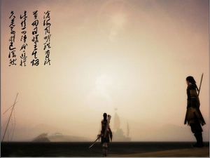

# 闲话金庸的武侠世界

一、从武打与武侠说开去

在那个网络和电子游戏还没有泛滥的年代，小说是一种较为流行的消遣。武侠小说也曾经被不解风情的家长们称为武打小说，认为只是毒害小孩不好好学习、不务正业的罪魁祸首之一。

金庸的小说当属通俗文学，其本身是在报纸上连载，商业化意图很明显。那么既然要吸引读者来看，就得把故事讲得够有味儿。加之其本身的通俗易懂，在那个年代很受青少年的青睐。当然了，现在之所以这么多人来分析金庸，结构金庸，绝不仅仅是故事情节上的猎奇，其深层内涵是道之不尽的。

武打是武侠的皮，是武侠小说的背景。借助那些杜撰的奇门招式，让人物拥有超距常人的能力，至于用这个能力干什么，这是“侠”的范畴。“侠”是一种价值观输出，这种价值观又植根于中国古典文化之中，无论是古代的正史记载还是文学作品，都不或缺侠的形象。武侠小说是现代人对传统的反刍和再演绎。深谙中国传统文化和文学的金庸便是古今两者最天衣无缝的桥梁。

对“侠”的定义并不复杂，舍己为人者、见义勇为者、锄强扶弱者、义薄云天者、为国为民者，这些都是金庸的侠。价值上是单纯的，但是价值背后的文化内涵却值得深究。

金庸小说中习惯对政府持负面态度，从最早的《书剑恩仇录》开始，“朝廷”便是一个贬义词。小说的两大反派，乾隆和张召重，一个是最高统治者，虚伪怯懦；一个是朝廷鹰犬，心狠手辣。但是乾隆似乎比后者还要恶劣一点。其中为之效力的武者的原罪就在于，为统治者效力，这就相当于站到了人民群众的对立面。事实上小说对正邪两派的勘分也正是代表民间的红花会和江湖群雄和代表官方的清朝当局与其众鹰犬。于是“侠”在小说中就有些脸谱化，反政府的那就是侠。

西方同样也流行过于中国类似的骑士小说，包括进入启蒙时代后的《三个火枪手》等，都能看做欧版的“武侠小说”。两者相同之处在于都用上武打搏斗的元素。但西方这类小说和政治的瓜葛不多，内涵上，还是深受文艺复习以来人文主义的影响，是讲人是如何活得开心的。行侠仗义后，名利双收，英雄要抱得美人归，个人主义和浪漫主义色彩很浓重。但是中国的侠客对伴侣要一心一意，懂得自律和禁欲，时刻把理想摆在第一位。

金庸早期对历史政治抱有某种焦虑感，这种焦虑感根本的成因是中国人对政治制度的不自信，于是金庸更倾向于出身民间的侠客充当正面。他们或者得志，或者悲壮。曾经看过一位评论家说，武侠小说标志着中国启蒙运动的未完成，深以为然。正是由于中国知识分子在如何构建先进政治文明上的茫然，催生了武侠小说这种政治童话的创作。相反西人作家对政治没有兴趣，因为那是另一个领域的学者已经完成的任务。他们有更多的闲心去表现人性的风花雪月。

因为而中西方在文学上的上述异同，也是两种文明存在的根本差异所致，文学是这种差异的一处侧面。

但是到了中期，金庸的这种茫然感和焦虑感开始日趋缓和，到了后期则全然释然，甚至走向了虚无，这是后话。

二、《射雕英雄传》的进阶

前两部作品《书剑》和《碧血》在十四部作品中所占地位并不高，但是些许苗头已经展露出来。个人认为《射雕》是金庸创作的一大转折点，从这部作品开始，金庸磨砺了故事编排上的娴熟，奠定了他将虚拟人物插入史实这一特色的基础。

《射雕》是一部非常恢弘的作品，把真实的历史和虚构的江湖融洽地糅杂在一起，没有了前两部这类尝试的生硬。而且在故事结构上运用了一个巧妙的明暗双线组合。

故事明线是老实憨厚的郭靖，暗线则是狡诈卑鄙的杨康。两人上一代是世交，原本的家庭背景相仿，但是突发的变故使得两人走上了完全不一样的人生历程，最后的命运也天差地别。

郭靖出生大漠寒苦之地，练就了他广阔的胸怀和单纯的性格；而杨康被女真贵族收养，成长在勾心斗角的政治环境中，使得他世故圆滑，诡计多端。此处又含蓄地体现了作者对政治的那种厌恶。

同时郭靖也是第一个确立了金庸描写主角使用“养成”模式的人物。他的武功一开始并不高明，天资也十分愚鲁，但是在江湖闯荡却左右逢源，得到高人相授，终成一代武学大师。但是凭的是这个人的单纯善良和处事认真，全真教的高级内功、洪七公的降龙十八掌、包括引得江湖上血雨腥风的《九阴真经》，都是无意间习得的。他的爱情也是如此。

而杨康一直在主动求索武学名师，最后他设计杀死欧阳克，以为这样就能得到欧阳锋的教授，但是死于欧阳锋的蛇毒。其中情节也是跌宕曲折。这是金庸对“性格决定命运”的诠释。

靖康双子是一个里程碑式的寓言。此后很多剧情都依照这个套路，好人的好报是因为他们的“好”，这种收益是坏人费劲心机是得不到的。这是金庸小说惯有的一个规律，劝诫世人待人处事。

除了郭靖和杨康，另一个对比是郭靖和铁木真。

《射雕英雄传》的命名取自两人在大漠上射雕的那段对话。成吉思汗问郭靖自己算不算是英雄。郭靖的回答很坦诚，广阔的牧场却是建立在这么多百姓的白骨之上，而你却无法长生不老，终之将死，这样的成功又有什么用？

毫无疑问最后的英雄当然是郭靖。金庸借郭靖评价铁木真这个历史人物，征服者的千秋霸业，不过也只是历史长河中的一瞬。为了自己的贪欲而杀戮，所谓霸业不过是统治者眼里的迷梦。真正的英雄是儒家那种“明知不可为而为之”的舍身取义者。历史功绩是虚妄的，但是高尚的精神却永世长存。

这是金庸在《射雕》所表现的朴素价值观和英雄观。

三、奇情怪恋与《神雕侠侣》

《神雕》是一部武侠包装的言情小说。

金庸很多作品都有一条引导故事的线索。这可以是一本武林秘笈，比如上一部《射雕英雄传》和之后的《笑傲江湖》；或者是迷失的宝藏，比如《雪山飞狐》；有的时候是藏着秘密的绝世神兵，比如《鸳鸯刀》和《倚天屠龙记》。目的是用这些诱惑去表现人的贪欲，再牵涉出想去阐述的道理。

但是《神雕》的线索却是男女主角长达十几年的恋爱经历。这次不再有论理说教，为的是歌颂爱情的坚贞。

首先要说的是，金庸的爱情观是十分传统的，甚至有几分迂腐。爱一个人，往往会一见钟情直至从一而终。极少出现移情别恋的现象。而且这种爱极为柏拉图主义，不带有任何现代人认为的有爱有性的观念。

这种思维可能金庸本人也被自己笔下角色在理想和原则上的执着所影响，以至于让他们在爱情上也是如此。

也就是这种对爱情的高度纯洁化，精神化和极端化，使得金庸笔下的爱情不那么近人情，有时甚至使人感到不适。例如为阿紫受虐自残的游坦之，实在不知道阿紫到底哪里值得他这么去爱，现在读来简直有种SM的味道。再比如为周伯通苦等几十年的瑛姑，难以置信一个女人愿意花去这么多年守候一个男人，以至于杀子之仇都被时间给稀释了。

用现代人的爱情观来说，恋爱本来是两个人的事。如果一方难以委屈求全，另一方又何必苦苦相逼？两个人选择恋爱，为的是双方都能受益到快乐。不能遂愿，合理的决策应该是再去寻找另外的人。再说得机械一点，恋爱根本上也不过是激素的作用，保质期如此长久，有点不科学。

对于这个问题，笔者觉得岳灵珊是一个亮点。在岳灵珊生前的最后和劳德诺的对话中，她声称父亲和丈夫“两不相帮”“自己太苦命”“要出家为尼”。这个时候她不再被爱情所禁锢，林平之既然如此出卖自己，那就就此恩断义绝。林平之如不杀她，相信她真的会这么做。

周芷若也是个很特别的形象。她爱张无忌，但这种爱很是微妙，爱中有恨，有嫉妒。周芷若被写成一个女强人，她有她的未竟之业，但也有感情上的羁绊。她利用她所喜欢的人，达到自己的一些目的，这其中夹杂的矛盾是难以道明的。到了《倚天》，角色摆脱了以往写女性的单纯和单调和情爱模式，让女人在智识上首次超过了男人。

金庸小说里，人总是带着很多枷锁，无法真正自由自在的生活。世俗的成见，师徒的秩序，感情的依赖。令狐冲对小师妹也是如此，但是他也没有再去苦恋。《笑傲江湖》是一部解放人性的小说。它的价值观彻底地拥抱了个人主义，爱情观上也是如此。

但是至于杨过，他的感情之路则没有的角色那么生硬。杨过是个遗腹子，很小时又没了母亲，是个半孤儿。用现在的话说这人从小缺爱。所以故事开始后他尽力抱紧好好对待他的每一个人。包括他那个疯癫的义父欧阳锋，也是因为从小没有父亲才愿意认的（欧阳锋和杨过的父子关系显然是金庸开的一个小玩笑，这两个人其实在前作中有着千丝万缕的联系，但是时过境迁阴差阳错地成了父子）。

有了这个铺垫，杨过对小龙女的一往情深就有了根据，既然这是宿命所致，两人的坚持也从而变得感人。

当然杨过也并非全无欲望的清教徒，在杨过生命中出现过其他女性和他的关系比较暧昧。这出自杨过机智好动的天性。但是在原则问题上又是很认真执着的。这样的安排使得人物更真实，符合人性。

《神雕》中还附加了很多次要人物的各色恋爱经历，而且都不同寻常。最开始的武三通因为对养女产生了不明不白的感情，压抑成半疯；李莫愁因为爱人的背弃，从冰雪可人的少女变成滥杀无辜的赤练魔头；裘千尺对公孙止夫妻关系中的强势和硬霸，使得丈夫也变得有些变态，两人互相仇杀。

武三通的遭遇是从侧面暗示不符合公序良俗的情爱悲剧，为了反衬杨过为了爱的不羁和牺牲精神和世俗的迂腐。而李莫愁和小龙女同门，两人结局不同，也是因为一个狭隘，一个豁达。

小说虚构的绝情谷和情花这种植物，是一个绝妙的比喻，用来寓意爱情带给人的伤痛和苦楚。情花的毒就是爱情的毒。李莫愁、公孙绿萼、小龙女和杨过都中过这种毒，而只有天竺高僧中毒无碍。最后也是因为一颗绝情丹，使得男女主角生离死别，十六年后机缘巧合才聚首。故事依然愿意赋予“有情人终成眷属”的结局。

四、英雄的迟暮与大汉主义的终结，以及政治抱负的瓦解

金庸早期不光是个反政府的“愤青”，同时也是个坚定的汉民族主义者。这点在第一部《书剑》痕迹很明显。

值得玩味的是，金庸的第一部作品和最后一部都是发生在清朝的故事，而且都引入和两位真实的君王，乾隆和康熙。乾隆毫无疑问是个反面人物，他代表的不光是无德的国家机器，同时也代表统治汉族的异族统治者。

到了《射雕》，这个立场依然很简单。金庸站在南宋汉族一方，确切地说是南宋底层劳动人民一方，南宋政府同样不是什么好东西。看最初借说书人和郭杨二人对岳飞的评价就很容易发现。

不过《射雕》中的郭靖似乎还有一定摇摆的余地。他血统是汉人，但是自小在蒙古长大，和铁木真之子拖雷是拜把子兄弟。这个时候固有的血缘和后天的养育相剥离开，似乎还有一些情感取舍上的空间可以挖掘。目睹蒙古军西征的惨状，郭靖还是选择了弱势的同胞。这是他作为一个英雄应该选择的。

到了《天龙八部》，乔峰和境遇取舍就比郭靖难得多了。相反乔峰是个汉人养大的契丹人，而且他一直不知道自己的国籍。

这其中就是金庸自问的一个道德困境，为什么汉族就应该天然正确？乔峰目睹汉人欺压契丹人，本着侠义道出手相救，而当上南院大王。这个时候侠之大者为，国为民的行为准则就和国籍立场有了尖锐的冲突。这是郭靖不需面对的。

郭靖和乔峰都是同一种侠，他们的价值观上升到了家国的层面，这是儒家的所倡导的。但在真实的历史中，如果再加入民族的问题，就会变得矛盾。如果本民族的统治者是昏庸的呢？如果异族的统治者是贤明的呢？这个队应该怎么站？《射雕》回避了这个问题，它说汉族的百姓需要谁侠者就去帮助谁，而《天龙》中，当乔峰发现所谓国际政治并非以往认为的那么简单，辽与宋，并不是谁压迫谁，征战议和，那是高层玩的政治游戏。两国交战，难道契丹的百姓就有错？汉族的百姓就是对？

金庸本人也回答不了这个问题，乔峰用他气壮山河的一死换取两个民族和和平。

前面说过，金庸的政治立场从最初的民族主义，无政府主义，走向了后期的虚无。让笔下人物从历史的影响者变成傍观者，祛魅了绝对的价值判断。

郭靖有着很强烈的政治抱负，他还想过要争取杨过加入抗战大军，但是杨过的本身不问世事，击杀蒙古贵族只是迎合最后的故事高潮，算是这个人物的率性而为。

到了张无忌，那就是一个完全没有任何政治头脑的人物了，他的原型来自早期同样优柔寡断的陈家洛。而看得出金庸很“怨”陈家洛的“不成器”，让他失去了爱人香香公主，于张无忌就宽容多了。

乔峰是金庸塑造儒家大侠的顶点，也是终结。从此以后再也没有这样光伟正的人物出现了。这个时候的金庸对儒家的政治观和汉民族主义发生了动摇，以至于最终摒弃。《笑傲》是金庸对以前理想的诀别。他告诉读者，其实民间的江湖也不是自己说得那样全然由人情道义支配，这只是另一个政治舞台。这两点集中体现在《鹿鼎记》身上，政治从来不是理想主义者该趟的浑水。

这里想到以前听过的一句笑话，女人的某个部位和政治都是很肮脏的东西，偏偏男人对这两者最有兴趣。让韦小宝出身妓院，腾达于皇宫，这是一个欲望与权力的隐喻。韦小宝在罗莎国帮助索菲亚公主政变，使的是他在瓦舍听戏的“围魏救赵”一节，这出千把年前发生在中国的事件，也能在俄国奏效，其中是一种对帝国政治文化的调侃。言外之意是几千年这种情况就没变过。

《书剑》中的乾隆是个反派，但《鹿鼎记》中的康熙同为满洲外族君王，金庸对他的态度不偏不倚，是中性。看得出来此处金庸也意识到，古代帝王将相，也没有什么好评论的。他们统治的出发点并不是不食人间烟火的道德使命感，而是出于作为君王固然的职业职责，或者是皇族贵胄御统天下的一家之利。而中国历史上的那些王朝变更，没有人是出自他想要的那种救黎民于暴政水火的高尚诉求，明君与治世，只是个人与天下的规律性的双赢而已，其本身有它自身的变量去确定，无需加入任何价值判断。真正的合理社会，去依靠某个不出世的贤者是幼稚的，但是金庸总是寄托笔下的侠士，为读者编织梦想。

所以韦小宝不是一个影响者，他只不过被借来旁观和展现权利游戏该怎么玩儿。

从第一部到最后一部，金庸在认识上完成了惊人的成长。

（采编：孙晓天，责编：佛冉）
