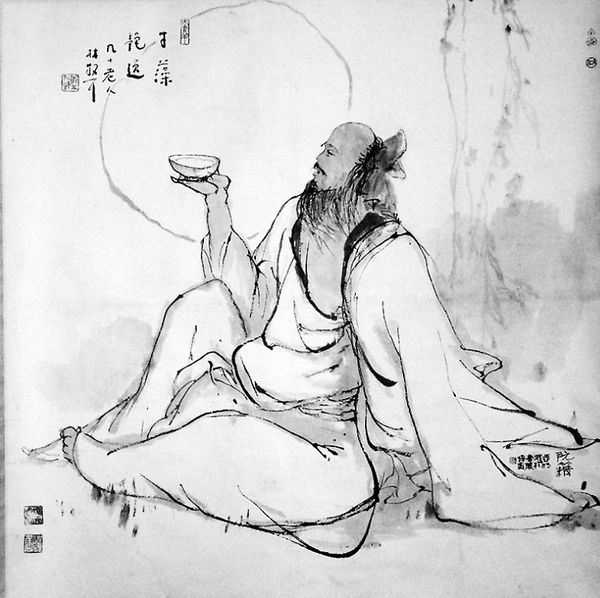

# 阅读的焦虑

** **

这两日购得十七本书。我先是忙忙碌碌地清理了一番书柜，腾出位置来，再热切地把它们整整齐齐地罗列在书架上。我本以为自己会像个种完土豆的农民一样，在完成了繁重的劳作以后，如同打量着平整的土地一样满心欢喜地用目光玩赏这一列排开的书，再静静地点上一根烟，吸完。

结果当我盯着那一溜漂亮的书脊看时，我突然感到了一种深刻的焦虑。

对于焦虑这种情绪，我向来是瞧不上眼的。从前激赏麦芒的几句诗，“你只需叹息，像一场梦/你只需存在，哪怕被毁灭/这一切已经足够幸福了/就不要再追求什么不朽”。在我看来人生的理想境界是刘伶那样的，乘鹿车，携美酒，使人荷锄随之，死便掘地以埋，才高于志，土木形骸，这是一种多么具有审美意义的生活方式。至于焦虑，那是对这世界汲汲有所求的人才会具备的情绪，如若连不朽都不求了，那还有什么可感到不安的？

焦虑最让人感到可鄙的地方是，一旦承认了它，就等同于承认你失却了轻视这个世界的风度。在生活面前始终葆有从容与优雅，这至关重要，因为生活本身就是一篇由白痴讲述的荒唐故事，充斥的满是无意义的喧哗与骚动。

这是我十八岁时对焦虑的看法，想来那真是我活过的并不算长的年月里最好的一段。那时读高三，课室的书桌上总是堆上四五本闲书，放着一只盖碗茶杯，月白中隐隐透点天青色的杯身上绘着一朵墨莲。后来我还在桌上养了一条斗鱼，它在狭小的杯子里摆动着它长长的尾鳍，像一小团优美舒展开来的深蓝色墨水。别人在做习题时，我在读宇文所安，读本雅明，读北大中文系选修课的课堂实录，把喜欢的词句抄在小本上，从中感到一
