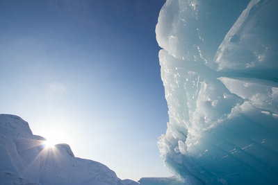
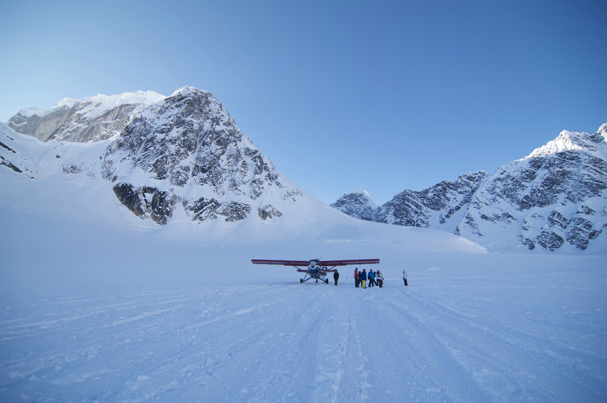
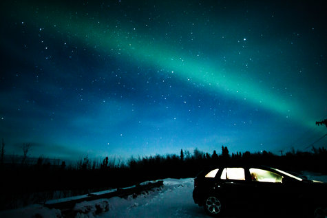
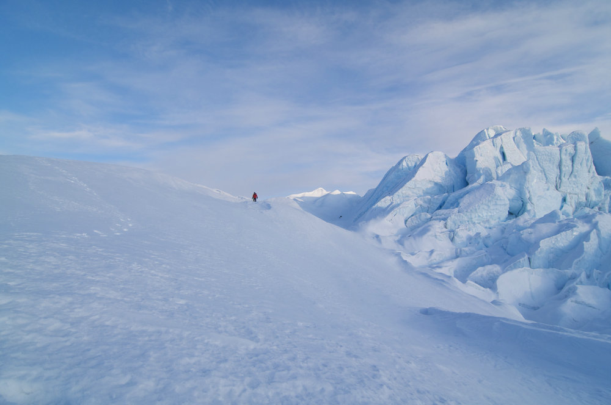

# 阿拉斯加，我们有这千山与万水

###阿拉斯加，我们有这千山与万水###
    
147年前，阿拉斯加被俄国以每英亩二美分的价格卖给美国，这片远离尘嚣的荒野一度被揶揄为“总统的北极熊花园”。而如今，阿拉斯加成了无数人床头灼灼的白月光，万千旅人心中缱绻的新雪花，一部《荒野生存》，更让阿拉斯加成为自由和梦想的圣地。时值三月，我尚在初春的纽约带来的焦灼和忙碌中挣扎，机缘巧合地被朋友约去阿拉斯加。一路从美东辗转到阿拉斯加最主要的城市安克雷奇，足足花费14小时，抵达机场已是深宵，女孩子们拉出睡袋在机场静僻一角直接入睡，同行的男士轮流守看行李。我卷在睡袋里恬静入眠，机场外星空寂寥，白雪皑皑。现代人平日里考虑的事情太多，牵绊也太多，根本无暇体会心中渴望自由的灵魂。而阿拉斯加无疑是自由的，它远离美国本土，有生俱来的寂寞；它幅员辽阔，是灵魂革命最好的战场；它头顶着漫天极光，我们都相信这是世界上最美的光，将给我们带来海阔天空的幸福。

###冰川，万物皆有魂魄###

在机场提了两辆SUV后，大家直奔沃尔玛购足面包零食饮用水，往后的9天里我们只坐下来吃了三顿饭，可见阿拉斯加条件之艰苦。简单用完午餐后，我们驱车前去汽车可以抵达的全美最大的冰川——Matanuska Glacier。冬季的冰川公园人迹罕至，并不对外开放，公园门口只有一家纪念品店开着，需要签一张“入公园后果自负”的生死状才让我们进入。
    
安克雷奇云淡风轻，气温不过零下十几度，比想象中温和许多。公园内供行人健行的步道早已被雪覆盖得不见踪影，有时候地上忽而出现一条冰缝，有时候又忽然踩进埋过小腿的雪堆，谁也不知道脚下是什么，我们就沿着雪地车留下的车辙小心翼翼地走着。刚刚开始的时候，视野所及之处只有低矮的雪山和灰褐的岩石，天地间只有我们一行十人，谈笑声散入清冽的空气，竟只踩在雪地上窸窸窣窣的声音最清晰。
    
绕过一块小高地，眼前的景色骤然壮美至勾魂摄魄。一条条冰川如同跃出水面的海豚，尚带着晶莹的水滴，在阳光下闪着蓝色的光芒。我从冰川的罅隙中走过，居然觉得惊惶，因为积雪需要经历过千年才会从乳白色变成这样剔透的湛蓝，深怕自己轻轻一触碰就万劫不复地破坏了这漫长的修行。《荒野生存》的男主角克里斯托弗里在电影里说“我想那么年轻，干净，那么寂寞地生活着”。此刻的我们，那么年轻，那么干净，面对着大自然花了万千时间缔造出的胜景，也显得寂寞而渺小，幸运的是，我们如同张岱在《湖心亭看雪》中一般，遇到了“莫说相公痴，更有痴似相公者”的痴心人。
    
据说阿拉斯加有十万多条冰川，也是世界上冰川消融速度最快的地方，我们站的地方，下面恐怕正有细微断裂的声响，带着难以自抑的悲伤；远处的树木，黄昏的日色，乃至拂过的风，都似在注视着我们这群不请自来的访客。离开冰川的时候跟纪念品店老板打了招呼，逗了逗他养的一条黑狗，一整个下午似乎只有我们这一队游客。店主告诉我们冰川的面貌每天都在变化，那一刻我心中庆幸我拥有过这世上这冰川最独一无二的时光，过去和未来，都不会有人再看见。这一切都是有生命的。

###麦金利，群山静默如谜###
 
只有三条路的小镇塔基那带给我很温柔的回忆，深夜里坐在木屋的摇椅里，煮一壶咖啡，翻一本过客留下的旧杂志，星光落在在窗台上犹如散落的金箔。阿拉斯加的家庭旅馆总是布置得充满人情味，摆满了书籍，摄影和艺术品，又鼓鼓囊囊地供应着暖气和热饮，教人全然忘记屋外是如何严酷。
    
第二天醒来，也是在这个小镇上，我们坐着小飞机去看麦金利。这架叫罗密欧的小飞机颤颤颠颠从简陋的机场起飞，引擎声隆隆作响，需要戴上墨绿色的大耳机才能听到飞行员的话。从飞机上俯瞰阿拉斯加的土地，除了一条延伸至天边的高速公路，其余皆被雪覆盖，悄无声息，间或出现一抹蓝宝石般的光泽，是一个冰湖。飞行员说夏季的时候会看到郁郁葱葱的森林和星罗棋布的湖泊，但是冬季来也很好，出奇得安静和肃杀。
    
飞到阿拉斯加山脉上空的时候，机舱外是连绵起伏的雪山，被冰川勾勒出的地形在夏季原本更凌厉险峻，可以想像裸露出岩石的时候是如何直刺云天。帅气的飞行员驾驶着飞机带着我们在群山中穿梭，告诉我们此刻脚下是冰川中的“亚利桑那大峡谷”——罗斯冰川，此地冰层厚度超过千米，两边是高约1500米崇山峻岭，故而深度是大峡谷的两倍。我们把脸贴在舷窗上俯视，罗斯冰川全然不似静止的景观，在阳光下随着角度变幻蜿蜒，如同汹涌的大河一般展现着生命的张力。飞行员指着不远处山腰上一处半圆形的突出物，告诉我们有一个摄影师每年都会在那里度过六周，又指出一处山谷说夏季的时候那里扎满了登山者的帐篷。阿拉斯加山脉主峰麦金利峰是北美第一高峰，海拔6194米，以凶险著称于登山界，暴风雪常常是被下面的风卷携到高处，气候十分恶劣。纵使这样，也抵挡不住人类对自然之美的向往。
    
那天是万里无云的好天气，偏只在最高的一处山峦白云缭绕，那便是麦金利峰。麦金利是美国人后来起的，印第安土著称它为德纳利，意思是太阳之家，被当地人奉为圣山，若非极度幸运，难以目睹真容。小飞机在山峰中灵活地盘旋，在几乎要跟麦金利擦肩而过的那刻，忽而云雾散尽，山顶上覆盖的冰雪仿佛触手可及。我从未抱希望能够看到如此坦白的麦金利，却在离它最近的一刻被它彻底惊艳。在从前看过的照片上，它不过是一座孤独的高峰，对于普通人而言甚至没有太大的美学上的意义，而被真正被赋予了这份可以亲眼目睹的幸运之后，才知世界待我多么好。
    
尔后飞机降落在一片平坦的山谷冰川上。没有航站楼，没有飞机跑道，也没有别的飞机，只有几个红色的标记来辨识方位。从小飞机里出来走在冰川上，两边除了雪山没有别的风景，却丝毫不感到乏味，反而有一种身在广寒宫般的轻灵。人走着走着就变成细小的黑点，在群山之下分外渺小，又因为是天地间唯一的灵动而显得夺目。
    
返航的时候回看麦金利峰，又被笼罩在恍恍惚惚的云雾中。它本不肆卷红尘，才在这荒凉世界里把自己遮掩成一个秘密，却在恰恰好的时候对我展露俗情，使得我觉得自己也带上了神性的光辉。

配图2

###极光，一切因你而值得###

冬天去阿拉斯加最初的动机一定是为了那一道绿光。在去极光之城费尔班克路上，我一直在刷阿拉斯加大学地理研究院网页，上面以0到9标注着极光活动强弱指数，可惜数字一直停留在不甚乐观的2上。好在高速公路上风景壮美，时不时有观景台可以停车欣赏，天空干干净净，冰河干干净净，树木干干净净，卷起的风尘都干干净净，让人全然沉溺，不愿念及其它。
    
费尔班克是阿拉斯加自驾游能开到最北的城市，城市不大，来往的多是来看极光的游客。为了在凌晨去看极光，我们在一家做夏威夷菜的餐厅吃了全程第二顿饭，就回酒店休息了。阿拉斯加和夏威夷，美国独有的远离本土的两个州，一个最北，一个最南，被我们用食物无意间串在了一起，食物真是跨越空间的美妙纽带。到了深夜10点，裹上两三层外套，往费尔班克郊区赶。

看极光要远离城市，城市的灯光如人类在自然界里一样，霸道得让原始的光芒黯然失色。我们选择了一间坐落在山顶上的木屋酒吧。酒吧装修粗旷，酒杯都比我在纽约看到的大上一倍，到处挂满了动物标本和皮草，显示着这片土地的原始和血性，还有闪耀着金属光芒的摩托车和朋克风的皮夹克，颇有误入大王山寨的感觉。除了我们十人，还有一群日本的中年人，他们轮流着在外面观看天空，等待极光到来的一刻通知全团。酒吧只有一个老板娘，年逾五旬却风采奕奕。因为墙上还挂了不少脱衣舞娘的黑白照，我们不禁猜测老板娘就是照片里的人，年轻时看尽姹紫嫣红，才选择在极寒之地恬淡地经营这么丰盛的酒吧。
    
到了凌晨1点多，极光还是没有任何活动迹象，我们从酒吧出来决定去另一个山顶等。大家盯着夜空几近疯魔，数度错认远方的城市灯光为极光，倒是星光静静洒在雪地上亮得耀眼，亮得连吸血鬼都无法生存。外面是接近零下三十度的低温，即使开足暖气，因为经常要开关车窗的缘故，车内还是冻得吓人。为了唤醒昏昏欲睡的身体，我们两台车里的人就拿出对讲机互相唱歌，从动力火车的《当》唱到迪克牛仔的《有多少爱可以重来》，每一首都可以唱到热血澎湃，有滚滚红尘之中肆意妄为的青春，还有充满憧憬又始料未及的遗憾。

直至近两点，天空微微发亮，泛出若隐若现的绿光。我们从车里跳出来，架起三脚架，等着极光变强。然而极光只是由淡转浓，依旧是平铺的一条，除了让我笃定不是自己的幻觉之外，并没有上下跳跃变幻无穷的动感。但在夜的画布上，本已有万千璀璨繁星，竟无端多出贯穿穹顶的绿光，还是美得全然不真实。科技已经如此发达，到底还是自然最颠倒众生。不久绿光似华美现身又娇羞谢幕的昙花，渐渐隐去。在露天冻得四肢麻木的我们，这才回酒店补眠，发现发尖都结了冰。

    
后来的几天天气状况愈发不好，再也没有见到极光的机会。在阿拉斯加最后的一夜我们又回到酒吧，期望能等到盛大的极光，老板娘为了我们特地延迟关门时间，遗憾地告诉我们晚上会有暴风雪不可能看到极光，但是她说我们还年轻，一定还有机会再看到。我已经去过了很多城市，走过了很多土地，辗转各处，余生自然有的是机会一路向北，再憧憬一场极光。但这一次，我们已经经历了这个世界上最美好的事情，看到过这个星球上最绚丽的光束，我很难想像自己还能重逢这样的感动，爱到深处，真是容易变成悲观主义者。

###极圈，良宵可消永夜###
    
费尔班克以北再也没有城市，7小时车程外只有一个叫做冷脚的小营地，是为来往货车司机歇脚用的，再远处就是美军北冰洋的基地。很少有游人会驱车前往冷脚。通往北极圈唯一的道路——达尔顿高速路况并不好，有很长一段砂石路，也很可能被冰覆盖，汽车保险公司表示不会负责在那段公路里的任何事故，北极圈土壤冻结，植被稀少，除了苔原地貌，也没什么风景。但是我们还是要去，总想跟与众不同，大概是所有年轻人共有的矫情。中途没有任何加油站，我们连汽油都是在费尔班克买好，灌装在壶里随车携带。
    
在达尔顿高速入口处，我们信心满满地合影，觉得自己像是远征的英雄，而我们的终点是只在地理课本中读过的从来可望不可及的北极。越往北，树木就越稀疏低矮，从针叶林，变成灌木丛，最后变成苔原，阿拉斯加高耸的山脉也不见，只有起伏的丘陵。入夜后，汽车的灯光就成了北极圈夜景的缔造者。远光灯打在反光路标上，一片寂静的黑暗中就瞬间出现银色的通道，像是在向远古时代穿越。即使开着SUV，我们依然是这条公路上最小的车。除了我们，只有巨大的卡车。《变形金刚》里擎天柱的原型一定是这些运输物质的大卡车们，远远就能看到它们的车灯，在上坡的时候直直射向天空，外星人仿佛随时都可能在某道光中出现。
    
七个小时我不知道睡过去了几次，每一次醒来窗外都是一片混沌的黑色羼杂着卡车移动的灯光，直到前方有一处静止的灯火，才安下心来。冷脚真的很小，只有一溜住宿的平房，一间最北的小邮局，还有一间小小的餐厅。停车场倒是巨大，歇满了大货车。男生们被这些洋溢着雄性激素的大铁盒子吸引，扔下行李就去合影。女孩子本来累得只想休息，而在北极圈里有这么一个供应着洗澡热水，松软被褥，充足暖气的地方，简直是钟鸣鼎食之家，又让大家兴奋起来，于是吃零食啃面包削苹果。苹果清冽的口感，在经历了几近极限的环境后显得沁人心脾。冷脚几乎没有光害，本该是看极光的好地方，只是那天开始，天气已经趋于阴沉，连月光都影藏在厚重的云层之后。
    
三月份的北极圈夜还是特别长。夜容易让人疲倦，使人脆弱，从窗口望出去，雪地里的夜一片苍茫，天寒地冻。跟同伴互道晚安之后，我拿出电子书看弗朗索瓦兹萨冈的《我最美好的回忆》。即使在城市中消磨了二十多载时光，我还是热衷于幼稚又浪漫的乐趣，我心想这大概是我能经历最长的夜，万万不可就这么睡去，总是要读一本足够性感的书来释放思想。过去几天实在精彩，比想象更疯狂和意外，纵使明知回忆不能复制，但因为足够美好，哪怕只看见过一次，只感受过一刹那，就再不能当没有发生过。 这长长的一夜我先是在车轮上，被隆隆地载向北极，再是在万顷冰雪上唯一的旅店中，赤着脚穿着背心读书，哪怕这是个没有太阳升起的极夜，也是一个兼具天时地利的良宵。
    
我果然睡到10点，睁开眼起身擦了擦窗上的雾气，看到雪撬犬拖着两个胖胖的男人在雪地上跑过，阿拉斯加的人民都胖胖的。之后去和朋友去小餐厅饮咖啡，给家人朋友写明信片，期间也回复了几封工作琐事的邮件。生活大部分时间是无聊的，而在无聊之余，可以专门去爱一个人，去做一项志业，去陪伴一群朋友，这就是我想活成的生命。

###风雪，天空多灰亦放亮###

从北极圈往安克雷奇有十几小时的车程，为了赶上次日下午的飞机，在冷脚寄完明信片我们就返程。公路边是全长近1300公里的阿拉斯加输油管道，从北冰洋边的普拉德霍弯终止于南边阿拉斯加弯，兴建这样一条钢铁蛟龙，当时一定历经艰难：地震，雪崩，森林火灾，每一样灾难都不容忽视；永冻层，活跃的断层，定期迁徙的动物，这些脆弱的生态都要小心提防不能轻易打扰。
    
白天的极圈依旧是迷迷濛濛，明明只是阴天，却到处飞扬着灰烬一般的细雪。停车出去感受了一下，风大的站不住脚，全然感觉不到寒冷，刮在脸上炙热如小火。北极风卷起陈年的旧雪花，低低地扫在路上，扬到半空，伸手去捉又握不住，早就穿过手指的罅隙又不知飞往何处。
    
彼时我们对极光尚存一丝念想，特地在费尔班克停留了几小时。还是在那个酒吧，老板娘给我们端来炸鳕鱼和牛肉汉堡，自言自语道：“这些孩子肯定很累了。”又劝告我们要早些出发，因为深夜会有很大的暴风雪，也许不好开车。我们对暴风雪全然没有概念，只觉得不过是雪大一些，风大一些，而后来遇到能见度几乎为零的雪，绝对始料未及。
    
我坐在车后排已经睡着，人声离我很远，隐约听见有人说着先停一小时等看得清路了再走。风声飕飕得也很远，梦里舒缓而宁静。直至有人把我推醒，让我下车，说是车偏离公路，陷在雪地里出不来。此时天光已微亮，我张望了一下四周，雪仿佛永远下不完，天地被茫茫的雪连接成混沌一片，前面哪有什么公路，只有一片莽莽雪原。
    
男生们把女孩子转移到另一辆汽车里，然后开始想办法把车从雪堆里挖出来。我不知自己身在何地，手机信号也断断续续，连找保险公司救援都无从联络，男孩子只靠着后备箱里自带的简单工具，根本无从下手挖车。万幸过路的车辆虽然不多，但每一辆都停下来帮助我们。有一辆越野车里载着全家6口，车内东西很多非常凌乱，看样子条件也不是很好，女主人翻了很久给了我们一条粗绳，希望能够把车拉出来。最后还是一群路过的阿拉斯加男人，穿着牛仔裤就从车上跳下来给我们拉车，大概是看我们几个亚洲人细皮嫩肉不堪重用，直接支开我们，仅仅靠着他们五个人，两个拉，三个推，居然把车硬生生拉回路面。完了拍了拍雪花，又拍了拍我们的肩膀，跳上汽车，在雪地中绝尘而去。那一天状况百出，尔后车轮被戳破，我们又在雪地里上演了一出换轮胎的戏码，后来居然还能及时赶上飞机，真是不可思议。 
    
雪也不知道是什么时候停的，原本簇新的车辆沾满了泥泞。开入安克雷奇境内的时候天空一成不染，晶莹透明，几小时前的慌乱如梦似幻，犹如溢出去的清水，心知再不会重演。那场雪不知是否还在那片土地上日继以夜地下着，雪下得越密集，人和人就越接近，越混沌，就越想靠近同类。

从安克雷奇飞往纽约的夜间航班很长，回忆起整个阿拉斯加的旅行却好短，似乎除了雪，冰，和那道极光，再没有别的景致好同旁人讲。米兰•昆德拉觉得最好的时光是“人在无限大的土地之上，一种幸福无所事事的冒险旅行”。感谢我的九个挚友陪我一路同行：丁哥，飞姐，越哥，陆少，安哥，韡韡，小雪，菲菲，军鸽。与你们一起见证过伟大的存在，壮丽的瞬间，极致的浪漫，才体会到《荒野生存》中的幸福最终需要分享的意义。 短暂的是那道极光，漫长的是从此以后对我们终将永远幸福的信念。短暂的是那场暴风雪，漫长的是对未知路上坚持不懈的毅力，前方无风无雨，只要我们有这手与脚，就可以拥有这千山和万水。

(责编：刘铮)