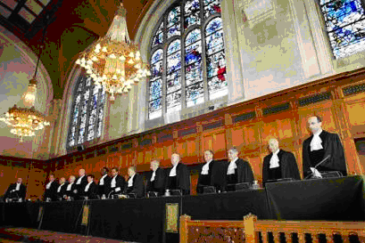
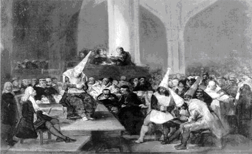

# 陪审团那点事儿

一

那是2011年的夏天，我在联邦法院实习。被分配了案件之后被告知，法庭正在进行一场陪审团审判（jury trial），值得去看看。这次审判尤其不同，因为是死刑案。美国尤其在北方各州，死刑适用十分严格，不少州业已废除死刑。而刑事案件很多又是州法，所以在本辖区联邦法系统内，这已经是很多年来的第一次死刑案件——事后该案案犯确实被判处死刑，更是本辖区联邦法院多少年来的头一遭。

总之，这是一件非同寻常的大案。等到我去看的时候，陪审团已经宣判被告有罪，进入了死刑审判环节。通常，量刑是法官的事情，但如果要判一个人死刑的话，必须由陪审团同意，而且与有罪环节一样，必须由12人一致同意，一个人不同意都不行。而在死刑环节，《联邦证据规则》并不严格执行，所以能见到的证据也更广泛。

案情并不复杂，一个较大的毒贩察觉一个小毒贩与自己的生意抢地盘，于是将其杀害。并非所有谋杀罪都是判死刑的，本案中被告杀害手段之残忍、灭绝人性，是检方要求判死刑的主要原因：案犯拿着工业胶布与棒球棒，进入小毒贩家里，将几个受害者脸部包缠起来，然后用球棒将其一棒一棒地打死。具体的血腥情节，我就不多说了。

说到这里，经常看律政剧如《Law & Orders》的人估计会想象法庭是怎样一副激烈的场面：有控辩律师的精彩交锋；法官拼命敲着法槌高呼”Order!” “Order!”；待到宣判时陪审团主席坚毅地站起来，目光如炬扫视全场，深吸一口气，以坚定的口气、洪亮的正义之声宣判：“有罪！”“死刑！”

然而现实中，这一切，是全然没有的。

在刑事案件中，控方深知程序正义对判决公信力之重要、辩方也深知保持良好的形象才能打动陪审团；而真正进入陪审团审理阶段的刑事案件只占5%左右（其他案件绝大多数都通过控辩交易认罪了事），故这些案件多是大案要案，不可不慎。因此，在刑事案件庭审中，控辩双方律师的关系反而更融洽、更配合。整个质证过程虽然充满了血腥的凶杀图片和林林总总的个人生活历史，甚至有哭泣与落泪，然而总体上却显得相当沉闷、按部就班。

当陪审团宣布判决的时候，空气像是要凝固了一样。毕竟，一个人是生是死，就是这一分钟见分晓的事情。陪审团的主席站起来了，他的声音却有气无力，念判决的过程中头一直低着，甚至不会抬起头来看看法官或是庭上他人。与其说是定人生死的判官，倒不如说更像是一个做错了事情的孩子，机械地、木讷地将判决的问题与答案一条一条念出来。如果不是全神关注地盯着他，甚至可能漏掉他在念到是否判决死刑的问题时那声若游丝的一个“Yes”。

我非常能理解为什么会出现这样的场景。陪审团员都是背景清白的平民百姓，手握生杀大权的之时，权柄的重量，是令人心存敬畏的：这些陪审团员将一辈子记住这一幕，记住他们亲手将一个活人交给死神——哪怕这个人是个罪人。而万一他们弄错了，将更是一场挥之不去的梦魇。

二

在英美文化中，陪审团一直被视作自由人的最具象征性的权利之一，英国《大宪章》中就有” No free man shall be taken or imprisoned . . . except by the lawful judgment of his peers or by the law of the land.”（非经同侪之审判，或依习惯法，自由民不受拘捕监禁。）其中”judgment of his peers”，指的就是陪审团审判。这和学术期刊的“同行评议”(peer review)里的"peer"是一个用法。今天的陪审团制度，就是这个“同侪审判”的历史遗迹。

历史上的陪审团是一个"self-informing body"，一个“知情群体”。意思是说，陪审团员因为都是乡里乡亲，所以自然应该知道嫌犯是否有罪，因此并不是到法庭上来听取证据然后认定一个真相的，而是直接来宣布真相的——无论是决定起诉的陪审团（presentment jury），还是判决的陪审团（trial jury），做出决定依据的都是陪审团自身了解的情况。在中世纪的农业社会中，人口流动性很低，因此各家对乡邻的事情都很清楚，陪审团在开庭之前，就应该已经知道答案了。所以说，中世纪的陪审团是知情人（或可能知情人）组成的陪审团。

在13世纪以前，陪审团是“起诉陪审团”(presentment jury)，更接近于今日的“大陪审团”(grand jury)，只负责决定是否对某个嫌犯提起刑事诉讼，而不是“判决陪审团”(trial jury)。在陪审团根据自身对事件、对当事人的了解，决定提起诉讼之后，法庭将使用“神判”(trial by ordeal)的方式来裁决被告是否有罪：教士祈祷上帝显灵，然后被告被五花大绑扔进水里看看是沉下去还是浮上来，或是把手放进沸水里、用脚走过烧红的铁，看看若干天后是否愈合。

教会逐渐认为，这种引诱上帝显灵的行为违反基督教义（见路加福音4：12 Thou shalt not tempt the Lord thy God. 不可试探主——你的神），于是到了13世纪，也就是我国的南宋末年，教会才禁止神职人员参与神判活动。这么一禁止，实际上神判就被废除了。因为没了神职人员作法，就没法请上帝显灵了，那么被告被扔进水里是沉下去还是浮上来就不能说是上帝的旨意了呀。神判被废除了，那么原来只用于提起公诉的陪审团，就顺理成章地变成了宣判有罪无罪的陪审团。前面讲了，中世纪的陪审团是知情人或可能的知情人组成的陪审团，那么他们来判，没什么不合适的。

当然，让负责起诉的陪审团来审判，审判者一下子从神，变成了人，在一个全民信教的古代社会里，是一时很令人难以接受的事情——老子以前只受上帝的审判，凭啥现在让老子受凡人的审判。而且还有一个很明显的问题：既然一群人决定某人应当被起诉，就说明他们觉得某人可能有罪，如果再让这群人宣布这个人到底是否有罪，那无疑就有了偏见，从而只是摆设。所以在神判废除的初期，很多被告不愿意接受陪审团的审判——这与今天强烈要求陪审团审判这个主流形成鲜明的对比。

那么神判被废除了，被告又不接受陪审团，怎么办呢？用刑呗。这些可怜的被告就会被压在一块大石头底下——别笑，这是真的，这个程序有个充满着文艺青年情调的法文名字，叫做”peine forte et dure”, 意思是“强烈而持久之痛苦”。这强烈而持久之痛，直到他们呜哇呜哇地求饶、同意接受陪审团审判为止；或者到被压死为止——有些被告选择被压死，因为如果被判重罪（felony）罪名成立，全部家产要充公交给国王，这些人为了给妻儿留下活路，宁愿被压死。到了14世纪，被告有权要求，参加了负责起诉的陪审团员不得参加负责判决的陪审团，判决陪审团才正式从起诉陪审团中分离出来。

然而经历了黑死病、又经历了城市化，原有的农业社会组织遭到破坏，这时候再指望陪审团来提供真相信息显然已经不现实。在一个由陌生人组成的社会中运作的陪审团，就不得不演变成了一个像大陆法系里的法官一样听取证据然后认定事实的组织。 在美国，司法体系出于公正性的考虑，很早开始就有意地避免选用那些已经获悉案件信息的人作为陪审团员，譬如美国独立战争导火索之一的事件波士顿惨案中，为了公正审判向殖民地民众开火的英军士兵，法庭特地到远离事发地的地方选取陪审团员。英文中的偏见一词——prejudice，就是预先(pre-)已经有了自己的判断(jud-)的意思。今日美国法庭对陪审团员的遴选有着一套复杂的、甚至有时相当费时费力的调查过程，称之为”voir dire”，就是为了排除那些可能有“偏见”、可能会先入为主的陪审团员——这个程序也引致了一些批评，因为在这个过程中，律师可能以排除偏见之名设法操弄陪审团人选、排除可能对己方不利的陪审团员，从而选出对己方有利的陪审团。

不管怎么说，陪审团发展到这一步，其实与原来大宪章所要保护的陪审团，根本就不是一个东西了；如果说中世纪农业社会的陪审团是一种社会的自治组织、能够提供“法庭所不知道的信息”，今天使用陪审团则完全没有这个成分，甚至要特意排除这个成分——不但要严格筛选陪审团员，而且要通过各种证据规则(rules of evidence)来决定哪些证据陪审团员可以看可以听，哪些不能看不能听（如大部分的“传言证据”, hearsay）；陪审团员在判决的过程中，只能考虑法庭告诉他们可以考虑的证据，决不能依赖任何“法庭所不知道的信息”。因而，今天使用陪审团，多多少少有那么一点因为传统、为了使用而使用的成分，所以说，是一个历史的“遗迹”。

三

但陪审团制度显然不只是一个历史的遗迹。到了18世纪，陪审团制度已经定型，对现代社会中陪审团的作用，也有了比较成熟的理论支持。对于后世影响最大的，是布莱克斯通大法官的传世巨著《英格兰法释义》中关于陪审团的论述，以及美国立宪时围绕着陪审团的公开讨论。

布莱克斯通对陪审团制度的赞扬，可以归结为以下几点：

1、法官等司法官往往是国王任命，如果司法完全被这些官员垄断，那么可能出现潜意识上袒护自身的贵族等级偏见（“involuntary bias towards those of their own rank and dignity”）。 2、陪审团员并不是固定的官职，而是直到临审判前才从本地普通群众里决定人选（“not appointed till the hour of trial”），所以独立性更高；哪怕是政治上有地位的人也不得不对此有所顾忌。 3、在封建制度下，如果没有陪审团，那么司法必然掌握在本地领主手里，从而令封建领主可以一手遮天——事实上，“普通法”（common law）之“普通”(common)，说的就是“之于国王的法庭的普通”(common to the King's court)，以区别于封建领主、教会等其他组织设立的法庭。 4、与当时的大陆法的调查模式相比，公开在法庭上进行质证，比在法官的密室里进行取证调查要更有利于得出真相。 5、陪审团审判减轻了司法系统的负担，是更为廉价的审判方式。 

然而布莱克斯通也提到了普通法陪审团的不足之处： 1、由于强调当庭审判，因此调查手段有限，尤其是无法有效、方便地调取使用文书、书面证据。 2、虽然从案件发生地选取陪审团有其方便优越的一面，但局限于本地的陪审团显然也会造成各种偏见问题。

这里就必须讲一个普通法的结构性特征：集中审判(concentrated trial)。

什么叫集中审判呢？大陆法的法庭为了一个案件，有需要的话可以多次开庭进行质证和辩论。但普通法的法庭，一个案件一般只有一次开庭审判，这次审判就叫“Trial”，所以说是集中的审判。之前的各种辩论、听证，都不是真正意义上的开庭审判，在形式上讲都是为了审判做准备。

在旧时的英国，如果要告状，先要到位于伦敦西敏寺（Westminster）的法庭使用一个令状（Writ）提起诉讼（plead），这叫writ pleading。然后法官将需要陪审团解决的事实问题决定下来，等到法官出去进行巡回审判（assize）的时候，到当地去召集陪审团来进行审判。 那么到了今天，虽然法官不需要像马锡五同志那样背着国徽到田间地头进行巡回审判了，但是在一个案件中陪审团仍旧是只开庭一次：如果需要决定谁欠谁钱，陪审团被召集起来，决定完这个问题了，那么陪审团就解散了。这个过程只有一次。

这就大大局限了普通法所能给予的救济(remedy)种类：一般来说，普通法只能给予那些能一次完成的救济——最主要的就是金钱救济，或者归还某个财产。你欠我钱，法院判你还钱，完了；你抢了浦阿姨的兔子，法院判你把兔子还给浦阿姨，完了。今天英美法所讲的“法律救济”（legal remedy），就是这么来的——这种普通法给予的一次性救济，就是“法律救济”。

与此对应的“衡平救济”（equitable remedy），则是衡平法院的职责。比如一个合同毁约，原告可能要求赔钱，也可能要求强制履行合同。那么前者就属于法律救济，是可以一锤子买卖决定的，被告赔钱就行了。而后者则属于衡平救济，常常不是一锤子的事情——比如我要求你给我建个房子，那么，依赖陪审团进行判定的普通法庭就没法强制被告把房子建起来——陪审团做出决定就散了，总不能把陪审团十二号人都叫回来，有事没事回来盯着那家伙有没有在盖房子吧？——但在衡平法院，没有陪审团，而是由常设的法官管理案件，那么就没有这个问题。等到后来普通法和衡平法合并了（也就是今天我们所讲的“普通法”），普通法庭才有了衡平管辖权。

直到今天，普通法陪审团一个的结构性特征就是一次审判、一锤子买卖。这个特征在现代最极端的一次例子是著名的辛普森案——这一次审判持续了9个月。这9个月里面，陪审团员被隔离、被关在一个酒店里，不能接触媒体也不能随便看报看电视，行动有人监视，当然更不可能让他们刷人人、刷微博。

所以，布莱克斯通所讲的陪审团的优越性与局限性，都必须放在这个结构特征里理解。陪审团的独立与清廉，恰恰取决于布莱克斯通所说的“直到临审判前才决定人选”、一次审判、审判完了马上解散。也就是说，直到审判前，没有人知道陪审团员会是谁，所以可以在一定程度上保证清廉（当然，这样不是绝对的，毕竟权钱交易总是无孔不入）。而如果像大陆法那样一个案件多次开庭，诉讼各方有充分的时间和机会去贿赂陪审团。在这种情况下，陪审团将会比法官更容易贿赂——法官毕竟有断送其职业生涯的顾虑。

这就联系到陪审团在历史上的曾经有过的另一个结构性特征：单一问题简单审判，也就是说一个案子一般只决定一个相对简单的问题——比如你欠我钱还是我欠你钱，房子是你的还是我的，等等。如果不是这样的话，一次集中审理很可能解决不了问题，陪审团员也很有可能被弄糊涂，毕竟不是专业人士。早期的现代普通法非常强调以合适的令状（writ）来进行起诉，目的就是为了使用特定的令状起诉（writ pleading）来把交给陪审团决定的问题尽量简化。

所以普通法法院里充斥的基本上都是相对简单的案件，像现代的商业诉讼，动辄几十、上百个原被告方，无数的事实与法律问题，还有各种反诉（counterclaim）、交叉诉（cross claim）等关系，在普通法院根本是不可想象的。还有譬如信托（trust）、公司（corporation）案件，也都涉及到比较复杂的民商关系。

那么对于这种复杂的案件，怎么办呢？这就是属于衡平法院管的事情，不归陪审团管。前面已经讲了，衡平法与普通法不同，行为方式更接近于大陆法，没有陪审团，调查方式比较灵活，审理也不是集中一次开庭审理，而是由专业法官负责。所以，直到最近一百年以前，陪审团审理的案件都是相对简单的案件，复杂案件都是到衡平法院由专业法官审理。

事实上到现在，美国的特拉华州都还保留着专门的衡平法院，处理衡平案件。特拉华是一个名不见经传的小州，但是财富五百强企业当中的60%和上市公司中的50%都是在这个小州注册的。其中很大一部分原因就是因为特拉华州有着非常适应企业需求的、发达的公司法（美国的公司法是州法），而这个公司法案件，就是属于衡平法院管辖的。由于有专业的衡平法官来处理这些案件，法律执行的统一程度非常好，法官的决定也更容易预期（predictable）；而如果由非专业的陪审团来决定的话，则会有很大的变数。对于商业活动而言，这一点是非常重要的，因为市场的正常运转、定价机制的健康运作，取决于清晰明确的法律。如果财产权得不到保障，政策朝令夕改，那么市场就无法形成正确的价格预期，从而也无法达到“看不见的手”的调控作用。所以，企业往往喜欢在特拉华州注册，尽管这样有时会增加成本；专业的衡平法院在其中功不可没。

布莱克斯通大法官在谈及陪审团时就说过：”On the other hand, if the power of judicature were placed at random in the hands of the multitude, their decisions would be wild and capricious, and a new rule of action would be every day established in our courts. It is wisely therefore ordered, that the principles and axioms of law which are general propositions, flowing from abstracted reason and not accommodated to times or to men, should be deposited in the breast of the judges . . .”(另一方面，如果司法权力被随意授予众人，他们的决定将是无边际、随心所欲的，那么我们的法庭每天都会出现一条新的法律规则。因此，现在的安排是很明智的：由较为抽象的思考而来、不迎合时代或人的口味随波逐流的法律原则与公理，被安置在法官那里。)所以，谈论陪审团，首先需要了解它在历史上的结构特征，如果用一句话概括，就是一群普通人在一场集中进行的审理中解决一个相对简单的案件。

到了后来，衡平法和普通法合流之后（在美国，这个标志性的事件是1938年《联邦民事诉讼规则》的颁布实施），衡平法的案件也纳入普通法的管辖权。上面提到的普通法陪审团的两个结构特征，只剩下一个，也就是集中审判。那么陪审团制度就显得力不从心了：原先交给专业法官的复杂案件，现在也要由陪审团来集中审判，其挑战可想而知。好在新的民诉规则采纳并扩大了一些历史上的做法，以减轻审判的难度。 第一个最重要的革新是由律师（而不是法庭）主导的审前取证（pretrial discovery），通过全程速记的证言采录（deposition）和文件调取等方式取得大量的证据。

第二个则是法官的即决判决（summary judgment）。即决判决利用审前取证得到的证据，基于这些证据所呈现出来的、没有争议的主要事实，可以直接对案件作出审判。即便无法在案件涉及的所有问题上结案，也可以将某些问题结案（即“部分即决判决”partial summary judgment），从而简化了需要最终提交给陪审团审判的案件。

通过一系列的程序手段，在所有民事案件中，据估计大约只有3%-5%的案件会进入审判（trial），其中还有一部分是由法官进行的审判（bench trial）而非陪审团进行的审判。很多案件在之前就被结了，或者和解了。在刑事方面，辩诉交易的兴起，也将真正交由审判的案件降到5%左右。

此外，经历了几百年的时间，普通法法庭也发展出很多控制陪审团的手段。如果陪审团没有遵守法律的要求，那么主审法官要么可以径为判决（judgment notwithstanding verdict），翻译成人话就是“虽然陪审团这样判了，但是实在有悖法律与证据，所以法官弃用陪审团的判决，而直接给出不同的判决结果”，或是指示重新组织另一个陪审团、重新审判（new trial）。此外，即便陪审团还没作出判决，如果法官听了各方证据之后觉得这个案件没啥好说的了答案很明显了，可以直接指示陪审团给出某个判决（directed verdict）。当然，出于对陪审团的尊重和司法文化、传统上的理由，或是出于避免承担责任，法官一般不会随便干涉陪审团的判决。（当然，刑事案件比较特殊，有所谓禁止“双重危险”（double jeopardy）的宪法原则，如果陪审团宣告一个被告无罪，那么就是无罪释放，任何人不得更改。当然，反过来，陪审团如果宣告一个人有罪，法官可以推翻判决，总统也可以特赦。）

具有讽刺意味的是，布莱克斯通所言陪审团是一种较为“廉价”的审判方式，到了今天则完全不是那么回事。由于案件变得更复杂、对程序正义的要求更高，导致审判的时间大大增加。从前在伦敦的刑事法庭（俗称Old Bailey），两拨儿陪审团员两班倒，批量处理，平均一个案件下来不到十五分钟就审完了。换到现在，绝对要被人骂草菅人命。现在无论刑事还是民事，一个案件少则几天，多则几个礼拜，极端的像辛普森案九个月。更不用说消耗陪审团员的时间所造成的对社会机会成本的损失——对陪审团员是没有多少经济补偿的，而抽陪审团员又跟抓人服兵役一样选中你了就必须得去。

这就导致了诉讼成本大大增加——比如一个案件，如果坚持庭审，光律师费就得好几千上万，而假如对方愿意赔个几千块钱了事，干嘛不和解呢？更何况陪审团的决定，与专业的法官相比，是更难以预测的，如果坚持庭审，搞不好陪审团就让你赔个倾家荡产。陪审团审判的逐渐减少，也就成了必然的事情了。

所以，回到开头的话题——陪审团绝不是律政剧里描述的那副样子，而是有特定结构背景、特定适用范围的一个制度。谈论陪审团，如果了避开整个英美法演进的历史以及陪审团在诉讼程序和司法、文化体系中的地位，而只是片面地将其塑造成公正廉明的化身，无疑是断章取义的。陪审团存在的结构性基础，在于普通法的单次、集中审判，也在于当代普通法诉讼程序的限定。而且，民事方面案件的复杂性，刑事方面陪审团判决究竟是否更有利于保护被告、限制政府，以及在庭审时间越来越长的背景下陪审团制度对司法系统、对陪审团员和对社会的代价，都是讨论陪审团制度所不能脱离的现实背景。脱离了这些结构前提与现实情况来谈陪审团，无疑是不明智的。

谈论制度，最忌讳简单化、浪漫化，这篇东西，也只能说是对一些比较主要的问题点到即止，很多历史的细节（如普通法法院的管辖权和与衡平法院的关系、美国建国时围绕第七修正案的重大争议等等）不得不略过。

中华民国一〇二年 三月九日

（采编：韩忠楠；责编：彭程）
