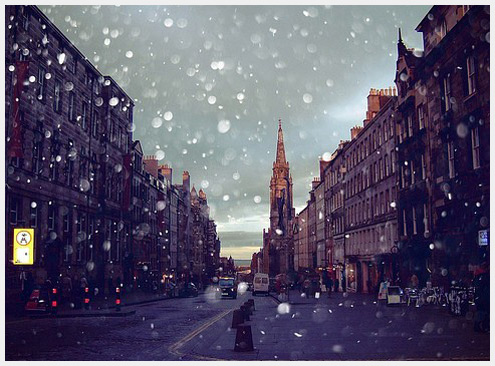

# 隔壁

姑娘叫点儿八，小伙叫都宝，他们在一个城市上学，却很少见面，交集少得可怜。都宝喜欢王朔，三岁能倒背《一半是火焰一半是海水》，六岁能用汉语拼音默写《永失我爱》，长大了更是不得了，平日沉默却装着一肚子坏水，时不常往外洋溢点机灵智慧，招人喜爱的那种。点儿八长在北方，却是个不折不扣的南方人，别看姑娘家经常耍贫嘴，但心里还是细腻得很，有时候大大咧咧一个人突然就蔫不出声了，谁也不知道她想什么呢。

点儿八和都宝是通过朋友认识的，这个朋友点儿八也不是很熟。点儿八这个人奇怪，其实要说起来，也没几个熟人，可是在人多的时候总有那么几个能让她假装很热络的样子，说不清是不是双方都想掩饰尴尬正好掩饰到一起 去了的缘故，一来二去，虚假繁荣。点儿八和都宝没繁荣起来，因为二人不需要彼此来掩饰尴尬，屈指可数的几次见面都一样，就算点儿八放弃挣扎选择完全的沉 默，也还是有人和都宝密不透风的交谈毫不冷场。

点儿八不知道是从什么时候开始发觉自己喜欢都宝的，故事讲到这里已经显示出笔者弱爆了的讲故事能力，能把每一句自己说的话变成俗套的桥段这种技能掌握起来实在是没什么难度。

点儿八就是喜欢都宝了，在她心里，他是个遥远的，有趣的，眼里泛着狡黠的光的流氓。都宝说过，我这样的你都喜欢你真是不挑，点儿八心里想的是“流氓那么多，我独取你一个来嫖，你说我挑不挑！”。点儿八就是喜欢流氓，还必须得是坏心眼儿多就算天天诅咒世界还一副忠良嘴脸的流氓，活了二十一年，看来看去，这种流氓能让她看得上眼的，也就都宝一个。

其实点儿八也是个女流氓，外表显不出道德败坏的样儿，有时候还被相熟好友当成卫道夫害怕一下，但实际怎么样谁又知道呢，有时候连她自己都搞不懂自己，笔者看着都着急。点儿八这姑娘被欲望和规矩裹挟着摸爬滚打了这么多年依然找不到和自己和平相处的门道，每天睡觉前都哀嚎自己好矛盾，又不肯为解救自己做出点力所能及的贡献。最近她想明白了，因为近来流行杨绛的一句话“你的问题主要在于读书不多而想得太多”，所以她把“看书”这件事当成速效药抓住紧紧不放，打算死马当活马医。在点儿八的感觉中都宝是个读书很多的人，似乎这是他给人感觉如此有趣的唯一解释，那些荒诞却让人激动不已的点子绝不可能是空穴来风。点儿八暗暗觉得，“读书”是接近都宝的最佳途径，虽然她现在依然幻想不出俩人坐在街边一边吃脏串一边侃侃而谈的样子，能想到的都是自己坐在都宝对面，因为说不出什么有价值的话题而羞赧不已，转而问一些傻逼都会问的问题，这种情景想想都会让点儿八叹气。

点儿八跟一般姑娘不一样的地方在于，她极其真诚地抗拒着“爱”这个词，她不明白那到底是什么，又不想稀里糊涂地凑合过去。像很多让人难以捉摸的概念一样，这个单音节的词给了她很大的困惑。朋友曾经提示她当初做过的一些事无疑就是爱的具体表现，可是经常好了伤疤忘了疼的点儿八就是回忆不起当时的感受，这一点无疑让笔者更加为她着急。点儿八经常会想如果这时候有一些简单的公式可以阐明就好了，她总觉得自己过去的种种行为因为掺杂了很多只有她自己清楚的心思在里头 所以不可能百分之百是因为“爱”。正因为如此她热爱那些爱情故事，带着些一探究竟的态度，她努力地在那些优美的语句中汲取她所需要的阳光雨露，并企图将它们公式化。比如“我是说‘爱’！那感觉是从哪来的？从心脏、肝脾、血管，哪一处内脏里来的？也许那一天月亮靠近了地球，太阳直射北回归线，季风送来海洋的湿气使你皮肤润滑，蒙古形成的低气压让你心跳加快。或者只是来自你心里的渴望，月经周期带来的骚动，他房间里刚换的灯泡，他刚吃过的橙子留在手指上的清香，他忘了刮的胡子刺痛了你的脸……这一切作用下神经末梢麻酥酥的感觉，就是所说的爱情……”这些话对她很受用，有些时候情绪到了还会因为这些台词哭一鼻子，但是时间长了，看得多了，点儿八突然有种“何德何能配得上这种感情”的感觉。

但点儿八还是期待这种爱情，她知道如果想遇到自己的“马路”就要像马路一样地去爱“明明”，这种感情必须要有同等的疯狂和不顾一切。就像一个人跳水，就要激起巨大的浪花，她跳过水，但神奇的就在于竟然入水后水面平静无波，这种无师自通的压水花技术实在能甩国家队几条街了。在点儿八心里，都宝会是激烈回应的水面，她看过都宝18岁时写的日志，那时他有一个心爱的姑娘，他对姑娘说不完的情话写满了一个本却没别人看过，从这方面点儿八有点羡慕那个姑娘。点儿八16岁的时候还有一个给她写情话的小伙，这段充斥着“我恨你，我把你的东西都从窗户扔出去了，让它们随风而逝”这种给环卫工添麻烦，既影响市容，又容易造成高空坠物纠纷的桥段的初恋最终以点儿八移情别恋而落下帷幕，从此再也没有一个原意为她写点什么的人。这对一个欲求不满的矫情逼来说的确是很伤人的事实。

点儿八现在也是个矫情逼，一矫情起来没羞没臊的，回过神儿来就自己抽自己，恨不得打瞎自己的眼。所以有时候这姑娘禁不住会想，如果有一天都宝发现自己这样意淫他，会不会把她嘲笑得连肠子带肚儿都统统翻出来。“都宝是个聪明人。”点儿八的朋友准确无误地告诉她。点儿八喜欢那种有灵气的聪明人，但也着实害怕他们，想到和这种人相处会暴露自己的愚蠢她就陷入了自怨自艾自惭形秽手头任何事情都做不下去的失落谷。“聪明人”变成了个叫她敏感的词，每当想起都宝她就深刻的感觉到自己脑门上刻着一个“蠢”，她带着“蠢”吃饭，带着“蠢”洗澡睡觉，带着“蠢”做生活中每一件琐事，不经意间把它养的白白胖胖。点儿八甚至想，像自己这种愚不可及的姑娘，哪辈子才能去追逐红色的朝霞呢？

那天晚上，天空又飘起了白雪，点儿八告别了心爱的姑娘打车回家。出租车驶离五道口，在橘黄色灯光下沿着学院路风驰电掣，车拐上三环的时候，司机师傅随着广播唱起了<快乐老家>。点儿八坐在后座上看着窗外飘雪的北京，心里空落落的，她想起了都宝。点儿八知道这一切的一切都跟都宝无关，他也不会知道她有多想在这个下雪的晚上跟他一起站在景山上君临城下地俯瞰紫禁城白色的头顶，她甚至想象得到他双手插兜的样子。点儿八心里有好多想起来就令她自己心软的场景，这些场景和这个人在她的脑海里飞快的交错闪现，她对自己产生了怀疑。巨大的失落突然攻击了她，点儿八觉得自己度不过这个冬天了。

（采编自投稿邮箱；配图：季节扬；责编：刘铮）

 
