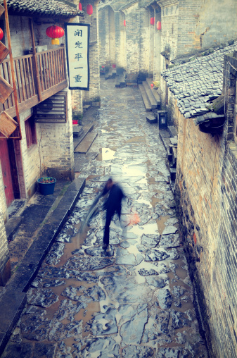

# 雨脚如麻（一）·弋人何篡

** **

这是一个发生在南京的故事，已经过期，时长一年。

几年前的一天，我和另外一群人坐在学校对面的包子店里，我们做了一个约定，约定在将来的某一天，我们中的某个人，将要把这个故事写出来。

如今，到了实现这个约定的时候。

#### 壹

今天是端午节。

陈纵蹲在医学工程系的实验楼门口，一边慢慢的抽着兜里最后一支红南京，一边等着费铭。

红南京一直卖的很火，超市里很少能买到整条的，街边小店假货又太多。大学后门有一家烟酒店，老板是个退伍军人，据说很有点门道，东西真。他家红南京卖十一块钱一包，和老板混熟了能便宜点，十块六。烟买来了拆开，把盒子顶内侧的锡纸条撕了一看，后面十有八九都印着A1，标A1的红南京烟丝好，味道鲜，走肺里过一圈，不焦不燥，熨熨帖帖，和二十块钱一包的金南京也差不了多少。

陈纵和费铭约好了，等费铭考完了流体力学之后去喝顿酒吃顿小龙虾，再去成贤街天桥底下搓点CD，唱离骚祭水鬼。南京人过端午节要吃“五红”，壳儿红亮的小龙虾最重要，那是南京人的半个命根子。费铭到了英国以后想小龙虾想的撕心裂肺，吃鬼佬碧眼胡弄出来的澳洲龙虾，也只是那么个意思，肉老的像鞋垫。

医工系的实验楼解放前就有了，陈纵就进去过一次，木地板踩起来嘎嘎响，楼道里一股霉味，夹杂着一点消毒药水的腥。楼板上吊着日光灯，灯光白中泛绿，走进了一看，磨砂玻璃上挤满了密密麻麻的蠓虫尸体。

他拒绝再进这栋小楼。

实验楼张着黑洞洞的大嘴，慢悠悠的往外吐着三三两两的人群，跟牛反刍似的，好像都能听见食道的括约肌咕咕作响。

大嘴里一线微光忽闪，紧接着费铭贼忒兮兮的脸就从大嘴里浮了出来。

“呸，我日他大爷。有烟没？”

“没，最后一根就这截屁股了。”

费铭睡在陈纵的上铺。

费铭一米七九的个头，脸盘飒，身条展，眼睛亮，肩膀宽。

费铭的脸很白，但是不是青春小说里写的那种“白皙”。一个男人要是被形容为“白皙”，那可真恶心。费铭的脸是白而且发亮，那白亮亮的大脸在你眼前晃悠的时候，你就想往手心里吐口唾沫，抡圆胳膊一个耳光上去，听听那声音脆不脆。

费铭也很有点门道，据说。

大学报到的那一天，陈纵身挂四件行李挪进宿舍。早上路过长江大桥，被滚烫的太阳晒了一路，屁股酥麻，从上嘴唇到尾巴骨尖尖都是又腥又黏。当时费铭身在半空，正蹶着屁股往他枕头旁边的白墙上摁图钉，钉一张印着滚石大红舌头的海报。

陈纵说了声你好，就拱进了下铺收拾行李。

头顶上传来嗵的一声闷响，陈纵一回头，费铭的鼻子尖就快贴上陈纵的额头。他的脸从上铺倒吊下来，贼眼飘飘。

几年以后，陈纵和费铭重新提起过这一幕，当时费铭喝的已经上头了，白脸庞仿佛一对猪肝，一双眼睛精光四射，舌头根子和小弟弟一起发硬，一双手在空中胡乱舞着。

“这这这年头还还还还还有这种哥哥哥们们儿有有有有有腔调滚滚滚石下次介绍我我我认识。”

说完这句话，费铭就拱桌子底下去了。

#### 贰

费铭是一个正宗的南京小杆子，上高中的时候就骑个小林海风驰电掣，气场大的好像一辆坦克，能把路边卖柴火馄饨的小摊子掀翻。费铭说这优良的基因来自他爸，他爸是一个正宗的南京老杆子。

他爸叫费耀洛，乍一听还以为他爸是巧克力，后来又觉得像满族人。这几年坊间清宫大辫子戏甚为火爆，人人都看我大清列祖列宗。有一天陈纵故作神秘的问费铭，哎你家是在旗的吧，哪个旗的，是上三旗不？

费铭愣了半晌，从上铺跳下来说，旗你妈逼啊。

他们家祖宗八辈正宗汉人，祖上是扬州城内一方巨贾豪强，盐，茶，丝绸，皮货，瓷器，什么生意都做。满人入关的时候搞扬州十日，他家祖宗们守死节不剃发，数十人共赴国难。所以费铭挺烦人家说大清国。

费铭说到他爸的时候从来不叫爸，就叫费耀洛，当面也这么叫。他爸也不生气，一口一个答应的又甜又脆。

“费耀洛当年妖着呢，傲着呢，牛逼着呢，一身绿军装，身背绿军挎，军挎里一把工兵铲，一块大板砖，一板砖下去，脑浆子就出来了。”

有天晚上，302宿舍四个人磕了满地五香瓜子皮，把认识的女生从胸到屁股都掰扯了一遍，毫无睡意。于是开始痛说革命家史，忆苦思甜。费铭这句开场白一说，暮合四野，万籁俱寂。

费铭他爸是高干子弟，从小打架，从城东的军区大院一路打到新街口的大华电影院。改革开放之后，他爸脑瓜灵，辞了铁饭碗扑嗵一声跳下海，在台湾人开的电影公司里做场务，挣的是美金。费铭说小时候他吃的速食面是台湾产的日清，两包料，一包肉酱一包脱水蔬菜，那时候南京中萃只生产一种速食面，里面就一包调料，灰不拉叽的粉末儿香精味冲的口唇发麻。他小时候用夏士莲香皂洗脸，全幼儿园的小朋友都用上海硫磺皂。

陈纵就想是不是因为用了夏士莲，费铭这张脸才这么白这么亮。

费铭还说，他爸挣了美金回来，都是几千几千的厚厚的绿钞票，上面印着个长头发美国老头，皮松肉赘。他妈骑着个破自行车，怀揣上一沓一沓印了美国老头的绿钞票，去新街口或者迈皋桥找黄牛换成人民币，再把一沓一沓印了中国领导人的大团结揣在怀里，给费铭换钢琴，换江苏少年文学出版社出版的二十二块钱一本的彩图史记，换猪皮夹克。

“我妈要是当时被警察叔叔抓了，随便哪一次，那投机倒把倒换外币的罪估计关到现在都没放出来呢，要真这样，我天天给我妈送饭去。”最后，费铭用这句话结束了他的独白。

302宿舍里的四个人把房间里最后一瓶可乐分了四杯，水杯碰的啪啪作响，把这杯可乐敬给了各自的妈，一仰脖子喝干了，然后倒头就睡。

那一夜费铭睡的又沉又香。

醒来想想，费铭这故事里有水儿。亏的陈纵他们三人，听的手心发紧背脊冒汗。

#### 叁

两人喝完端午节的大酒，从成贤街走回学校的时候，天已经快要黑了。

太阳盘踞着不远处一片小小的天空，从高楼大厦的间隙滚落下去，周围的空气一下子有了具体而真实的质感，仿佛漂亮姑娘的眼波流转，看得人心里痒痒的，想伸手去捞。

白天暑气蒸腾，街上人烟稀少。每天的这个时候，南京城的大街小巷都堵满了四个或者两个轮子的破铜烂铁，仿佛搅活了一滩泥浆水，浑浊而喧闹。

费铭踢踏着人字拖，进三食堂买了六个菜肉馅的包子托在手里，大声吆喝：“走，咱们上高地。”

“高地”就是男生宿舍的顶楼。五楼走廊靠东边的男生澡堂里开了一个天窗，墙上镶了铁梯子通向顶楼。天窗是锁着的，直到有一天，费铭吃饱了撑的慌，拿写字台抽屉的钥匙去捅那个小锁，结果一捅就开。

自此，高地就成了302宿舍的秘密。

上了高地，可以俯瞰学校全貌，以及大约四分之一个鼓楼区的车水马龙。费铭曾经带了许多个姑娘，在大白天溜进男生宿舍，爬上高地，在水泥地上画粉笔画，畅谈人生，畅谈梦想，畅谈姑娘当月的安全期。

许多年以后，陈纵在北京。每次路过亚运村安慧里的无名高地酒吧，总是心中一动。

费铭利索的爬上天台，啊啊啊吼了两嗓子，跟文艺小青年爬黄山那劲儿差不多。陈纵说费铭你中午小龙虾吃撑着了吧，傻逼。

他从裤兜里掏出烟来丢给陈纵，明黄色的盒子上鲜红的南京商标和辟邪图案，一百五十块钱一包的九五至尊。

“这才六号，你这个月不过啦？”

“不过了，不过了。”

顿了一会儿，他嘻嘻一笑，说，“你放心抽赖，费耀洛给的。”

点上烟，又顿了一会儿，费铭不笑了，他说，“我操，我失恋啦。”

陈纵一口烟气正在向下走，刚想好好顺顺这馥郁的香味。被他这句话一惊，立马岔了气，眼睛鼻子连着肺叶子火辣辣的疼，立马破口大骂：“失恋个蛋啊！”

这话不是乱说，2009年这届，就连文院外院的女孩子都爱往平时一片荒芜的工程院跑。工程院风生水起，化工系来了个山东男生叫白喜绕，学精细化工和石油，一米九的大个子，长了个约翰屈伏塔的裂缝下巴，会拉小提琴。医工系来了个大活宝费铭，系里那些牲口似的女生一改往日女博士的颓废气场，平时走在工程院里腰板笔直胸脯挺的像打了硅胶，有时在第三食堂里遇见了别的系的女生来打听费铭的八卦，傲气的白眼珠子能翻到天花板上去，好像费铭是她们生的一样。

有天陈纵在BBS上看见有人悬赏求白喜绕，费铭和英语文学系另外一个小帅哥的手机号码，嘿，赶明儿发帖叫卖费铭三礼拜没洗的袜子和梦遗内裤，估计能小发一笔。

#### 肆

失恋这话从费铭嘴里冒出来，极其假，极其突兀，极其破坏社会和谐。陈纵甚至都不知道他和谁“恋”了。

费铭猛吸一口九五至尊，那明亮的火线立刻向后退了半厘米，烟灰长出来好大一截，灰灰白白。

费铭说，周弋杭，晓得勿啦。

陈纵点点头：“晓得晓得。”

费铭是南京本地人，中学六年读了一个据说很牛逼的学校，叫做金陵外国语学校。这个学校是一九六四年周恩来总理创办的八所外国语学校之一，是为了培养有中国灵魂世界胸怀的外语专业型人才，等等等等。

陈纵不是土生土长的南京人，全家搬到南京来也不过一年时间，关于金外的传说都是后来他从一个去北京上大学的金外女生那里听来的，她说完问陈纵打听这些干吗，陈纵说我上铺的哥们儿是你校友，叫费铭，认识么。

那姑娘粉脸飞红，“费铭丫就是一臭流氓”。

大一的暑假，陈纵被朋友叫去鼓楼广场的外语角和其他的英语培训机构站场子，常常碰到金外的女生。大多数男生对她们没什么好印象，都很丑，而且都事儿事儿的。看过金外的女生，才会明白为什么南京其它中学的男生把金外叫做“侏罗纪公园”。

金外的女生都有一种以天下为己任的胸怀，这胸怀比她们的胸罩大多了。这些女生要么整天挂着满脸假笑，仿佛随时都要上台做学期总结；要么装小资，开口闭口简奥斯汀米兰昆德拉，看电影一定要说是原版无字幕的；要么穿西装校服，整天行色匆匆，说三句话看八次手表，好像摩根士丹利的顾问正在等她。

还有一种最奇妙的女性生物来自金外的理科实验班，跟金陵大学工程院的牲口差不多，总是嘴唇紧抿一脸刚毅，跟刘胡兰似的，嘴角残留着面包渣和牛奶渍，一天背六篇新概念作十页纸的手算三阶矩阵习题，考试报分数的时候双拳攥的紧紧的，进了年级前十名则咧嘴一笑，牙龈上还贴着中午食堂的炒韭菜。

理科班的这些女生在从金外毕业，走入遍布世界各个角落的光怪陆离灯红酒绿的大学之后，突然一下子意识到了这大千世界除了新概念和矩阵习题以外的部分其实妙不可言，随即迅速打碎了束缚了自己十多年的厚茧，打耳洞烫头发化浓妆穿高跟鞋，男朋友一个礼拜一换。

没用，还是丑，还是像牲口。

费铭把这一切归结于金外的校服设计的不合理。

金外的校服陈纵看过，除了常规的运动服以外还有一套西装，都是化纤质地，版型剪裁奇差。外面是藏青色的外套，里面是浅蓝色的衬衫。每天放学的时候，呼啦啦从金外的大门里涌出来，搅和到南京市区黏稠的晚高峰车流里。

费铭穿上浅蓝衬衫，把袖口一挽，的确有点五四运动时期的感觉，像那时候清洁工。如果再扎上配套的红领带，可以直接拉回八十年代的照相馆，背后是北京天安门城楼的布景，穿四个兜工作服的老师傅戴着花布护袖，来，看镜头，靠近一点，笑一笑，好，咔嚓一声，一张一九八一年的结婚照。

费铭说，女生的衬衫绝傻，腰身屁股胸脯全给遮住了。娉娉婷婷婀娜多姿倩影婆娑这些字眼根本就不可能出现在你的脑海中。往公交车站一站就是司机，往超市一站就是理货员，往公用厕所一站就是下岗再就业的大妈。你压根看不出中国灵魂世界胸怀。

但是周弋杭是个小小的例外。

#### 伍

金外每年一次的运动会一般都租用五台山体育场的场地，五台山体育场在南京市中心，交通方便，场地很开阔。所以每年运动会的时候都会有许多南京其它中学和大学的学生混进来，呼朋唤友，吆五喝六。

有时候体育场的入口会有一两个戴着红袖章的总务处老师执勤，这些老师年纪都大了，处于半退休的状态，一年到头也没什么教学任务，很是清闲。于是学校里的各项杂务就成了他们发挥余热的唯一途径，他们穿球鞋戴红袖章，常常有与年龄不相称的利落身手，一把把课间翻墙出去买零食的学生从墙头上揪下来，再对着学校后门的小贩得意的一笑，看着他们无可奈何的把已经炸好的鸡腿再丢进保温箱里。运动会算是金外的最最重大活动的校园活动之一，虽然一般都在双休日举行，但这时候这些伟大的执勤老师是不可能回家休息的，他们双手交叠置于脐下三寸，目光炯炯，像护着雏儿的母鸡一般看守着“侏罗纪公园”的女恐龙们，随时准备把试图溜进金外这风水宝地的社会闲杂人等就地扑倒。

费铭曾经带陈纵去过金外的运动会会场，五台山体育场的开放了六个入口，每一个都被总务处的老师堵的严严实实。费铭从包里拽出揉的脏兮兮的金外校服套在身上，看准了一个入口，在那个入口执勤的红袖章老师正在教训一帮溜出来叫披萨外卖的初中学生，费铭趁着红袖章不注意，一闪身从他身后钻进了会场，瞬间淹没在几千个穿着同样校服的金外学生中间。

陈纵往东走了二十步，停在了一棵梧桐树下。

过了五分钟，从体育场的围墙那边飞出了费铭那件油渍斑驳的金外校服。陈纵跳起来接住，左右看看，迅速套在身上，从同一个入口也混进了体育场。

体育场里热闹非凡，大喇叭正在放着各个班级上交的通讯稿，朗诵的估计是学生会的宣传干事，“某某同学仿佛矫健的小鹿一般冲过了终点，啊请让我们为他高声喝彩”，声音无比甜腻，叫人倒胃口。

费铭熟门熟路，带着陈纵在人群中辗转腾挪，直到看见一块白底红字的纸牌才停了下来。纸牌上面写着“高三（日）”。

周弋杭比费铭小一届，文科生，日语班的。

费铭指着坐在观众席最后一排的一个女生：“就是那个。”

那个女生左手托着腮，右手放在膝上，目光有点空，仿佛置身于人群之外静静的旁观，耳朵里塞着耳机，身旁的书包上放着一张姜昕的CD，《花开不败》。

她眼珠乌黑，头发乌黑。发线分的清清爽爽，远远能看到白的发青的头皮，阳光顺着这白的发青的发线流淌下来，把发梢泡成半透明的浅棕色。紧接着阳光一路向下，趁着女孩子扭过头的间隙，滚烫滚烫的直接流进粉嫩的后脖颈。

陈纵想起日本歌妓脖子后面那块用脂粉涂出来的小小的白色三角，在两盏清酒下肚以后被汗液浸泡的微溶，散发出酒精的清苦和身体本身甜糯的香，日本男人称这个部位为“后胸”，是女人身上最性感最美丽的地方，其次是脚。他们为了这块小小的皮肤疯狂，为了它一掷千金，为了它抛家弃子，为了它拔刀决斗。

费铭出国五六个月之后，有一天突然打电话跟陈纵说他和周弋杭又联系上了，现在她在武藏野美术大学学版画。陈纵挂了电话以后，脑海中突然冒出了一个奇怪的场景，还是那天在五台山体育场那样滚烫滚烫的阳光，斜斜的刺穿窗玻璃打在画室的地上，把整个房间映的通透明亮，周弋杭被一个日本男人抱在怀里，日本男人小心的嗅着她脖子后面那块皮肤，像一只猛虎轻嗅蔷薇。

#### 陆

费铭提到周弋杭的时候，谈吐之间就会不由自主的带出一点吴侬软语的滋味。他没说任何具体的人和事，只是说他喜欢她，喜欢了好几年，在离开金外之后才买了花去告白，可是她不喜欢他。

说完了，他把最后一口九五至尊从鼻腔里喷出来，然后走到天台边缘，把烟屁股从六楼天台上弹了下去。

陈纵嘴巴里塞了小半个菜肉包子，这一口咬的太狠，噎的舌头都被挤到了嗓子眼，差点没憋背过气去。看他往天台边缘走的时候，陈纵想喊，喊不出声音，干脆把剩下的菜肉包子全塞到嘴里，然后躬下腰做百米赛跑的准备动作，心想等会儿费铭往下跳的时候是把他丫的拦腰抱回来还是干脆给他屁股上补一脚让丫死的更利落些。

费铭在天台边缘站了几分钟，陈纵看他毫无往下跳的意思，就慢吞吞的把嘴里的包子咽下肚，说，“费铭你这丫挺的，烟头弹到人家晒的被子上面把宿舍烧了老子今天睡你家去。”

费铭突然蹦起来，左腿一抬，把脚上的人字拖甩了下去，接着把另一只脚上的也甩了。过了几秒，听到楼下传来一前一后两声啪啪的闷响。费铭回过头来，哈哈大笑。

陈纵把脚上的球鞋也脱了，光脚站在天台上。天已经全黑了，脚下的水泥地带着太阳的余温，涩涩的，颗粒粗糙。

陈纵和费铭都有点愤世嫉俗，不过大学时代的男生谁不傻逼谁不愤世嫉俗。

有时候在宿舍上网，看到网路上流行的“男生看了沉默女生看了流泪”的文章都要大骂作者全家的女性。

在费铭单恋周弋杭的那段时间，有一个周末，陈纵睡午觉醒来，一看电脑屏幕，费铭正叼着根香烟看“男默女泪”文，看完了照例还是那一句。

“默你个蛋啊，泪你个头啊。”

然后费铭轻点鼠标，收藏夹，保存。

陈纵翻身继续睡，却睡不着了，对费铭说：“哎，要不给你找个姑娘打一炮。正午一炮，百病全消。”

费铭特地去查了字典，周弋杭的妈妈是杭州人，所以名字里有个“杭”，而那个“弋”就是汉武帝钩弋夫人的“弋”，意思是小木桩，也指高飞的禽鸟和系着丝线的捕鸟短矢。有一个成语叫作“弋人何篡”，就是说禽鸟飞的很高，捕鸟的人无法施展技巧，追不到。

费铭在他失恋的当天晚上，躺在陈纵上铺，翻来覆去自言自语，唏唏簌簌像只老鼠，烦的人睡不着，恨不得朝上一脚踹通了床板，直接把丫踹到天花板上去。第二天他用一只金色的油性记号笔把“弋人何篡”这四个字写在了他床头那张滚石海报上，写完之后描了又描。

一年之后的某一天，宿舍大扫除，那天他把海报摘下来，发现海报之后的白墙也印上了这四个字的油印，模模糊糊的，边缘涣散。

 

（采编：孙梦予；责编：徐海星）

 
