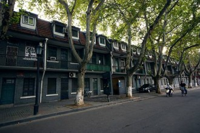
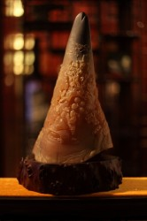

# 雨脚如麻（三）﹒犀照

**壹。**

南京在六月十八日进入梅雨季节。

空气是湿的，凝滞的，粘稠的，半透明的，沉甸甸的，压着人们的肩和胸腔。

费铭坚持认为，入梅之后质感沉重的空气是因为那些漂浮在城市上空的鬼魂。

一到黄梅天，积累了两千五百年的鬼魂像放风一样呼啦啦飞出来，代替大气层笼罩着南京城，思考，嬉笑，翩翩起舞。这狂欢持续到七月半的鬼节盂兰会，之后天空放晴，空气在太阳的暴晒下变干燥。

南京城的历史多长啊，能寻得到的建城史和地方志就写了两千五百年。

多少尸骸堆积在这城市的柏油马路下面啊，数也数不清。

无论是杨柳小蛮腰的美人还是一百八十斤重的英雄，都会老，都会被遗忘。一眨眼，更勇武的英雄仗剑横空出世，更水灵的美人画舫停在了秦淮河边。回头一望，旧人的面目开始模糊，坟山上的荒草已经齐腰高了。

帝王将相，贩夫走卒，红粉娇娃，他们的皮囊腐骨埋在土地里，油脂滋养着繁盛的草木，血和泪泡软了城墙砖，而灵魂就在这城市上空游来荡去，灵魂都是轻飘飘的，灰不溜秋的，像一团暧昧的水雾。从东飘到西，从北飘到南。有的飘的快，有的飘的慢。

长在南京这样的城市，不用读史，不用开天眼，就能看清身前身后的五百年。站在燕子矶的乱世滩上，腥膻的水雾扑面而来。谁都会怀古，谁都会怆然涕下，谁都会唱”滚滚长江东逝水”，比杨慎唱的更好。

费铭十六岁那年，南京的黄梅天特别特别长。

空调压缩机嗡嗡的聒噪，吹出冷而甜脆的空气，费铭觉得耳鼻眼目都是火辣辣的干燥的疼痛。他躺在床上读《古兰经》。

《古兰经》上说，“真主是没有形象的，但又是耳聪目明，全知全能的。他无时无处不在，凡有三个人的密谈，他就是第四个参与者，凡有四个人的密谈，他就是第五个参与者……主永远与穆斯林同在。”

《古兰经》上还说，“万物非主，惟有安拉。”

费铭好像听到游荡着的鬼魂在他耳边切切喳喳的低语，“我无处不在”。

这深沉的叫人恐惧的教义折磨了年幼的费铭好几年，他独自坐在图书馆空旷的第四层，常常猛然抬起头，他觉得天花板上会浮出一双黑色的眼。

天花板白晃晃的什么也没有，角落挂着破碎的蛛网。

费铭深恨自己这些年看了太多怪力乱神的书和电影，这些东西在他人生观形成的重要时刻为他支撑起了一片仿佛失乐园的内心世界。他感觉自己脆弱且渺小，像赤裸着被人遗弃在广场上的孩子，“我必定是什么神秘生物的试验品”，而这恐惧他无处诉说。

**贰。**

堂子街旧货摊子上淘来半支犀牛角梳子，两千块钱。秦老板硬说费铭拣了大便宜。

秦老板用不锈钢的保温杯喝茶，一杯茶要放半杯茶叶，远远望去杯子里陈年的茶垢被水一泡，黑咕隆咚。

秦老板叼一根绿南京，耳朵上别一根费铭递上去的南京特醇，趿拉一双北京黑布鞋，肚子上的肉柔顺的垂在卷起来的破汗衫下面。

“哎呀你不要外行，真是犀牛角，你看这条筋，这就是地岗，阿懂啊？”

“整角上有一条沟一条筋，叫作天沟地岗，阿懂啊？”

“两千真不多要，卖犀牛角违法的，阿懂啊？”

老板看费铭直勾勾的盯着那半截梳子发愣，急的连问了好几个“阿懂啊”，又从小抽屉里翻出一小块麂皮擦那梳子。

“你闻闻，一擦就喷喷香，麻油香，水牛角么的这么香，阿懂啊？”

“你不信你舔舔，酸的，水牛角不酸，阿懂啊？”

费铭躲开了差不多快要被塞进嘴里的那半截梳子，把头点得像鸡啄米，“懂懂懂懂懂。”

秦老板还要卖弄，两只手指夹着烟屁股对费铭指指点点，”峤旋于武昌。至牛渚矶，水深不可测，世云其下多怪物……”

费铭接下茬儿接的极快，“峤遂燃犀角而照之，须臾，见水族覆出，奇形怪状。其夜梦人谓之曰，‘与君幽明道别，同意相照也。’”

秦老板没卖弄成，佯怒，“什么都懂嘛。阿晓得晋书里面讲的‘峤’是哪个啊？”

“晓得晓得，是温峤不是和峤。”

秦老板悻悻的把烟屁股踩在脚下，“小呆逼懂的不少。”

费铭把当年的压岁钱拿出来一大半，换回半截硬梆梆的犀牛角梳子放在香烟盒子里。

回家的路上他做了无数遍的设想。

如果掰不断怎么办，用线锯还是电钻？

掰断了之后怎么办，用打火机烧还是用酒精灯？要不要浇一点打火机油助燃？

酒精灯哪里搞，是从学校实验室偷还是去化学药品店买？

点燃了之后冒烟怎么办？有怪味道怎么办？

当这一切都细节都设定妥贴之后，费铭瘫坐在出租车后座上，灵台犀照的这神秘的仪式在他眼前一遍遍重复，那一从淡绿色的火焰将会驱除缠绕他许多年的恐惧和猜疑，让他看清在他耳边低语的灵魂的面目。

费铭激动的两手哆嗦，心跳得像擂鼓一般。

踏进家门的那一刹那，费铭突然意识到他忽略了几个非常关键的问题。

“万一‘那东西’不在我家怎么办？”

“万一在家里，又怎么办？”

“我会当场吓死，还是当它不存在该干嘛干嘛？”

费铭喉头发紧，进退两难的站在家门口，惶急的四处打量着自己的家，仿佛这儿是个完全陌生的地方，手里紧紧攥着放了犀牛角梳子的香烟盒，香烟盒被他手心里的汗水浸的软软的。

最终，费铭还是没有点燃那价值人民币两千元整，据说可以通灵驱邪的半截梳子。过了几年，那半截梳子随着费铭惶惶然迷乱的青春期一起消失，竟不知所终。

有一天，费铭里鼓起勇气问白喜绕，“白老头，你讲，这世界上有没有鬼？”

白喜绕搓着手腕上的天珠，憨憨的笑，“我不知道，我小时候觉得有，上中学的时候老想，人从哪里来的，人死了以后到哪里去，越想越糊涂，夜里睡不着觉。我觉得这些只有老人才懂。”

费铭心中大慰，拍了拍白喜绕的肩。

万青在电脑里慢悠悠的唱：“一万匹脱缰的马在他脑海中奔跑。”

“如此生活三十年直到大厦崩塌，云层深处的黑暗啊淹没心底的景观。”

**叁。**

费铭用尽全力张开双臂，细白的手指死死的攥住两边的石头裂缝，指关节部位的皮肤被撑的仿佛透明，可以清楚的看见青紫色的淤血慢慢累积。

可是那股吸引力是如此的强大，它不紧不慢地一点点增加，将费铭的身躯像那黑暗的深处拉扯。

费铭的手指终于断了，他眼睁睁的看着自己的灵魂脱离的去壳响黑暗的深渊飘去，撕扯的嗓子想喊，却发不出任何的声音，胸腔像压上了一块巨石，之能听见呼哧呼哧喘气声，仿佛漏了气的鼓风箱。

从这梦魇中惊醒的时候，费铭四肢百骸里的血流似乎都凝滞了。他感觉到膝盖僵硬冰冷，十只脚趾蜷成肉球，他咬了咬牙猛的将腿伸直，一股电流从腿部的神经沿着脊椎传导向大脑，费铭顿时痛的从床上坐了起来。

手机在枕头地下欢快的震动着，屏幕发出幽幽的光，3：16 AM。

陈纵的讯息很简短，只有一行字，“我们到巴塘了。”

费铭捏着手机发了一会儿呆，什么也没有回复，这时候陈纵的第二条讯息又来了，“听说周在奥克兰。”

费铭揉揉眼睛，在床边坐了一会儿，光着脚踩在地板上，冰冷的触感让费铭打了一个寒战。

拧亮了台灯。凌晨四点不到，电脑屏幕的荧光有些闪烁，脸庞映的绿油油的。忽然听得窗外的树丛簌簌的响，似乎有枝叶折了。轻手轻脚摸下楼，在黑暗的客厅里磕绊穿行。有一剪黑影，嗖的从树上窜下来，没入灌木丛中就不见了，似乎是一只猫。费铭从来不能抗拒眉眼平展的女人面目，他突然想写俳句，“紫水绕柴扉，樟底软缎浅浅寐，鬓上插秭规。”

一个星期前陈纵在MSN上给费铭留言，说暑假要带着陈横跟白喜绕进藏，“寻找人生寻找自我”。陈横坚持说他们应该骑单车，骑马过金沙江，或者干脆徒步穿越无人区。陈纵回了一句“滚”，就把弟弟的宏伟理想全盘否决了。最终在白喜绕的一再坚持下，他们选择了非常稳妥的川藏南线，经过318国道进藏。

到达康定之后，他们的路线和当年年羹尧抚藏的进军路线差不多，途经打箭炉，里塘，巴塘，穿越金沙江，走左贡，八宿，林芝到达拉萨。

陈横的极限计划虽然被推翻了，但是依然很兴奋，买了冲锋衣，防水的登山靴，指北针酒精炉GPS瑞士军刀LED头灯等等装备，还买了一支非常漂亮的大军匕，在白喜绕和陈纵的一再阻止下放弃了睡袋和露营帐篷。

费铭在他们出发前犹豫了很久，最终留在了伦敦，没有加入这支队伍。

陈纵陈横很是生气，白喜绕倒是没说什么。

费铭心中有些矛盾，最近半年他心思混沌昏乱，他不太能理解自己潜意识里究竟在躲避什么，和这帮哥们儿分离了一些时日，虽然并没有生疏，但是费铭总觉得隐隐的有了隔阂。

费铭这些天意志消沉，他很为自己的怯懦感到羞愧。一方面他深深的怀念着一些不大可能留住的人和事，比如说周弋杭和与周弋杭在金外一起度过的那几年的时光；另一方面他又深恨这种“小布尔乔亚无病呻吟”的水晶阁小儿女之态。

陈纵认为男人也是有生理期的，“每个月总有那么几天”，学妹也不想看，毛片也不想看。一场雨，两场雨，一日风，两日风，就算是盛春时节，心绪仍旧败坏。陈纵不是诗人，嘴笨，说不清楚这是什么感觉，只能在网吧狠狠的敲键盘，抽烟，连篇累牍的骂粗话。

每当费铭的心理月经期准时来到，他总是无比熟练的调整好自己的身心吐纳，像是练气功一样，与这股凶邪的力量对抗，经脉逆流，此消彼长。

费铭往往长时间的呆在“高地”上，吃三食堂菜肉馅的包子，抽红南京，抬头看天。云朵仿佛纱幔缓缓移到眼前，扯薄了，撕碎了，如衣如巾，如瀑如流，费铭大脑一片空白，满心苍狗之叹。

**肆。**

中世纪的修士在大腿上紧紧的束着粗麻编成的苦修带，吃粗砺的干面包，喝冷水，体验神示的感应，代替世人赎罪。人和人不同，像费铭这种人生来就注定了这一辈子要多受许多的苦楚，这苦楚并不是衣食之虞，而是精神上漫长的苦修。不需要这些肉体上的折磨，他们看起来与普通人并没有什么区别，怀着对人事爱憎必然的期待，在暗夜里却都皱着眉头思索各种各样无解的命题，怀疑自我的存在，寻找归属感，呼吸连着天地宇宙，却无法摆脱形骸的束缚，想些什么，谁知道？

伦理，道德，宗教，社会准则不但没有帮助人们确立自我的价值，相反，确实人越来越感到无法摆脱的强大异己力量。

祖先将迁徙的路线留在了基因里，这些DNA片段经过时间的淘洗逐渐成为了无法表达无法编码的废扇区。在某一时刻，因为一些特殊的原因，这些古老的基因被唤醒，变异后的DNA 使这些人的血里有风。儿时的街衢巷陌，在他们看来仿佛异乡的街头旅舍，无比陌生和疏离，处在喧闹的人群中却落落寡合，刻骨的孤寂逼迫这些自找麻烦的人，背起一个简单的包裹去寻找一个从未谋面的“故乡”。

杜牧的身影惊起了鸳鸯。

陆羽和皎然和尚在顾清山下流浪，“绿水掉云月，洞庭归路长。”

梭罗绕着他的宝贝湖水走了一圈又一圈。

毛姆歌颂高更和他的塔希提岛。

柳永的手指滑过歌姬天鹅绒一般的小腹皮肤，写了什么字，“少年游”。

亨利米勒睡遍了南北回归线之间所有美的丑的妓女，依然confused。

尼采疯了，成了第二个太阳。

川端康成张大嘴巴，咬住一根煤气管。

安兰德耸了耸肩膀。

韩波想要成为“永恒”的代言人，一生做了三件事，酗酒，流浪，同性恋。

Leonard Cohen满脸皱纹，慢慢拨着吉他弦。

吴尔芙说，“到灯塔去”。

每当费铭想到这些人，总是用细白的牙齿紧紧咬住下嘴唇。

费铭有一个隐秘的不断重复的梦境，来自伊藤润二著名的短篇《断层之谜》。在一面奇怪的山墙上有许多人形的山洞，每个人都找到与自己的躯体完全吻合的山洞，无法抵抗好奇心的驱使，所有人都走进了自己的山洞。进入山洞之后，无法后退，之能不断的前进，前进。

最后一幅画面是山岩的另一边，山洞的出口是一条条已经完全不成人形的裂缝。

费铭第一次看到这恐怖的画面时，毛骨悚然，肩胛骨不由自主的收紧，额上冒出一层细汗。许多评论家分析了《断层之谜》的创作动机，大约是说人不能抵抗社会环境的诱惑，经过环境的挤压最终将会成为扭曲的怪物。费铭看完了这些评论，依旧噩梦不断。

“究竟为什么活着呢？”

回想起那一段长长的心理缺陷期。费铭浸泡在极度的自我压抑和惶恐不安中，在夜里竖起耳朵听着周围浓如墨的黑暗中可能发出的任何声音。强迫自己闭上眼睛，甚至想要在深夜里拿胶纸把自己的眼睛贴在一起。当他试图发问“究竟为什么活着”时，总能看到别人给出的标准答案：“我们为爱活着。”

如今费铭再也不可能被这个答案说服了。

我们有爱。可是我们最终都是要毁灭的。

还是费耀洛说的对，“有情人终成黄土。”

他觉得自己有病，需要犀牛角，需要降魔杵，需要跟着白喜绕一起开着大切诺基抽着红南京听着梦回唐朝，一路山呼海啸奔向拉萨然后在布达拉宫前扑嗵一身跪到地上。但是事到临头费铭又打了退堂鼓，他怕这一趟旅行之后，这病被治好了，自己也成为了一个索然无味的路人甲。

幸而白喜绕是个很灵光的人，虽然他脸蛋黑红身高一米九，笑起来憨憨的，女朋友是精细化工系胸最大脑子最笨的小学妹，但是所有人都肯定白喜绕是个头脑不简单的靠谱人物。白喜绕不太喜欢说话，在酒桌上听见黄段子，陈横笑的最响，陈纵故作不屑，王胖子不知所云，白喜绕表情和蔼，但是只要细心观察，白喜绕必定是第一个反应过来的人。

这个朋友让费铭感到很欣慰，费铭喜欢这种话只要说一半就心照不宣的朋友。所以当费铭告诉他们不参加这次旅行的时候，白喜绕只回复了一个字，“好”。

至于陈纵打听到的周弋杭的最近行踪，让费铭感到有些意外。

费铭揉着抽筋的小腿肚子，又慢慢挪上了床。

（采编：孙梦予；责编：欧阳银华）
