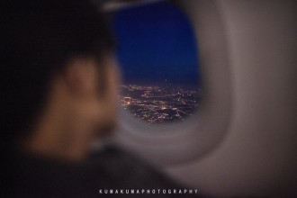
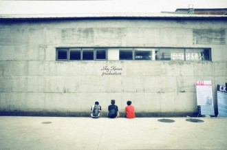

# 雨脚如麻（五）·飞行中

**壹。**

你的脸靠在冰凉的舷窗上，呼出的水汽凝成冰碴，在焰口上燎过，消散不见。

你一觉醒来，静坐在一片深灰色的寂静里，头顶上有一粒遑遑的灯光。噪音似乎来自很远的地方。“如果黑暗中你看不清方向，就请拆下你的肋骨，点亮做火把，照亮你前行的路。”

冰是沉默的水。灰烬是睡眠的火焰。

你曾经至死也不妥协，至死也不宽恕。而在这个离尘世很远的地方，你感觉生死的界限突然模糊。你伸出手去，一滴空调的冷凝水滑落到指尖上。

“他暗暗地使天地变异，却不敢毁灭这一个地球。他暗暗的使生物衰亡，却不敢常存一切尸体。他暗暗的使人类流血，却不敢使血色永远鲜襛。他暗暗的使人类受苦，却不敢使人类永远记得。”

你咬着牙笑着，笑自己的弱智弱力。

你总像一个战士，用尽全力掷出一支枪，霍霍飞驰于麻木的灵魂之上。枪头中空，刺破空气时发出狂啸，尖厉的啸声，能温热这世上冰冷的血么？

你读书，读千百年前先哲留下的谜语，却解不开。合上书页，将谜语埋葬。你是自以为聪慧的西西弗斯，向山顶上推着巨石，你知道巨石终会落下，却不愿停止。你仇恨寂寞，却逐渐习惯甚至依赖寂寞。你认定了一个殉道者的身份，却不愿说的太多，以防秘密被曲解。如果被剥夺了这身份，就奋起反抗，去夺回你在这世上唯一的权力，就像西西弗斯在这世上唯一的使命。

加缪说，西西弗斯是快乐的，他的命运是属于他的。当荒谬的人深思他的痛苦时，他就使一切偶像哑然失声。

“天不变道亦不变”，你坚信，你总有一天能够通彻这不变的天道，与神明相遇。或许就像此刻，你身在归途，束缚在万里高空之上一个封闭的钢铁驱壳里。突然间你全身剧痛，你的灵魂变硬仿佛水晶，死去的先哲复活，坐在你旁边的座位上，面目平庸而朦胧。他让你看窗外的风雨星辰，他让你感受生命的大欢喜，他让你将肋骨在自身的肉体上磨成刀，挥舞着向前飞快奔跑，去迎接未知的明天和明天之后的死亡。

跑！

跑！

跑！

得道的傻和尚跟在你的身后，慢慢的在雨中走着，“跑什么呢，前面不还是雨么。”

前面还是雨，夹杂着淡红色的尘雾，千军万马般的杀了过来。你定定地站着，自知逃不过，只得稳住身形，视死如归。

蓦地听见耳边一声叹息，“下去了也好，天上也是寂寞。”

于是你睁开眼，看雨水向你奔涌而来，击在你身前的玻璃上，在一片脆响之后粉碎在地，映着晨光。

雨中的清晨有你熟悉的景象，长久居住的城市是伦敦。秋冬交替的时分，雨水钻透云层，裹挟着光明飞流直下。而那城市却是干涩的，大地皲裂，而时光就趁机从这裂缝中溜走了。花不肯开，草不愿长，如同你的心。

你的心因为什么干渴？是因为一个对你来说已经永诀的人，还是因为一个总是找不到的故乡。据说去另一个世上的人，要被带上望乡台，回头看一看，看见人群中似曾相识的脸，方知自己已成了幽魂，划明了生死的界限，走进一条单向行驶的隧道，便再也回不来了。幽魂于是哭泣，甚至嚎啕，在你的故乡，哭成壮烈的雨季。

那与你永诀的人，骨殖上被打了一块烙印，“分离”。从此吴楚异乡，天各一方，趾离端坐在你的床头，把她放在你的梦中。沉在心底的岁月腐烂成了池底的淤泥，池水清澈，了无痕迹。你渴望一场山崩地裂的灾难，好让这池水和这岁月都坍塌成一片废墟，可是时间太长太久了，你只好容忍它在你心中住下来，生根发芽。风，雨，江，流，它无法被撼动，它就是你的心。

你的整个身体往下坠，往下坠，仿佛整个身体都消失了，只留下一颗砰砰跳动着的心脏。终于沉到了一个地方，这是什么地方？不知道。四周仍是漆黑一团，你像一只中弹的鸟，从墨黑的天坠在地面上，连扑翅挣扎的力量都没有。

你贪婪地打量着身下的土地，想要伸出手去，拨开眼前的云雾，好把故乡看个清楚。苍翠绵延的丘陵中间是各色人居的群落。江水肥了，水上涌着霭。你仔细回忆着这一带江水的滋味，丰润而成熟。那一瞬间你突然明白，你从不曾远离这江水。它在你的身体里流动着，在骨缝关节的地方，浇出一朵细小的，与尘雾同样色泽的淡红的花。

你就这样，突然从天上跌回了故乡。

  ** ****贰。**

人最根深蒂固的关于一个城市的记忆往往残缺，身在其中的人，无法描摹它完整的面貌，它被缀上了许多的幻想和情感，却总是晦涩不堪。

对于费铭来说，伦敦留给他的铭印就是从希斯罗机场到他租住的公寓的那一小段路程。坐出租车大约需要四十分钟，花费六十英镑。

从上海直飞伦敦的航班在下午四点半降落，到伦敦的季节总是深秋或是严冬，天黑得很早。费铭拖着两个脏兮兮的旅行箱，在人群中辗转，躯干僵直酸痛。他小心翼翼不愿触碰别人的身体，关于飞行的噩梦一时间还没有完全散去，两条腿里的血液因为长时间的不循环而枯竭，他担心自己的腿会不会已经变成腐坏的酱紫色，用力一拍，青灰色的皮肤啪的一声裂开，满手都是冰凉胶黏的脓血。

可是就算如此，费铭仍然愿意克服满心满身的疲惫，多花十分钟的时间等待一辆Austin FX4。这是目前还在伦敦街头出现的所有出租车中最老的一款，大约是1950年左右的设计。每次坐这款车，必须很用力的按下银色把手上那个带有钥匙孔的摁钮，然后以手肘为支点向外拉把手，才能打开后排车厢的车门。开这款车的司机也很老了，通常把满头银色的白发很整齐的向后梳，穿格纹法兰绒的外套，口音浓烈。

坐上这样的车，在傍晚将至的时候缓缓的向市区进发。往来的车流亮着灯，灯光汇成两条相向而行的河溪，安静的流淌。对面的那一条河是明亮的黄色，因为迎面而来的车头大灯，而自己身处的这一条河是暧昧的腥红，因为车辆尾部红色的刹车灯。费铭是会被这种景色感动的人。这种处于繁华城市中无助却又熟悉的感触，时常迫使费铭去一次又一次的确认自己到底身处何方。在这条长长的路上，费铭在车厢的座位中用力向后缩着身体。车流汇成的明亮的河反而叫人眼光模糊。

一百年前，两百年前，就有人曾经走在这条路上，马车辚辚，就着路两旁煤气灯发出的银灰色的光晕，在迷津间穿梭。凛冽的寒夜，天上有星，星光和煤气灯光混成一团，摔在石头路面上，摔的粉碎。过往的行人脚步清脆响亮，呵出的水汽凝结成冷冷的雾，就像许多手枪在射击一样。每个人都在无知无觉时就被扔到了这世上，白捡了一副性命驱壳，在这驱壳里养出了一个砰砰乱跳，嗡嗡作响的心。走啊走，跑啊跑。生命的属性和死亡一样，一片寂静。每个人都在一步一步救自己，靠一笔一笔的写，靠一寸一寸的画，靠一帧一帧的胶片，靠一个一个磕在土地上的长头。费铭想，后来那些人走到哪里去了呢？没有人知道。

老旧的出租车压过公路上的减速条的时候发出可疑的吱嘎吱嘎声。费铭觉得，说不定就在下一秒钟，这车就散成了一地废铁。费铭从车上滚落下来，在马路上拖出长长的血痕。费铭相信自己一定不会死，他会立刻从地上爬起来，拍打身上的灰尘，然后像条狗似的，趴在地上来回的嗅着柏油马路上的自己的血迹。这血迹因摩擦而加温，仿佛他爱过的城市，总是黄昏。

  ** ****叁。**

费铭从奥克兰回到伦敦之后，过了一段仿佛行尸走肉一般的生活。他不清楚是因为自己莫名其妙的相思病更加严重了，还是因为身体对于快要痊愈的状况做出的戒断反应。他的满腹情思和斗志，像在南京的梅雨季节里丢在地上的一枚烟头，温吞吞湿漉漉的萎靡了下去。

九月末，英国的所有大学都在为新的学年作着准备，教室和实验室的门口常有年轻而好奇的脸庞试探着伸进来四下打量。到处都是人，费铭躲不开，他努力支起耳朵听，想从这纷乱的人声中听出一段旋律或是节奏，能让他的生活安稳有序。可是他从早听到晚，什么都听不到，除了一片嗡嗡的嘈杂

嗡嗡嗡嗡嗡嗡嗡嗡嗡嗡嗡嗡嗡嗡嗡嗡嗡嗡嗡嗡嗡嗡嗡嗡嗡嗡嗡嗡嗡嗡嗡嗡嗡嗡嗡嗡。

于是他开始想念金陵大学男生宿舍的顶楼，那块属于他们几个人的小小的“高地”。

“几回凭吊南郊墓，野树红花满碧萝。”

他在图书馆四楼靠窗口的座位上静静坐着，右手边是没写完的作业，左手边是冰凉的不锈钢栏杆，栏杆后面是被擦的干干净净的双层玻璃窗。靠近玻璃窗，看见的是自己的脸的虚幻的影，稍稍远离，看见的是天上的清白的月亮。费铭睨视着那月亮，满心艳羡。他觉得月亮才是真正的隐者。月亮圆了，月亮缺了，月亮挂上枝头了，月亮落在水缸里了。朔望之行总叫人感叹。有的人读了几本书，喝了几杯酒，就敢用筷子瞧着瓷碗，狂妄地唱什么“但愿人长久”，而那些没读过书，没喝过酒的呢，就拿木头模子压一个月饼吃，“我把月来吞了，我把日来吞了”。可是月亮呢，月亮就安安静静的在天上挂着，瞧着你我，瞧着人世间的一切悲欢离合，瞧着费铭那一钱不值的满腹愁肠。

费铭想，月亮也有病。

一个永远孤独的人，或者一个永远孤独的星球，一定有病。

  ** ****肆。**

手机突然发出的震动声响吓了费铭一大跳，费铭叹了一口气，合上了打开摊在桌上之后就再没翻过页的教材。

收到的是陈纵的短讯，这让费铭有些意外。他隐隐地觉得似乎出了什么问题，像是怕自己不祥的预感得到证实似的，费铭犹豫再三才开始阅读这条短讯。

六个字，一个逗号。“白喜绕出事了，”

费铭没有回复，他疑惑的看着句子结尾处的那个逗号。也许还会有第二条短讯来解释白喜绕的状况。一个小时之后，第二条短讯来了，“什么时候能联系一下？？老白出事了。”接着是第三条，“被车撞了，具体的不知道，他爸妈说好像不太好。”

费铭甚至不愿去打一个电话问一问事故的起因经过以及白喜绕的现状，他相信自己的直觉，也相信他和白喜绕之间的默契。

回想这一个暑假，他们很早以前就有去拉萨探险朝圣的计划，后来费铭突然决定要退出，然后飞过大半个地球去看了一眼喜欢了小半辈子的姑娘和一个神经病诗人的烂糟糟的故居，他没牵到那个姑娘的手，也没抒发对诗人的爱，无声无息的跑回伦敦，不跟任何人联系。陈纵陈横对费铭的这种行为简直忍无可忍，多次当众宣布“要和费铭这个活呆逼绝交”，而费铭则在回到伦敦之后嬉皮笑脸的跟陈纵说，准备吃半个月的白面包把机票钱省回来。“绝对是活呆逼”，陈纵总是用这句话结束和费铭的交谈。

王胖子的妈拖家带口在暑假的时候来到了南京，亲切慰问了在新东方上英语四级辅导班的王胖子，到金陵大学的门口照了照片，“好”，吃了盐水鸭，“好”，坐了秦淮河的画舫，“好”，最后王胖子的妈来到了快要搬迁的下关发电厂，这里是王胖子的妈三十年前原本应该被分配到的地方，在南京市区的西北方，离长江很近很近，这个厂的工人曾经在1949年接运了解放军第35军部队渡江。王胖子妈在发电厂的外围绕了大半圈，“好好好”。王胖子觉得他妈是魔怔了，发电厂有什么好不好。当他听说费铭撵着一个小姑娘从伦敦活生生跑到奥克兰去之后，王胖子胖手一拍，“这败家玩意儿，三炮！”

白喜绕除了在出发去拉萨之前给费铭发来了一个“好”字以外，再无音讯，直到费铭回到伦敦以后告诉他，“我去激流岛看顾城的。”白喜绕回复说，“不错。”

白喜绕知道有些话多说无趣，费铭知道白喜绕知道有些话多说无趣，白喜绕知道费铭知道自己知道那些说出来无趣的话费铭能够体会。

费铭很早以前就有一个想法，这个在自己的朋友圈里说话最少的傻大个儿，会在某一天以一种惊人的行为，打乱所有人的生活。这个想法只是在某个夏天，金陵大学附近某个大排档摊子上，某个酒酣耳热的瞬间，悄悄地闪出来，连费铭自己都来不及抓住它，就被更多的啤酒冲走了。

仿佛许多人都曾经在日常生活中的某一秒钟突然停下来，发现眼前的景象似曾相识，不，并不只是似曾相识，而是和梦境中的或是旧时经历过的某一幕完全相同。每一个细节都是那么的熨帖妥当，气味，温度，天空中云朵的形状，街角缓缓驶过来的卡车，灰色的马路，红色的信号灯，一切一切，都是早就已经设定好的程式。如今，在这个图书馆四楼的角落里，深埋在费铭脑海中的那个关于白喜绕的程式被启动了，费铭不需要研究这个程式的语言代码，白喜绕死了也好，残了也好，蹭掉脸皮毁容了也好，他都不去问。他只要机械的执行属于他的脚本，他应该回去，回南京去。

最近一班从伦敦直飞南京的航班在五天后，从法兰克福转机，要耗去整整一天的时间。费铭义无反顾。他觉得这次回南京的飞行和以往的每一次都不一样，他不会觉得疲惫，也不会意识到究竟飞过了多长的航线，他会紧绷着身体一动不动的坐在飞机上，如临大敌。他要做好准备，看看一个普通大学同学的车祸究竟会演变成怎样的结局。

五天时间一晃就过去了，他凭着仅存的一点破碎的逻辑，订机票，把乱七八糟的东西塞在箱子里，上飞机，准备昏睡十一个小时。

起飞仅仅一个小时之后，费铭就在一阵颠簸中惊醒过来，鼻腔里有一股浓烈的血腥味，他半张开嘴，死命的忍住抽泣，鼻涕堵住了鼻孔。他觉得自己快要窒息了，双手均匀地颤抖着，鼻尖上沁出了一层密密的汗。“叮”的一声，机长开始广播，“遇到了气流。”

坐在他旁边的中年男人睡的依旧很熟，鼾声稳定，像一只蛰伏的兽。

飞机在气流里颠簸不停，发动机发出巨大的轰鸣声。就像费铭躲不掉的人声一样，混合着机舱里干燥的空气，紧紧压迫着他的神经。

嗡嗡嗡嗡嗡嗡嗡嗡嗡嗡嗡嗡嗡嗡嗡嗡嗡嗡嗡嗡嗡嗡嗡嗡嗡嗡嗡嗡嗡嗡嗡嗡嗡嗡嗡嗡。

费铭一边手忙脚乱的系上安全带，一边用力揉着潮湿紧绷的眼角，像突然想起了什么似的，从包里拿出手机。他想起飞机起飞后他忘了关手机。

“白喜绕出事了，”“什么时候能联系一下？？老白出事了。”“被车撞了，具体的不知道，他爸妈说好像不太好。

费铭再一次把这三条短讯从头到尾一个字一个字慢慢看了一遍，坐直了身体，看着舷窗外肥厚的云层。从五天前收到陈纵这三条短讯之后，费铭一直处于一种半梦半醒的状态。他甚至无法确定这短讯中词句的含义，“出事”，“被车撞”，这究竟是什么意思。当他一个人独处的时候，就会胡思乱想，白喜绕高壮的身躯猛的腾空，又像一张纸片一样轻飘飘的落在地上摔的支离破碎。他身在半空，怎么也够不到。

（采编：吴子衿；责编：孙梦予）
