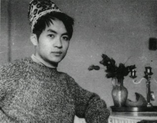

# 雨脚如麻（四）﹒杀人是一朵荷花

**壹。**

伦敦到奥克兰的机票贵得离谱，尤其在暑期的旅游旺季。

费铭订机票的时候刷的是费耀洛的信用卡，五分钟以后费耀洛的电话就追来了，电话那头的声音近乎咆哮，费铭破天荒的喊了一声“爸”，费耀洛被这一声“爸”哄的肝儿颤，顿时筋软骨酥，声音降了一个八度还多，“这是要干吗去呀？”

费铭说，“暑假没什么事情，又不回国，想先去新西兰玩玩。”

费耀洛在电话那头不知道咕哝了一句什么，费铭他妈已经劈手夺过了电话，“一个人去啊？安不安全啊？钱够不够啊？那边有没有认识的同学啊？酒店订了没有啊？新西兰有毛利人吧？土著吃人的吧？要不爸妈跟你在新西兰会合一起玩啊？”

费铭一句一句耐心地应着，听见费耀洛在边上催促着费铭他妈，“你别管了，万一有小女朋友一起呢？”

费铭突然觉得有一个老杆子爹是件幸运的事，至少在他们年近半百的脑袋里，还为“私奔”，“诗”，“浪漫”，等等诸如此类的词汇留有一块小小的位置。

从伦敦飞奥克兰要在悉尼转机，前前后后大概要27个小时。费铭在办签证和准备行李的时候一直处于大脑放空的状态，直到走出奥克兰机场的那一刹那，南半球和煦的阳光裹挟着细碎的风扑面而来，那种恍若隔世的不真实感如同一盆冰水从头浇下，把费铭浇了个愣怔。

在机场徘徊了许久，费铭决定先去激流岛，至于是否联系周弋杭，容他好好地想一想。

费铭叫了出租车去酒店丢下行李，洗澡换衣服，从奥克兰的市中心向海边走，不需要看地图，只要凭着直觉认清海的方向，走二十分钟就是轮渡站2号码头，坐三十分钟轮渡可以到达激流岛。白天时间发出的轮渡每小时一班。 水雾迷蒙，渡船划破平静的海面，细腻的白色泡沫气味咸腥，向船舷飞快的涌过来，和船后方发动机带出的浪涌交汇之后又散开，如此往复。海鸥翅膀平展，滑行到航标上，用喙梳理羽毛。大群海豚追逐着，沉沉浮浮，银灰色的背脊在太阳下闪耀着油亮的光。

在激流岛的轮渡码头下船，拿着地图向Rocky Bay方向走。在远离海靠近山的方向有一条叫做Fairview Crescent小路，在128号所在的山坡右手边，有一个破败的带露台的小屋，全木结构，赭红色的外墙已经开始褪色，周围植了竹子，竹子疯狂的长着，被不知名的草和树裹挟着。

“到了。”费铭心道。

这里是顾城的故居。

费铭一脚踏入那几乎齐腰高的草丛，却迟迟不敢卖出第二步。索性抽回了已经迈出去的腿，踮起脚来向小楼里张望，一楼的屋门紧锁着，腐朽的木梯横在脚边，新旧不一的蛛网挂在墙上。偶尔有风吹过，费铭的心跳得很快，背脊上蒙着汗，蒸发之后又是一股凉意，加上眼前这一片破败的景象，说不出这感觉是恐惧还是凄凉，费铭竟然有些想哭。

绕着小屋走了一圈，费铭终结不敢再向小屋靠近一步，也许是怕惊扰了那本就敏感怯懦而且扭曲的诗人的魂。

费铭从背包里拿出《英儿》，里面夹着一张费铭在飞机上听着万晓利的歌默写的《墓床》。万晓利的声音本来就很有分量，《墓床》这悲怆的诗加上混响的效果，像是咒语，拥有魔力。

“我知道永逝降临，并不悲伤/松林中安放着我的愿望/下边有海，远看像水池/一点点跟我的是下午的阳光/人时已尽，人世很长/我在中间应当休息/走过的人说树枝低了/走过的人说树枝在长。”

费铭把这张薄薄的纸片用石头压在小屋之后的山坡上。

** ****贰。**

离开顾城的故居，已经快要黄昏。天气转阴，气温大约只有摄氏十三度。费铭沿着来时的路走回码头，一路上路过好几个酒庄，有和蔼的老人向他推销自己家的酒和橄榄油，身后是大片的羊群正在缓缓地走回各自的庄园。费铭一向不喝新世界的葡萄酒，只买了一小瓶橄榄油。

坐在回奥克兰的轮渡上，费铭被夹着雨点的风吹的缩手缩脚，怀里抱着橄榄油。橄榄油瓶子上贴着标签，还有手写的罐装日期。标签上面是庄园主人的照片，老夫妻都是半灰半白的头发，骄傲的笑着。

顾城写过，“死了的人是美人，鬼说完就照照镜子其实它才七寸大小”，“杀人是一朵荷花”，费铭陡然觉得这恍惚迷离血腥气四溢的逻辑很是混蛋。

“生命这么好，为什么要死呢？”

“死不是空虚的，死是实在的，太密集了。我的灵魂到那去了，有时候相爱，有时候灵魂就飞走了。真像蛋壳一样。我有这个宝贝，别人没有。有时也真孤寂，找不到一个灵魂。能找到的都是生活。

“真渴望被精美地爱。可是我知道，没有比相思更美的，相思真像光中飘着的线。一头没拽住就飘下去了。”

费铭的脑海中倏忽闪过这残破的言语。他在这凄风冷雨中紧紧的咬着牙，他想生，想死，想爱，想被爱。

甲板上有一只离群的水鸟，张惶的扑腾着翅膀。

那边是死，这边是生。“在爱与死之间，充当一个忠实的第三者。”

突然感觉心被一只手揪了一下。

突然下定了决心。

突然觉得生命是很重要很可贵的东西。

费铭把橄榄油塞回包里，掏出手机。雨水打在屏幕上，用手擦拭了，模糊一片。费铭的手微微颤抖着，手指点击屏幕的速度甚至比大脑遣词造句的速度还要快，写了删，删了再写，最终只是短短的一句话，“听说你在奥克兰，我也在，我很想见到你。”

收讯人是通讯录的最后一条。周弋杭。

信号满格。电磁波在雨中腾飞，冲破云层。

天上的乌云越来越浓重。

费铭感慨得一塌糊涂。

** ****叁。**

再次见到周弋杭，是在费铭出国之后的第二年。

Ponsonby Road是奥克兰市中心非常著名的一条小街。费铭坐在葡萄牙人开的咖啡店里，靠窗的座位很安静，绿色的阳光在窗叶的缝隙间流淌，水烟浓郁的水果香味在身周弥漫。

门楣上钉着的玻璃风铃原地打了一个转，声音清脆。周弋杭推开门走进来，四处张望着，头发乌黑，眼珠乌黑。发梢仍旧是半透明的。

费铭有点手忙脚乱，之前排练了许多遍的对白和动作都记不清楚了。

他想站起来，屁股底下的椅子和地板摩擦发出刺耳的声音，于是他又想坐下。当周弋杭走到他面前的时候，费铭半弯着腰，一手想推开身后的椅子，一手扶着差点被他带到地上去白瓷碟子。

周弋杭抿嘴无声地笑了一下，似乎很为自己的杀伤力感到满意。

周弋杭穿了灰色剪绒的针织衫，配了质地相近的麂皮平底鞋，脚背上的皮肤非常白，薄薄的一层，隐约可见浅青色的血管和纤细的跖骨。她拉开椅子在费铭对面坐下，肩膀放松，膝盖并拢，直视着费铭的眼睛，似笑非笑。

费铭赞赏的叹了一口气，再一次确认这是他非常喜欢的女孩子，时刻懂得与大街上放肆闹腾的庸脂俗粉拉开距离。

之前一年，武藏野美术大学的美术学科综合展上展出了周弋杭的一幅版画，反响很好。周弋杭递给费铭一张明信片，上面印的就是这幅作品。

是一幅木面木刻的凸版画，名字叫做《交换双眼》，大面积的阳刻十分震撼，画面很饱满，主题是一张被处理过的线条感强烈的脸，刻刀留下的痕迹暗含力量，几乎完全由重叠的直线勾勒出的空洞眼眶中伸出两只手，手心上长着一对苍老的错位的眼。

“你还记不记得我上初中的时候，你在学校的瓷砖上画的。”

周弋杭说的是费铭上高一那年的事。

每个孩子总有天生的幻觉，这幻觉并没有什么具体的物质性的意向，而是由光影，扭曲的空间，童年的生长状态所组成，这幻觉将在成长的过程中被自觉或者不自觉的忘却，仿佛成为了心智成熟的必要条件。在费铭的眼里，水倒流，山崩裂，星辰如火焰，而自己的倒影却是具有生命力的兽，逆光的树在咆哮，玻璃上反射的脸像一只咧嘴大笑的猫，天空中飘过一朵表情冷漠的云，能将费铭的身形瞬间定住，费铭微张着嘴，仰头与那朵长久的对视，云不动，费铭也不动，心乱如麻。

这幻觉逐渐演变成了费铭异于常人的敏感心性，他信赖和崇拜着不可知的力量，却从不试图寻找，他用自己的方式把对这世界异常复杂的感知记录下来。

费铭非常喜欢画水粉画，在他看来水粉画比油画和水彩画要随意许多，调色自由，画静物的时候色彩的质感跃然纸上。因为画的好，费铭从初一开始就经常被美术老师挑去，在每年的春天为操场东边的白瓷砖墙上画瓷砖画。

这几乎成了一个传统，直到高一那年，费铭在九九八十一块白色瓷砖上涂抹了诸多纠缠在一起的神仙圣众，画面的右上角是《封神演义》中的杨任，怨愤的幽冥之气冲散了道德真君脚下的云，被剜去双眼的眼眶里长出了手，而手心上再长眼，眼中射出的金光笼罩着他身下的纷繁事物。那凄厉的画面曾经在费铭的脑海中出现了许多次，却始终找不到一块足够大的区域让他把它画出来，所以当费铭面对着这九九八十一块雪白的瓷装的时候，竟然激动的想哭。开工当天下午的体育课，费铭破例没有去打篮球，而是一直在这块瓷装墙附近踱步，监督着值日的劳动委员把瓷砖一块一块的擦干净，还请值日生喝了健力宝。

费铭在放学以后主动要求留下来完成画作，他一直非常缓慢地用黄色颜料在瓷装上勾着画面的轮廓，一直磨蹭到整间学校空无一人。空旷的操场上，粗糙的水泥地面反射着路灯昏黄的光，细小的蠓虫和灰色的飞蛾在路灯周围飞快旋转。学校的矮墙外是一条横穿南京城的主干道，晚高峰时的车流穿梭，氙气车灯明亮的光一次次闪过，把费铭的脸照得苍白。费铭他妈催他回家的电话全部无人接听，手机在口袋里震得费铭尾椎骨发麻。费铭一次次的调颜料，一次次的站上板凳，一次次的跳下来在水桶里捞出泡干净的画笔，不知疲倦，不愿停歇。

** ****肆。**

第二天，费铭跨进学校大门的时候，许多老师和学生在拥挤在那面白瓷装墙前面瞪着眼观赏，诸路神仙在满墙的宣传共青团植树节活动的画面里吹拉弹唱衣袂飘飘，杨任眼眶中的那两只手尤其动人心魄。费铭很满意这个效果，故意装作漫不经心的样子，从众人面前走过，上楼去自己的教室。

地理作业刚抄了一行，费铭就被美术老师拎出了教师，班主任在一旁抱着膀子似笑非笑。美术老师暴跳如雷，圆圆厚厚的眼镜片上布满了油乎乎的指纹，而愤怒的目光就从这眼镜片后面喷涌出来糊了费铭一头一脸，一着急，无锡口音就冒了出来，“费铭你特派啊，勿晓得伊格画的是啥，你讲伊格画的是啥？”

费铭忍着笑，学着美术老师的语气，“伊格画的是神仙，晓得伐。”

美术老师最终毫不让步，勒令费铭用一天时间按照原来学校审核过的草稿重新画，费铭点点头，一声不吭回到教室继续抄他的地理作业。

一天以后，那片白瓷砖墙上的画面没有任何改动，而墙角的法国梧桐树的树干上则被涂上了一条滚石乐队标志的大红舌头，舌尖上有费铭的手印，而舌头下面是黑体字的口号“Suck the world !”

一节课以后，费铭就看见美术老师带着学生会的宣传干事拎着颜料跑向操场，他们围着树干绕了两圈，用一块紫色的颜料把“suck”这个词涂上，无可奈何地离去了。

费铭的瓷装画到底还是没有保住，学生会的宣传干事带了三个低年级的学生将瓷砖铲了个一干二净，画上了共青团员植树和宣传垃圾分类的四格漫画，那三个学生之一就是周弋杭。

梧桐树干上的大红舌头却被留了下来，大约是学校舍不得在植树节把这棵粗壮的梧桐树砍去，树皮也不能铲，只好任由费铭的手印和“the world”在操场的角落越长越茁壮。费铭站在教学楼三楼的走廊上，双手插在裤子口袋里，倚着墙看着周弋杭小小的身影。距离太远，看不清她的表情。费铭钟爱的诸位神仙在小铲子的啃噬下一点点化成满地五颜六色的颜料沫儿，瓷砖强露出了死灰色的本来面目。周弋杭把她负责的那一块墙面铲干净之后，拍了拍双手，领着小桶往回走，走了几步，突然又停下脚步回过身，看了看那片干净的瓷砖墙，随即飞快的抬起头，准确的望向三楼费铭站立着的方向。费铭能感觉到空气中飘过一丝若有若无的暖融融的气流，他迎着那丝暖意，对着操场上那个小小的身影点了点头。

这次事情之后，费铭画瓷砖画的光荣使命也自然被剥夺了，开始时还有好事的低年级学生躲在费铭他们班的教室后门寻找艺术家的背影，后来大家都将这事逐渐忘却，只有刚入校的新生会因为那句没头没尾的“the world”摸不着头脑，四处询问。

费铭毕业之后，金陵外国语学校经历了全面的翻修和改建，操场比原来扩大了许多，而那棵梧桐树也被砍去，大红舌头不见了，费铭的摇滚情结却丝毫未减。只是在梧桐树刚刚被砍去的那个周末，费铭抽空回了趟金外，坐在梧桐树的树墩上，用手抠着余温未消的年轮，树木的湿气仍在，眼前却是满目疮痍。

费铭又一次感叹，树犹如此，人何以堪。

** ****伍。**

费铭漫不经心的把玩着那张明信片，霎那间许多的画面在脑海中重重叠叠，心中五味陈杂。是应该用深沉的嗓音来叙述回忆吗，还是应该坦然平静的笑？这只是一件小小的，小小的，早已经被人忘却的风波，却突然以迅雷不及掩耳的速度“跳切”进入了费铭那本来就组织混乱的叙事空间。周弋杭让他的画和他的幻想以一种最更有力的方式重生，这让他感到欣慰和欢喜，却又他为自己曾经的狷狂感到难过，感到面红耳赤。

最终费铭停止了手上的动作，他自失地一笑，把明信片夹进了《英儿》，很郑重地把书册按了按，抬头看坐在对面的周弋杭，依旧是似笑非笑的表情。他在这一瞬间突然下定了决心。

长久以来，他一直对这段若有似无的感情保有一种乐观的憧憬，仿佛畅销书中的桥段，男女主人公在兜兜转转许多年之后，经历许多错误的人和事，依旧会绕过大半个地球去牵对方的手，这时候主题曲的前奏响起，他们在人群中相拥，过往的片段闪回，或喜或悲。白喜绕曾经很明确的说过，对于费铭来说，周弋杭是一个已经被神化了的幻象，活在费铭那个狭隘而封闭的内心里，周弋杭这道方程有两个根，有理根是看清这幻象接受世俗的洗礼，暴露出令人沮丧的现实一面，斟酌良久，终于遗忘；无理根则是在此生余下的漫长的时光里依赖着这个幻象活下去，活到老，活到死，有一天费铭老了，双眼混浊，在一池湖水边熬着日子，缓缓的抬起头看天，夜色如黛，星光朦胧，夜航船上载着永不老去的身影缓缓从天边滑过来，身后是碎银万两。拥着这幻象下葬，墓碑竖起来的时候，天上的流星和地上开了千年的花都会坠落，血与骨化在泥里，成为传奇。

费铭决定保留那个无理根，就像但丁暗恋贝娅特丽其四十年，在亚平宁的山间左突右闯，写下三十一首长长的诗。

他说，“我们走吧？”

周弋杭点点头，喝完了杯子里最后一点果汁，站起身，跟在费铭身后走出了咖啡馆。

黄昏将至，Ponsonby Road上行人步履匆匆，周弋杭和费铭手挽着手站在马路边的台阶上，谁也不知该如何开口，做暂时的或是永久的告别。就像他们相处的大多数时间一样，总是安静，略显尴尬，其实谁都知道各自心中有千山万壑，在上演着轰轰烈烈的默剧。

他沉默的，面无表情的看着周弋杭的脸，似乎要把这张脸看到心里去，然后为这张脸建一座金字塔，干燥，荒芜，终年不见阳光，这张脸就存放在金字塔的最底层，时光将不再对这张脸做任何的修正，任由其不朽。

周弋杭用双手环住了费铭的腰，把脸贴在他的胸前，说，“再见啦。”

费铭的鼻尖抵在周弋杭青白的发线上，小心的嗅着头皮散发出来的温暖甜糯的味道，他说不出话，只是轻轻的“嗯”了一声。

周弋杭点点头，松开手，又说一声，“那我走啦。”

费铭说，“路上小心。”

路灯突然亮了。

** ****陆。**

“重逢无意中，相对心如麻。对面问安好，不提回头路。提起当年事，泪眼笑荒唐。我是真的真的真的爱过你。

说时依旧泪如倾，星星白发犹少年，这句话请你放在心底，要告诉任何人，你往哪里去，不要不要跟我来。”

------三毛《说时依旧》

(采编：吴子衿；责编：孙梦予)
