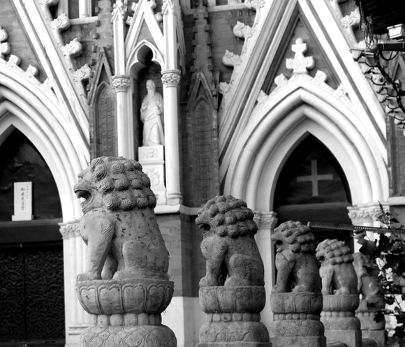
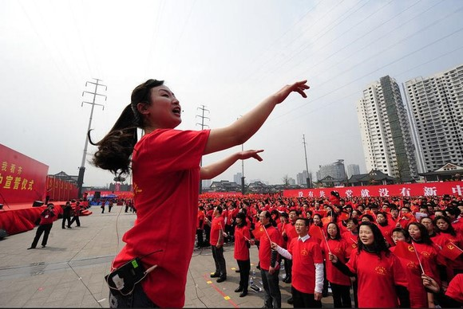
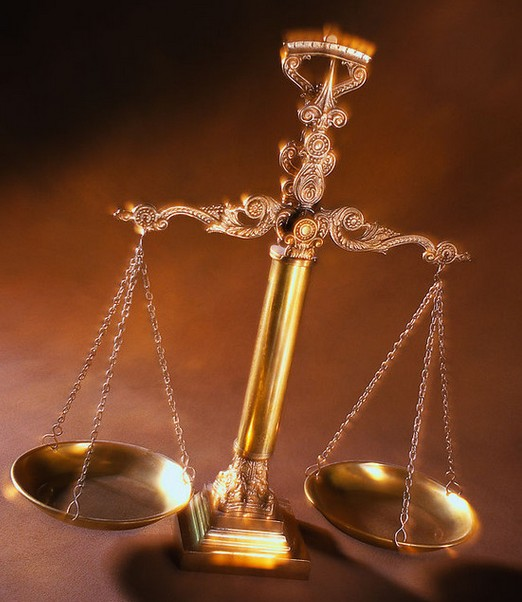

# 非“左”即“右”与“左”“右”为难的中国知识分子

** **

小编导读：

“左”与“右”，区分了意见的战场中最鲜明的两个阵营，表达了两种在经济、政治和文化上相异的观念倾向。 而这两种观念，结合了利益和权力，就变成了意识形态，就变成了武器。我们没有一个共同的标准来评判这两种立场孰优孰劣。因为它们反映了人类根本性的两种需求：安全和自由。左派要平等和福利，右派要自由和发展。但共同的底线都是基本的自由和保障。

“左”与“右”常常被解读得很片面，这一是因为解读者往往抱着偏执的态度，也是因为对左右认识不清，因为它们的边界本来也很模糊。抽象的“左”与“右”确实可以用具体的政治经济光谱里的坐标来表示，但我们就可以简单认为朝鲜就是“左”，美国就是“右”吗？ 为了更深入的探讨“左”、“右”问题，我们将陆续推出这么一组专题文章，内容是从政治学、经济学、社会学等不同视角上厘清概念边界、梳理理论脉络、分析具体问题。

本文《非“左”即“右”与“左”“右”为难的中国知识分子》是该组文章的第一篇。在上个世纪末，中国发生了一场令人瞩目的思想论战，其导火索是1997年年底《天涯》杂志发表的汪晖长文[《当代中国思想状况与现代性问题》](http://wenku.baidu.com/view/3b78e8ed0975f46527d3e1ea.html)_。_围绕中国现代化发展模式，很明显地形成了两大思想阵营：一方高举“自由主义”的大旗，而另一方则称为“新左派”。“自由主义”在90年代末，其实已_经_成了一个很神圣的词汇，很多人都愿意自称是“自由主义”者，但是另一边，在中国的语境下，“左”一直很不幸地具有某种贬义，几乎没有人_乐_意接受“新左派”的称号。本文谈的就是这两种思潮和作者的一些思考。

爱划线站队似乎是中国知识分子历来的一个传统，即便这个群体中也是种类迭出，千差万别的，诸如搞学术的，研习思想的，草根的，官方的，御用的什么的。这里自然不是要讲知识分子（也就是 “智识阶层”）们的逸闻趣事，也不是讲所谓的“悲惨遭遇”（某些异见作家真是有着超乎寻常的迫害妄想症）。要谈什么呢？其实很简单，就是知识分子的意识形态立场问题，通俗地讲就是所谓的“左”、“右”问题。

“左”与“右”的问题历来就是我们意识形态中的一部分，就我个人而言，是不太喜欢用意识形态去衡量某种东西的。但这是切实存在的问题，所以不得不谈。细分的话，会有很多意识形态的种类，比如民族主义（文章不多涉及），自由左派，温和右派，意识形态极左派，自由主义极右派等等。由于其标准的不确定性，划分自然是不可穷尽的。但是，最根本的问题就是左右两种方向。所以，本文就针对这两种“方向”谈两种在今日中国比较流行的思潮——自由主义和新左派。

**一．中国“自由主义”思潮**

看到这个分标题你可能会奇怪，为什么中国的“自由主义”会打上引号？因为笔者个人觉得，中国自由主义是一个有待商榷和澄清的概念。

从三十年前开始的中国经济改革很大程度上是按照自由主义的理论——自由竞争和有限管制操作的。而中国的政治改革则要滞后得多，直到今日，仍然是那套形式主义。而那些经济学家，大多是秉承自由主义观念的。但在当时，这种经济学上的“自由主义”对中国的思想界影响甚广，尤其是中国的思想界。但是，政治上的自由主义思想则是少之又少，直到近年来思想领域放开一些，政治哲学的自由主义观念才开始发酵。

经济学和政治学的自由主义有什么不同呢？（当然重合的也是很多的）[[i]](file:///C:/Documents%20and%20Settings/Administrator/%E6%A1%8C%E9%9D%A2/f%E5%8F%91%E7%A8%BF/%E9%9D%9E%E5%B7%A6%E5%8D%B3%E5%8F%B3%E4%B8%8E%E5%B7%A6%E5%8F%B3%E4%B8%BA%E9%9A%BE%E7%9A%84%E4%B8%AD%E5%9B%BD%E7%9F%A5%E8%AF%86%E5%88%86%E5%AD%90.doc#_edn1)

经济学中的自由主义主要是指国家在政策方面实行自由放任（或者是有稍微的管制）的市场经济，私人财产神圣不可侵犯，私人自由和选择不可侵犯等等。而政治哲学的自由主义则是一种理念上的自由，是为自由立法的，包括以自然法中体现的自由为自由，普遍的法治，有限国家，有限政府等等，当然也包括微观意义上的个人，财产等的自由和保障。所以，概而言之，经济学中的自由是政治哲学中自由的部分体现。

在八十年代思想解放的时候，自由主义确实伴随着中国改革而进入人们的思想视野中。但是，真正形成系统的中国式自由主义思想始终没有出现，因而都围绕着经济学的狭隘一隅去阐述他们的自由观，去抒发他们的自由“需求”。当然，这是无可厚非的，毕竟中国的思想在禁锢几十年之后需要一些新鲜的空气。但是，正因为这种自由观本身就是狭隘畸形的，他们只是简单的呼喊着自由，民主这几个口号，呼喊着经济自由化，私有化。一些主流的“经济学家”，知识分子就为着这个口号去呼喊奔走。因为从功利主义的角度来看，实行自由主义的经济举措确实可以使不少人得到实惠，但是我们的市场经济缺乏法治保障，通常都是权利和资本勾结，市场活动严重不透明，利益侵犯成为家常便饭，弱势群体的利益就受到极大损害。新左派的批评就针对经济私有化带来的贫富差距和现代性问题对自由主义进行质疑（这个问题在后面要讨论）。为什么会这样？因为这种不健全的法治之下是不可能有真正的自由主义出现的，有的也仅仅是类似末代帝国出现的所谓“资本主义萌芽”，洋务派的官办企业（其实还真类似今天的国企），其实都是一种病态的经济，病态的社会情况。在没有法治和宪政的社会中，自由不可能出现。

对于社会上的所谓“愤青”，以及对政府持异见者[[ii]](file:///C:/Documents%20and%20Settings/Administrator/%E6%A1%8C%E9%9D%A2/f%E5%8F%91%E7%A8%BF/%E9%9D%9E%E5%B7%A6%E5%8D%B3%E5%8F%B3%E4%B8%8E%E5%B7%A6%E5%8F%B3%E4%B8%BA%E9%9A%BE%E7%9A%84%E4%B8%AD%E5%9B%BD%E7%9F%A5%E8%AF%86%E5%88%86%E5%AD%90.doc#_edn2)，我觉得其实这些人有很多问题没认识清楚。愤青和异见者只存在于自我塑造以及口号中，他们只知道给自己贴一个标签，与谁谁划清界限，与谁谁势不两立，标榜某种口号，其实无外乎是寻找一种新的群体归属，而对于处在敌对——即使仅仅是观念相左的对方则大加鞭笞，不留丝毫的余地。这是什么呢？这同样是一种思想专制，是与极左专制一样可怕的东西。自由的要求是什么呢？最起码要保障别人的表达自由。而民主呢，也不是一部分人的观念就是真理，民主的力量在于利益表达和制衡，而非多数人对少数人的欺压。

当然，他们批评政府，批评社会，是为了这个国家的公民长远幸福考虑的。我也同情某些异见作家的境遇，也赞同愤青对现状的批评。因为毕竟这些是事实。但是，他们的批评往往缺乏建构性，只是一味的谩骂，一味的诋毁和内斗，一味的要求。空洞的自由和民主概念确实一时间可以吸引人们的眼球，受迫害的假象确实能够激起人们的同情，但你们真正改变了这个社会吗？没有。你们真正改变了中国公民的地位了吗？也没有。你们真正启蒙了思想？还没有。中国的所谓具有“自由主义”倾向的“右派”也就仅仅是思想上的一厢情愿，整日憧憬着民主自由的乌托邦，这与共产主义乌托邦本质上没有什么区别。只怕是一旦这些自称右派的“自由主义者”执政，比红色专制也好不到哪儿去。

**二．作为一种“主义”的自由**

既然是谈作为“主义”的自由，可能会比较学究一点。从韦伯的分析范式来看，“自由”从属于意识结构，而社会的变革，来自于宏观社会结构和意识结构的双重变革，而且，他的分析侧重的是意识结构路径，即宗教世界观的解神秘化过程；马克思被广大的右派思想家所排斥，从思想上来看，他与韦伯走的是一条相反的道路。

自由主义的产生与市场经济确实是密不可分的，也是一个鸡生蛋蛋生鸡的问题，争论下去没有什么太大的必要。但自由主义思想与自然法思想是有着天然的关系的。自由主义思想一直处于发展之中：从古典自由主义到新自由主义（New Liberalism）和新古典自由主义（Neo-Liberalism）。这样说自然简单，但理出其发展脉络则不是一件容易的事情。作为一种理念，自由主义孕育于古典自然法学说之中，这时，它是一种先验的唯理主义价值，坚持抽象的自由，平等，法律至上，坚持社会正义的实现。新自由主义与古典自由主义的区别就在于，他的认识论转变的更接近经验论，亦即自由是一个经验过的价值，在价值实现的过程及程序上具有经验意义，同时，新自由主义赞成国家力量的介入和干预，即积极自由；新古典自由主义又称为保守自由主义，认识论也比较独特，既向经验论转变，同时又不放弃其理性主义立场，不赞成国家力量的介入，也就是消极自由。[[iii]](file:///C:/Documents%20and%20Settings/Administrator/%E6%A1%8C%E9%9D%A2/f%E5%8F%91%E7%A8%BF/%E9%9D%9E%E5%B7%A6%E5%8D%B3%E5%8F%B3%E4%B8%8E%E5%B7%A6%E5%8F%B3%E4%B8%BA%E9%9A%BE%E7%9A%84%E4%B8%AD%E5%9B%BD%E7%9F%A5%E8%AF%86%E5%88%86%E5%AD%90.doc#_edn3)

经济学中的自由主义更多关注的是实际操作层面的自由，也就是自由市场和竞争，但有一个重要的前提，那就是法治和宪政。有了法治，市场参与者就不能为所欲为，因为有法律去规范他们的行为；有了宪政，政府就不能为所欲为，因为有紧箍咒束缚住了这个“必要的恶”。

反观我们的现状，首先，中国不是法治国家，基本上没有人对法律有坚定的信仰，除了那些法律发烧友—小律师什么的—当然是利益导向的，在权力面前，法律不存在；第二，中国不是宪政国家，我们的宪法现在只是作为一个政治文献而存在，而非一部法律[[iv]](file:///C:/Documents%20and%20Settings/Administrator/%E6%A1%8C%E9%9D%A2/f%E5%8F%91%E7%A8%BF/%E9%9D%9E%E5%B7%A6%E5%8D%B3%E5%8F%B3%E4%B8%8E%E5%B7%A6%E5%8F%B3%E4%B8%BA%E9%9A%BE%E7%9A%84%E4%B8%AD%E5%9B%BD%E7%9F%A5%E8%AF%86%E5%88%86%E5%AD%90.doc#_edn4)。

所以说，中国没有市场经济，同理，经济学中的自由主义就说不过去。因为，没有宪政，没有法治，就不存在自由市场。所谓的市场经济改革无外乎是在官僚支配资本下的权钱杂交的怪胎，权力随时可以终结这个怪胎的生命—当然是在官僚资本利益允许的范围之内。

**三．新左派思潮**

新左派思潮是近年来一股很强的政治思潮，他们的思想源泉同样是马克思——不过不是东方列宁斯大林式的只搞形式和教条的马克思主义，而变得更加多元化：西方马克思主义，如德国法兰克福学派，法国的当代思想家中也有相当多的左派—福柯，布迪厄等等。甚至他们可以从自由主义中吸取一些养分，来完善自己的思想体系。

新左派思潮不再认为阶级斗争是社会矛盾的体现，而变得更加务实，更加侧重批判——对社会现状，不公正现象，现代性问题。的确，对于贫富分化，阶层冲突，社会断裂的当代中国社会，新左派的批评是十分有杀伤力的，因为这些都是实实在在的问题，而且是与百姓切身相关的问题。这样，就在舆论中占据了制高点。而所谓的“自由主义”因为市场不透明，权力寻租，圈钱勾结造成的问题而威信尽失。

相对于“自由主义者”，新左派思潮就显得更加形体化，是实实在在存在的思想群体，体制也更加容忍。笔者本人是学社会学的，在分析一些社会问题，社会不公正，两极分化，这些问题西方马克思主义思想家分析的就非常深入；现代性问题也是一个社会学传统的关注课题，不一而足。在宏观社会理论中，左派思想确实很有影响力。

但是，新左派思想没有脱离其母体，在对专制和集权政治的态度上，往往含混不清（当然是对于中国新左派思潮来说的）。他们呼吁加强监督权，温和的改良，对改革加以监督，对社会财富的分配加以监督，但不妨碍他们赞同一党专政以及威权体制。这样就留下了批评的空间。

**四．“左”“右”再思**

还是那句话，人类始终都有一种趋群的倾向（在不严格意义上），古斯塔夫·勒庞在《乌合之众》中也谈到了群体的心理问题，这里涉及到了群体的认知，安全感，归属以及尊重，价值实现。无论是自称“左派”的人，还是“右派”的人，都力求在群体中自保，而自保的方式就在于对这个群体加以认同，按照这个群体的方式去行动。

所以，当加入了某个群体之中时，群体行为就有了独立于个人行为的特点，就以我们的左右派来说，在互相攻讦之中，二者找到了各自的认同，并在其群体内部实现整合。这也就是我们通常所说的“站队”问题。我这样讲应该是两面不讨好的一种讲法，我既不认同左派，也不认同右派，也不是一个调和主义者。

一群人与另一群人斗来斗去，归根结底，什么问题都没解决。文革过去这么多年，由于一系列的众所周知的原因，我们国民都没有对这个“事件”——叫灾难更合适——去进行一丁点儿的反思。在一个人人自危的社会中，每个人都是受害者，都被某种强大的力量牵引着，被斗争，被迫害，无限的冤屈。但我们同时又是加害者，我们的沉默，冷漠，纵容，甚至是作为加害者的快感都使我们变得麻木，变得只会明哲保身，变得虚伪。

胡适之先生曾经说过要少谈主义，多谈问题。这篇文章中谈了太多的主义，真正的问题也没有解决什么。不过，思想这个问题确实也不是一篇小小的评论就可以改变的，也不仅仅是实行一些举措和政策来解决的，而是需要思想的再一次启蒙和解放。民众的冷酷和愚昧真的是超乎我的想象。我本人不是出于什么目的，但希望向更多的人更加通俗地传播一些观念，促进这个社会的启蒙和进步，完成历史上未完成的启蒙任务。

真的爱这个国家，你就要改变它；真的爱这个民族，你就要改变它。不要再说那种不负责任的言论，真的爱自由，就要真的懂得什么是宽容。

* * *

[[i]](file:///C:/Documents%20and%20Settings/Administrator/%E6%A1%8C%E9%9D%A2/f%E5%8F%91%E7%A8%BF/%E9%9D%9E%E5%B7%A6%E5%8D%B3%E5%8F%B3%E4%B8%8E%E5%B7%A6%E5%8F%B3%E4%B8%BA%E9%9A%BE%E7%9A%84%E4%B8%AD%E5%9B%BD%E7%9F%A5%E8%AF%86%E5%88%86%E5%AD%90.doc#_ednref1) 迈克尔·罗斯金在一本政治学经典教材中清楚地展示了各种“主义”之渊源。 

[[ii]](file:///C:/Documents%20and%20Settings/Administrator/%E6%A1%8C%E9%9D%A2/f%E5%8F%91%E7%A8%BF/%E9%9D%9E%E5%B7%A6%E5%8D%B3%E5%8F%B3%E4%B8%8E%E5%B7%A6%E5%8F%B3%E4%B8%BA%E9%9A%BE%E7%9A%84%E4%B8%AD%E5%9B%BD%E7%9F%A5%E8%AF%86%E5%88%86%E5%AD%90.doc#_ednref2) 可以找一些异见作家的作品来读一下，比如《致帝国的悼词》等等，愚以为这些书没有任何的思想价值，完完全全是在抱怨，妄想受到了哪些哪些迫害，如此云云 

[[iii]](file:///C:/Documents%20and%20Settings/Administrator/%E6%A1%8C%E9%9D%A2/f%E5%8F%91%E7%A8%BF/%E9%9D%9E%E5%B7%A6%E5%8D%B3%E5%8F%B3%E4%B8%8E%E5%B7%A6%E5%8F%B3%E4%B8%BA%E9%9A%BE%E7%9A%84%E4%B8%AD%E5%9B%BD%E7%9F%A5%E8%AF%86%E5%88%86%E5%AD%90.doc#_ednref3) 可以参见以赛亚·柏林的相关著作，柏林曾经提出了积极自由和消极自由的区分。 

[[iv]](file:///C:/Documents%20and%20Settings/Administrator/%E6%A1%8C%E9%9D%A2/f%E5%8F%91%E7%A8%BF/%E9%9D%9E%E5%B7%A6%E5%8D%B3%E5%8F%B3%E4%B8%8E%E5%B7%A6%E5%8F%B3%E4%B8%BA%E9%9A%BE%E7%9A%84%E4%B8%AD%E5%9B%BD%E7%9F%A5%E8%AF%86%E5%88%86%E5%AD%90.doc#_ednref4) 当然，有人可以质疑，我们不是有《中华人民共和国宪法》吗？和其他什么什么法的红本本放在一起。但我们国家没用宪法审判过一起案件，没有违宪审查和宪法法院，一些基本的权利—集会结社示威什么的—想必也是稀缺资源。 

（责编：刘一舟）

