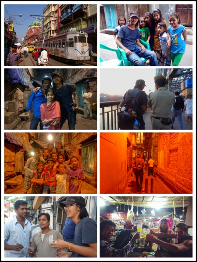

# 顽固少年加尔各答

一、 

没想到还能见May一面。

这是我在加尔各答的第七天，也是最后一天。没想过这么快就走的，印度的第一站，舒服得跟冬眠似的，连感冒都带点病中的温柔。物价低得让人讶异，人情好得让人脸红。人和动物都面容平和相安无事的生活在这里，人车牛羊乱哄哄挤在一条街上，随地吃饭睡觉乞讨大小便，满街都散发着自由的空气，彷佛从来都是如此，曾经是殖民地首都或现今稍显滞后破败，都对日常生活没多大影响。 

一美国的老头四十年前就在这里，现在又回来，次数已经记不清了。“感觉也没多大变化，几十年过去，还是电车，黄的士，人力车在一条街上慢慢晃着。”破旧的古典建筑让加尔各答看起来像个颓唐的老年人，但车水马龙生气勃勃的它更像是一个顽固的少年，拒绝世界加诸于它的任何变化。

另外一日本哥们，住了七年，给我们推荐了一个餐馆。走出萨德街，经过一个鸡屎遍地，大鸟漫天的街区，再经过一排用老式打字机给人代写书信的老头，然后是颜色鲜艳的衣服和蔬果，接着是鱼腥味，茶味，熏香味，再走进一个写着某旅馆的牌子，穿过一个公共卫生间，然后走上狭窄昏暗的楼梯，一上楼发现别有洞天，人头汹涌，米饭和咖喱飘香。

饭饱后买单，才3块多人民币，然后就成了常客。

还有一韩国哥们，故地重游，感慨万千。最念念不忘的，是十年前喝过的一家奶昔店。“是我喝过的最好的，所有之中最好的！”他手舞足蹈表情兴奋，仿佛想起初恋。

然后我们就陪他去找，我莫名其妙的哼起：“寻得到，尘封小店，回不到相恋那天。”

小巷拐来拐去，我是迷路了，但店还真是找到了。

店面不大，但是顾客盈门，浴缸大的锅煮着浓稠的牛奶，香气扑鼻。点个最普通的奶昔，一尝，果然好吃，哥们舔舔嘴唇，又喝了一碗，不知道能不能回到他“相恋的那天”。知道的是大家都对味道赞不绝口。开了十年，总该有它存续的理由。

老城老店老朋友，老书老狗老情人，除了老情人得看情况，其他都是让人魂牵梦绕，仿佛回到故乡回到童年的好东西。

凄风冷雨的苦旅中，到旧书店翻翻老书的气味，写封长信给老朋友，那种心神的抚慰很难表达，但试过的人会知道。

跟很多来过印度的朋友谈起过加尔各答，除了在仁爱之家做长期义工的，大部分是匆匆而过。除了嘈杂和脏乱，留下的印象不多。

但也有很喜欢的，之前认识一个姑娘，拿了两个月的签证，第一站就是加尔各答，然后两个月全耗在这里。

很多人表示惊讶：“有比这更好的地方啊”

我也问，“其他可能很好的地方都没去，不遗憾吗？”

她的回复我记不清了，我估计是这样的，也算是我的回答：不遗憾啊，遇上了好的东西，就厮混在一块。其他那些不确定的，就再说啦。

我几乎立即就理解了这种旅行方式，喜欢上就长待呗，多简单啊。

但直到现在我才明白她为什么会选加尔各答。

但人是很矛盾的，理解到的，不一定就做得到。如果能喜欢一个地方就长久待下来。我就不会瞎跑这么些年了，估计也不会这么快就离开加尔各答。

离开一个地方不一定需要原因，但是这次又。原因是突然发现所有人都要走了，而且都是去瓦拉纳西。一问才知道瓦拉纳西将要有个大节日，水灯节我没等，骆驼节我也没赶，为什么会赶这个节日呢？我也说不清，人的际遇本来就很多说不清的成分。十面埋伏遇不到的，转个街角就不经意地出现了。

于是前两天还在外国人售票中心排队，买去大吉岭的火车票。看排号大概要等四个小时，而两个小时后那地方就得关门，于是拍屁股走人。

两天后就干脆先不去大吉岭了，真是世事无常。

有时候死赖着怎么都不肯走，另外一些时候说走就走了，有时候是洒脱，有时候是无情。但这就是自己了，好不好都得学着接受，学着跟自己达成谅解。

二、

跟May之前在缅甸见过一面，住的一个旅馆，还有“疯子梅西”阿瓦罗和旅馆大少刘富豪，过节，淋雨徒步吹牛喝酒，然后再见。

然后就在印度再见了。

May大概也没想到，我竟能比在缅甸见时更潦倒了。

拖鞋的头磨破了，牛仔裤的屁股处也穿了个洞，最显眼的是那不堪重负的破包，开了个大洞，不拉链就能掏钱包。而拉链是彻底坏了，把两个塑料袋卷成绳子，勉强把开口绑起来，拿东西不能更方便了，方便自己方便小偷，近乎圣徒的行径。

走在街上，隔一会就有路人提醒我，“嘿，哥们，你的包开了。”

“知道，已经坏了。”我说，有时候笑，有时候不笑。

不过倒是没被偷过啥，估计小偷看到破成这样的鸟包也不好意思下手。小偷都不好意思下手的，警察就更该不好意思了。

一回在Howrah大桥拍日落，一警察过来拦住我。“嘿，不让拍照，奥巴马今天来视察”

“好吧， 我不知道呢，那我就删掉吧。”

“得删掉，而且要罚款。”

“不是吧，我之前又不知道，我这就删掉，但没钱。”

警察很惊讶的样子：“中国人怎么可能没钱？”

然后把我带到桥头的警亭。

警亭里坐着另外一个警官。

解释了几句，我就把那开口的破包给警官看，“看，真没钱了，大包被偷了，小包成这鸟样了，还背着，你觉得我像是有钱的主吗？”

警官瞅了一眼我的包，再瞅了我一眼，然后挥挥手。“走吧。”

然后我就脱身了，也没让删照片啊。

当你穷困到小偷和警察都不好意思向你下手时，从容的心态就要来了。

叶子飞高或飘飘然的时候，你终于能感觉到诗里描述的：

“风烟俱净，天山共色。

从流飘荡，任意东西。”

然后你就踩到牛屎了，还是新鲜的，湿润的。

但好消息是——情况不能更坏了。

光脚的不怕穿鞋的，你年轻自由，你随遇而安，你无所畏惧。

三、

刚到印度就感冒了，不是印度的问题，也不是我体质的问题。

衣服和睡袋都随大包一块丢了，而我又错误地估计了被子的价格和夜晚的温度，所以总是穿着单衣睡觉。半夜冷醒还不能像在以前野外露营那样，爬起来生堆火等太阳照常升起。

我大学时有个哥们，人帅而且聪明，诗文数学武艺酒量俱佳。他在杭州的冬天（谁住过谁知道）经常只穿单衣盖薄被单睡觉的，但是身体很好，吹嘘一夜七次，当然不是在说撒夜尿。

我们对他的诸般技艺有很多怀疑，证实的只有两点，一，他的手刀真能劈开钢窗，之后我们就能爬到楼顶俯瞰紫金港喝大酒了。二，他没有像他自我标榜的那样非礼勿动非礼勿脱姑娘衣服。

一哥们怀疑他武艺好只是因为有杀气，然后苦练杀气，然后老是挨揍。但这哥们是我认识的最可爱的朋友之一，我以后还会不断地提到他，所以现在先不说了。

我就怀疑他身体好是因为冬天穿单衣，就像一个老教授说他身体好是因为坚持了几十年每天用冰搓澡。寒冷是很好的锻炼，如果你在寒冷中不能抱着姑娘滚床单的话。

所以我在加尔各答的冬天坚持不买被子。结果是半夜冷醒，然后就感冒了，然后就留着鼻涕想起一生中那些后悔的事。

第二天我就拖着病体，花了十六块人民币买了张床单当被子。

包是装不下了，只能外挂，已经挂了好些东西了。除了被单，还有笔记本的外接键盘，还有水壶，杂七杂八，塑料袋又破又旧，让人看着又佩服又揪心。

May可能也是看不下去，送了我一个大大的布袋子：“拿着用吧，应该比你的塑料袋要好些。”

你知道我不是个容易感动的人，我只是有时候很容易感动。

四、

曾答应了别人的事我有很多都没做到，尤其是答应姑娘的，所以变得不愿轻易许诺。

这回决定做一回守信的人，稍微安慰自己那不安的良心。于是把拍过的照片打印出来，给照片里的朋友和小孩送过去，顺便给May指指加尔各答的路。

又是故地重游，第二次见，就能算故人了，一块喝茶抽烟吹牛，然后留联系方式拍合照，然后堵车，转眼就到黄昏。到处都堵得一塌糊涂，焦躁的喇叭声和混乱得颇有秩序的车流，和不能再习惯的平静面容。这就是现代文明和古代文明的交汇点。

走路比坐车还快，那就走路吧，入黑后终于走到了老中国城。夜幕下跟着孩子们在小巷和楼梯里钻来钻去，从各种阴暗的角落里探出头来吓唬在吃饭或聊天的当地人，弄清来意后就把惊诧换成无与伦比的美丽笑容，让人在这些笑容里陶醉忘返，直到眼看着火车要赶不上了才恍然大悟。

好不容易“逃离”中国城，赶紧连跑带跳地赶路，最后时刻公交车像被激怒的公牛，狂吼着喇叭发飙狂奔，奇迹般地把我送上了将要开动的火车，而且开动之后发现没坐反方向，也没坐错班次。

惊魂稍定，发现忘了一瓶大水在路边，忘了告诉姑娘那布袋子有多好用，忘了给姑娘一个温情的道别，忘了告诉加尔各答我有多爱它。

所以埋下了伏笔，还会回来的，不知会是什么时候，但总还是会回来的。

因我也是个顽固的人。

（采编：朱燚；责编：刘铮）