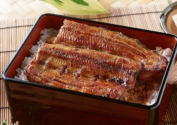

# 饮食经验主义

今年《舌尖上的中国》的开播着实让美食节目在中国媒体市场上火了一把，当饮食抛开了味觉体验，单从文化讲述和图像描摹上就能使受众为之动容，这是电视媒体始料不及的，他们似乎在找到一个崭新突破口的同时，发现在观众内心里其实蕴藏着一个久远而丰富的饮食世界。

6月，《舌尖》热度甫降，上海东方卫视便将美食才艺真人秀《顶级厨师》搬上荧屏。这档节目的品牌原型是1990年英国BBC推出的《Master Chef》，04年世显团队（shine group）在对原有节目模式进行重组和创新后，将其作为独立品牌进行推广，在30多个国家进行合作制作，东方卫视于今年成为其中国合作方，并给其冠了一个响亮而霸道的中文名称“顶级厨师”。

依托于高效的创意、推广团队和领先的媒体技术，欧美市场上的独立真人秀品牌往往能在短时间取得轰动效应后吸引着来自中国的巨额资本的眼光。于是在资本关注市场多于关注文化产业本身这样一种大环境下，版权购买和本土化移植成为了一种必然。仔细观察《顶级厨师》的制作团队不难发现，这是一只名副其实的“联合国军”，shine group将其驻澳大利亚、美国和英国的制作人悉数发往中国全程跟踪指导，技术上率先使用了无线摄像技术，100多米的动态信号传输距离让摄影师彻底摆脱了数据线的缠绕，8000平米的摄影棚包罗万象，从食材摆放到灶台再到尝菜都有专门的区域布景。舞台设计精致而富有现代感，厨房宛然化作一个美食加工厂。

只可惜这些终究没能挽回《顶级厨师》0.46的收视率，当赛季结束，东方卫视组织专家开研讨会研究收视与市场推广情况时，大多数专家讲的还是相同的故事：怎么让美食节目走向家庭？而这近乎是一个伪命题，往大了讲，饮食是躺在餐盘上的文化，而对于家庭来说，饮食则是每天一半以上中国人需要操心劳神的问题，饮食离了家庭，实在是所剩无几。

《顶级厨师》的氛围营造与《master chef》的美国版本如出一辙，强调竞技本身，评委话少，几乎不带表情，赞许和批评直来直往，选手间刻意安排的相互挑衅显得生硬而露骨。竞赛机制激烈而残酷，几乎没留给选手太多喘息的余地，虽然主持人一再强调要让选手在竞赛过程中体会烹饪的乐趣。但是仅仅作为观众来看，选手头上豆大的汗珠，游离的眼神和时断时续的话语，实在让人读不出乐趣之所在。更致命的在于整个比赛的菜品设计，一档美食节目在预设受众人群时，家庭主妇绝对是首要考虑的对象。当《顶级厨师》为了追求画面质量和精致品味，频频祭出龙虾扇贝作为烹饪食材时，主妇们手中的遥控器只怕是早已按下了调台键。

如果研讨会上允许观众参与，“没有共鸣”大概是所有观众都能给出的答案。

无独有偶，央视凭借其强大的资源和市场占有，在对《中国好声音》表示了一阵赤裸裸的眼热后，终于推出了自己的“山寨”美食评选活动《中国好味道》，并在9月将其独立制作的美食真人秀节目《中国味道》推上了综合频道的晚间强档。当节目的主题曲敲定由口水歌天团“凤凰传奇”来操刀制作，当主持人朱轶歪着脑袋冲镜头温情地喊出“百姓厨艺大擂台，咱们家的拿手菜”时，不难发现，这档节目选择了一个聪明而精准的定位，平民路线。

宿舍楼下的食堂有台电视机，烧菜的师傅和洗碗的阿姨闲暇时经常凑在一起，追一追各个时间档里的温情剧，中央一台就成了一个相对固定的频道，如果没有人特别要求，一般我去，电视都是停在这个频道上。《中国味道》的播出时间则恰好是晚饭时分，如果晚上没课，我便把吃饭的节奏放慢一些，追一追比赛的进程，有时候对于选手的晋级和淘汰不明所以，便问一问旁边收拾餐桌的大叔，一般都能得到满意的答案。晚饭的时候追这个节目倒是个不错的选择，一个是我比较喜欢朱轶的主持风格，二一个是看着电视里的玉盘珍馐多少能与自己碗里的菜形成互补，聊以解忧。

比赛的细节现在已不大能记得分明，只是比赛过程中有一道菜令人影响深刻。菜品的作者叫王维丽，是刚果民主共和国驻华商务参赞，工作闲暇拿出自家厨房里的看家本事来节目中秀一把。比赛中王维丽拿到的主食材是带鱼，单从成品卖相上看绝对不能算一流，因为老抽和黄酒的缘故，色调泛黑，周边又没有亮色时蔬作搭，显得沉闷而单调。所有选手的菜品都呈现在镜头面前时，坐在我周围的同学无一人看好这道菜，我心里却是暗暗叫了声好。

带鱼在八九十年代的内陆地区，算是一类相对稀缺的食材。那个年代，海鲜是绝对没有的，带鱼因为不用吃那种新鲜劲儿，冷冻之后也好运输，于是成了那个时代内陆地区人民亲近海洋的唯一途径。就算是在今天交通较为不发达的地区，带鱼依然是稀罕物事，电视剧《乡村爱情故事》里，带鱼俨然成了小县城里亲友往来，官场礼节中不可或缺的硬通货。

我们家原来住在“三线厂矿”的家属区。为了规避战争风险，在1964年至1980年，政府在属于中西部三线地区的13个省和自治区投入了大量的人力物力，建起了1100多个大中型工矿企业、科研单位和大专院校。这便是俗称的“三线厂矿”单位。三线厂矿在九十年代算是比较时髦的词，因为在这样的单位工作意味着铁饭碗和高福利，但是信息和物流的闭塞是外界无法想象的，比如带鱼，小时候我们家就不怎么能见着，因为即使有钱市场上也不经常卖。

物质的匮乏必然使人的创造性增加，这对于中国烹饪史来说，几乎是一条草蛇灰线。厨师们在改进烹饪技法与设计食材搭配时，常常是一方面追求美学理想，一方面又不得不回过身来看看手头到底有些什么。《山家清供》载了杜甫的《槐叶冷淘》一诗，“冷淘”在今天相当于凉面的意思，短短几句详尽地描绘了用槐树叶子滤汁儿和面制作凉面的过程，文末用了“碧鲜可爱”一词来形容，但尝过槐叶的人大多除了苦涩就再也没有别的体味了。南宋诗人方岳写过一首《豆苗》诗，大意是赞颂豆芽菜的爽嫩可口，诗中二三两句如是言说：“秦邮之姜肥胜肉，远莫达之长负腹。先生一钵同僧居，别有方法供斋蔬。”这个“别有方法”除去精湛技艺，还留下些许无奈。

我妈也算是“别有方法”的人。家里人对吃带鱼盼望不亚于过节，每每购得，母亲自是谨慎对待，小心烹调，生怕浪费。烧带鱼的办法是我妈从一个上海同事那儿求来的，方法大抵和如今上海菜里的“熏鱼”类似，那个年代上海人就已然是时尚和眼界高的代名词了，她们口中有关饮食与着装的点评，一次次冲击与洗刷着父母那辈人的固有观念，给这个缓慢而安静的三线城市带来许多有关海洋和财富的憧憬。这里的“熏”倒没有烟熏火燎的意思，而是将鱼块小火干炸后迅速投进事先调好的料汁中，装盘后的鱼外观像是熏过罢了。油温和料汁的调配是两个关键问题，一个决定口感，一个决定味道。起初我妈也是迟迟未能切中肯綮，在我和我爸的睽睽注视下，忍痛舍弃了几条鱼后，这才终于形成了一套完整的制作方案，此后这套流程一直在我家被奉为圭臬，十多年来从未更换。

于是一种味道和一种企盼交汇在了一起，精心点缀着悠长而沉静的日子。

而我为王维丽的菜叫好，则是因为她的做法和菜品的样貌，着实与我妈的带鱼相距不远，刹那间，一种亲切而熟悉的味觉记忆奔涌而出，这样一种冲动只怕是用各类饮食理论解释不了。不出意外，尝菜的评委一致给了好评，而评价里用的最多的一个词便是“妈妈菜”，这个词出现在这样一个美食真人秀节目里，无疑是至高荣誉。

而“妈妈菜”的背后凸显的还是一个“共鸣”。

“共鸣”是所有审美活动里最能体现人类高潮表现的词，接受美学中往往强调作者的生命体验在审美过程中的参与，一句台词，一个场景，一抹色彩就能勾起脑海里所有关于热烈和温暖，关于自由和解脱，关于时间与永恒的记忆。在饮食的理想国里，显然人类是有审美惯性的， 因为众口难调，所以局部经验就是客观真理，个人体验就是绝对标准。谁也干预不得。在这样的框架里，有关竞赛和评判的意义则显得单薄了许多，很多时候，好吃难吃不再成为一种客观的定性标准，只要对味儿就行，这个对味儿便是经验产生的共鸣。于是梁实秋吃了大半生到头来还是忘不了儿时京城大栅栏外的“铁锅蛋”；于是枪决前，林昭给母亲写的诗句里依然然充斥着儿时母亲厨房里盛出的家常菜。

因而当姑娘在婚后嫌男人胃口挑剔时，也需想起，这或许是他母亲用半生时间浇灌出的生命印迹。

（采编：周凌希；责编：欧阳银华）

