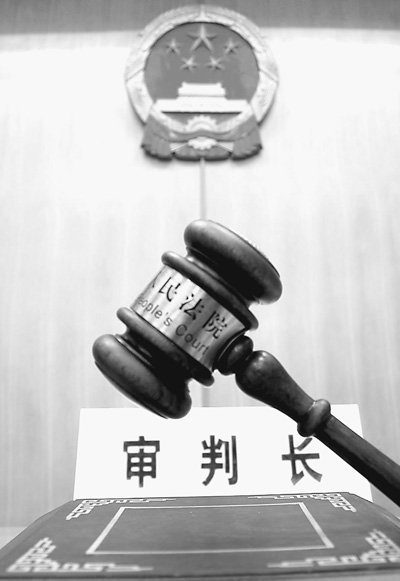
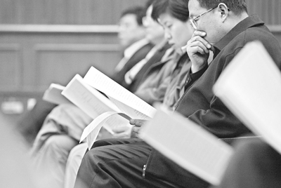
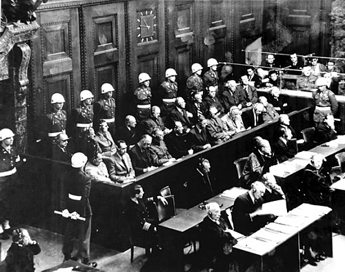

# 高墙深院

#### **序**

笔者根据与S省高级人民法院法官朝九晚五共处一个月中的亲闻亲见，编缀此文。文章的中心不在结论，而在于展示、验证结论的过程，因为结论已经在汗牛充栋的文献资料中被反复讨论。

实习期间，笔者刻意与法官保持着一定距离，而没有发展到与法官打成一片，以避免过分亲热带来视觉偏颇。笔者试图走近法官的生活圈内同时又站在法官的生活圈外，以求对法官的生活作一忠实、客观、平实的记录，一窥当下法律、法院与法官的真实情状。有时候，笔者是一个诚实的偷听者，在法官们只言片语的闲聊或正谈中，捕捉敏感信息以还原某些灰色事实。有时候，笔者是一个磊落的偷窥者，放胆从法官们举手投足和面目变化中探求其内心起伏。庆幸的是，根据笔者分析判断，法官们并未因实习生的到来而让他们的言行举止有任何包装或避讳，他们谈笑自若，没有遮掩躲闪。法官们同样是诚实而磊落的。尽管笔者出入于法官周身，有时不得不在他们的视听范围内参与、分享话题，不过笔者大部分场合选择缄默，低调地隐身于法官思维的禁区。笔者力求在不动声色、沉默寡言中完成一系列观察。姑且，把这份基于亲身实践的经历，当做一份对法律、法院、法官的田野调查。

不求深刻，但求真实。[[1]](file:///C:/Users/Administrator/Desktop/%E9%AB%98%E5%A2%99%E6%B7%B1%E9%99%A2.docx#_edn1)

#### **理想：远逝的激动**

在展开本文画卷，呈现真实的法制图景之前，我们来重温一些雷打不动的金科玉律，它们是朝野内外关于实现法治的反复呐喊和呼吁：

法律：

法律需要被信仰，否则它形同虚设。在由意志而不是由法律行使统治的地方没有正义可言。正义不仅应当得到实现,而且应当以人们看得到的方式得到实现（西方法谚）。

法院：

法律如果没有法院来阐说和界定，其真正含义和实际操作就是一纸空文（汉密尔顿）。司法是实现正义、守卫公平的最后一道防线。法院是法律帝国的首都，法官是帝国的王侯（德沃金）。

法官：

法官是法律世界的国王，除了法律就没有别的上司（卡尔.M克思）。法官乃会说话的法律，法律乃沉默的法官（ [美]爱德华·Ｓ·考文）。法官就是法律由精神王国进入现实王国控制社会生活关系的大门。法律借助于法官而降临尘世（[德]拉德布鲁赫）。法律职业的社会地位是一个民族文明的标志（费尔德）。

……

……

这些教条在学院派的精打细磨下，闪烁的吸引力催人振奋。曾经，我们在法学院的课堂上，为之深深激动。我们不止一次感觉，通过执政当局对建设法治国家承诺的实践，通过全社会对法律信仰的建立、深化，通过一代又一代法律职业共同体的不懈努力，中华大地不久将被法治的曙光普照。

然而，真实世界不照顾我们的感觉。

#### **现实：尴尬与徘徊**

**一、法律橡皮化**

公民：上访日常化

法院并不寂寞，有时几乎像赶集一样热闹。法院门口有很好的绿化带，站立着几棵青木，为拉横幅提供了莫大的便利：间距适当，高度合宜。和大多数新闻图片中看到的上访不同，这里没有歇斯底里，呼天抢地，反而呈现出公共场合少有的井然有序。一部分上访人，在横幅下立一遮阳伞，桌凳收拾妥当后，安安稳稳坐下，乍一看很像到社区做普法宣传的工作队。一旁的轿车，身披“抗议司法不公”，方方块块几个大字异常醒目。一部分上访人，将自带的M夹扎开后，与伙伴们开始了热切交流。个别上访人，一大把年级歪躺在轮椅里，很难分辨出是在享受日光浴还是期待什么奇迹。还有四肢完全着地，天当被子地当床的上访人，嗜睡非睡的迷离态既像是乞讨，又像是表演行为艺术。不过，他们都很安静不吵不闹。他们在工作日同样朝九晚五，与法院同时苏醒，同时打烊。上访，经年累月已经成为一部分上访常客日常生活的一部分。

从上述“依法”上访的情势来看，国家被“依法”治了这么多年，老百姓“依法”办事的能力有了很大提高。这些经过一审、二审、再审或者无数次审的元老级当事人，已经没有了早先时候凭据暴力或自残来威胁、感动官员的低级化上访手段。

比较有意思的是，从上访人展示的横幅标语来看（“法官违法受保护，依法治国成儿戏”；“公平公正在哪里，司法为民又在哪里”；“睁眼讲瞎话，是戏弄法律，还是蹂躏百姓”；“强烈要求省高院依法纠正X市中级人民法院的错误判决”……）他们还是相当尊重法律的，几乎一律要求的是“依法”解决，而不是依“政策”或“领导人”解决。他们“信仰”“法律”，并满怀希望依靠法律。其实没有人会拒绝信仰法律，如果法律能够真正给他带来利益。法律始终他们开展斗争的光明正大的手段，尽管他们争取利益的实际途径可能并非法律。在这些老百姓看来，戕害自己的不是法律，而是法院和法官对法律的错误适用。因为，法院和法官所适用的法律与他们心目中的法律相去甚远。或者，当法律没有站在自己队列时，它就不是正确的法律，不是真实的法律。那么，谁真正尊重法律、维护法律，谁真正践踏法律、无视法律？法律是可以揉捏的橡皮，不同的人根据不同的诉求，对这块橡皮做着五花八门的形塑。人们只信对自己有利的法律，每个人都从自身利益出发， 站在自我中心的角度，解释、重构法律。法律的统一性和权威性，荡然无存。

从信访现状看,老百姓受传统意识的影响,总认为越大的庙和尚越会念经[[2]](file:///C:/Users/Administrator/Desktop/%E9%AB%98%E5%A2%99%E6%B7%B1%E9%99%A2.docx#_edn2)。信访事实上成为老百姓与国家权力机关博弈的通道，而且这种博弈遵循的游戏规则是“闹的越大，获利越大”。权力机关凭据信访制度的道德高点意淫自己的正当性，老百姓凭据信访制度的规则弹性引诱自己的趋利性。目前，权利救济已经成为我国信访制度的头号任务。普通民众过于依赖信访制度权利救济功能，使得信访体制逐步发展成为部分取代正常宪法体制甚至超越宪法、法律推进公平正义的体制[[3]](file:///C:/Users/Administrator/Desktop/%E9%AB%98%E5%A2%99%E6%B7%B1%E9%99%A2.docx#_edn3)，更加不把宪法、法律当做唯一、可靠的维权工具。

信访人深谙色彩蕴藏着丰富的情感和深刻的隐喻。信访人在法院门口围出的条幅很有特色，一律黑纸白字。信访人充分运用了色彩心理学赋予黑里嵌白的心理功能，一方面借白色表达自己的高洁、明净、坦然、光明却又遭遇腐朽、反动、失败、徒劳，借黑色寄托司法的严正、尊贵而又抗议司法的神秘、阴险、恐怖。“黑底白字”具有强烈的视觉冲击力，肃穆、凝重里含有深沉的悲情色彩，营造出沉痛、悲凉的气氛，昭示着此地可能正在发酵着另一场窦娥的悲剧。试想，如果你是一名普通的路人，看到众多的黑白横幅在法院的地盘上旌旗招展，你会对这个国家的法律与法院作何感想。或者你是一名刚刚从学校毕业初进法院的小公务员，兴高采烈地憧憬着实践正义、公平时，引入眼帘的满是招魂鸣冤的景象，心底的痴迷热恋是否已被一盆冷水浇灭？

法院：接访常态化

信访办是法院堂而皇之的工作部门。信访办与审判庭比邻而居，它的业务与审判部门的业务一样核心和重要。如果说，信访机构作为党政机关的一部分，作为对自己内部工作的监督体系有其合理性。那么，将信访机构纳入司法机关与审判部门平行，而且能够对审判部门的审判结果指手划脚，则是相当滑稽的制度安排。按照现有的制度资源，审判委员会制度、再审制度等已经能够起到纠正法院错误裁判的作用，信访机构在法院内部运作，直接将司法程序的严肃性甩在问题解决的行政逻辑之后。这相当于法院左手写下的判决，因为当事人信访而用右手将这个判决抹掉，既判力夭折在襁褓当中，司法权威因司法部门自己扇自己的耳光而大打折扣。法律正义不是通过司法机关适用法律实现，却寄希望于司法之外的信访达成？

法院：再审泛滥化

再审给败诉方更多“翻身”的期望，同时带来胜诉方对判决结果的不确定性。再审程序启动的简便化，将当事人和法院拖进更加漫长的诉讼征程。让一些无理起闹的当事人找到玩转法律的借口。再审在某种程度上使得“一事不再理”形同虚设。特别是诸如劳动关系争议、劳务合同纠纷类诉讼费极其低廉的案件，受“不申白不申”的心理怂恿，当事人滥用申诉。更让法律难堪的是，再审制度在发挥统一法律适用功能的同时，还需担负起将终审后仍不能平息的涉诉信访矛盾尽量纳入诉讼体系来进一步消化的政治任务[[4]](file:///C:/Users/Administrator/Desktop/%E9%AB%98%E5%A2%99%E6%B7%B1%E9%99%A2.docx#_edn4)。本来不属于法律解决或法律无法解决的矛盾，生硬地要靠法律的名义解决，这就不得不牺牲法律的精神底蕴，而委曲求全政治的追求，更加让法律的规则性、刚性被软化。一旦当事人意识到再审承担的政治课题，法律被当事人玩弄于股掌之间的几率便会增大。

多头多层次监督，法官裁量权的行使难以自由。某种程度上，再审的低门槛，容易诱发腐败现象，给有的当事人带来“寻租”的机会。“司法没有既判力”是法律不能被严格执行面临的最严重危机（法官语）。裁判的合理性，因为裁判不得不面临多方面的“关照”而充满不确定性。如此情致下的法律，又如何避免被随意拿捏的命运？

**二、法院剧场化**

庭审：严肃的法庭戏剧

查阅卷宗， YL市中院关于某土地使用权转让合同纠纷[[5]](file:///C:/Users/Administrator/Desktop/%E9%AB%98%E5%A2%99%E6%B7%B1%E9%99%A2.docx#_edn5)的审委会记录显示：参加人员包括1个主持人，1个列席人，1个汇报人，1个记录人，9个评议人。主审法官陈述本案审理报告后，主管院长发表意见（基本系事实复述），接下来是评议人发言：“本案不能调解”；“土地是国有土地”；“土地现状是一块平地”；“现在土地值钱了，被告想要回来”；以上是4位参会人员的发言记录，一字不多一字不少，极尽简明概要。其余5位评议人在院长“本案无法调解，同意合议庭意见”的表态后，纷纷表示：“同意合议庭意见”。审委会最后决议：“同意合议庭意见”。综观整个会议过程，几乎没有关于事实认定和法律适用的争鸣与讨论。

后来，S省高院经合议，在致YL市中院的函中明确要求：“本案纠纷涉及XX企业全体职工的切身利益，你院重审时应尽量取得当地党委、人大及政府的支持，多做协调、调解工作，力争案结事了。”

“庭审就像在走过场”，事实上，庭审“就是”在走过场。在刚刚出道的年轻律师们还在为苦苦找寻说服法官的法律理由而精心编写诉状时，在风度翩翩的名所大牌律师们在法庭口若悬河滔滔不绝针锋相对慷慨陈词时，在当事人为搜寻支持己方法律意见的事实证据抓耳搔腮时，在当事人苦心造诣地参加完庭审带着忐忑满怀期待时，实际上，判决书已经静静的躺在法官的办公桌上，积了薄薄的灰尘一层。它只等待着一个神圣的期限，到时即可魔法一般启动它应有的神圣力量，宣示所谓法律的精神和懿旨。尤其当你事不关己却又身处其中，看到证据交换、开庭审理煞有介事按部就班，当事人、律师和法官们的一本正经愈发显得装模作样。

庭审还是一门艺术，凡艺术总有追求完美的冲动。在庭审观摩考核中，对模拟法庭的评头论足，像极了在生产判决书或裁定书的司法车间，法官们如何在操作规范指导下，制造一个标准的庭审模具，以便能够让海量的庭审批量效仿。

审判权管理：“承包责任制”悄然复兴

法院在完善审判权管理制度的行政化过程中，大步阔进，试图“用数字说话”增强司法绩效的说服力[[6]](file:///C:/Users/Administrator/Desktop/%E9%AB%98%E5%A2%99%E6%B7%B1%E9%99%A2.docx#_edn6)。而在审判权管理诸制度中，法官目标责任考核制度最为严峻。

法院正门大厅内，各个法庭、法官各个季度的工作进度，以精密的数据统计形式跃然展板之上。如今，为响应最高院发布的三个五年司法改革纲要，绩效考核已经成为法院的一项常态化、制度化工作[[7]](file:///C:/Users/Administrator/Desktop/%E9%AB%98%E5%A2%99%E6%B7%B1%E9%99%A2.docx#_edn7)。法院绩效考核“唯量化论”的倾向，将诸如审判质量、审判业务能力等隐性素质项目均纳入量化考核的范围，并不符合司法的固有规律和裁判逻辑[[8]](file:///C:/Users/Administrator/Desktop/%E9%AB%98%E5%A2%99%E6%B7%B1%E9%99%A2.docx#_edn8)。对审判效率的推崇，似乎掩盖了对审判质量和审判业务能力的强调。如果说，审判效率还能从一堆冰冷的百分比数据导出，那么审判质量和审判业务能力究竟从何体现？上诉和申诉是当事人重要的诉讼权利，当事人正当、积极行使合法权利，与法官判决的合法性、合理性存在反向关系？诉讼权利是法官赋予公民的重要权益，自由裁量权是法律赋予法官的合法权力，怎能假以当事人对自己诉讼权利的行使或放弃，而对法官的自由裁量权作肯定或否定评价？

法院严密、科学的绩效考核制，将30年前发轫于农村的“承包责任制”，植入行政科层管理制度中，法院在去行政化的呼声中顶风前行，稳步推进行政化。这令笔者不由想起，时下各层级各单位的公务员，他们的日常工作已经不再有一杯浓茶一份报纸的闲暇。他们有的挂着某镇或某乡的领导头衔，却要蹲点密切守候分管村庄的动向。他们有的挂着北京市委某直属机关的荣誉，却往来于熙熙攘攘的中关村大街，通过怀柔或文功武治慑服异见分子。现在才看到，原来法官们也无可奈何，只能暂时放下“正义化身”的姿态，汇入广阔的生活天地，奔忙在维稳的最前线，按照既定的政治逻辑将一切骚动的种子扼杀于破土生根之前。

法官是国家公务员体制中的一员，法官的考察、嘉许、升迁与法官的“审判政绩”密切挂钩。比如，“在许多法院，法官的工作绩效与是否被信访是联系在一起的。哪怕你的判决是合法的，但只要出现对你案件的信访，你就有错”[[9]](file:///C:/Users/Administrator/Desktop/%E9%AB%98%E5%A2%99%E6%B7%B1%E9%99%A2.docx#_edn9)。

文娱：“红”是永远的主色调

如火如荼的政治生活俨然成为法院里一道不可忽视的风景。受制于出勤考核，党员宣誓入党誓词活动，重读M列经典学习活动，几乎每周一次的红色经典影像观摩活动，上座率居高不下。强调对法官的政治素质考核不为过，关键是强调的焦点在哪。法官提高政治素质应有的正确导向在于：有政治意识不是为了更多“干政”，而是为了防止司法不恰当地主动“干政”或防止被要求或被迫更多“干政”[[10]](file:///C:/Users/Administrator/Desktop/%E9%AB%98%E5%A2%99%E6%B7%B1%E9%99%A2.docx#_edn10)。

事实上，对法官政治素质的要求，超过对法律素质的要求。仔细观察高院对法官的考核内容，不难发现：“贯彻执行党和国家方针政策情况，政治上的方向和态度”作为基础性的考核依据，使得“法官法和法官职业道德标准的遵循情况”边缘化，甚至让步于“法院规章制度的落实情况，与同事关系的处理情况”等非与法官审判能力直接关联的项目[[11]](file:///C:/Users/Administrator/Desktop/%E9%AB%98%E5%A2%99%E6%B7%B1%E9%99%A2.docx#_edn11)。在当局的思维深处，“才华于文人在其次，关键是立场！立场对了，才华是锦上添花，立场错了，才华则会落井下石。”（《大明宫词》武则天台词）。可以想见，法官为证明自己的能力素质，不得不应付于各种政治学习班，穿梭在日常人际交流的漩涡中。

法院风生水起的文娱活动，“政治正确”仍然在拿腔拿调。“运动会”、“文艺会演”在图文并茂的解说词中，一律充斥着 “正式表述”惯有的正襟危坐式的宣传口吻：“XX活动的蓬勃开展，让XX法院有了良好的院风，从而也带来审判效率、审判质量的显著提高”，法院文化建设活动与审判活动、法官职业素质等职业化内容紧密联系，“政治化”“功用化”态度暴露无遗。

法院大楼：满含深情的设计理念

高耸。宽大。方正。大幅以山为主的浮雕壁画。高院持重典雅的布局，似乎想要极力昭示法律坚如磐石，法院高山仰止，法官执法如山。

高院被围墙和栅栏包围[[12]](file:///C:/Users/Administrator/Desktop/%E9%AB%98%E5%A2%99%E6%B7%B1%E9%99%A2.docx#_edn12)。当事人进入立案大厅需要经过一道安检，从立案大厅到法院主体大楼还需要一道登记。法院前门、后门均配有武警站岗。法院为法官提供办公用房、车辆、设备、住房（福利性分房）等。法院大楼内，生活配套设施齐全，健身房、洗浴室、图书馆、理发室和食堂、多功能厅应有尽有。这表明：一，高院仍然是行政传统中的一个单位，而非西方开放式的公共产品建筑。法院的庄重性、威严性遮盖了服务性、亲和性；二，高院和法官审判工作的展开，须依赖行政体系的工作运转机制，频繁与其他单位、部门交通、联系，须获得上级部门或同级人事、组织、警备部门的支持、保护。三，高院生活设施的齐全，在形式地试图打造司法的适度封闭性的同时，强化了法官对高院和单位体制的依赖性。[[13]](file:///C:/Users/Administrator/Desktop/%E9%AB%98%E5%A2%99%E6%B7%B1%E9%99%A2.docx#_edn13)

**三、法官市井化**

开庭：迎合当事人的自保之举

立案大厅里，一位满头银发的老人和中年人在翘首等待。他们是某劳动争议案的申诉方，两天前接到H法官通知今天来高院。被申诉方（用人单位）的代理人，三个年富力强的年轻人亦同时赶到，他们踏着大步走在前面。老人腿脚不便，由中年人搀扶着缓慢前移，不断向笔者致歉：“他身体不好，走不快。只好麻烦你等一等了”。约10分钟后，来到谈话间门口，中年人问：“今天不是开庭吗”？得知这次“只是谈话，开庭时间再通知”后，中年人面露无奈。原来，老人和中年人家住YL市，距离XA市有上百公里，差旅费是不小的开支，往返一次实在不易。从其衣装判断，他们经济条件不是太好。事实上，即便只须一次开庭，他们至少还需要再费两次周折，才能领到判决书或裁定书（因为，法官很少当庭宣判，即使判决书早已写好，也是择期宣读）。傍晚6点左右，到车站搭回程公交时，恰遇该父子两人也在候同一辆车。此时的XA市，正在仲夏的炎热炙烤中，沉闷、燥热、干渴不输北京最热的时点。老人双眼暗黑，白衬衫已被汗水浸透。父子两个沉默无语，表情凝重。今天的谈话，于他们而言，不知成效如何。

根据诉讼制度安排，高院负责二审、再审的案件，可以选择书面审理或开庭审理。从法官的角度看，书面审理经济、简便、迅速，应当是法官的首选。实际上，几乎每一个二审、再审案件，法官更倾向于选择开庭审理。法官接到案卷后，首先做的事情就是联系当事人到高院谈话（其实，谈话内容往往是对申诉状、答辩状的复述，法官并未获得新信息）。按法官的逻辑，无论有没必要会见当事人，将当事人召集在一起，三方面谈对质，既能从双方言辞交锋中看出底气，也能给当事人一种法官已经用心、尽力的印象，在一定程度上可以减轻来自当事人胡搅蛮缠、缠诉上访的压力。不过，法官的“自保”之举，有时却折腾了当事人。

裁判：用法律点缀领导意志

两个公司关于欠款支付方式的争议，涉及到4000万左右的纳税额。为保险起见，债权方坚持走正常手续，债务方希望用另外的方式合理避税。但税金由谁承担？当事人都很有背景，一方企业法人代表是人大代表，一方企业法人代表是政协委员。双方互不相让，将关系捅到“上级的上级”、“领导的领导”处。根据上面的精神，法院只好努力做双方的调解工作。最后，庭长在调解无望之下，向上级领导慨叹她只是“一烂屁庭长”，试图躲避执行难以驾驭的“最高指示”。

理论上，“在现代法治国家，司法机关以及司法官员之间只有审级之分，而没有等级之分。上级审法官并不意味着就是上级法官”[[14]](file:///C:/Users/Administrator/Desktop/%E9%AB%98%E5%A2%99%E6%B7%B1%E9%99%A2.docx#_edn14)。但是，我国司法系统内对法官级别的精细设计以及“院长负责制”、“错案追究制”、“审判委员会”等制度推行，事实上削弱了法官独立审判的地位。在权力的天平上，官大一级压死人。法官与庭长、院长之间存在明显的服从与命令关系，毫不夸张的说，法官实际上首先服从的是上级领导的指示、意见而不是理性与规则。法官只能服从他所属环境约定俗称的游戏规则，法理只是一个结果确定后寻找理由的参考文本[[15]](file:///C:/Users/Administrator/Desktop/%E9%AB%98%E5%A2%99%E6%B7%B1%E9%99%A2.docx#_edn15)。没有许可独立的环境，难有坚持独立的意识，奈何强求其作出独立的审判？有时候，上级领导的指示、意志是模糊不清的，“慎办”、“妥处”这样的领导手记，留给法官的更多是惆怅和无助。法官还需充分发挥主观能动性，揣测、还原、体会领导的真实意志。

难堪的是，为回应“和谐”，法官除对法律绝对信仰之外，必须考虑政治要求和社会呼吁。法官裁判时不得不瞻前顾后、亦步亦趋。因为一个司法上完全正确的审慎决定，在政治上可能显得不那么正确。法官不得不依照现有的制度逻辑和权力话语去思考去行动，同时总是遭到法学界知识精英们的批评和奚落。他们被给予厚望，同时又不被信任。法官两边都要讨好，否则要么在知识上被法律家讥刺和挞伐，要么在舆情中遭受民众的诟病和唾骂。他们的裁判、决定可谓四面楚歌，十面埋伏。

调解率：不停的追逐

H法官主动打电话给某合同纠纷案的上诉人，建议说：“该案并不复杂，涉案标的不算大，希望你们能够调解，这样对大家都有好处。一是可以尽快案结事了。一旦走诉讼程序，没个半年八月，是无法结案的。最好是你们坐下来谈，毕竟你们对事实最清楚。二是如果你们和解了，对我们来说多了一个调解，也是好事”。然后，H法官热情地指导上诉人怎么写撤诉申请和委托授权书，并在上诉人仍然不得要领后，直接口头叙述，让上诉人实录。

在绩效考核制度的压迫下，法官的审判工作一直为调解率奔波，调解率几乎成为一切努力的中心。尤其是面对一些理由明显不足的上诉人、申诉人，法官通常会主动联系，有时可以说是千方百计地寻找当事人，以期说服当事人撤诉或调解，创造更高撤诉率和调解率。法官本是消极的裁判角色，现在却忙着和稀泥。钟情于“案结事了”的调解，迫使法官追求法律效果、社会效果和政治效果的统一，甚至不惜牺牲法律效果以保证社会效果和政治效果。

当事人：折腾到家

年轻的M法官又到T法官处诉苦：某案当事人多次打电话，要求法官召开听证，最后撂下一句狠话，如果她的诉讼请求得不到支持，“我们走着瞧”。就在M法官离开办公室不久，该当事人打电话找到T法官，对该案从另一法官交由M法官承办耿耿于怀（事实上，M法官已经向她作过说明，案件移送是因原承办法官告病假）。该当事人还向T法官保证“绝对没有讲过威胁M法官的话”，并担心M法官审理时，会因为曾经与她的口角而受到影响。T法官告诉她：“法官不是街头混混。如果判案是感情用事，那岂不是人人都能当法官？我们审判是要看证据事实的，不会因为当事人几句话，就判他败诉。如果法官因为当事人态度不好就为难当事人，国家还要法律干什么”？该当事人说想申请M法官回避。T法官让她把书面申请送过来。当事人提出口头申请，担心书面申请对M法官影响不好。T法官说只能写书面申请，当事人再次坚称口头申请，并扬言要给院领导写信。无奈之下，T法官说：“当事人有哪些权利，前期送达的文书上有明确记载，你可以自由行使，我不能阻拦。至于你要申请M法官回避的理由是否充足，我会在接到你的书面申请后，交给上级领导，结果出来后及时告诉你”。当事人期期艾艾，又东拉西扯一通。最后，T法官警告当事人：“你不要再疑神疑鬼了。我们很忙，请不要再乱打电话无故骚扰”。

在诉讼过程中，法官需要花费很多精力“招呼”当事人。一些当事人似乎紧紧抓住法官“人民公仆”的角色不放，往往对法官提出许多过分要求，不愿配合法官工作，阻挠诉讼程序顺利推进。有些当事人或故意躲避法官，或将法官当做免费的法律援助者（比如当事人喋喋不休，要求法官代读代邮判决书），或视法官为自己专职的文书传达员。有些当事人或通过种种方式旁敲侧击，干扰法官办案，或以语言暴力要挟、威胁法官裁判。在与当事人交涉过程中，法官时刻需要保持国家工作人员形象，不能随便怠慢了当事人。许多时候，想到自己只是一介公仆，为了“当家作主”的“人民”满意，法官们必须陪着笑脸柔声解答，只能在撂下电话后，嘀咕当事人一句“真是不知好歹”解解气。

人情：甩不掉的包袱

T法官最近接到同事们密集而来的电话。原来，高院处级干部竞聘活动开始了。许多参选人纷纷活络起来，到各办公室走动。一天上午，一位年轻的女法官生生涩涩地进来后，一脸笑容：“T叔，这次还望你多多支持”。

T法官：“好的，好的。可惜只有一票，恐怕不起作用吧”。

女法官：“哪里哪里。T叔的支持非常必要，那是基础性的一票”。

T法官：“我们心里都有一杆秤，票投给谁实际早就有了主意。你放心，肯定会支持作出成绩的同志，不会乱投”。

T法官最后一句话不痛不痒，说完后女法官感到已无继续待在办公室的理由，遂欠身退出。T法官将感慨投向笔者：“你看看，现在的社会风气，不是不好，是非常的不好”。后来，T法官相继以满口应诺“好的好的”“没问题没问题”，先后打发走四五位拉票人。[[16]](file:///C:/Users/Administrator/Desktop/%E9%AB%98%E5%A2%99%E6%B7%B1%E9%99%A2.docx#_edn16)

法官得知自己作为中间人为两边朋友介绍的生意没能顺利开展，颇感为难，于是致电怠惰的一方，言辞恳切：“他是我多年的老同学，你是我多年的老朋友，因为这层关系我才介绍你们认识……”。法官晓之以情，动之以理，最后发出感情通牒，恳请对方“给我个面子”，尽快对积极的另一方做个回应。

法官在市民社会的油盐酱醋和家长里短当中过活，又怎么能完全与人情社会的行动逻辑毫无干系？法官是为政府办事的人，法官是适用法律的官，这些显在的坚硬标签，让法官始终处于普通百姓可欲可求的地位。这就无法避免总有熟人拜托法官施恩给惠。尽管法官对自己的实际地位和权力有清醒认识，但甘苦自知，法官不能拒绝这最正常的诉求，因为他始终要活在邻居、社区和亲朋当中。法官关照为朋友的孩子安排到中院的实习情况，法官受朋友委托将关系延伸到远在新疆高院的同行……在局外人看来，法官不就是在沾公权的光谋私人的利吗？但是，面对当事人满怀诚意的“牛肉干”，法官没有办法摆出森严的面孔拒绝，尤其在当事人自愿撤诉、并非言明“牛肉干”的用意之际，法官又能找到什么合适的理由不予接受？倘若法官一律说“NO”，留住了严明、清廉，却烙下了刻板、冷漠和缺心眼，甚至被疏远、孤立、诟骂。法官与当事人虽然谈不上新交故旧，但诉讼中一来二往，伴随着寒暄、谦虚、感激、再见和试探、推诿、接受，若干次“交道”总是会留下一些“情分”的。法官不是毫无感情的木偶，要求法官完全不理会基本的交流范式，是不现实的。

形象：休闲中有一颗摇滚的心

法官很少穿工作服，只有在庭审或会议的当口，才会临时匆匆换上。凉鞋、短袖和运动裤，法官平时多半素衣素服，鲜见法袍加身或西装革履。宣扬法官精英化、职业化的同时，我们也将法官过度神秘化。实际上，图个简便、适宜、随性，法官宁做最普通的白丁布衣。

从第一眼印象上判断，法官是冷峻肃穆的，不苟言笑。其实，法官们威严的面容下，同样掩藏着娱乐世界的欢心。法官无法抗拒当今网络世界的娱乐刺激，他们需要在枯燥、单调的工作间隙，偶尔找些调剂生活的作料。他们玩网络游戏，乐此不彼，他们看火爆的影视节目，津津有味，他们听动感十足的劲爆歌曲，捂不住心底的摇动。犹记得某个下午，H法官观看《中国好声音》，引得T法官抛下阅了一半的卷宗，一脸好奇，飘出一句“啥这么欢乐”后，点着碎步到H法官处欣赏了好一会。

追求：官本位意识下的精神高地

法官们普遍表示，法官工资至少是当地平均工资的两倍才算合理。S省高院法官的工资大约在4000元左右，正式编制的书记员工资大约2000元左右。笔者办公室最年轻的H法官36岁，西北政法大学法学学士学位，毕业后即进入高院，于一年前从书记员提升为助理审判员。H法官刚刚乔迁至地处黄金地段的新房（市场价10000元/米左右的商品房，以4000元/米的价格购得，面积120平米左右），驾驶价值10万元左右的轿车一部。曾问：“姑且不说法官的工资数额，高院的法官，至少在社会上是很受尊重的吧”。H法官苦笑：“我就是高院的法官，你看我有什么地位”？从他的气势里，可以嗅出他对法官真实地位的不满。H法官还谆谆告诫：“千万不要到法院来。去任何政府部门都比到法院要强”。听闻笔者仍然向往法官职位，H法官摇头：“你们年轻人，非要亲自碰一鼻子灰才知道好歹。我当年抱着和你现在一样的心态，总认为“学以致用”才是最好的出路。可是，当年和我们一起毕业的同学，现在许多都做到“处长”了”。

有福利分房政策带来的几十万元，有中高档住房和汽车，有稳定、体面的工作，在一般意义上来讲，H法官在同龄人中，已经跻身中等收入行列，正在或者已经成为中产阶层。我们看到，他的抱怨，不是物质方面的匮乏。当他与当初相同起点的同学相比时，才会在一堆“处长”“局长”面前感到挫败。法官虽然带个“官”字，并没有带来社会地位的真正提高，法官的职业荣誉感仍然单薄。即便收入稳定、经济中等，法官对法官身份的政治待遇和社会地位，相当在意。

目前，法官的级别采用两轨制，一个法官既有法官的级别，还有相对应的行政级别。比如四级法官对应于科级，高级法官对应于副处级等。法官在与相同级别的其他政府部门的横向比较中，一旦发现自己的地位在行政人员之下，心理失衡难以避免。这表明两个问题：一，法官对法官身份寄予较高的期望，这种期望很可能就是他们当初选择法官为业的重要原因；二，法官仍然把自己定位成行政系统当中的普通一员，不自觉的会将自己与同序列的行政执法者对比。法官对法官职位的评价模式，思维深处残存着官本位意识，但希望自己的真实身份在行政官之上。由此看来，贸然取消法官的行政级别，不如在保留的基础上相应提高法官的行政级别，更能满足法官的职业自豪感。

给予法官丰厚的物质待遇，是许多论著强调保障法官独立的必要条件。法官是人，是世俗社会的一份子。法官当然看重工资待遇、福利待遇，追求基本的物质欲求。法官不是普通人，不是公务体系里的普通公务员。法官的知识背景、职业特征、工作性质决定了法官须要有特别的政治待遇和社会地位，他们有更高层级的精神欲求。由此看来，要求法官有超人的道德品质是没人性的，不对法官提出必要的职业伦理要求是不理性的。

#### **思考：路还远吗**

**一、司法理念：司法为“民”，更为“正义”**

眼下，司法在整体处理问题的方式上，都以恢复稳定、和谐的社会关系为最终目的。司法的职能更具有意义的是纠纷解决而非实现规则之治。困难的是，在社会变革中，各阶层、各群体人民的利益要求都具有一定合理性，尽管这些利益要求相互冲突，他们都能从中国社会的政治原则和经济规则中不同程度的找到支撑自己利益主张的依据。特别是不同社会阶层和不同主体都可能创造条件，使其处于意识形态上的优势地位，并借助于大众传媒的渲染，对司法机构形成一定的压力，以谋求司法对其利益的特别保护。

“司法为民”？问题的症结在于，人民是适合做引证的政治概念，但没有清晰的区分功能。民有良民、刁民、暴民、屁民、善民，“司法为民”为的是哪一类民？“司法为民”为的是人民的哪一类利益？有人会说，跟着民意不犯错。但，民意是躁进的。情绪化的民众诉求，很难允许司法的克制品性在审慎裁判时发挥作用。民意是混沌的。多样化的民众诉求，很难分清哪些是真正裸露的民意，哪些是被过渡包装的民意。民意是流动的。消费式的民众诉求，很难允许司法的权威性保持连贯、统一和稳定。

将司法的目标，紧紧盯住“人民的感觉”、“人民的利益”转，注定司法只会越来越偏离正义。在我们这个礼制发达了两千多年的社会，道统在社会舆论上始终占据最有力的位置，法统的身影则常常隐匿在主流表达的末席。可以说，我们的生活里，善良、美丑讨论的太多了，而真假、正邪被重视得不够。法律是我们辨真假、厘正邪的最可靠的方式，我们需要“通过法律的正义”，而非一味迎合人民的趣味。

决策高层根本不理会法律的真正价值，仅仅把法律当做维稳工具。这才是法官们忧心忡忡，感到失望的地方。许多法官认为：“司法为民”本身是个值得怀疑的命题。在我国正统话语系统中，任何权力的宗旨都是“全心全意为人民服务”，这就逼迫本应居中裁判的司法权，在通往正义的途中背负着沉重的政治使命。司法当局钟情的“胜败皆服”，更是决定了法官的裁判只能是和稀泥。依法判决，不一定是正确的判决。如果判决不能让人民满意，司法权就没有做到“为人民服务”。人民不认可的判决，党政机关就会萌生修正、否定的意向。法官们感叹他们的工作，“与行政官的工作没有多少区别”。

**二、调解制度：存在合法，抬高无理**

“能调则调,当判则判,调判结合,案结事了”，这是最高院当前宣示的司法政策。对调解制度的重视，某种程度上是对国外兴起的ADR模式的跟进、回应。不过，国外的调解与我国的调解出发点并不相同。比如，美国法院主张的调解，是诉讼外的调解，故又称“替代性纠纷解决机制”（简称ADR）。ADR的目的是压缩进入法官裁判视野的案件数量，以保证法院有充足资源应对其余待裁判案件。我国的调解则包括诉讼前调解、诉讼中调解和诉讼外调解，贯穿整个审判活动的始终。调解与审判本是定纷止争的两个场域机制，在我国的语境下却都是审判权所涵盖的内容。[[17]](file:///C:/Users/Administrator/Desktop/%E9%AB%98%E5%A2%99%E6%B7%B1%E9%99%A2.docx#_edn17)

令人不安的是，法院调解应有的功能已有异化倾向,它已经超越了解决纠纷的初衷,背负着社会治理、社会控制、避免信访、法制宣传等行政职能。调解所负载的政治统治的功利意义，超过了司法审判的公正意义。“搞定就是稳定、摆平就是水平、无事就是本事”，这段司法工作评判标准，决定了审判和调解，只能是“和谐”在司法领域的代理人。[[18]](file:///C:/Users/Administrator/Desktop/%E9%AB%98%E5%A2%99%E6%B7%B1%E9%99%A2.docx#_edn18)

至于调解的缺陷。法院将“调解优先”“发展”到“强制调解”，迫使法官将“调解”作为结案的首选方式。一旦当事人揣测并利用法官不得不“先行调解、在意调解”的心理，就可能以“调解”为拖延手段。如果当事人乐于参与久调不决的闹剧，势必严重影响到另一方获得公正审判的及时性。为追求实现高调解率,法官必然会通过“背靠背”或“面对面”的方式,向当事人传达不同信息，并刻意营造出权利人只能让步牺牲权利的场景，违背了民事法保护权利者利益的立法宗旨。另外，强化调解，赋予法院依职权启动调解的权力,与民事诉讼处分权原则的精神背道而驰,直接或间接地折损诉讼公正。值得一提的是，调解的非程序性和非形式化特征，以及对证据的漠视，将降低审判使权利义务明晰化的作用，淡化人们交易行为规则化、规范化的意识，从而导致法律虚无主义意识的扩散和蔓延。再者，调解更依赖于经验技巧、威信和策略[[19]](file:///C:/Users/Administrator/Desktop/%E9%AB%98%E5%A2%99%E6%B7%B1%E9%99%A2.docx#_edn19)，对法律程序性和实体性知识的专业化要求较低，这就会导致当事人漠视法律的神圣性、质疑法院的公信力和鄙夷法官的权威性。那未，法律、法院和法官，就很难获得全社会的应有尊重。[[20]](file:///C:/Users/Administrator/Desktop/%E9%AB%98%E5%A2%99%E6%B7%B1%E9%99%A2.docx#_edn20)

至于调解的存废。当然，调解的功能自然不能完全忽视，进而彻底否定。调和、谦让是调解的基本特点。调解的软程序或少程序,使调解具备了将情、理、法溶于纠纷解决过程中的基础,可以模糊事实判定所必须的依据(证据)，相较于判决表现出灵活、经济、简便、高效。

至于调解率的高低。严格来说，调解率与法官的业务素质和审判的社会效果并无直接关联。就法官个人而言，让一位擅长审判的法官更多地主持调解，将不能实现对该法官审判技能的充分发挥和有效利用。就案件性质而言，与选择调解机会较多的民庭法官相比，刑庭法官尽管只有判决，但公正审理并不妨碍其成为优秀法官。就争议主体而言，判决一般更适用于陌生人之间，而调解更适用于熟人之间。因此，不能“对各级法院、各地区的法官和同一法院或同一审判庭的不同法官的‘审调比’做出统一的硬性比例，并以此为标准展开评比”。[[21]](file:///C:/Users/Administrator/Desktop/%E9%AB%98%E5%A2%99%E6%B7%B1%E9%99%A2.docx#_edn21)即便是调解很有“市场”的民事领域，须知重要的是以当事人可接受的方式解决问题，并不是以某种我们认为好的方式解决问题。

综上，“调审分离，调审并重”应是法院处理“判决”与“调解”关系的最佳定位。只有遵循司法规律,让多元纠纷解决方式并存、发展,才能给面临不同纠纷的不同群体自由选择解决方式的空间。总之，合理配置和发挥每一种纠纷解决方式的优越性,才能让我们在调解与审判的十字路口，不再左顾右盼、徘徊彷徨。

**三、信访制度：法治国家必须切除的“肿瘤”**

信访是一种权利吗？就当前情势来看，信访不仅是一种明文规定的合法权利，甚至是与诉权并重的权利。信访已经突破了政治愿望表达权的边界，成为了名副其实的请求法律救济权。

信访制度”的鼓吹者认为，做好信访工作是国家机关实现政治任务与法律正义的有机统一。他们从信访与再审的关系角度，论证得出“信访是发现生效裁判有错的重要途径；信访是检验再审成效的重要形式；信访是监督再审法院、法官的有效方式”。甚至得出结论，“再审以后,如果双方当事人都服判,一般就不会再为此而信访。这就说明再审是有成效的”[[22]](file:///C:/Users/Administrator/Desktop/%E9%AB%98%E5%A2%99%E6%B7%B1%E9%99%A2.docx#_edn22)。

然而，信访“形式上全能”而“事实上无能”[[23]](file:///C:/Users/Administrator/Desktop/%E9%AB%98%E5%A2%99%E6%B7%B1%E9%99%A2.docx#_edn23)。在集权制度下，由于国家党政机构收集信息的失真和信访人提供信息的失真，信访制度已经远离了旨在沟通统治者与被统治者的设立初衷。就现实中的信访制度来看，其“政治参与功能逐渐萎缩”，“权力监督功能实效单一”，但“权利救济功能扩张过度”。不难理解，全能型政党需要全能型政府，因此执掌国家权力的政党必须将政府打扮成包办一切的国家保姆。“信访”这种低效率甚至无效率的制度安排，就成为构造国家保姆形象的化妆术[[24]](file:///C:/Users/Administrator/Desktop/%E9%AB%98%E5%A2%99%E6%B7%B1%E9%99%A2.docx#_edn24)。而在一个敬畏法律、信赖法院、尊重法官的法治国度，政府无须以包办一切的姿态设置形式上全能、事实上无能的信访机构。国家与公民之间的冲突纠纷，应当由法律调整的，交由法律程序调整；应当由行政机构以救济手段解决的，由行政程序循序渐进予以解决；而公民与公民之间的私人性纠纷，应当由社会自治、市场习性调节的，国家就不再必要为社会与市场越俎代庖[[25]](file:///C:/Users/Administrator/Desktop/%E9%AB%98%E5%A2%99%E6%B7%B1%E9%99%A2.docx#_edn25)。可以说，信访制度是当局缺乏法治观念的集中体现。

无论如何，信访制度在当今中国推进法治建设的宏大语境中，越来越显得不合时宜。对泛滥的“信访”不加遏制，可能愈发助长全社会“信访不信法”的势头。因而，在国家的民主转轨和法治推进中，信访是法治社会的制度肿瘤，必须历经一次手术的阵痛而彻底根除。唯此，才能提高司法救济的权威性和有效性，把人民群众的诉求引向正式的司法救济渠道。

**四、再审制度：亟待规整的“青天”情结**

许多学者已经指出，民事再审制度存在太多缺陷：一是启动主体多元化（最高法院、上级法院、法院院长有权提起再审，当事人可以申诉再审，检察机关可以抗诉再审），损坏上诉审程序应有的终审程序地位；二是再审程序职权化（法院、检察院可启动再审），国家权力干预私人利益，违背民事诉讼中当事人的处分权；三是背离审判独立原则（法院既是启动再审程序的主体，又是主持再审程序的主体），违背民事诉讼中诉审分离的原理；四是价值标准理想化，决策层对降低再审门槛的功能意义过于乐观（再审程序轻易便可启动,实则严重影响终审裁判的稳定性和权威性）。

再审对被动参与的当事人是沉重的经济负担，更耗费了稀缺的审判资源。一方面，二审作出的裁判犹如产品被封箱打包并贴上既判力的封条，再审程序启动，再行开箱修复的陈本，远大于打包之前先行修复的成本。另一方面，再审的泛滥，侵占了一审、二审的司法资源，降低了一审、二审的诉讼投入并影响到司法产品的质量。据笔者观察，高院法官同时承办的案件，三分之二是再审案件。因此，无论从提高诉讼效益还是维护诉讼公正的角度来看，关键在于强化两审终审制度保障司法正义的基础作用，而不要寄期望于将一审、二审错误裁判的“欠债”留待再审“偿债”。[[26]](file:///C:/Users/Administrator/Desktop/%E9%AB%98%E5%A2%99%E6%B7%B1%E9%99%A2.docx#_edn26)

**五、审判权管理制度：摆脱行政枷锁的桎梏**

我国法院的结构形式具备科层制的典型特征，行政化的管理模式已经深深地内化在法院的管理模式中。最高法院到基层法院，都无一避免被“行政格式化”。然而，司法权体现的是公平、正义的价值观，科层行政官僚制所体现的是效率第一的功利主义价值观。法官管理的体制结构决定法官审判体制的运作，审判体制的运作决定法官的思维观念[[27]](file:///C:/Users/Administrator/Desktop/%E9%AB%98%E5%A2%99%E6%B7%B1%E9%99%A2.docx#_edn27)。法院获得审判权威，摈除行政权威的影响，是实现司法独立、法官独立的重要一环。

是的，法院绩效考核制度有助于通过调动法官的积极性予以实践司法的能动性，有效地监督和促进法官的办案活动，让法院更好地驾驭审判，提高审判的质量和效率，提高法院参与社会管理，促进社会稳定的能力。不过，法院绩效考核方法，必须遵循司法的固有规律和裁判逻辑，围绕审判的业务需要加以设定，而绝不是行政化的、事务性的绩效考核方法就可代替[[28]](file:///C:/Users/Administrator/Desktop/%E9%AB%98%E5%A2%99%E6%B7%B1%E9%99%A2.docx#_edn28)。

**六、法官社会化：在幽禁与典型之间**

司法权的独立公正运作，需要相对封闭、独立、安静、自由的运作空间。但在乡土中国的熟人社会中，法官裁判时不得不纠缠于法理与情理、法理与常理的矛盾冲突当中。在行政化、官僚化的生活环境、工作环境中，法官裁判时不得不徘徊犹豫于各种世俗的权力网络空间，不得不周旋于各种需求、建议、指示、压迫、威逼利诱当中。因此，当种种客观因素的合力作用，会逼迫法官直接或间接、公开或隐蔽地虚置法律而依政策或环境考虑，因为依法裁判往往意味着更多更大的成本。司法权能的发挥，无法杜绝外界干扰，它从介入矛盾纠纷意欲彰显裁判价值的那一刻起，决定裁判不是法官的裁判，不是合议庭的裁判，不是审判委员会的裁判，甚至不是“依据法律”的裁判。法官对裁判环境“封闭、独立、安静、自由”的追求只得变成一种美好的的寄望了。

法官的职业化、精英化一直是法律学界对法官的主流定位，鲜有学者认识到法官职业化、精英化的局限性。在目前的具体情势下，法院、法官是否有通过法律知识去压制生活知识的足够的合理性？这仍然存在疑问。但可以预见的是，法律的不断精细化和“法律对生活世界大规模的殖民过程中，法官的知识将会越来越与生活知识隔绝”[[29]](file:///C:/Users/Administrator/Desktop/%E9%AB%98%E5%A2%99%E6%B7%B1%E9%99%A2.docx#_edn29)。

因为，伴随着社会关系的不断复杂化和社会分工的日益专门化，由司法的广场化到司法的剧场化将会成为司法活动类型发展的一个趋向[[30]](file:///C:/Users/Administrator/Desktop/%E9%AB%98%E5%A2%99%E6%B7%B1%E9%99%A2.docx#_edn30)。但司法的剧场化导致法官的裁判活动越来越不被民众所理解，“以至于，普通的民众每天在各种各样的法律中生活，却似乎又感到法律离他们的生活愈来愈遥远。法律愈来愈变得令人难以理喻，变得隐蔽晦暗，变得“矫揉造作”，愈来愈失去可触及性和亲近感”[[31]](file:///C:/Users/Administrator/Desktop/%E9%AB%98%E5%A2%99%E6%B7%B1%E9%99%A2.docx#_edn31)。过于强调法官的职业化、精英化，则会使司法的职业化不可避免地将司法理性神秘化，造成司法理性吞噬民主性、疏远日常理性。正如波斯纳所言：“直觉难以表述，无偏见并非客观性，而法官无利害关系的直觉常常不能为经验证实或证伪”[[32]](file:///C:/Users/Administrator/Desktop/%E9%AB%98%E5%A2%99%E6%B7%B1%E9%99%A2.docx#_edn32)。在这个意义上，法官应该通过自身知识和形象的社会化，将裁判活动至于阳光之下。法官裁判过程的阳光化，有利于消除催生腐败的细菌。甚至可以为法官的独立、公正行使裁判权提供保护，尽量避免法外势利的渗透。

如果社会只剩下法律，是一种深深的悲哀。法官应当深入生活，走出法律构筑的象牙塔，才能呼吸到鲜活世界的生活气息。法官只有积极参与到公众的视野当中，才能正确的为社会对司法的盼望、期冀把脉，跳出法律城堡的桎梏。正是基于对社会生活的感知，法官才可能在法律的缝隙中将生活理性提升为一种法律理性，将生活知识融入法律，让法律与社会生活同步，同时法官的知识得到不断完善[[33]](file:///C:/Users/Administrator/Desktop/%E9%AB%98%E5%A2%99%E6%B7%B1%E9%99%A2.docx#_edn33)。

“法律当然要极高明，但更应中庸；要穷极思变，但也不能远离日用常行；要求真，但更要寓俗”[[34]](file:///C:/Users/Administrator/Desktop/%E9%AB%98%E5%A2%99%E6%B7%B1%E9%99%A2.docx#_edn34)。总之，“法官应具有社会化的特点，了解真实的生活和民情，洞察并把握社会发展的走向，把法律规范置于社会的大框架之中，从而更准确地理解和适用法律。”

 

#### **跋**

在近距离观察司法环境的过程中，笔者不小心打开了通往司法真实场域的窗户，觑见了最真实的法律、最真实的法院和最真实的法官。它们与法学院和书本上的形象风格迥异，陌生而又似曾相识。法律从“概念”走进“生活”，确有着微妙的距离与互动。

如今看来，“经典论文”上大声疾呼、奔走相告的方案策略，愈发表现出其改善现状的苍白无力；课堂内外与师友津津乐道的评头论足，往往不及生活更能了解现实的真正需求。吊诡的是，这些宏大理论华美空泛，却又确有不断提出和深化的必要。

不照顾现实的理论呼吁，只能是自欺欺人的梦呓。我们的目光不能仅仅放在理论界对概念定义的精雕细琢，自说自话，还是要回到司法实践的最前线，搞清楚司法的真正困难是什么，以及克服困难的真正途径是什么。因而，制度如果不能融入社会，只能算是精美的花瓶。当它不及一个丑陋的破盒更便于盛饭，被遗弃和忽视就是正常的。我们能谴责用食的人品味低下不懂花瓶的精美？我们能诅咒花瓶的设计者浪费资源造出“中看不中用”的东西？事实上，用食者取实用而弃精美，设计者重精美而略实用，是适应现实最为理性的选择。通常，旁观者似乎因为距离而获得真理，却因距离而失却真实。实用与精美的裂缝背后，隐藏着什么？找到填补两者之间鸿沟的宝物，才是我们确定前行的基本方向，既而专注于精打细磨具体方法的出路吧。

法律、法院和法官，都有说不尽的牢骚，都有很受伤的理由，都有很委屈的苦衷。它们都身不由已，在隐性的和显性的诱惑、威胁当中，苛求它们绝对忠贞不渝有点勉为其难。社会要求它们有所作为，但是面临着诸多制度环境和现实难题的深重束缚。法律理想和社会现实存在较大脱节，法律真谛和生活要求相顾无言。

阵痛与欢乐伴生、迷失与希望同在、困惑与释然共路，法律及法律人在转型中国的大舞台里，既承载着普罗大众的无限期望，亦负担着重塑社会公平正义的使命。困难很多，形势严峻。法治任重道远，法律人必须锲而不舍。意识到问题的严重，正视真正的困难，法律人扭转法律、法院和法官集体失语的尴尬境地，才会更有力量。

总结：法学院教会我们仰望星空，始终秉承对法律的神圣信仰和对法治的无限期待。S省高院教会我们脚踏实地，懂得如何策略地运用法律解决实际问题的重要性。

 

### 【附日记一则】

**幽院**

这是一个明媚的早晨。坐在六楼的办公室里，目光恰能平行遇见窗外舞动的国旗。在微风中的这一抹鲜红，时而舒展，时而卷缩。

这是S省高院，S省境内守护全省公平正义最权威的一道防线。它是庞大的，稳固地屹立在古都XA市正在倾注热情开发的新区。在离它百米开外的地方，密集的高档建筑群为它围出一道美丽的弧线。“Q江首座”，巨幅招牌诱惑你知道这里正面临着资本的新一轮兴风作浪。

清晨干净的天空下，一片黑白相间的帷幔，抖动着，瑟缩着，试与国旗翩翩起舞。国旗脚下，矗立着威严的士兵。他们年轻的脸庞，绽放出这个年龄少有的刚毅、自豪和威仪。他们在共和国的旗帜下，严肃地打量着那些黑白的条幅，和条幅下老老少少的人们。

嘶哑的电话铃音，将我的目光拉回窗内。放下听筒的那一刻，兀然有股机械的疲惫感，转瞬即逝。窗内是法。窗外也是法。只是窗外那些黑底白字勾兑出的一个个“法”，是“法的悲鸣”不是“法的圣谕”，是“法的挣扎”而非“法的力量”。因恐惧麻木而生一种深沉的悲哀，害怕它吞噬，可我惊慌地发现，我拒绝它的来袭又盼望它的填充。我不知道，自己是否正站在一块坚实高地的中央？

振作。桌案上厚厚的文书，在面无表情的盯着我。它们给我预留了几块空地，等着我将一堆由文字和数字串联起的符号描绘。这些苍白的纸张，在经过几道工序后，将被我烙印上代表高院的红色印戳，然后凝聚了一股神秘的力量，奔向这个世界特定角落里的人们。我赋予了这力量吗？我不由得一怔，恐惧感再次袭遍周身。我不知道自己做了什么？究竟做错了对的事，还是做对了错的事？我顿时困惑，并困惑不已。

一阵喧闹过后，燃烧了一天的烟灰缸冷灭了，兴奋了一天的电话机哑掉了，躁动了一天的大楼安静了。像蜂窝一般环环相扣的网格状办公室，几分钟前还生龙活虎，突然间窒息，没了招摇和生气了。

回望高耸的高院，沉默着，不断腾起神秘的气息。天色越来越暗。

夜，来了。

 

###  【注】

[[1]](file:///C:/Users/Administrator/Desktop/%E9%AB%98%E5%A2%99%E6%B7%B1%E9%99%A2.docx#_ednref1)特别说明：无引经、无据典，本文并不试图做理论推演，无访谈、无问卷，本文亦无意从社会学或统计学的角度做分析归纳。另，文中所叙现象，范围仅限笔者耳目所及，不能代表和反映当前法律、法院、法官的整体全貌，望阅时自酌。

[[2]](file:///C:/Users/Administrator/Desktop/%E9%AB%98%E5%A2%99%E6%B7%B1%E9%99%A2.docx#_ednref2)在预设着“圣上英明”的民族传统心理中，信访人往往首先将走访对象确定为主管机构和主管官员的上级机构和上级官员，甚至是中央机构和中央领导。

[[3]](file:///C:/Users/Administrator/Desktop/%E9%AB%98%E5%A2%99%E6%B7%B1%E9%99%A2.docx#_ednref3)孙大雄：《信访制度功能的扭曲与理性回归》，载《法商研究》2011年第4期。

[[4]](file:///C:/Users/Administrator/Desktop/%E9%AB%98%E5%A2%99%E6%B7%B1%E9%99%A2.docx#_ednref4)王信芳：《民事再审制度功能实现的路径思考》，载《法学》2009年第10期。

[[5]](file:///C:/Users/Administrator/Desktop/%E9%AB%98%E5%A2%99%E6%B7%B1%E9%99%A2.docx#_ednref5)背景介绍：该案争议主体一方系房产开发公司，另一方系改制中的集体企业。房产公司与集体企业磋商签订《联合开发协议》，以实现集体企业的有效改制。协议中约定房产公司提供资金，集体企业提供土地使用权作为投资。在双方第一次磋商后，土地价格猛涨。在进行第三次磋商时，集体企业增加合作条件，房产公司同意，但集体企业改制领导小组意见不一。于是，房产公司与集体企业67名职工中的42名签订《联合开发协议》，并加盖集体企业公章（事后查明系集体企业管章人员私自行为）。集体企业法人代表拒绝签字。在诉讼进行过程中，集体企业法人代表另与提供条件更优厚、回报收益更丰富的其他房产公司签约。

[[6]](file:///C:/Users/Administrator/Desktop/%E9%AB%98%E5%A2%99%E6%B7%B1%E9%99%A2.docx#_ednref6)补充说明：在S省高级人民法院发布的【SX年鉴2012】中“司法交流”部分，特别提到全省法院积极开展国际司法交流工作,全年接待了哥伦比亚法官代表团来访18人。接待最高法院、北京等兄弟省(市、自治区)的领导和同志来S考察共173批次1342人次。其中最高人民法院34批306人，外省法院70批750人，副部级以上领导17批138人次，副厅级以上领导67批14 0人。在“涉诉信访和审判监督”部分，指出S省法院“办结率8 5%，超额完成全年化解70%的目标”，全年共接待处理群众来访1010人次，同比下降16.46%；全省涉诉进京越级访5 35人次，同比下降14. 3%。

[[7]](file:///C:/Users/Administrator/Desktop/%E9%AB%98%E5%A2%99%E6%B7%B1%E9%99%A2.docx#_ednref7)补充说明：绩效考核的对象主要是法官，考核内容和项目主要涉及审判效率的指标（立案与结案率、平均审执限、当庭宣判率、调解率、执结率、执行标的额到位率等）、审判质量的指标（立案变更或撤销率、上诉率、二审改判率、发回重审率、再审改判率等）和审判业务能力的指标（处理案件能力、庭审能力、裁判文书制作能力、调研能力等）。

[[8]](file:///C:/Users/Administrator/Desktop/%E9%AB%98%E5%A2%99%E6%B7%B1%E9%99%A2.docx#_ednref8)沐润：《法院绩效考核机制的评析及其完善》，载《云南大学学报（法学版）》2012年3月第2期。

[[9]](file:///C:/Users/Administrator/Desktop/%E9%AB%98%E5%A2%99%E6%B7%B1%E9%99%A2.docx#_ednref9)张永和：《民意并不天然与司法为敌》，载孙笑侠主编：《转型期法治报告》（2009年卷），法律出版社2010年12月第1版第181页。

[[10]](file:///C:/Users/Administrator/Desktop/%E9%AB%98%E5%A2%99%E6%B7%B1%E9%99%A2.docx#_ednref10)苏力：《关于能动司法与大调解》，载《中国法学》2010年第1期。

[[11]](file:///C:/Users/Administrator/Desktop/%E9%AB%98%E5%A2%99%E6%B7%B1%E9%99%A2.docx#_ednref11)沐润：《法院绩效考核机制的评析及其完善》，载《云南大学学报（法学版）》2012年3月第2期。

[[12]](file:///C:/Users/Administrator/Desktop/%E9%AB%98%E5%A2%99%E6%B7%B1%E9%99%A2.docx#_ednref12)补充说明：西方的法院建筑，通常区分的是法官办公区、审判区和公共生活区，一般民众通过简单安检即可进入办公区和生活公共区。这表明：一，法院为公众提供公共产品服务；二，专门隔离出法官办公区，以显示法官的独立性、严肃性和权威性。具体参见吕芳：《中国法院文化研究》，2007年中国政法大学博士论文。

[[13]](file:///C:/Users/Administrator/Desktop/%E9%AB%98%E5%A2%99%E6%B7%B1%E9%99%A2.docx#_ednref13)吕芳：《中国法院文化研究》，2007年中国政法大学博士论文。

[[14]](file:///C:/Users/Administrator/Desktop/%E9%AB%98%E5%A2%99%E6%B7%B1%E9%99%A2.docx#_ednref14)蒋剑鸣等：《转型社会的司法：方法、制度与技术》，中国人民公安大学出版社2008年版第36－37页。

[[15]](file:///C:/Users/Administrator/Desktop/%E9%AB%98%E5%A2%99%E6%B7%B1%E9%99%A2.docx#_ednref15)王申：《司法行政化管理与法官独立审判》，载《法学》2010年第6期。

[[16]](file:///C:/Users/Administrator/Desktop/%E9%AB%98%E5%A2%99%E6%B7%B1%E9%99%A2.docx#_ednref16)据了解，有的法官明知道竞选成功无望，仍然要参加竞聘，为的是避免落下被领导批评不够上进的口实。

[[17]](file:///C:/Users/Administrator/Desktop/%E9%AB%98%E5%A2%99%E6%B7%B1%E9%99%A2.docx#_ednref17)吕芳：《中国法院文化研究》，2007年中国政法大学博士论文。

[[18]](file:///C:/Users/Administrator/Desktop/%E9%AB%98%E5%A2%99%E6%B7%B1%E9%99%A2.docx#_ednref18)李喜莲：《法院调解优先的冷思考》，载《法律科学》2010年第2期。

[[19]](file:///C:/Users/Administrator/Desktop/%E9%AB%98%E5%A2%99%E6%B7%B1%E9%99%A2.docx#_ednref19)正如苏力所言，调解有、却不完全是技术或知识问题，调解需要调解者本人具有某些特质，比如年龄、性别、耐心、气质、阅历、道德权威、体察社情和当事人的心思、语言生动富有感染力、善于发现隐藏的利益、会替当事人算账、善于提出各种安排，以及在不违反社会基本公正和情理的前提下适度的“不依法办事”等等。

[[20]](file:///C:/Users/Administrator/Desktop/%E9%AB%98%E5%A2%99%E6%B7%B1%E9%99%A2.docx#_ednref20)李喜莲：《法院调解优先的冷思考》，载《法律科学》2010年第2期。

[[21]](file:///C:/Users/Administrator/Desktop/%E9%AB%98%E5%A2%99%E6%B7%B1%E9%99%A2.docx#_ednref21)苏力：《关于能动司法与大调解》，载《中国法学》2010年第1期。

[[22]](file:///C:/Users/Administrator/Desktop/%E9%AB%98%E5%A2%99%E6%B7%B1%E9%99%A2.docx#_ednref22)高洪宾：《信访制度与再审制度》，载《人民法院报》2005年第04期。

[[23]](file:///C:/Users/Administrator/Desktop/%E9%AB%98%E5%A2%99%E6%B7%B1%E9%99%A2.docx#_ednref23)在当代中国的盛世观中，信访只能是党政机构“天听聪明”的姿态化方式。

[[24]](file:///C:/Users/Administrator/Desktop/%E9%AB%98%E5%A2%99%E6%B7%B1%E9%99%A2.docx#_ednref24)任剑涛：《信访制度是否适应时代潮流》，载《探索与争鸣》2012年第1期。

[[25]](file:///C:/Users/Administrator/Desktop/%E9%AB%98%E5%A2%99%E6%B7%B1%E9%99%A2.docx#_ednref25)任剑涛：《信访制度是否适应时代潮流》，载《探索与争鸣》2012年第1期。

[[26]](file:///C:/Users/Administrator/Desktop/%E9%AB%98%E5%A2%99%E6%B7%B1%E9%99%A2.docx#_ednref26)王信芳：《民事再审制度功能实现的路径思考》，载《法学》2009年第10期。

[[27]](file:///C:/Users/Administrator/Desktop/%E9%AB%98%E5%A2%99%E6%B7%B1%E9%99%A2.docx#_ednref27)王申：《司法行政化管理与法官独立审判》，载《法学》2010年第6期。

[[28]](file:///C:/Users/Administrator/Desktop/%E9%AB%98%E5%A2%99%E6%B7%B1%E9%99%A2.docx#_ednref28)沐润：《法院绩效考核机制的评析及其完善》，载《云南大学学报（法学版）》2012年3月第2期。

[[29]](file:///C:/Users/Administrator/Desktop/%E9%AB%98%E5%A2%99%E6%B7%B1%E9%99%A2.docx#_ednref29)左卫民：《在权利话语与权力技术之间》，法律出版社2002年版第164页。

[[30]](file:///C:/Users/Administrator/Desktop/%E9%AB%98%E5%A2%99%E6%B7%B1%E9%99%A2.docx#_ednref30)舒国滢 ：《从“司法的广场化”到“司法的剧场化”：一个符号学的视角》，载《政法论坛》，1999年03期。

[[31]](file:///C:/Users/Administrator/Desktop/%E9%AB%98%E5%A2%99%E6%B7%B1%E9%99%A2.docx#_ednref31)舒国滢 ：《从“司法的广场化”到“司法的剧场化”：一个符号学的视角》，载《政法论坛》，1999年03期。

[[32]](file:///C:/Users/Administrator/Desktop/%E9%AB%98%E5%A2%99%E6%B7%B1%E9%99%A2.docx#_ednref32)[美]理查德·波斯纳：《法理学问题》，苏力译，中国政法大学出版社1994年版第159页。

[[33]](file:///C:/Users/Administrator/Desktop/%E9%AB%98%E5%A2%99%E6%B7%B1%E9%99%A2.docx#_ednref33)左卫民：《在权利话语与权力技术之间》，法律出版社2002年版第167页。

[[34]](file:///C:/Users/Administrator/Desktop/%E9%AB%98%E5%A2%99%E6%B7%B1%E9%99%A2.docx#_ednref34)王纳新：《法官的思维：司法认知的基本规律》，法律出版社2005年12月版第299页。

[[35]](file:///C:/Users/Administrator/Desktop/%E9%AB%98%E5%A2%99%E6%B7%B1%E9%99%A2.docx#_ednref35)王晨光：《法官的职业化精英化及其局限》，载《法学》，2002年第06期。

 

（采编：周拙恒；责编：周拙恒）

 
