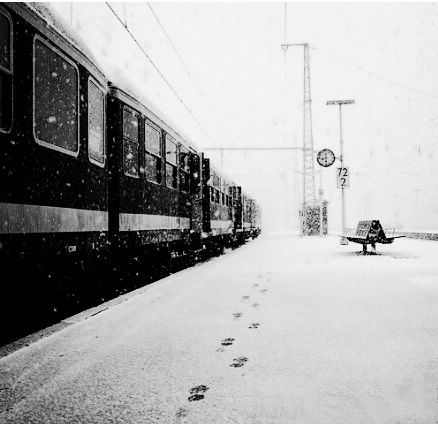

# 鸽子

**我发誓从未听过如此凄厉的嚎叫，它来自一个骄傲的女人。我瘫软在窗后，第一次品尝到一种无以言表的美妙滋味。沉重的瞳孔终于可以放松一下了，看看窗外的天，本希望来场应景的大雨，可更令人惊喜的是，一半天晴，另一半，比晴天还亮。**

# 鸽 子

## 文/倪舸（University of Delaware）

 

我靠墙坐在地上，身边立着一个女人。她出乎预料地镇定，甚至连声咳嗽也没有。“别灰心。”她坚定地拍拍我的肩。“一定会找到出路的。”语气如同劝慰一个因玩耍而迷途的孩子。

这是第一天晚上，亦或第二天黎明。我们看不到阳光与黑夜，依据本能估摸着在这座巨大厂房里囚禁的时光。唯一的暖色只有头上不知亮了多久的旧灯泡，此时此刻也任凭不知何处输来的电压一道，起伏的昏黄、灰暗、昏黄。

“别总是这样！”女人有些生气，俯身打掉了我再次掏出的烟。我抬头打量她，却记不得如何与她相识，如何交流，以及又为何被困在这个鬼地方。只是依稀忆起大雨中我们一同跑进那条废巷，还有就是，她有孩子——我猜如此。“你是个男人，不能轻易放弃希望！”音调像母亲在我童年时毫无新意的鼓舞和责备：考试失利，或者长跑掉队，哪怕是我的拼图游戏进展缓慢。她毫无疑问要高声唠叨，“一定！”、“不能！”、“必须！”

“我们必须打起精神！”女人拍了拍手上的土。“不能消沉！”她接着摇摇我的胳膊。“别灰心，一定会找到出路！”

我想起了几天前偶遇心理学老师时的样子。他在餐厅吃晚餐，看到我坐在对面，便唤我过去，接下来，一如办公室里的寒喧。“你的论文虽然比起前几次进步很大，可问题还是有的。”他不急不缓接过侍者递来的咖啡，不料一个倾斜便溅了个满袖。“你！怎么搞的！”侍者连连道歉。“哦，不好意思，我们刚刚谈到哪里了？对了，”他猛一拍脑门，几缕棕色水渍沾在眉梢。“你应该把儿童心理活动作出尽可能多的推测，假若你毕业后独立面对那些问题孩子，会有很大帮助。你难道没看过那本书吗？叫……”我的余光外是落日映红的桦树，霓虹初上，一个乞丐对着树根撒尿。“总而言之……”老师向服务生勾了勾食指。“我相信，你一定可以取得成功，不要灰心！”我下意识掏掏钱包，示意由我付帐，他没有拒绝。

我不希望别人在我心不在焉时指手划脚。我轻轻摆手，示意女人暂且息声。无奈，她已然把我的一切举动视为因怯懦而萌生的绝望，并强行搀起我，临行不忘踩灭地上的烟蒂。

“我考虑了一下，”她把手指指向一侧。“那边行不通，报废的机器把路完全堵死了。而那边……”她的手指从容地在空中画出一个半圆，“那是一排柱子，我们从未到过那里，不能去。这里太大，一定不要走散。”她正在一步步绘出一张地图，足以覆盖这片厂区，从而按原路一点点挪回去，找到入口的门，退回来时的废巷。

当然，她没有地图。

“你瞧，这路上有我们先前的脚印！”女人兴奋起来。“沿着这条通道退回去，一定可以回到第一片厂区！”她笑出了声。“谈谈你的家庭吧，亲人？朋友？”我没作声，显然她有些失望。“那，你平时喜欢做些什么？我是说……爱好？”

“请告诉我们你的姓名、年龄、工作经验、爱好与特长，”副考官捏着笔，把我所说的话记录在纸上，“很好，祝你好运，”他打开会议室的大门，嘴角上扬一下，“下一位。”

我摇了摇头，回过神来。女人的叹息中，面前依然是狭窄的通道。杂物一股脑洒个满地，不知多少黑色机油渗了煤烟爬上斑驳的灰墙。

“你瞧！我就知道！”她指指前面那扇门，大声喊着，“虽然耗费了这么长时间，但总会找到的！”说罢，她一把撞开了大门，簌簌落下的蛛网弥漫在憋闷的空气中。

父亲让我照看妹妹时总会心平气和地摸着我的头：“男子汉，这是个艰巨的任务，有信心吗？”他伸出拳头，儿时的我学着把小手握成一团，在父亲的指节处轻轻一抵，“好儿子！”

排气扇的叶片呻吟个不停，踩扁的烟头像截冻死的虫子。我们通过了一排柱子后的门，迎面是方才停留过片刻的厅堂，以及那面冰凉的石墙。“这可怎么办……”女人揉揉太阳穴。

我的头很痛，父亲继续死死戳着我的脑袋。“让你仔细照看妹妹，你干什么去了！”又是一下。“因为你的失误，她跑到了公路上，若是被车撞到，你说怎么办！”父亲抽了我一记耳光，朦胧的视线中，母亲在桌旁摆放碗碟，妹妹伏在母亲肩头，津津有味地吮着拇指。

“既然如此，我们就向顶楼走，爬上去就可以向下面的人们求救。”女人又一次打断了我的回忆。她拉住踉踉跄跄的我，登上附近的铁梯。没有编码，我们只好自己查数层数，至于查了多少，终于，大家都乱了顺序。

“听我说……”我叫住了女人。“我想，我们可以分头行动，至少……”“别这么说！”她一口回绝了我的提议，“我们要出去，谁也不能丢下谁。”女人坚毅的眼神像颗钉子。

我从未感到如此疲惫过，僵硬的身子触不到背后石墙的冷，眼前只有不远处排气扇的影子闪过，吱吱呀呀恼人的啜泣。这完全是一层厂房的复制品，女人喘着气，跪坐在一边。这个迷宫几乎也榨干了她全部的体力，若不是她仍在喋喋不休，我甚至无法分清这两具身体是否是活物。

“看！”女人刹那间来了精神，一个遥远的亮斑闪过她的鼻梁。那是隐匿在顶楼尽头一扇小小的窗，这整团混沌中仅有的窗。女人再一次顽强挺直了身子，俯视呆若木鸡的我，竟露出几分轻蔑的微笑。她是站着的，光斑在脑后散射，似乎形成一轮光环。女人成为了她意志中的神，带着母亲般自始至终的责任和强者理所当然的自信，迈向那扇窗。她向我勾勾食指，唤我过去。

“跟我来。”

女人的笑容拼结成一团，像张搅在一起的水彩。在这个高度，足以俯瞰整个城市。窗外是连绵的高楼大厦，每一条街，每一道巷子，还有路边向我们挥手的人们。

女人颤抖的手又一次向远处指指——是一片街区，大厦像一柄柄大刀，街巷交错织成一张大网，网住了星罗棋布向我们挥手的人们。然后是第三片、第四片，各个街区成了磁铁，从四面八方向高悬的窗涌来。一样的楼层，一样的街道，人群每一个动作：左手或右手的舞动，模具刻出似的，成了块无边的幕布，与天空相连。大群鸽子黑压压在云中盘旋，划过一个又一个圆圈。

我发誓从未听过如此凄厉的嚎叫，它来自一个骄傲的女人。我瘫软在窗后，第一次品尝到一种无以言表的美妙滋味。沉重的瞳孔终于可以放松一下了，看看窗外的天，本希望来场应景的大雨，可更令人惊喜的是，一半天晴，另一半，比晴天还亮。

梦中出现的人，总看不清他们的脸。

我大笑着从床上惊醒，发觉闹钟早已停了。

睡前丢进缸中的烟蒂，火花未熄。昏黄、灰暗、昏黄。

（采编：佛冉 责编：黄理罡）

 
